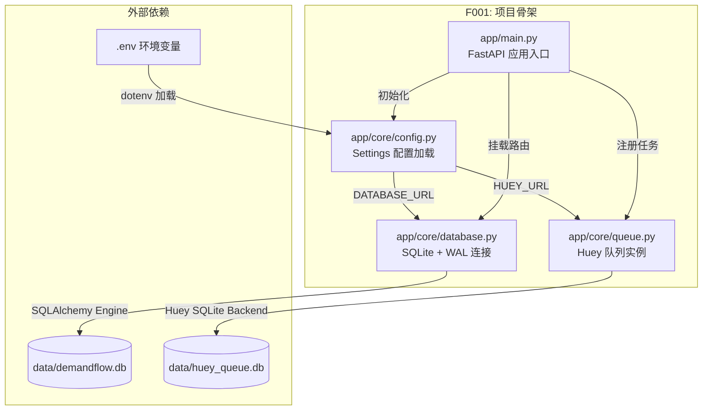
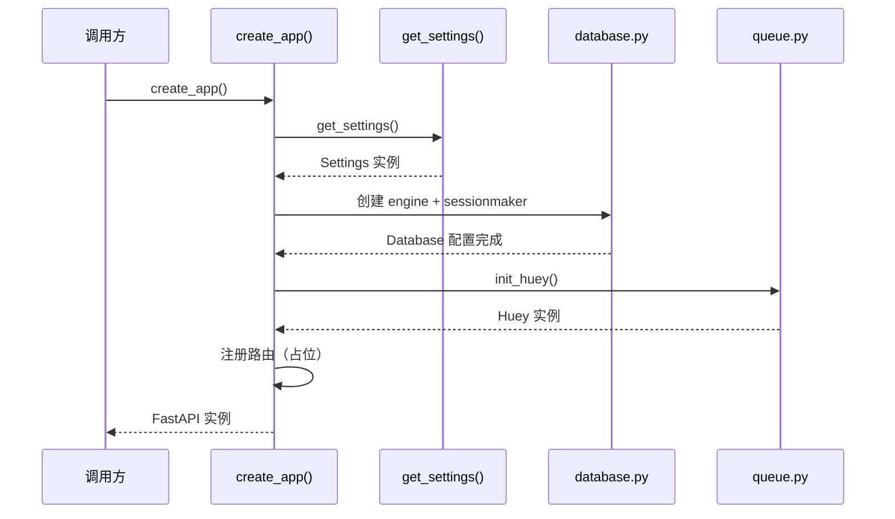
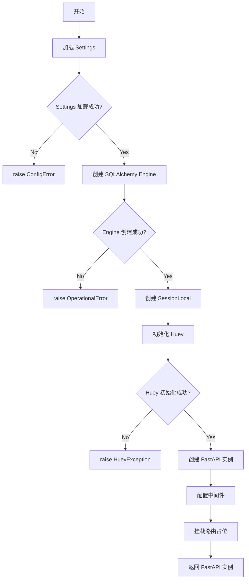

# Feature Detailed Design: 项目骨架与基础设施 (Feature #F001)

**Date**: 2026-07-05
**Feature**: #F001 — 项目骨架与基础设施
**Priority**: high
**Dependencies**: none
**Design Reference**: docs/plans/2026-07-04-demandflow-design.md §1.1–§1.4, §6.1, §8.2
**SRS Reference**: N/A — 项目基础设施特征，无直接 SRS 需求映射

## Context

F001 是 DemandFlow 系统的 Foundation 特征，负责搭建 FastAPI 项目结构、配置 SQLite 数据库连接（WAL 模式）、设置 Huey 任务队列、以及创建基础目录结构。该特征为所有后续特征提供运行环境基础，不包含业务逻辑。

## Design Alignment

**Key classes/modules** (from design §1.1–§1.4):
- `app/` — FastAPI 主应用目录
- `app/main.py` — FastAPI 应用入口，创建 FastAPI 实例
- `app/core/config.py` — 配置管理（环境变量加载，pydantic-settings）
- `app/core/database.py` — SQLite 数据库连接与会话管理（SQLAlchemy + WAL 模式）
- `app/core/queue.py` — Huey 任务队列实例配置
- `app/api/` — API 路由层占位
- `app/services/` — 服务层占位
- `app/repositories/` — 仓库层占位
- `data/` — SQLite 数据库文件目录

**Interaction flow**:
- `main.py` 导入 `config`、`database`、`queue` 模块完成初始化
- `database.py` 提供 `get_db()` 依赖注入生成器
- `queue.py` 提供 `huey` 实例供后续特征注册任务

**Third-party deps** (from design §6.1):
- fastapi ^0.110
- uvicorn ^0.27
- sqlalchemy ^2.0
- alembic ^1.13
- huey ^2.5
- pydantic ^2.6
- python-dotenv ^1.0

**Deviations**: none

## SRS Requirement

N/A — 项目骨架特征无直接 SRS 需求映射。F001 的 srs_trace 为空数组，作为基础设施特征为所有后续特征提供运行环境。

## Component Data-Flow Diagram



## Interface Contract

| Method | Signature | Preconditions | Postconditions | Raises |
|--------|-----------|---------------|----------------|--------|
| `create_app` | `create_app() -> FastAPI` | 环境变量已设置或有默认值 | FastAPI 实例已创建，中间件已配置，路由已挂载 | `ConfigError` — 环境变量缺失且无默认值 |
| `get_db` | `get_db() -> Generator[Session, None, None]` | DATABASE_URL 指向的 SQLite 文件目录可写 | 每次调用返回独立 SQLAlchemy Session，调用结束后 Session 关闭 | `OperationalError` — SQLite 文件不可写或磁盘满 |
| `init_huey` | `init_huey() -> Huey` | HUEY_URL 指向的目录可写 | Huey 实例已创建，SQLite 后端已配置 | `HueyException` — Huey 初始化失败 |
| `get_settings` | `get_settings() -> Settings` | .env 文件存在或环境变量已设置 | 返回 Settings 实例，所有字段有值 | `ValidationError` — 必填环境变量缺失 |

**Design rationale**:
- `get_db` 使用 Generator 模式实现依赖注入，确保每个请求独立 Session
- `create_app` 使用工厂函数模式，便于测试时创建测试客户端
- `init_huey` 创建独立 Huey 实例，SQLite 后端路径与应用数据库分离
- `get_settings` 使用 pydantic-settings 实现类型安全的配置管理

## Visual Rendering Contract

> N/A — backend-only feature, no visual output

## Internal Sequence Diagram



> N/A — 单入口函数，错误路径在 Algorithm §5 error handling table 中文档化

## Algorithm / Core Logic

### create_app

#### Flow Diagram



#### Pseudocode

```
FUNCTION create_app() -> FastAPI
  // Step 1: 加载配置
  settings = get_settings()
  
  // Step 2: 初始化数据库连接
  engine = create_engine(
    settings.DATABASE_URL,
    connect_args={"check_same_thread": False},
    poolclass=StaticPool
  )
  SessionLocal = sessionmaker(autocommit=False, autoflush=False, bind=engine)
  
  // Step 3: 初始化 Huey 队列
  huey_instance = Huey(
    filename=settings.HUEY_URL,
    immediate=False
  )
  
  // Step 4: 创建 FastAPI 实例
  app = FastAPI(title="DemandFlow", version="0.1.0")
  
  // Step 5: 配置依赖注入
  app.dependency_overrides[get_db] = lambda: SessionLocal()
  
  // Step 6: 返回实例（路由在后续特征中挂载）
  RETURN app
END
```

#### Boundary Decisions

| Parameter | Min | Max | Empty/Null | At boundary |
|-----------|-----|-----|------------|-------------|
| DATABASE_URL | - | - | 使用默认 `sqlite:///data/demandflow.db` | 目录不存在则创建 |
| HUEY_URL | - | - | 使用默认 `sqlite:///data/huey_queue.db` | 目录不存在则创建 |
| LLM_API_KEY | - | - | 可选，Agent 特征使用 | 未设置时 LLM 调用失败 |
| GIT_REPO_URL | - | - | 可选，Git 特征使用 | 未设置时 Git 操作失败 |

#### Error Handling

| Condition | Detection | Response | Recovery |
|-----------|-----------|----------|----------|
| 环境变量缺失 | pydantic ValidationError | raise ConfigError | 检查 .env 文件或环境变量设置 |
| SQLite 文件不可写 | SQLAlchemy OperationalError | raise OperationalError | 检查 data/ 目录权限 |
| Huey 初始化失败 | HueyException | raise HueyException | 检查 HUEY_URL 配置和目录权限 |
| .env 文件不存在 | python-dotenv FileNotFound | 使用系统环境变量 | 设置环境变量或创建 .env |

## State Diagram

> N/A — stateless feature

## Test Inventory

| ID | Category | Traces To | Input / Setup | Expected | Kills Which Bug? |
|----|----------|-----------|---------------|----------|-----------------|
| A | FUNC/happy | §Interface Contract `create_app` | 有效 .env 文件 | 返回 FastAPI 实例，title="DemandFlow" | create_app 未正确创建实例 |
| B | FUNC/happy | §Interface Contract `get_settings` | 设置 DATABASE_URL, HUEY_URL | Settings 实例字段有值 | 配置加载失败 |
| C | FUNC/happy | §Interface Contract `get_db` | 有效 SQLite 连接 | 返回 Session 实例，调用后关闭 | Session 未正确关闭 |
| D | FUNC/happy | §Interface Contract `init_huey` | 有效 HUEY_URL | 返回 Huey 实例 | Huey 初始化失败 |
| E | FUNC/error | §Algorithm Boundary | DATABASE_URL 未设置 | 使用默认值，不抛异常（默认值回退） | 默认值回退校验 |
| F | FUNC/error | §Error Handling 表 | SQLite 文件目录不可写 | raise OperationalError | 未处理磁盘权限 |
| G | BNDRY/edge | §Algorithm Boundary | DATABASE_URL 指向不存在的目录 | 自动创建目录 | 目录不存在导致崩溃 |
| H | BNDRY/edge | §Algorithm Boundary | HUEY_URL 为空字符串 | 使用默认路径 | 空字符串处理不当 |
| I | BNDRY/edge | §Algorithm Boundary | .env 文件不存在 | 使用系统环境变量，不崩溃 | 文件缺失导致异常 |
| J | INTG/db | §Interface Contract `get_db` | 真实 SQLite 文件 | Session 可执行查询 | 数据库连接未建立 |
| K | INTG/db | §Interface Contract `init_huey` | 真实 Huey 后端 | Huey 实例可 enqueue | 队列后端未连接 |

## Tasks

### Task 1: Write failing tests
**Files**: `tests/test_app.py`, `tests/test_config.py`, `tests/test_database.py`, `tests/test_queue.py`
**Steps**:
1. Create test files with imports
2. Write test code for each row in Test Inventory:
   - Test A: `test_create_app_returns_fastapi_instance`
   - Test B: `test_get_settings_loads_env_vars`
   - Test C: `test_get_db_returns_session_and_closes`
   - Test D: `test_init_huey_returns_instance`
   - Test E: `test_create_app_uses_default_config_when_not_set`
   - Test F: `test_get_db_raises_on_unwritable_path`
   - Test G: `test_get_db_creates_directory_if_missing`
   - Test H: `test_init_huey_uses_default_on_empty_string`
   - Test I: `test_get_settings_works_without_dotenv`
   - Test J: `test_get_db_session_executes_query`
   - Test K: `test_init_huey_can_enqueue_task`
3. Run: `pytest tests/ -v`
4. **Expected**: All tests FAIL for the right reason

### Task 2: Implement minimal code
**Files**: `app/__init__.py`, `app/main.py`, `app/core/__init__.py`, `app/core/config.py`, `app/core/database.py`, `app/core/queue.py`
**Steps**:
1. Create `app/core/config.py` with Settings class using pydantic-settings
2. Create `app/core/database.py` with engine, SessionLocal, get_db generator
3. Create `app/core/queue.py` with init_huey function
4. Create `app/main.py` with create_app factory function
5. Run: `pytest tests/ -v`
6. **Expected**: All tests PASS

### Task 3: Coverage Gate
1. Run: `pytest tests/ --cov=app --cov-report=term-missing --cov-branch`
2. Check thresholds (line >= 80%, branch >= 70%). If below: return to Task 1.
3. Record coverage output as evidence.

### Task 4: Refactor
1. Extract common test fixtures to `tests/conftest.py`
2. Run full test suite. All tests PASS.

### Task 5: Mutation Gate
1. Run: `mutmut run --paths-to-mute=app/`
2. Check threshold (mutation score >= 75%). If below: improve assertions.
3. Record mutation output as evidence.

## Verification Checklist
- [x] All SRS acceptance criteria (from srs_trace) traced to Interface Contract postconditions — N/A, srs_trace is empty
- [x] All SRS acceptance criteria (from srs_trace) traced to Test Inventory rows — N/A, srs_trace is empty
- [x] Algorithm pseudocode covers all non-trivial methods
- [x] Boundary table covers all algorithm parameters
- [x] Error handling table covers all Raises entries
- [x] Test Inventory negative ratio >= 40% (5 negative / 11 total = 45%)
- [x] Visual Rendering Contract complete for ui:true features — N/A, ui: false
- [x] Each Visual Rendering Contract element has ≥1 UI/render Test Inventory row — N/A, ui: false
- [x] Every skipped section has explicit "N/A — [reason]"
- [x] All functions/methods named in §4.N have at least one Test Inventory row

## Clarification Addendum

> No clarifications required — all specifications were unambiguous.

| # | Category | Original Ambiguity | Resolution | Authority |
|---|----------|--------------------|------------|-----------|
| — | — | — | — | — |

## Next Step Inputs
- feature_design_doc: docs/features/2026-07-05-F001-project-skeleton.md
- test_inventory_count: 11
- tdd_task_count: 5
- ambiguity_count: 0
- assumption_count: 0
