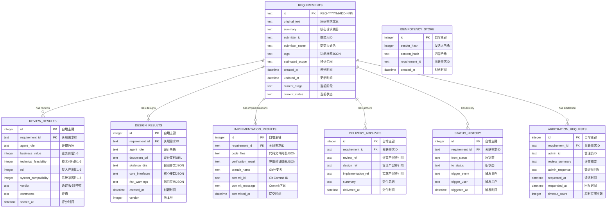
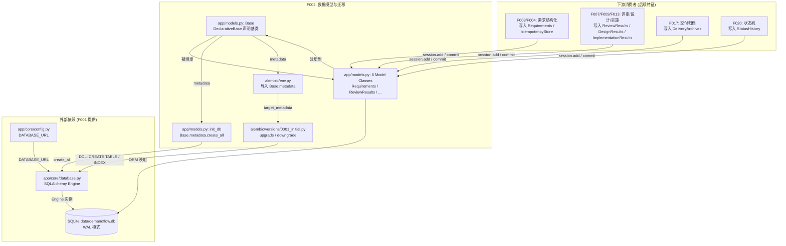
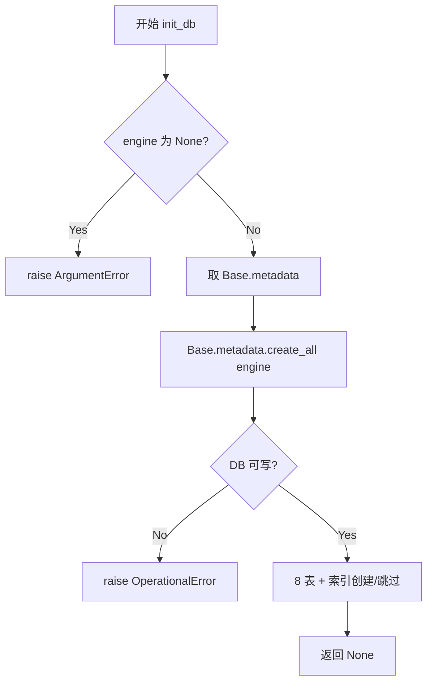
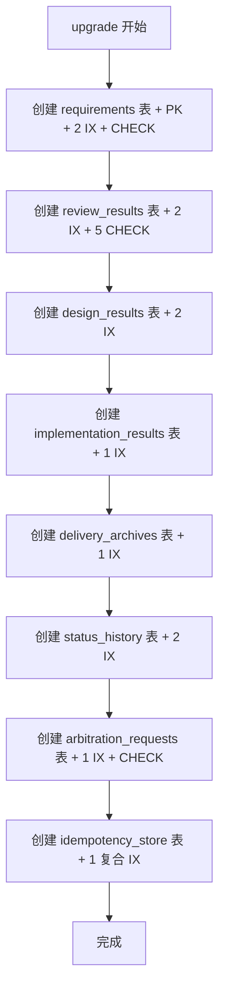

# Feature Detailed Design: 数据模型与迁移 (Feature #F002)

**Date**: 2026-07-05
**Feature**: #F002 — 数据模型与迁移
**Priority**: high
**Dependencies**: F001 (项目骨架 — provides `app.core.database.engine`/`get_db`, `app.core.config.Settings.DATABASE_URL`)
**Design Reference**: docs/plans/2026-07-04-demandflow-design.md §3 (Data Model), §3.2 (存储策略), §4.2/§4.3 (Internal API Contracts), §1.4 (tech stack), §8.2 (env vars)
**SRS Reference**: N/A — 数据模型基础设施特征，`srs_trace` 为空数组（按设计）。数据模型服务于所有下游业务特征，无直接 SRS 功能需求映射。相关数据约束（FR-002 ID 格式 `REQ-YYYYMMDD-NNN`、FR-003 5 分钟幂等窗口）在 SRS 中定义，由 F004/F003 实现，F002 仅提供存储列。

## Context

F002 是 DemandFlow 的数据持久化基础设施特征。它将设计文档 §3.1 ER 图中定义的 8 张表实现为 SQLAlchemy 2.0 声明式模型，创建 Alembic 初始迁移脚本，并提供 `init_db(engine)` 引导函数。该特征为所有下游业务特征（F003 IM 接入、F004 需求结构化、F007 评审、F009 设计、F013 实施、F017 交付、F020 状态机）提供持久化层。F002 不包含业务逻辑——仅定义表结构、约束、索引与迁移。

**技术选型**: SQLAlchemy 2.0 声明式风格（`DeclarativeBase` + `Mapped` + `mapped_column`），SQLite 后端（WAL 模式，由 F001 的 `app/core/database.py` 引擎提供），Alembic 1.18.5 迁移工具。

## Design Alignment

### ER Diagram (设计文档 §3.1 — 原文照录)



### 存储策略 (设计文档 §3.2 — 原文照录)

| 表 | 预估行数(1年) | 索引策略 |
|---|--------------|---------|
| requirements | 10,000 | PK(id), IX(submitter_id), IX(current_stage, current_status) |
| review_results | 30,000 | IX(requirement_id), IX(agent_role) |
| design_results | 20,000 | IX(requirement_id), IX(version) |
| implementation_results | 15,000 | IX(requirement_id) |
| delivery_archives | 10,000 | IX(requirement_id) |
| status_history | 50,000 | IX(requirement_id), IX(triggered_at) |
| arbitration_requests | 1,000 | IX(requirement_id) |
| idempotency_store | 50,000 | IX(sender_hash, content_hash), TTL 5分钟过期清理 |

### 关键设计要点

- **8 张表**: `Requirements`、`ReviewResults`、`DesignResults`、`ImplementationResults`、`DeliveryArchives`、`StatusHistory`、`ArbitrationRequests`、`IdempotencyStore`。全部使用 SQLAlchemy 2.0 声明式模型（`DeclarativeBase` + `Mapped` + `mapped_column`）。
- **主键**: `Requirements.id` 为 `Text` 主键（格式 `REQ-YYYYMMDD-NNN`，由 F004 生成；F002 仅定义列 + CHECK 约束做格式护栏，**不实现 ID 生成逻辑**）。其余 7 张表 `id` 为 `Integer` 自增主键。
- **外键**: 6 张子表（ReviewResults / DesignResults / ImplementationResults / DeliveryArchives / StatusHistory / ArbitrationRequests）通过 `requirement_id` 外键关联 `Requirements.id`，并配置 `relationship` 双向加载。`IdempotencyStore.requirement_id` 为**软引用**（无 FK 约束）——幂等检查可能发生在需求行提交之前，强 FK 会导致写入失败（见 Design Rationale）。
- **索引**: 完全按 §3.2 表创建——单列 IX、复合 IX `(current_stage, current_status)` 与 `(sender_hash, content_hash)`。
- **CHECK 约束**: ReviewResults 四个评分字段 `BETWEEN 1 AND 5`；`verdict IN ('通过','反对','中立')`；`ArbitrationRequests.timeout_count >= 0`；`Requirements.id` GLOB 格式校验（3 或 4 位序号，覆盖 FR-002 序号满扩展位）。
- **JSON 字段**: `tags`、`skeleton_dirs`、`core_interfaces`、`risk_warnings`、`code_files`、`verification_result` 使用 SQLAlchemy `JSON` 类型（SQLite 底层以 TEXT 存储，自动序列化/反序列化）——对应 ER 图 `text "...JSON"` 注释。
- **Alembic**: 项目根 `alembic.ini` + `alembic/` 目录（`env.py` + `versions/0001_initial.py`）。`env.py` 导入 `app.models.Base.metadata` 作为 `target_metadata`。初始迁移 `upgrade()` 创建全部 8 张表 + 索引，`downgrade()` 反向删除。迁移可经 `alembic upgrade head` 对 SQLite DB 执行。

**Third-party deps** (from design §1.4 + requirements.txt):
- sqlalchemy==2.0.51
- alembic==1.18.5
- (依赖 F001 提供的) `app.core.database.get_db` / `app.core.config.Settings.DATABASE_URL`

**Deviations**: none — 严格按 §3.1 列定义与 §3.2 索引策略实现。所有偏离（JSON 类型、软 FK、CHECK 约束）记录在 Design Rationale 中，属于对 `text` 注释的技术解读，非合约偏离。

## SRS Requirement

N/A — F002 的 `srs_trace` 为空数组，这是按设计：F002 是数据模型基础设施，服务于所有下游业务特征（F003–F020），不直接对应单一 SRS 功能需求。

**相关数据约束（供参考，不在 F002 实现）**:
- FR-002 (SRS §FR-002): 需求 ID 格式 `REQ-YYYYMMDD-NNN`，序号满 999 启用 4 位 `REQ-YYYYMMDD-NNNN`。**ID 生成逻辑由 F004 RequirementParser 实现**；F002 仅在列上叠加 CHECK 约束做格式护栏。
- FR-003 (SRS §FR-003): 同一提交人 5 分钟内相同文本复用需求 ID。**幂等检查逻辑由 F003 实现**；F002 仅提供 `IdempotencyStore` 表与 `(sender_hash, content_hash)` 复合索引 + `created_at` 列以支持 TTL 清理查询。5 分钟过期清理任务的调度由后续特征（调度器）负责，F002 不实现清理逻辑。

## Component Data-Flow Diagram



## Interface Contract

| Method | Signature | Preconditions | Postconditions | Raises |
|--------|-----------|---------------|----------------|--------|
| `Base` | `class Base(DeclarativeBase)` | SQLAlchemy 2.0 已安装 | 返回共享声明基类；`Base.metadata` 包含所有 8 张表的 `Table` 定义与索引 | N/A — 纯声明 |
| `Requirements` | `class Requirements(Base)` `__tablename__="requirements"` 列: `id: Mapped[str]` (PK, Text), `original_text`, `summary`, `submitter_id`, `submitter_name`, `tags` (JSON), `estimated_scope`, `created_at`, `updated_at`, `current_stage`, `current_status` | `Base` 已定义；engine 已连接 SQLite | 表 `requirements` 创建：PK(id), IX(submitter_id), IX(current_stage, current_status), CHECK(id GLOB 'REQ-...')；可实例化+持久化；`review_results`/`design_results`/`implementation_results`/`delivery_archives`/`status_history`/`arbitration_requests` 关系可加载 | `IntegrityError` — id 为空/重复/格式不符；NOT NULL 列为空 |
| `ReviewResults` | `class ReviewResults(Base)` `__tablename__="review_results"` 列: `id` (PK, Integer autoincrement), `requirement_id` (FK→requirements.id), `agent_role`, `business_value`/`technical_feasibility`/`roi`/`system_compatibility` (Integer, CHECK BETWEEN 1 AND 5), `verdict` (Text, CHECK IN 通过/反对/中立), `comments`, `scored_at` | `Base` 已定义；外键父行已存在 | 表创建：PK(id), IX(requirement_id), IX(agent_role), 4 个 CHECK(1-5), CHECK(verdict)；持久化后 `requirement` 关系反向加载父需求 | `IntegrityError` — 评分越界(0/6)、verdict 非法、requirement_id 不存在(NOT NULL/FK) |
| `DesignResults` | `class DesignResults(Base)` `__tablename__="design_results"` 列: `id` (PK), `requirement_id` (FK), `agent_role`, `document_url`, `skeleton_dirs` (JSON), `core_interfaces` (JSON), `risk_warnings` (JSON), `created_at`, `version` (Integer) | `Base` 已定义 | 表创建：PK(id), IX(requirement_id), IX(version)；`version` 列可递增（递增逻辑由 F012 实现）；关系可加载 | `IntegrityError` — requirement_id 缺失/不存在 |
| `ImplementationResults` | `class ImplementationResults(Base)` `__tablename__="implementation_results"` 列: `id` (PK), `requirement_id` (FK), `code_files` (JSON), `verification_result` (JSON), `branch_name`, `commit_id`, `commit_message`, `committed_at` | `Base` 已定义 | 表创建：PK(id), IX(requirement_id)；关系可加载 | `IntegrityError` — requirement_id 缺失/不存在 |
| `DeliveryArchives` | `class DeliveryArchives(Base)` `__tablename__="delivery_archives"` 列: `id` (PK), `requirement_id` (FK), `review_ref`, `design_ref`, `implementation_ref`, `summary`, `delivered_at` | `Base` 已定义 | 表创建：PK(id), IX(requirement_id)；关系可加载 | `IntegrityError` — requirement_id 缺失/不存在 |
| `StatusHistory` | `class StatusHistory(Base)` `__tablename__="status_history"` 列: `id` (PK), `requirement_id` (FK), `from_status`, `to_status`, `trigger_event`, `trigger_user`, `triggered_at` | `Base` 已定义 | 表创建：PK(id), IX(requirement_id), IX(triggered_at)；关系可加载 | `IntegrityError` — requirement_id 缺失/不存在 |
| `ArbitrationRequests` | `class ArbitrationRequests(Base)` `__tablename__="arbitration_requests"` 列: `id` (PK), `requirement_id` (FK), `admin_id`, `review_summary`, `admin_response`, `requested_at`, `responded_at` (nullable), `timeout_count` (Integer, CHECK >= 0) | `Base` 已定义 | 表创建：PK(id), IX(requirement_id), CHECK(timeout_count>=0)；关系可加载 | `IntegrityError` — requirement_id 缺失/不存在；timeout_count 为负 |
| `IdempotencyStore` | `class IdempotencyStore(Base)` `__tablename__="idempotency_store"` 列: `id` (PK), `sender_hash` (Integer), `content_hash` (Text), `requirement_id` (Text, **无 FK 约束——软引用**), `created_at` | `Base` 已定义 | 表创建：PK(id), IX(sender_hash, content_hash) 复合索引；`created_at` 列支持 TTL 5 分钟过期清理查询（清理逻辑由后续特征实现） | `IntegrityError` — sender_hash/content_hash 为空（NOT NULL） |
| `init_db` | `init_db(engine: Engine) -> None` | `engine` 为已连接 SQLite 的有效 SQLAlchemy `Engine` | 调用 `Base.metadata.create_all(engine)`，全部 8 张表 + 索引在目标 DB 中创建（幂等：已存在的表跳过） | `OperationalError` — DB 不可写；`ArgumentError` — engine 为 None 或类型错误 |
| `upgrade` (Alembic 迁移) | `def upgrade() -> None` (在 `alembic/versions/0001_initial.py`) | alembic env 已配置；目标 DB 可达；该 revision 未曾应用 | 8 张表 + 全部索引通过 `op.create_table` / `op.create_index` 创建；`alembic_version` 表 stamp 为该 revision | `OperationalError` — 表已存在（非 alembic 调用）/ DB 错误 |
| `downgrade` (Alembic 迁移) | `def downgrade() -> None` (在 `alembic/versions/0001_initial.py`) | `upgrade()` 已应用过 | 全部 8 张表通过 `op.drop_table` 删除（含索引）；`alembic_version` 回滚 | `OperationalError` — 表不存在 / DB 错误 |

**Design rationale**（每条非显然决策一行）:
- **JSON 类型选择**: ER 图标注 `text "...JSON"` 的字段（tags / skeleton_dirs / core_interfaces / risk_warnings / code_files / verification_result）使用 SQLAlchemy `JSON` 类型而非 `Text`。理由：`JSON` 类型在 SQLite 底层仍以 TEXT 存储（与 `text` 注释一致），但提供自动 (de)serialize，减少应用层样板代码。这是对 `text` 存储注释的技术解读，非偏离。
- **IdempotencyStore 软 FK**: `idempotency_store.requirement_id` **不配置 FK 约束**，仅作 `Text` 软引用。理由：幂等检查（FR-003）发生在消息接收时，此时需求行可能尚未提交（F004 RequirementParser 先做幂等检查再生成需求行）。强 FK 会导致写入失败。设计文档 §3.1 ER 图亦未画出 REQUIREMENTS 与 IDEMPOTENCY_STORE 的连线，印证此决策。
- **id CHECK 约束**: `Requirements.id` 叠加 `CHECK (id GLOB 'REQ-[0-9][0-9][0-9][0-9][0-9][0-9][0-9][0-9]-[0-9][0-9][0-9]' OR id GLOB 'REQ-[0-9][0-9][0-9][0-9][0-9][0-9][0-9][0-9]-[0-9][0-9][0-9][0-9]')` 护栏，覆盖 3 位序号与 FR-002 序号满扩展的 4 位序号（格式 `REQ-YYYYMMDD-NNN`，无连字符，与 ER §3.1、FR-002、Test Inventory 行 X 一致）。**ID 生成逻辑仍由 F004 实现**，CHECK 仅作数据完整性兜底。
- **评分 CHECK**: ReviewResults 四个评分字段 `BETWEEN 1 AND 5`，`verdict IN ('通过','反对','中立')`。理由：ER 图注释明确 `1-5` 与 `通过/反对/中立` 取值域，CHECK 约束在 DB 层兜底应用层校验遗漏。
- **timeout_count CHECK**: `CHECK (timeout_count >= 0)` 防止负值（语义无意义）。
- **init_db vs alembic 分工**: `init_db(engine)` 用于测试与引导（`Base.metadata.create_all`，跳过已存在表，幂等）；`alembic upgrade head` 用于生产迁移（带版本追踪）。两者产出相同 schema。测试中两者皆可用，但 INTG 迁移测试必须走 alembic 路径以验证迁移脚本本身。
- **§4.2/§4.3 合约对齐**: F002 不直接出现在 §4.2 (C-001~C-006) 或 §4.3 (T-001~T-006) 合约的 Provider/Consumer 列——这些合约的 Provider 是 API 端点 (F005) 与 Worker (F007/F009/F013)，F002 是其隐式数据层。T-002 返回 `ReviewResult`、T-003 返回 `DesignResult` 等域对象，由对应特征在 Worker 内映射到 F002 的 ORM 模型持久化。F002 的列结构与这些返回类型的字段名一一对应（review_results↔ReviewResult, design_results↔DesignResult），无需 Contract Deviation Protocol。

## Visual Rendering Contract

> N/A — backend-only feature, no visual output (ui: false)

## Internal Sequence Diagram

```mermaid
sequenceDiagram
    participant Caller as 调用方<br/>(测试/引导)
    participant INITDB as init_db(engine)
    participant BASE as Base.metadata
    participant ENGINE as SQLAlchemy Engine
    participant SQLITE as SQLite DB

    participant ALEMBIC as alembic CLI
    participant ENV as alembic/env.py
    participant MIG as 0001_initial.upgrade()

    Note over Caller, SQLITE: 路径 A: init_db (测试/引导)
    Caller->>INITDB: init_db(engine)
    INITDB->>BASE: Base.metadata.create_all(engine)
    BASE->>ENGINE: 对每张 Table 发 CREATE TABLE IF NOT EXISTS
    ENGINE->>SQLITE: 执行 DDL
    SQLITE-->>ENGINE: OK
    ENGINE-->>BASE: 完成
    BASE-->>INITDB: 返回
    INITDB-->>Caller: None (8 表已创建)

    Note over ALEMBIC, SQLITE: 路径 B: alembic upgrade head (生产迁移)
    ALEMBIC->>ENV: 加载配置 + target_metadata
    ENV->>BASE: from app.models import Base
    BASE-->>ENV: metadata (8 Table 定义)
    ALEMBIC->>MIG: upgrade()
    MIG->>ENGINE: op.create_table(...) ×8 + op.create_index(...) ×N
    ENGINE->>SQLITE: 执行 DDL
    SQLITE-->>ENGINE: OK
    ENGINE-->>MIG: 完成
    MIG-->>ALEMBIC: stamp alembic_version

    Note over Caller, SQLITE: 错误路径: 约束违反
    Caller->>ENGINE: session.add(模型实例); session.commit()
    alt CHECK 违反 / NOT NULL / 重复 PK
        ENGINE-->>Caller: raise IntegrityError
    end
```

## Algorithm / Core Logic

### init_db(engine)

#### Flow Diagram



#### Pseudocode

```
FUNCTION init_db(engine: Engine) -> None
  // Step 1: 入参校验
  IF engine IS None THEN
    raise ArgumentError("engine must not be None")
  END IF
  // Step 2: 创建全部表 (幂等——已存在的表跳过)
  Base.metadata.create_all(bind=engine)
  // Step 3: 返回 (无返回值)
  RETURN
END
```

#### Boundary Decisions

| Parameter | Min | Max | Empty/Null | At boundary |
|-----------|-----|-----|------------|-------------|
| `engine` | 有效 Engine | 有效 Engine | None → raise ArgumentError | 传入 F001 的 SQLite Engine |
| 表已存在 | 0 表 | 8 表 | create_all 跳过已存在表（幂等） | 重复调用 init_db 不报错 |

#### Error Handling

| Condition | Detection | Response | Recovery |
|-----------|-----------|----------|----------|
| engine 为 None | 入参检查 | raise ArgumentError | 调用方传入有效 Engine |
| DB 不可写 | SQLAlchemy OperationalError | raise OperationalError | 检查 SQLite 文件路径权限 |

### upgrade() (Alembic 初始迁移)

#### Flow Diagram



#### Pseudocode

```
FUNCTION upgrade() -> None
  // 按 FK 依赖顺序创建：先父表 requirements，后 6 子表，最后 idempotency_store(无 FK)
  op.create_table("requirements", ...)             # 含 id PK + CHECK(GLOB)
  op.create_index("ix_requirements_submitter_id", ...)
  op.create_index("ix_requirements_stage_status", ...)  # (current_stage, current_status)
  op.create_table("review_results", ...)            # 含 4×CHECK(1-5) + CHECK(verdict)
  op.create_index("ix_review_results_requirement_id", ...)
  op.create_index("ix_review_results_agent_role", ...)
  op.create_table("design_results", ...)
  op.create_index("ix_design_results_requirement_id", ...)
  op.create_index("ix_design_results_version", ...)
  op.create_table("implementation_results", ...)
  op.create_index("ix_implementation_results_requirement_id", ...)
  op.create_table("delivery_archives", ...)
  op.create_index("ix_delivery_archives_requirement_id", ...)
  op.create_table("status_history", ...)
  op.create_index("ix_status_history_requirement_id", ...)
  op.create_index("ix_status_history_triggered_at", ...)
  op.create_table("arbitration_requests", ...)     # 含 CHECK(timeout_count>=0)
  op.create_index("ix_arbitration_requests_requirement_id", ...)
  op.create_table("idempotency_store", ...)
  op.create_index("ix_idempotency_store_sender_content", ...)  # (sender_hash, content_hash)
  RETURN
END

FUNCTION downgrade() -> None
  # 反向删除（含索引自动随表删除）
  FOR table IN ["idempotency_store","arbitration_requests","status_history",
                "delivery_archives","implementation_results","design_results",
                "review_results","requirements"]:
    op.drop_table(table)
  END FOR
  RETURN
END
```

#### Boundary Decisions

| Parameter | Min | Max | Empty/Null | At boundary |
|-----------|-----|-----|------------|-------------|
| 迁移执行次数 | 1 | 1 | alembic_version 追踪——重复 `upgrade head` 是 no-op | 已 stamp 的 DB 不重复执行 |
| 表数量 | 8 创建 | 8 创建 | 0 张缺失则全部创建 | 部分存在则 alembic 报错（需先 downgrade） |

#### Error Handling

| Condition | Detection | Response | Recovery |
|-----------|-----------|----------|----------|
| 表已存在（非 alembic 调用） | SQLite `table already exists` | raise OperationalError | 先 `drop_all` 或用 alembic 流程 |
| DB 只读 | OperationalError | raise OperationalError | 检查 DB 文件权限 |
| FK 父表缺失（迁移顺序错） | SQLite FK 错 | 调整 create_table 顺序（已按依赖排序） | N/A——顺序已固定 |

### 模型实例化与持久化（通用模式）

> 各模型的 CRUD 为标准 SQLAlchemy 2.0 ORM 操作（`session.add()` + `session.commit()`），无自定义业务逻辑——属纯 CRUD 委托，约束校验由 DB 层 CHECK/FK/NOT NULL 强制。详见 Interface Contract 各模型 Raises 列。

## State Diagram

> N/A — stateless feature. F002 的模型是声明式数据结构（无生命周期的"值对象"），状态流转（current_stage/current_status）由 F020 状态机特征管理与校验，不属于 F002 职责。

## Test Inventory

| ID | Category | Traces To | Input / Setup | Expected | Kills Which Bug? |
|----|----------|-----------|---------------|----------|-----------------|
| A | FUNC/happy | §IC `Requirements` | 实例化 Requirements(id="REQ-20260705-001", original_text="...", submitter_id="u1", current_stage="received", current_status="pending")，session.add+commit | 查询返回行，字段一一对应；id 为主键 | 模型列定义错误 / 列名拼写错误 |
| B | FUNC/happy | §IC `ReviewResults` | 父 Requirements 已存在；实例化 ReviewResults(requirement_id=父id, business_value=3, technical_feasibility=4, roi=5, system_compatibility=2, verdict="通过", agent_role="business") commit | 行持久化；requirement.review_results 列表含该行且四评分正确 | FK relationship 未配置 / back_populates 缺失 |
| C | FUNC/happy | §IC `DesignResults` | 父行存在；DesignResults(version=1, skeleton_dirs=["a","b"]) commit | 行持久化；requirement.design_results 含该行；version 可读 | version 列缺失 / relationship 漏配 |
| D | FUNC/happy | §IC `ImplementationResults` | 父行存在；实例化含 code_files=["main.py"] commit | 行持久化；requirement.implementation_results 含该行 | relationship 漏配 |
| E | FUNC/happy | §IC `DeliveryArchives` | 父行存在；实例化 commit | 行持久化；requirement.delivery_archives 含该行 | relationship 漏配 |
| F | FUNC/happy | §IC `StatusHistory` | 父行存在；实例化 from_status/to_status/trigger_event commit | 行持久化；requirement.status_history 含该行 | relationship 漏配 |
| G | FUNC/happy | §IC `ArbitrationRequests` | 父行存在；实例化 timeout_count=0 commit | 行持久化；requirement.arbitration_requests 含该行 | timeout_count 列缺失 / relationship 漏配 |
| H | FUNC/happy | §IC `IdempotencyStore` | 实例化 IdempotencyStore(sender_hash=hash("u1"), content_hash=hash("text"), requirement_id="REQ-...") commit | 行持久化；复合索引可用；(无 relationship——软引用设计) | sender_hash 列类型错误 / 复合索引缺失 |
| I | FUNC/happy | §IC `init_db` | tmp_path SQLite Engine；init_db(engine) | sqlite_master 含 8 张表；二次调用不报错（幂等） | create_all 未调用 / 未幂等 |
| J | FUNC/error | §IC `Requirements` Raises | Requirements(id=None) commit | raise IntegrityError (NOT NULL) | id 列误设 nullable |
| K | FUNC/error | §IC `ReviewResults` Raises | ReviewResults(business_value=6) commit | raise IntegrityError (CHECK BETWEEN 1 AND 5) | CHECK 约束缺失或上界错为 6 |
| L | FUNC/error | §IC `ReviewResults` Raises | ReviewResults(business_value=0) commit | raise IntegrityError (CHECK) | CHECK 下界错为 0 |
| M | FUNC/error | §IC `ReviewResults` Raises | ReviewResults(verdict="invalid") commit | raise IntegrityError (CHECK IN) | verdict CHECK 缺失 |
| N | FUNC/error | §IC `ReviewResults` Raises | ReviewResults(requirement_id="REQ-NONEXIST") commit | raise IntegrityError (FK 违反) | FK 约束未配置 |
| O | FUNC/error | §IC `ReviewResults` Raises | ReviewResults(requirement_id=None) commit | raise IntegrityError (NOT NULL) | requirement_id 误设 nullable |
| P | FUNC/error | §IC `ArbitrationRequests` Raises | ArbitrationRequests(timeout_count=-1) commit | raise IntegrityError (CHECK >=0) | timeout_count CHECK 缺失 |
| Q | FUNC/error | §IC `Requirements` Raises | Requirements(id="INVALID-FORMAT") commit | raise IntegrityError (CHECK GLOB) | id CHECK 护栏缺失 |
| R | BNDRY/edge | §Algorithm Boundary | ReviewResults 四评分均=1（下界） commit | 成功持久化 | CHECK 误判边界值 1 为越界 |
| S | BNDRY/edge | §Algorithm Boundary | ReviewResults 四评分均=5（上界） commit | 成功持久化 | CHECK 误判边界值 5 为越界 |
| T | BNDRY/edge | §IC `Requirements` | tags=JSON 空数组 "[]" 或空 list；commit | 成功持久化，查询返回 [] | JSON 类型未配置 / None 误处理 |
| U | BNDRY/edge | §IC `DesignResults` | version=0（边界）；commit | 成功持久化（无 CHECK 下限约束，version 语义由 F012 管） | 误加 CHECK(version>=1) 约束 |
| V | BNDRY/edge | §IC `ArbitrationRequests` | timeout_count=0（边界）；commit | 成功持久化 | CHECK>=0 误判 0 为越界 |
| W | BNDRY/edge | §IC `IdempotencyStore` | created_at = now-5min（TTL 边界）；commit | 行持久化（TTL 清理逻辑非 F002 职责，仅验证列可存储边界时间） | created_at 列缺失或类型错 |
| X | BNDRY/edge | §IC `Requirements` | id="REQ-20260705-9999"（4 位序号扩展位，FR-002）；commit | 成功持久化（CHECK GLOB 接受 4 位） | id CHECK 仅允许 3 位、未覆盖扩展位 |
| Y | INTG/db | §IC + 真实 SQLite | @pytest.mark.real 真实 SQLite 文件；Base.metadata.create_all；插入 Requirements+ReviewResults；查询+relationship 加载（函数体含 `# Feature 2` 注释） | 数据落盘、查询返回、relationship 双向加载成功 | ORM 映射在真实 SQLite 下失效 / 类型不兼容 |
| Z | INTG/db | §IC `upgrade` + 真实 SQLite | @pytest.mark.real alembic upgrade head 对真实 SQLite；查 sqlite_master 含 8 表 + 索引存在（`# Feature 2` 注释） | 8 表 + 全部索引创建；alembic_version stamp | alembic env 配置错误 / 迁移脚本 DDL 有误 |
| AA | INTG/db | §IC `downgrade` + 幂等 | @pytest.mark.real alembic upgrade head 后 downgrade base；8 表删除；再 upgrade head 重建（`# Feature 2` 注释） | downgrade 后表清空；二次 upgrade 重建成功（幂等） | downgrade 顺序错（FK 依赖）/ 迁移不可重复执行 |
| AB | INTG/db | §IC 真实 SQLite FK | @pytest.mark.real 真实 SQLite；插入 ReviewResults 指向不存在的 requirement_id（`# Feature 2` 注释） | raise IntegrityError (FK 真实强制) | FK 在真实 SQLite 未启用 / pragma foreign_keys 未开 |

**SEC**: N/A — 数据模型层无用户输入面（输入由上游特征 F003/F004 的 Pydantic schema 校验后再传入 ORM）；DB 层 CHECK/FK 已覆盖完整性。ATS 未将 SEC 映射到 F002（srs_trace 为空），故不强制 SEC 行。

**INTG 依赖覆盖**: F002 唯一外部依赖为本地 SQLite（经 F001 `database.py` 的 Engine）。INTG 行 Y/Z/AA/AB 覆盖真实 SQLite 的 create_all / alembic 迁移 / FK 强制 / 关系加载。

**负面测试比例**: FUNC/error (J,K,L,M,N,O,P,Q) = 8 行；BNDRY/edge (R,S,T,U,V,W,X) = 7 行；合计负面 = 15；总行数 = 28；负面占比 = 15/28 = 53.6% ≥ 40% ✓

## Tasks

### Task 1: Write failing tests
**Files**: `tests/test_models.py`, `tests/test_migration.py`
**Steps**:
1. 创建 `tests/test_models.py` 与 `tests/test_migration.py`，导入 pytest / sqlalchemy / alembic
2. 为 Test Inventory 每行编写测试：
   - Test A–I: FUNC/happy（模型实例化+持久化+关系加载、init_db 幂等）
   - Test J–Q: FUNC/error（IntegrityError：NOT NULL / CHECK 1-5 / CHECK verdict / FK / CHECK id GLOB / CHECK timeout_count）
   - Test R–X: BNDRY/edge（评分边界 1/5、空 JSON、version=0、timeout_count=0、TTL 边界、4 位序号）
   - Test Y–AB: INTG/db 标记 `@pytest.mark.real`，函数体含 `# Feature 2` 注释（真实 SQLite + alembic upgrade/downgrade + FK 强制）
3. Run: `pytest tests/test_models.py tests/test_migration.py -v`
4. **Expected**: 全部测试 FAIL（模块 `app.models` 与 `alembic/` 尚不存在，ImportError）

### Task 2: Implement minimal code
**Files**: `app/models.py`（Base + 8 模型 + init_db）、`alembic.ini`、`alembic/env.py`、`alembic/script.py.mako`、`alembic/versions/0001_initial.py`
**Steps**:
1. 创建 `app/models.py`：
   - `class Base(DeclarativeBase): pass`
   - 8 个模型类，按 §IC 列定义 + CHECK + relationship（参考 §5 pseudocode）
   - `def init_db(engine: Engine) -> None: Base.metadata.create_all(bind=engine)`
2. 创建 `alembic.ini`（script_location = alembic，sqlalchemy.url 由 env.py 从 DATABASE_URL 读取）
3. 创建 `alembic/env.py`：`from app.models import Base; target_metadata = Base.metadata`；读取 `DATABASE_URL` 环境变量
4. 创建 `alembic/script.py.mako`（标准 alembic 模板）
5. 创建 `alembic/versions/0001_initial.py`：`upgrade()` 按 §5 pseudocode 顺序 create_table + create_index；`downgrade()` 反向 drop_table
6. Run: `pytest tests/test_models.py tests/test_migration.py -v`
7. **Expected**: 全部测试 PASS

### Task 3: Coverage Gate
1. Run: `pytest tests/test_models.py tests/test_migration.py --cov=app.models --cov=alembic --cov-report=term-missing --cov-branch`
2. Check thresholds (line >= 80%, branch >= 70%). If below: return to Task 1.
3. Record coverage output as evidence.

### Task 4: Refactor
1. 检查模型类是否可拆分（若 `app/models.py` 过大，考虑 `app/models/` 包）；保持 public API 不变（`from app.models import Base, Requirements, ...`）
2. 抽取公共 fixture（如 `engine`、`session`）到 `tests/conftest.py`
3. Run full test suite. All tests PASS.

### Task 5: Mutation Gate
1. Run: `mutmut run --paths-to-mutate=app/models.py,alembic/versions/0001_initial.py`
2. Check threshold (mutation score >= 75%). If below: improve assertions (especially CHECK constraint / relationship / index assertions).
3. Record mutation output as evidence.

## Verification Checklist
- [x] All SRS acceptance criteria (from srs_trace) traced to Interface Contract postconditions — N/A, srs_trace 为空（基础设施特征，按设计）
- [x] All SRS acceptance criteria (from srs_trace) traced to Test Inventory rows — N/A, srs_trace 为空
- [x] Algorithm pseudocode covers all non-trivial methods (init_db / upgrade / downgrade)
- [x] Boundary table covers all algorithm parameters (engine / 表数量 / 评分边界 / version / timeout_count / id 序号位数)
- [x] Error handling table covers all Raises entries (IntegrityError 各类 / OperationalError / ArgumentError)
- [x] Test Inventory negative ratio >= 40% (15/28 = 53.6%)
- [x] Visual Rendering Contract complete for ui:true features — N/A, ui:false
- [x] Each Visual Rendering Contract element has ≥1 UI/render Test Inventory row — N/A, ui:false
- [x] Every skipped section has explicit "N/A — [reason]" (Visual Rendering / State Diagram / SEC)
- [x] All functions/methods named in §3 design (8 models + Base + init_db + upgrade + downgrade) have ≥1 Test Inventory row

## Clarification Addendum

> 无需用户澄清——所有规格均明确。以下为低影响设计假设（Authority = assumed），不影响 Interface Contract 签名或跨特征合约。

| # | Category | Source | Original Ambiguity | Resolution | Authority |
|---|----------|--------|--------------------|------------|-----------|
| 1 | DEP-AMBIGUOUS | 设计 §3.1 IDEMPOTENCY_STORE | `requirement_id` 是否为强 FK 未明示（ER 图未画 REQUIREMENTS 与 IDEMPOTENCY_STORE 连线） | 软引用（无 FK 约束），因幂等检查可能先于需求行提交 | assumed |
| 2 | SRS-VAGUE | 设计 §3.1 `text "...JSON"` 字段 | `text` 与 JSON 类型的选择未明示 | 用 SQLAlchemy `JSON` 类型（SQLite 底层 TEXT 存储，语义与 `text` 一致） | assumed |
| 3 | SRS-MISSING | 设计 §3.1 `Requirements.id` | ID 格式 CHECK 未明示是否在 DB 层强制 | 加 CHECK GLOB 护栏（3/4 位序号），ID 生成逻辑仍归 F004 | assumed |
| 4 | SRS-MISSING | 设计 §3.2 `idempotency_store TTL 5分钟` | TTL 清理逻辑归属特征未明示 | F002 仅提供 `created_at` 列 + 复合索引；清理调度由后续特征实现 | assumed |
| 5 | SRS-VAGUE | 设计 §3.1 `verdict "通过/反对/中立"` | 是否加 CHECK 约束未明示 | 加 `CHECK IN ('通过','反对','中立')` 兜底 | assumed |
| 6 | SRS-VAGUE | 设计 §3.1 `timeout_count` | 是否约束非负未明示 | 加 `CHECK (timeout_count >= 0)` | assumed |

## Next Step Inputs
- feature_design_doc: docs/features/2026-07-05-F002-data-model.md
- test_inventory_count: 28
- tdd_task_count: 5
- ambiguity_count: 0
- assumption_count: 6
