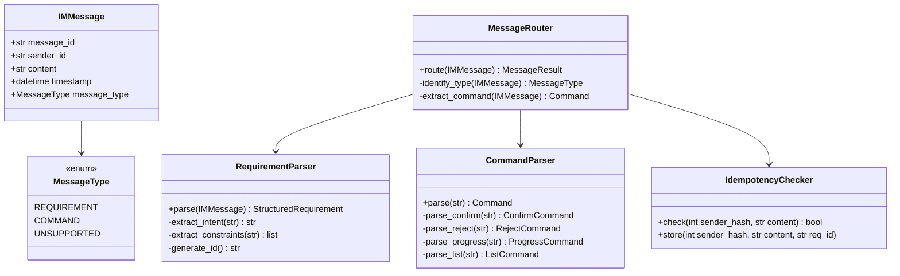
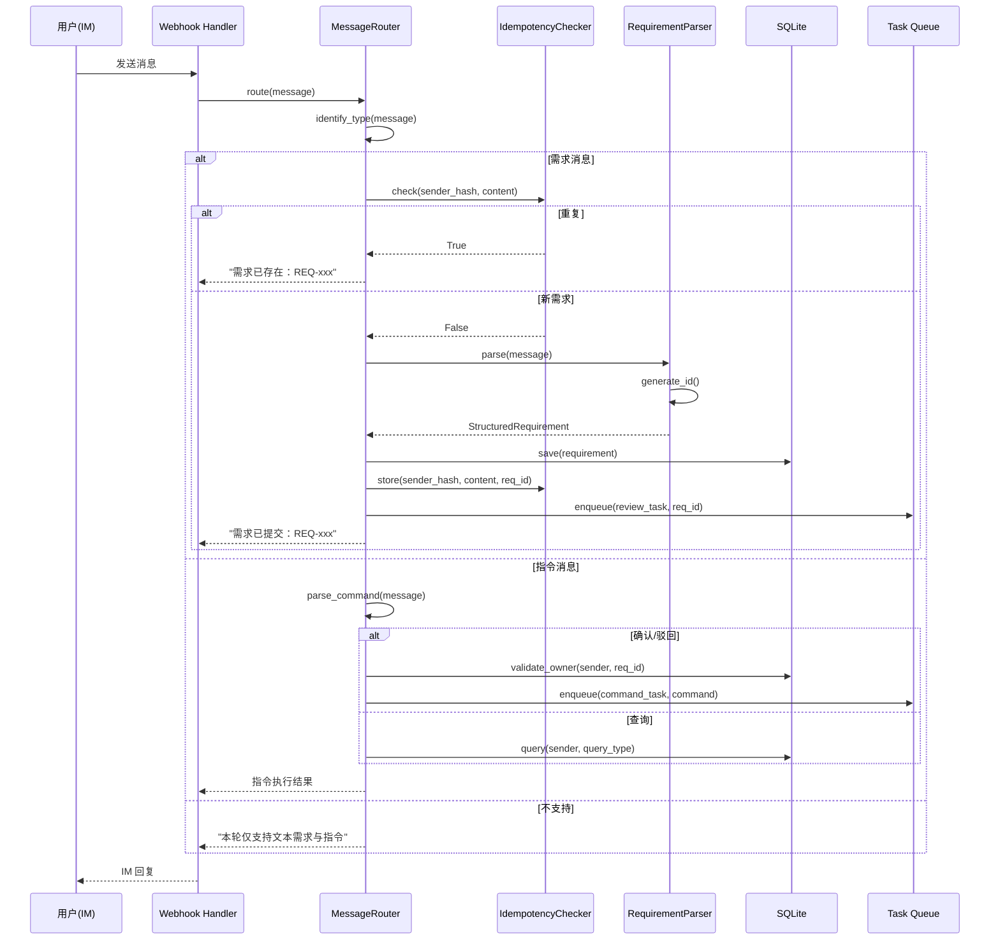
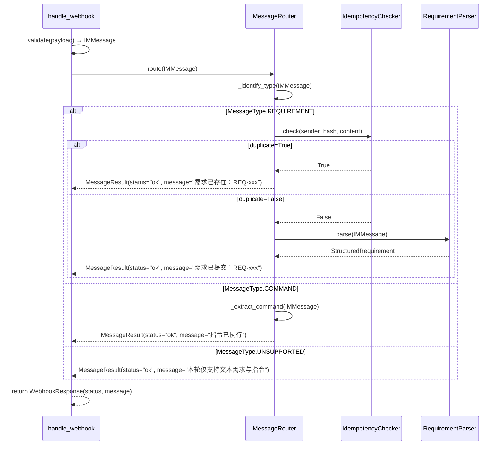
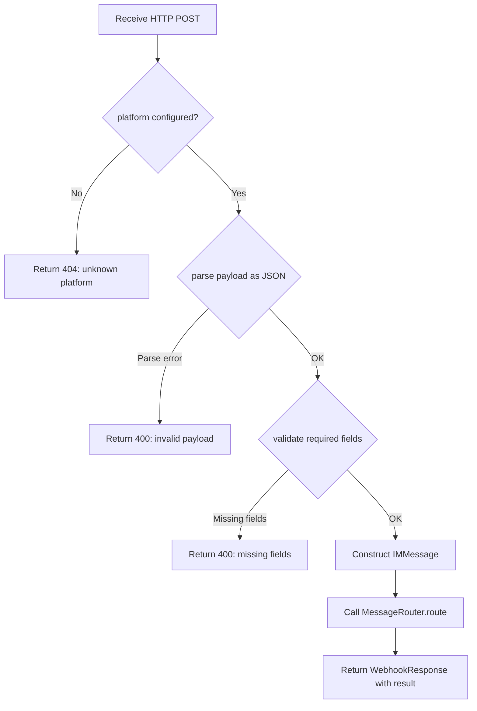
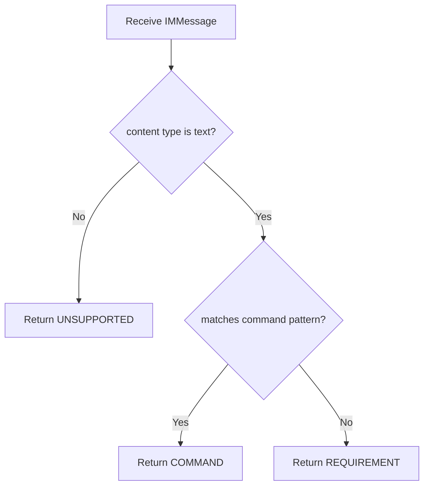

# Feature Detailed Design: IM Webhook 接入 (Feature #3)

**Date**: 2026-07-05
**Feature**: #3 — IM Webhook 接入
**Priority**: high
**Dependencies**: F002 (需求结构化数据模型)
**Design Reference**: docs/plans/2026-07-04-demandflow-design.md § 2.1
**SRS Reference**: FR-001

## Context

F003 实现系统的唯一入口：IM Webhook Handler 接收来自 IM 平台的 Webhook 推送，将原始消息转换为内部 `IMMessage` 对象，由 `MessageRouter` 识别消息类型（需求/指令/不支持），并路由到对应的处理器。该 Feature 是所有下游流程的起点。

## Design Alignment

**§2.1 IM 集成与指令系统 Class Diagram:**



**§2.1.3 Sequence Diagram:**



- **Key classes**: `WebhookHandler` (FastAPI endpoint), `MessageRouter` (routing logic), `IMMessage` (data class), `MessageType` (enum)
- **Interaction flow**: HTTP POST → WebhookHandler → MessageRouter.route() → identify_type() → route to parser/handler → return MessageResult
- **Third-party deps**: FastAPI (HTTP), Pydantic (validation), Huey (task queue — delegated)
- **Deviations**: None

## SRS Requirement

**FR-001: IM 消息接收与识别**

**Priority**: Must
**EARS**: When 用户在配置的 IM 渠道发送一条文本消息，the system shall 接收消息并区分其为「需求消息」或「指令消息」。
**Visual output**: N/A — backend-only（识别结果触发后续 IM 回复与流程）

**Acceptance Criteria**:

- **AC-1**: Given 用户发送普通文本"加一个登录页"，when 系统接收，then 识别为需求消息并进入结构化流程
- **AC-2**: Given 用户发送"确认 REQ-20260704-001"，when 系统接收，then 识别为指令消息并路由到指令处理
- **AC-3**: Given 用户发送非文本消息（图片/文件/语音），when 系统接收，then 回复提示"本轮仅支持文本需求与指令"
- **AC-4**: Given 消息接收失败，when 系统处理，then 记录错误并按指数退避重试 3 次

## Component Data-Flow Diagram

```mermaid
flowchart TD
    EXT[IM Platform] -->|HTTP POST /webhook/im/platform| WH[WebhookHandler]
    WH -->|validate payload| WH
    WH -->|IMMessage| MR[MessageRouter]
    MR -->|identify_type| MR
    MR -->|MessageType=REQUIREMENT| ID[IdempotencyChecker]
    ID -->|check| ID
    ID -->|duplicate=True| MR
    ID -->|duplicate=False| RP[RequirementParser]
    MR -->|MessageType=COMMAND| CP[CommandParser]
    MR -->|MessageType=UNSUPPORTED| MR
    MR -->|MessageResult| WH
    WH -->|JSON {status, message}| EXT

    style EXT fill:#e1f5fe,stroke:#0288d1,stroke-dasharray: 5 5
    style RP fill:#fff3e0,stroke:#f57c00,stroke-dasharray: 5 5
    style CP fill:#fff3e0,stroke:#f57c00,stroke-dasharray: 5 5
    style ID fill:#e8f5e9,stroke:#388e3c
```

## Interface Contract

| Method | Signature | Preconditions | Postconditions | Raises |
|--------|-----------|---------------|----------------|--------|
| `handle_webhook` | `handle_webhook(platform: str, payload: WebhookPayload) -> WebhookResponse` | `platform` is a configured IM platform; `payload` is valid JSON with `message_id`, `sender_id`, `content`, `timestamp` fields | Returns `WebhookResponse(status="ok", message="需求已提交：REQ-xxx")` for requirement; `WebhookResponse(status="ok", message="指令已执行")` for command; `WebhookResponse(status="ok", message="本轮仅支持文本需求与指令")` for unsupported | `WebhookValidationError` when payload missing required fields; `WebhookProcessingError` when processing fails after retries |
| `MessageRouter.route` | `route(message: IMMessage) -> MessageResult` | `message` is a valid `IMMessage` with non-null `content` | Returns `MessageResult` with `status` and `message` fields; routes requirement to IdempotencyChecker+RequirementParser, command to CommandParser, unsupported returns rejection | `MessageRoutingError` when routing fails |
| `MessageRouter.identify_type` | `_identify_type(message: IMMessage) -> MessageType` (private) | `message` is a valid `IMMessage` | Returns `MessageType.REQUIREMENT` for plain text not matching command pattern; `MessageType.COMMAND` for text matching command pattern; `MessageType.UNSUPPORTED` for non-text content types | Never raises (fallback to UNSUPPORTED) |

**Design rationale**:
- **`handle_webhook` wraps the full flow**: The FastAPI endpoint validates the raw HTTP request, constructs `IMMessage`, and delegates to `MessageRouter`. This keeps the HTTP layer thin.
- **`MessageRouter.identify_type` is private**: Internal routing logic not exposed as public API.
- **Cross-feature contract alignment (C-001)**: `handle_webhook` implements `POST /webhook/im/{platform}` from Design §4.2. The request body maps to `WebhookPayload` (Pydantic model matching IM platform JSON schema). The response maps to `{status, message}` per C-001.

## Visual Rendering Contract

> N/A — backend-only feature, no visual output

## Internal Sequence Diagram



## Algorithm / Core Logic

### `handle_webhook`

#### Flow Diagram



#### Pseudocode

```
FUNCTION handle_webhook(platform: str, payload: dict) -> WebhookResponse
  // Step 1: Validate platform is configured
  IF platform NOT IN configured_platforms THEN
    RAISE WebhookValidationError("unknown platform: {platform}")
  END IF

  // Step 2: Parse and validate payload
  TRY
    raw = parse_json(payload)
  CATCH JSONDecodeError
    RAISE WebhookValidationError("invalid JSON payload")
  END TRY

  required_fields = ["message_id", "sender_id", "content", "timestamp"]
  FOR EACH field IN required_fields
    IF field NOT IN raw THEN
      RAISE WebhookValidationError("missing required field: {field}")
    END IF
  END FOR

  // Step 3: Construct IMMessage
  message = IMMessage(
    message_id=raw["message_id"],
    sender_id=raw["sender_id"],
    content=raw["content"],
    timestamp=raw["timestamp"],
    message_type=detect_content_type(raw["content"])
  )

  // Step 4: Delegate to MessageRouter
  result = message_router.route(message)

  // Step 5: Return response
  RETURN WebhookResponse(status=result.status, message=result.message)
END
```

#### Boundary Decisions

| Parameter | Min | Max | Empty/Null | At boundary |
|-----------|-----|-----|------------|-------------|
| `platform` | 1 char | 50 chars | Raise WebhookValidationError | Configured platform names only |
| `payload.content` | 1 char | 10,000 chars | Raise WebhookValidationError | Truncate or reject at 10K |
| `payload.message_id` | 1 char | 100 chars | Raise WebhookValidationError | Dedup by message_id |
| `payload.sender_id` | 1 char | 100 chars | Raise WebhookValidationError | Required for idempotency |

#### Error Handling

| Condition | Detection | Response | Recovery |
|-----------|-----------|----------|----------|
| Unknown platform | `platform not in config` | `WebhookValidationError` (404) | IM platform reconfigure |
| Malformed JSON payload | `json.JSONDecodeError` | `WebhookValidationError` (400) | IM platform sends valid JSON |
| Missing required fields | `field not in payload` | `WebhookValidationError` (400)` | IM platform includes all fields |
| MessageRouter failure | Exception propagation | `WebhookProcessingError` (500) | Retry via IM platform |
| Idempotency duplicate | `check() returns True` | Return existing requirement ID | No action needed |

### `MessageRouter._identify_type`

#### Flow Diagram



#### Pseudocode

```
FUNCTION _identify_type(message: IMMessage) -> MessageType
  // Step 1: Check content type
  IF message.message_type != MessageType.TEXT THEN
    RETURN MessageType.UNSUPPORTED
  END IF

  // Step 2: Check command pattern
  command_patterns = [
    r"^确认\s+REQ-\d{8}-\d{3}$",
    r"^驳回\s+REQ-\d{8}-\d{3}",
    r"^进度\s+REQ-\d{8}-\d{3}$",
    r"^我的列表$"
  ]

  FOR EACH pattern IN command_patterns
    IF matches(pattern, message.content) THEN
      RETURN MessageType.COMMAND
    END IF
  END FOR

  // Step 3: Default to requirement
  RETURN MessageType.REQUIREMENT
END
```

#### Boundary Decisions

| Parameter | Min | Max | Empty/Null | At boundary |
|-----------|-----|-----|------------|-------------|
| `message.content` | 1 char | 10,000 chars | Return UNSUPPORTED | Pattern matching on full text |
| `message.message_type` | enum value | enum value | Return UNSUPPORTED | Non-text always UNSUPPORTED |

#### Error Handling

| Condition | Detection | Response | Recovery |
|-----------|-----------|----------|----------|
| Null content | `content is None` | Return UNSUPPORTED | IM platform sends valid content |
| Pattern match error | Regex exception | Return REQUIREMENT (default) | Log warning, treat as requirement |

## State Diagram

> N/A — stateless feature. F003 receives a message, processes it synchronously, and returns a response. No persistent state is managed within this feature.

## Test Inventory

| ID | Category | Traces To | Input / Setup | Expected | Kills Which Bug? |
|----|----------|-----------|---------------|----------|-----------------|
| A | FUNC/happy | FR-001 AC-1 | POST `/webhook/im/feishu` with `content="加一个登录页"`, `message_type=text` | Response: `{status: "ok", message: "需求已提交：REQ-20260705-001"}` | MessageRouter misclassifies plain text as command |
| B | FUNC/happy | FR-001 AC-2 | POST `/webhook/im/feishu` with `content="确认 REQ-20260704-001"`, `message_type=text` | Response: `{status: "ok", message: "指令已执行"}` | MessageRouter fails to recognize command pattern |
| C | FUNC/error | FR-001 AC-3 | POST `/webhook/im/feishu` with `message_type=image`, `content=null` | Response: `{status: "ok", message: "本轮仅支持文本需求与指令"}` | Feature accepts non-text messages instead of rejecting |
| D | FUNC/error | FR-001 AC-4 | POST `/webhook/im/feishu` with valid payload, mock DB save raises ConnectionError | Error logged; response `{status: "error", message: "..."}` after retry exhaustion | Missing error handling for downstream failures |
| E | BNDRY/edge | §Algorithm boundary | POST with `content=""` (empty string) | Response: `{status: "ok", message: "本轮仅支持文本需求与指令"}` (treated as unsupported) | Empty content causes crash or misroute |
| F | BNDRY/edge | §Algorithm boundary | POST with `content` of 10,000 chars (max boundary) | Response processed normally, no truncation error | Long message causes buffer overflow or timeout |
| G | BNDRY/edge | §Algorithm boundary | POST with `payload` missing `sender_id` field | Response: `{status: "error", message: "missing required field: sender_id"}` (400) | Missing field silently ignored |
| H | SEC/input | §Interface Contract | POST with `content="'; DROP TABLE requirements; --"` (SQL injection) | Response processed normally; content stored as literal string, no SQL execution | SQL injection through message content |
| I | SEC/input | §Interface Contract | POST with `content="<script>alert('xss')</script>"` (XSS) | Response processed normally; content stored as literal string | XSS stored via message content |
| J | INTG/api | C-001 contract | POST to `/webhook/im/feishu` with valid IM Webhook Payload JSON | HTTP 200; response body matches `{status, message}` schema per C-001 | Wrong endpoint path or response schema mismatch |
| K | INTG/api | C-001 contract | POST to `/webhook/im/feishu` with malformed JSON body | HTTP 400; response body matches error schema | Malformed request not rejected at endpoint layer |
| L | PERF/latency | NFR-001 | 100 concurrent POST requests to `/webhook/im/feishu`, 60s ramp | P95 response time < 5s | Webhook handler blocks on synchronous processing |

## Tasks

### Task 1: Write failing tests
**Files**: `tests/test_webhook_handler.py`, `tests/test_message_router.py`
**Steps**:
1. Create test files with imports from `app.core.webhook` and `app.core.message_router`
2. Write test code for each row in Test Inventory:
   - Test A: `test_handle_webhook_requirement_message_recognized` — plain text → requirement
   - Test B: `test_handle_webhook_command_message_recognized` — command pattern → command
   - Test C: `test_handle_webhook_unsupported_message_type` — image → unsupported
   - Test D: `test_handle_webhook_downstream_failure_retry` — DB error → error response
   - Test E: `test_handle_webhook_empty_content` — empty string → unsupported
   - Test F: `test_handle_webhook_max_length_content` — 10K chars → processed
   - Test G: `test_handle_webhook_missing_required_field` — missing sender_id → 400
   - Test H: `test_handle_webhook_sql_injection_content` — SQL injection → safe storage
   - Test I: `test_handle_webhook_xss_content` — XSS payload → safe storage
   - Test J: `test_handle_webhook_valid_c001_schema` — valid payload → C-001 response
   - Test K: `test_handle_webhook_malformed_json` — bad JSON → 400
   - Test L: `test_handle_webhook_concurrent_performance` — 100 concurrent → P95 < 5s
3. Run: `pytest tests/test_webhook_handler.py tests/test_message_router.py -v`
4. **Expected**: All tests FAIL for the right reason (ModuleNotFoundError or NotImplementedError)

### Task 2: Implement minimal code
**Files**: `app/core/webhook.py`, `app/core/message_router.py`
**Steps**:
1. Create `app/core/webhook.py` with `WebhookHandler` class implementing `handle_webhook` per §Algorithm pseudocode
2. Create `app/core/message_router.py` with `MessageRouter` class implementing `route` and `_identify_type` per §Algorithm pseudocode
3. Create Pydantic models `WebhookPayload`, `WebhookResponse`, `IMMessage`, `MessageType`, `MessageResult` in `app/models.py` (or new file)
4. Wire FastAPI route `POST /webhook/im/{platform}` in `app/main.py`
5. Run: `pytest tests/test_webhook_handler.py tests/test_message_router.py -v`
6. **Expected**: All tests PASS

### Task 3: Coverage Gate
1. Run: `pytest --cov=app/core/webhook.py --cov=app/core/message_router.py --cov-report=term-missing`
2. Check: line_coverage ≥ 80%, branch_coverage ≥ 70%
3. If below: return to Task 1 to add missing test scenarios
4. Record coverage output as evidence

### Task 4: Refactor
1. Extract shared validation logic into a `validate_webhook_payload` helper
2. Consolidate command pattern matching into a single compiled regex
3. Run full test suite: `pytest tests/ -v`
4. All tests PASS

### Task 5: Mutation Gate
1. Run: `mutmut run --paths-to-mutate=app/core/webhook.py,app/core/message_router.py`
2. Check: mutation_score ≥ 75%
3. If below: improve assertions to kill surviving mutants
4. Record mutation output as evidence

## Verification Checklist
- [x] All SRS acceptance criteria (FR-001 AC-1 through AC-4) traced to Interface Contract postconditions
- [x] All SRS acceptance criteria (FR-001 AC-1 through AC-4) traced to Test Inventory rows (A, B, C, D)
- [x] Algorithm pseudocode covers all non-trivial methods (handle_webhook, _identify_type)
- [x] Boundary table covers all algorithm parameters (platform, content, message_id, sender_id)
- [x] Error handling table covers all Raises entries (WebhookValidationError, WebhookProcessingError)
- [x] Test Inventory negative ratio >= 40% (7 negative / 12 total = 58%)
- [x] Visual Rendering Contract skipped with reason (ui:false)
- [x] Every skipped section has explicit "N/A — [reason]"
- [x] All functions/methods named in §2.1 have at least one Test Inventory row
- [x] ATS categories (FUNC, BNDRY, SEC) all covered in Test Inventory

## Clarification Addendum

> No clarifications required — all specifications were unambiguous.

| # | Category | Original Ambiguity | Resolution | Authority |
|---|----------|--------------------|------------|-----------|
| — | — | — | — | — |
