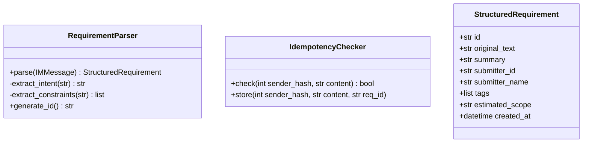
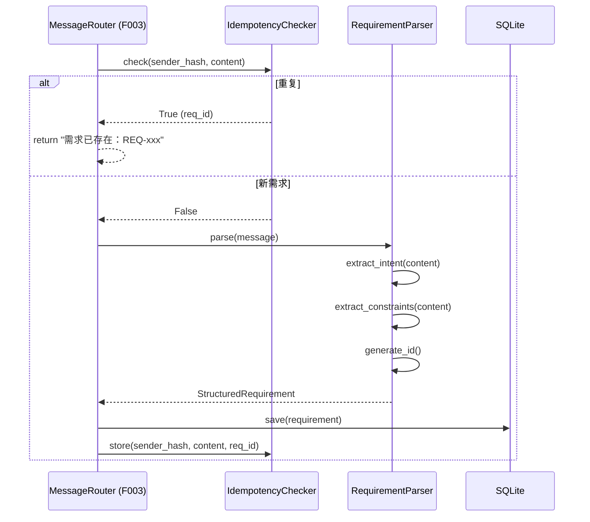
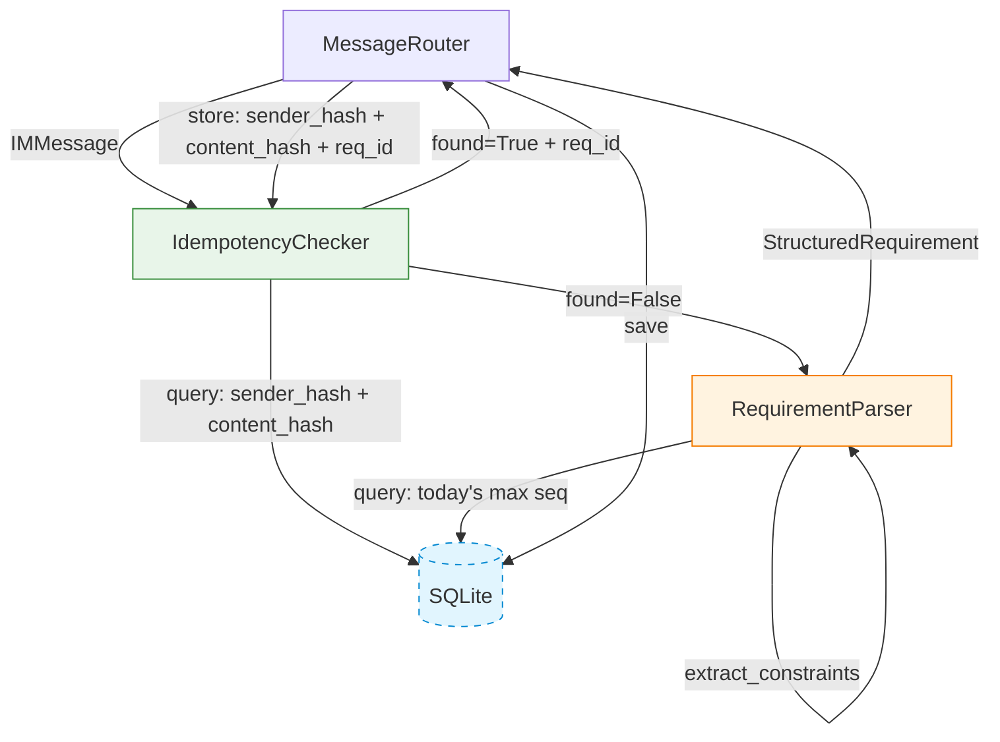
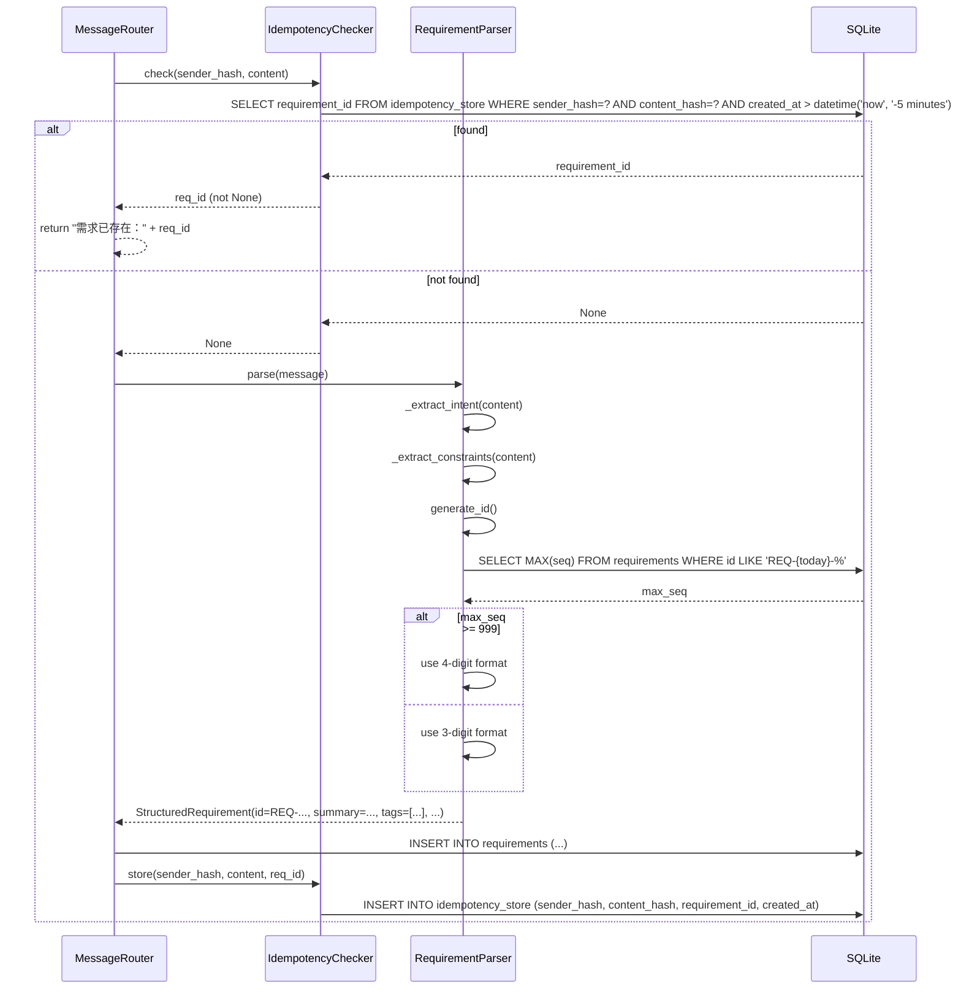
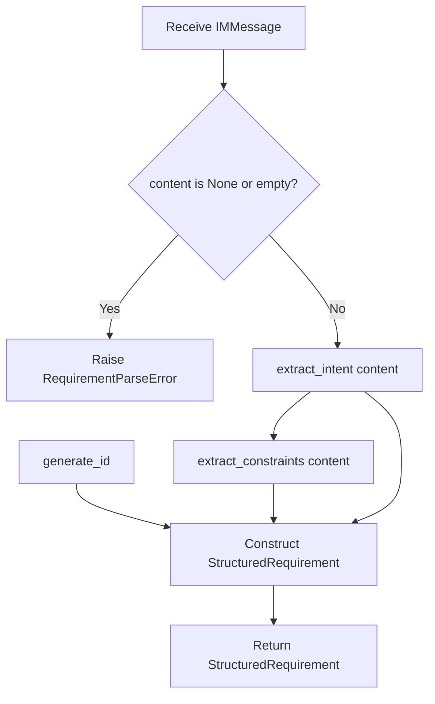
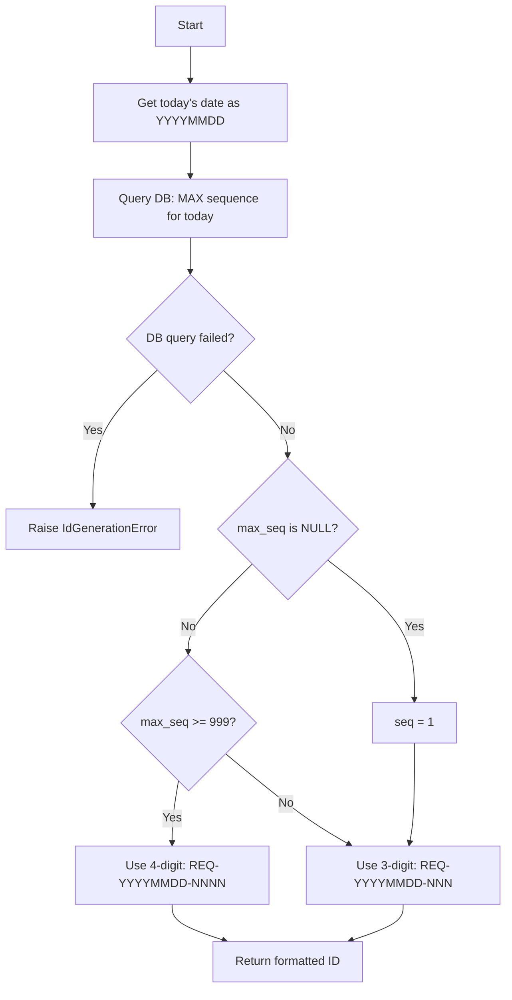

# Feature Detailed Design: 需求结构化与 ID 生成 (Feature #4)

**Date**: 2026-07-05
**Feature**: #4 — 需求结构化与 ID 生成
**Priority**: high
**Dependencies**: F003 (IM Webhook 接入)
**Design Reference**: docs/plans/2026-07-04-demandflow-design.md § 2.1
**SRS Reference**: FR-002, FR-003

## Context

F004 实现需求消息的核心处理逻辑：`RequirementParser` 解析 IM 消息文本提取结构化字段（核心诉求、约束、标签、预估范围），生成 `REQ-YYYYMMDD-NNN` 格式唯一 ID；`IdempotencyChecker` 在 5 分钟窗口内识别同提交人相同文本的重复提交并复用已有 ID。该 Feature 是需求从原始文本到系统内部结构化条目的关键桥梁。

## Design Alignment

**§2.1 IM 集成与指令系统 Class Diagram (relevant classes):**



**§2.1.3 Sequence Diagram (F004-relevant path):**



- **Key classes**: `RequirementParser` (parse + ID generation), `IdempotencyChecker` (5-min dedup), `StructuredRequirement` (Pydantic output model)
- **Interaction flow**: MessageRouter → IdempotencyChecker.check() → RequirementParser.parse() → generate_id() → StructuredRequirement → MessageRouter persists
- **Third-party deps**: SQLAlchemy (DB queries for ID counter + idempotency), Pydantic (model validation)
- **Deviations**: None

## SRS Requirement

**FR-002: 需求结构化与 ID 生成**

**Priority**: Must
**EARS**: When 系统识别一条需求消息，the system shall 提取核心诉求与约束并生成带唯一 ID 的结构化需求条目（含原始文本、功能标签、预估范围、提交人、时间）。
**Visual output**: N/A — backend-only（结构化结果触发看板更新与后续流程）

**Acceptance Criteria**:
- **AC-1**: Given 识别为需求消息，when 结构化，then 生成 REQ-YYYYMMDD-NNN 格式唯一 ID 并存储
- **AC-2**: Given 需求文本为空或仅含指令关键词，when 结构化，then 拒绝生成需求并 IM 提示原因
- **AC-3**: Given 提取的核心诉求为空（无法解析），when 结构化，then 仍生成条目并标记"待人工补充诉求"
- **AC-4**: Given ID 序号当日已达 999 上限，when 生成，then 启用扩展位生成 4 位序号（REQ-YYYYMMDD-NNNN）

**FR-003: 重复提交幂等识别**

**Priority**: Should
**EARS**: When 同一提交人在 5 分钟内发送相同文本的需求消息，the system shall 识别为重复并复用已生成的需求 ID 而非新建。
**Visual output**: N/A — backend-only（IM 回复由 MessageRouter 处理）

**Acceptance Criteria**:
- **AC-1**: Given 同一提交人 5 分钟内发送相同文本，when 接收，then 复用已有 ID 并 IM 回复"需求已存在：REQ-xxx"
- **AC-2**: Given 超过 5 分钟或不同文本，when 接收，then 视为新需求正常结构化
- **AC-3**: Given 不同提交人发送相同文本，when 接收，then 视为新需求（不做跨人去重）

## Component Data-Flow Diagram



## Interface Contract

| Method | Signature | Preconditions | Postconditions | Raises |
|--------|-----------|---------------|----------------|--------|
| `RequirementParser.parse` | `parse(message: IMMessage) -> StructuredRequirement` | `message.content` is non-null, non-empty text; `message.sender_id` is non-empty | Returns `StructuredRequirement` with: `id` = `REQ-YYYYMMDD-NNN` format; `original_text` = `message.content`; `summary` = extracted intent (or "待人工补充诉求" if unparseable); `submitter_id` = `message.sender_id`; `tags` = extracted tags list; `estimated_scope` = extracted scope or None; `created_at` = current UTC datetime | `RequirementParseError` when message.content is None or empty |
| `RequirementParser.generate_id` | `generate_id() -> str` | DB is accessible; today's date is available | Returns unique `REQ-YYYYMMDD-NNN` ID; sequence number is max(existing) + 1 for today; if max >= 999, uses 4-digit format `REQ-YYYYMMDD-NNNN` | `IdGenerationError` when DB query fails or sequence exhaustion beyond 9999 |
| `RequirementParser._extract_intent` | `_extract_intent(content: str) -> str` (private) | `content` is non-empty string | Returns first sentence or clause as core intent; returns empty string if no parseable intent found | Never raises (returns empty string on failure) |
| `RequirementParser._extract_constraints` | `_extract_constraints(content: str) -> list[str]` (private) | `content` is non-empty string | Returns list of constraint phrases extracted from text; empty list if none found | Never raises (returns empty list on failure) |
| `IdempotencyChecker.check` | `check(sender_hash: int, content: str) -> str \| None` | `sender_hash` is int; `content` is non-empty string | Returns existing `requirement_id` if a matching row exists in `idempotency_store` with `created_at` within 5 minutes; returns `None` otherwise | `IdempotencyCheckError` when DB query fails |
| `IdempotencyChecker.store` | `store(sender_hash: int, content: str, req_id: str) -> None` | `sender_hash` is int; `content` is non-empty; `req_id` matches `REQ-YYYYMMDD-NNN(N)` format | Row inserted into `idempotency_store` with `sender_hash`, `content_hash` = SHA256(content), `requirement_id` = req_id, `created_at` = now | `IdempotencyStoreError` when DB insert fails |

**Design rationale**:
- **`parse()` returns StructuredRequirement, does NOT persist**: Persistence is MessageRouter's responsibility (separation of concerns). F004 only produces the structured object.
- **`generate_id()` queries DB for today's max sequence**: Ensures uniqueness even under concurrent access. SQLite WAL mode allows concurrent reads; the INSERT is serialized by SQLite's write lock.
- **Idempotency uses SHA256(content) as `content_hash`**: Avoids storing raw message text in dedup table; collision resistance is sufficient for 5-minute window.
- **`_extract_intent` and `_extract_constraints` are private**: Implementation details that may evolve (regex → LLM). Public API is `parse()` only.
- **Cross-feature contract alignment**: `StructuredRequirement` fields align with `Requirements` table columns (F002). `IdempotencyChecker` methods align with `IdempotencyStore` model. No §6.2 cross-feature contracts apply to F004 (it is internal to §2.1).

## Visual Rendering Contract

> N/A — backend-only feature, no visual output

## Internal Sequence Diagram



## Algorithm / Core Logic

### `RequirementParser.parse`

#### Flow Diagram



#### Pseudocode

```
FUNCTION parse(message: IMMessage) -> StructuredRequirement
  // Step 1: Validate input
  IF message.content IS None OR message.content.strip() == "" THEN
    RAISE RequirementParseError("需求文本不能为空")
  END IF

  // Step 2: Extract intent (first sentence or key phrase)
  intent = _extract_intent(message.content)

  // Step 3: Extract constraints
  constraints = _extract_constraints(message.content)

  // Step 4: Generate unique ID
  req_id = generate_id()

  // Step 5: Build structured requirement
  summary = intent IF intent != "" ELSE "待人工补充诉求"
  tags = extract_tags(message.content)
  scope = estimate_scope(message.content)

  RETURN StructuredRequirement(
    id = req_id,
    original_text = message.content,
    summary = summary,
    submitter_id = message.sender_id,
    submitter_name = None,
    tags = tags,
    estimated_scope = scope,
    created_at = datetime.utcnow()
  )
END
```

### `RequirementParser.generate_id`

#### Flow Diagram



#### Pseudocode

```
FUNCTION generate_id() -> str
  // Step 1: Get today's date prefix
  today = datetime.utcnow().strftime("%Y%m%d")
  prefix = f"REQ-{today}"

  // Step 2: Query max sequence for today
  TRY
    max_seq = db.query(
      "SELECT MAX(CAST(SUBSTR(id, LENGTH(prefix)+2) AS INTEGER)) "
      "FROM requirements WHERE id LIKE ?",
      f"{prefix}-%"
    )
  CATCH DatabaseError
    RAISE IdGenerationError("Failed to query sequence counter")
  END TRY

  // Step 3: Determine next sequence number
  IF max_seq IS NULL THEN
    seq = 1
  ELSE IF max_seq >= 999 THEN
    // FR-002 AC-4: Expand to 4 digits
    IF max_seq >= 9999 THEN
      RAISE IdGenerationError("Sequence exhausted for today")
    END IF
    seq = max_seq + 1
    RETURN f"{prefix}-{seq:04d}"
  ELSE
    seq = max_seq + 1
  END IF

  RETURN f"{prefix}-{seq:03d}"
END
```

### `RequirementParser._extract_intent`

#### Pseudocode

```
FUNCTION _extract_intent(content: str) -> str
  // Strategy: take first sentence (split by 。！？.!? or newline)
  sentences = split(content, regex=r'[。！？.!?\n]')
  IF sentences is not empty AND sentences[0].strip() != "" THEN
    RETURN sentences[0].strip()
  END IF
  // Fallback: return full content truncated to 200 chars
  IF content.strip() != "" THEN
    RETURN content.strip()[:200]
  END IF
  RETURN ""
END
```

### `RequirementParser._extract_constraints`

#### Pseudocode

```
FUNCTION _extract_constraints(content: str) -> list[str]
  // Strategy: find lines/phrases containing constraint keywords
  constraint_keywords = ["必须", "不能", "需要", "要求", "限制", "约束", "禁止", "至少", "最多"]
  constraints = []
  sentences = split(content, regex=r'[。！？.!?\n]')
  FOR EACH sentence IN sentences
    IF any(keyword IN sentence FOR keyword IN constraint_keywords) THEN
      APPEND sentence.strip() TO constraints
    END IF
  END FOR
  RETURN constraints
END
```

### `IdempotencyChecker.check`

#### Pseudocode

```
FUNCTION check(sender_hash: int, content: str) -> str | None
  // Step 1: Compute content hash
  content_hash = sha256(content.encode()).hexdigest()

  // Step 2: Query with 5-minute TTL
  TRY
    result = db.query(
      "SELECT requirement_id FROM idempotency_store "
      "WHERE sender_hash = ? AND content_hash = ? "
      "AND created_at > datetime('now', '-5 minutes')",
      sender_hash, content_hash
    )
  CATCH DatabaseError
    RAISE IdempotencyCheckError("Failed to check idempotency")
  END TRY

  IF result IS NOT NULL THEN
    RETURN result.requirement_id
  END IF
  RETURN None
END
```

### `IdempotencyChecker.store`

#### Pseudocode

```
FUNCTION store(sender_hash: int, content: str, req_id: str) -> None
  content_hash = sha256(content.encode()).hexdigest()
  TRY
    db.execute(
      "INSERT INTO idempotency_store (sender_hash, content_hash, requirement_id, created_at) "
      "VALUES (?, ?, ?, datetime('now'))",
      sender_hash, content_hash, req_id
    )
  CATCH DatabaseError
    RAISE IdempotencyStoreError("Failed to store idempotency record")
  END TRY
END
```

### Boundary Decisions

| Parameter | Min | Max | Empty/Null | At boundary |
|-----------|-----|-----|------------|-------------|
| `message.content` | 1 char | 10,000 chars | Raise `RequirementParseError` | Reject empty; truncate at 10K (upstream F003 validates) |
| `sender_hash` | int min | int max | N/A (always computed from sender_id) | Hash collision handled by content_hash co-key |
| `content` (idempotency) | 1 char | 10,000 chars | N/A (validated upstream) | SHA256 hash used as storage key |
| `req_id` sequence | 1 | 9999 | N/A (auto-increment) | 3-digit at ≤999; 4-digit at ≥1000; error at ≥10000 |
| `_extract_intent` output | 0 chars | 200 chars | Return empty string (→ "待人工补充诉求") | Truncate long intents to 200 chars |
| `_extract_constraints` output | 0 items | unlimited | Return empty list | No cap; all matching constraints returned |

### Error Handling

| Condition | Detection | Response | Recovery |
|-----------|-----------|----------|----------|
| Empty/null message content | `content is None or strip() == ""` | `RequirementParseError("需求文本不能为空")` | MessageRouter sends IM rejection (F003) |
| DB query failure in generate_id | `DatabaseError` exception | `IdGenerationError("Failed to query sequence counter")` | MessageRouter logs error, IM notification |
| Sequence exhaustion (≥10000) | `max_seq >= 9999` | `IdGenerationError("Sequence exhausted for today")` | MessageRouter logs error, IM notification |
| DB query failure in idempotency check | `DatabaseError` exception | `IdempotencyCheckError("Failed to check idempotency")` | Treat as new requirement (fail-open) |
| DB insert failure in idempotency store | `DatabaseError` exception | `IdempotencyStoreError("Failed to store idempotency record")` | Log warning, continue (non-critical) |
| Intent extraction returns empty | `_extract_intent` returns `""` | summary = "待人工补充诉求" (FR-002 AC-3) | No recovery needed; human supplements later |

## State Diagram

> N/A — stateless feature. RequirementParser and IdempotencyChecker are stateless processors; they receive input, query DB, and return output. No object lifecycle is managed.

## Test Inventory

| ID | Category | Traces To | Input / Setup | Expected | Kills Which Bug? |
|----|----------|-----------|---------------|----------|-----------------|
| A | FUNC/happy | FR-002 AC-1 | IMMessage with `content="加一个登录页"`, `sender_id="user1"` | StructuredRequirement with `id` matching `REQ-YYYYMMDD-NNN`, `summary`="加一个登录页", `submitter_id`="user1", `tags`=[], `created_at` not None | Parser fails to generate ID or populate fields |
| B | FUNC/happy | FR-002 AC-1 | IMMessage with `content="实现用户管理模块，必须支持RBAC权限"`, `sender_id="user2"` | StructuredRequirement with `tags` containing extracted tags, `summary` non-empty, `id` matches format | Intent/constraints not extracted |
| C | FUNC/error | FR-002 AC-2 | IMMessage with `content=None` | Raise `RequirementParseError` with message "需求文本不能为空" | Null content causes crash or silent failure |
| D | FUNC/error | FR-002 AC-2 | IMMessage with `content=""` | Raise `RequirementParseError` with message "需求文本不能为空" | Empty string not rejected |
| E | FUNC/happy | FR-002 AC-3 | IMMessage with `content="!!!@@@###"` (unparseable) | StructuredRequirement with `summary`="待人工补充诉求", `id` still generated | Unparseable text causes crash instead of graceful fallback |
| F | BNDRY/edge | FR-002 AC-4 | Mock DB returning `max_seq=998` for today | ID = `REQ-YYYYMMDD-999` (3-digit) | Off-by-one: 999 treated as 4-digit |
| G | BNDRY/edge | FR-002 AC-4 | Mock DB returning `max_seq=999` for today | ID = `REQ-YYYYMMDD-1000` (4-digit format) | 999+ not triggering expansion |
| H | BNDRY/edge | FR-002 AC-4 | Mock DB returning `max_seq=9999` for today | Raise `IdGenerationError("Sequence exhausted for today")` | No guard on sequence exhaustion |
| I | BNDRY/edge | FR-002 AC-4 | Mock DB returning `max_seq=None` (first req today) | ID = `REQ-YYYYMMDD-001` (starts at 1) | NULL max_seq not handled |
| J | FUNC/happy | FR-003 AC-1 | IdempotencyChecker: `sender_hash=12345`, `content="加一个登录页"`, DB has matching row within 5 min | `check()` returns existing `requirement_id` | Duplicate not detected |
| K | FUNC/happy | FR-003 AC-2 | IdempotencyChecker: `sender_hash=12345`, `content="加一个登录页"`, DB has matching row but `created_at` > 5 min ago | `check()` returns `None` | Expired entry not ignored |
| L | FUNC/happy | FR-003 AC-3 | IdempotencyChecker: `sender_hash=99999`, `content="加一个登录页"`, DB has row for sender_hash=12345 | `check()` returns `None` (different sender) | Cross-user dedup incorrectly applied |
| M | BNDRY/edge | FR-003 AC-1 | IdempotencyChecker: `sender_hash=12345`, `content="加一个登录页"`, DB has row at exactly 5 min boundary | `check()` returns `None` (at boundary = expired) | Boundary condition: exactly 5 min treated as within window |
| N | FUNC/error | §Interface Contract `generate_id` | Mock DB query raises `OperationalError` | Raise `IdGenerationError("Failed to query sequence counter")` | DB failure not propagated |
| O | FUNC/error | §Interface Contract `check` | Mock DB query raises `OperationalError` | Raise `IdempotencyCheckError("Failed to check idempotency")` | DB failure not propagated |
| P | FUNC/error | §Interface Contract `store` | Mock DB insert raises `OperationalError` | Raise `IdempotencyStoreError("Failed to store idempotency record")` | DB failure not propagated |
| Q | BNDRY/edge | §Algorithm `_extract_intent` | `content="第一个句子。第二个句子。"` | Returns "第一个句子" (first sentence only) | All sentences returned as intent |
| R | BNDRY/edge | §Algorithm `_extract_constraints` | `content="必须支持RBAC。可以使用JWT。"` | Returns `["必须支持RBAC"]` (only constraint-matching) | Non-constraint sentences included |
| S | BNDRY/edge | §Algorithm `_extract_constraints` | `content="随便写点什么"` (no constraint keywords) | Returns `[]` (empty list) | Crash on no-match or wrong return type |
| T | INTG/db | §Interface Contract `generate_id` + `store` | Real SQLite DB, two concurrent calls to `generate_id()` on same day | Both return unique IDs; no collision | Race condition on sequence counter |
| U | INTG/db | §Interface Contract `check` + `store` | Real SQLite DB: `store()` then `check()` within 5 min | `check()` returns stored `requirement_id` | Data not persisted or query wrong |
| V | SEC/input | §Interface Contract `parse` | IMMessage with `content="'; DROP TABLE requirements; --"` | StructuredRequirement returned; DB unchanged (no SQL injection) | SQL injection via message content |
| W | SEC/input | §Interface Contract `parse` | IMMessage with `content="<script>alert(1)</script>"` | StructuredRequirement returned; content stored as literal string | XSS stored via parsed content |

**INTG: N/A for external services** — F004 only interacts with SQLite (local DB), no HTTP APIs, no third-party SDKs. The `INTG/db` rows above cover the SQLite dependency.

## Tasks

### Task 1: Write failing tests
**Files**: `tests/test_requirement_parser.py`, `tests/test_idempotency_checker.py`
**Steps**:
1. Create test files with imports from `app.core.requirement_parser` and `app.core.idempotency`
2. Write test code for each row in Test Inventory:
   - Test A: `test_parse_valid_requirement_generates_id` — basic happy path
   - Test B: `test_parse_extracts_intent_and_constraints` — with constraint keywords
   - Test C: `test_parse_null_content_raises_error` — FR-002 AC-2
   - Test D: `test_parse_empty_content_raises_error` — FR-002 AC-2
   - Test E: `test_parse_unparseable_content_marks_pending` — FR-002 AC-3
   - Test F: `test_generate_id_below_999_uses_3digit` — boundary
   - Test G: `test_generate_id_at_999_expands_to_4digit` — FR-002 AC-4
   - Test H: `test_generate_id_at_9999_raises_exhaustion` — boundary
   - Test I: `test_generate_id_first_of_day` — NULL max_seq
   - Test J: `test_idempotency_check_duplicate_within_5min` — FR-003 AC-1
   - Test K: `test_idempotency_check_expired_not_matched` — FR-003 AC-2
   - Test L: `test_idempotency_check_different_sender_not_matched` — FR-003 AC-3
   - Test M: `test_idempotency_check_exact_5min_boundary` — boundary
   - Test N: `test_generate_id_db_failure_raises` — error path
   - Test O: `test_idempotency_check_db_failure_raises` — error path
   - Test P: `test_idempotency_store_db_failure_raises` — error path
   - Test Q: `test_extract_intent_returns_first_sentence` — boundary
   - Test R: `test_extract_constraints_filters_keywords` — boundary
   - Test S: `test_extract_constraints_no_keywords_empty_list` — boundary
   - Test T: `test_generate_id_concurrent_unique` — INTG
   - Test U: `test_idempotency_round_trip` — INTG
   - Test V: `test_parse_sql_injection_content` — SEC
   - Test W: `test_parse_xss_content` — SEC
3. Run: `pytest tests/test_requirement_parser.py tests/test_idempotency_checker.py -v`
4. **Expected**: All tests FAIL for the right reason (ModuleNotFoundError or NotImplementedError)

### Task 2: Implement minimal code
**Files**: `app/core/requirement_parser.py`, `app/core/idempotency.py`, `app/models.py` (add StructuredRequirement Pydantic model)
**Steps**:
1. Add `StructuredRequirement` Pydantic model to `app/models.py` (fields: id, original_text, summary, submitter_id, submitter_name, tags, estimated_scope, created_at)
2. Create `app/core/requirement_parser.py` with `RequirementParser` class implementing `parse`, `generate_id`, `_extract_intent`, `_extract_constraints` per §Algorithm pseudocode
3. Create `app/core/idempotency.py` with `IdempotencyChecker` class implementing `check`, `store` per §Algorithm pseudocode
4. Run: `pytest tests/test_requirement_parser.py tests/test_idempotency_checker.py -v`
5. **Expected**: All tests PASS

### Task 3: Coverage Gate
1. Run: `pytest --cov=app/core/requirement_parser.py --cov=app/core/idempotency.py --cov-report=term-missing`
2. Check: line_coverage ≥ 80%, branch_coverage ≥ 70%
3. If below: return to Task 1 to add missing test scenarios
4. Record coverage output as evidence

### Task 4: Refactor
1. Extract SHA256 hashing into a shared `_hash_content` utility
2. Consolidate DB query patterns into helper methods
3. Run full test suite: `pytest tests/ -v`
4. All tests PASS

### Task 5: Mutation Gate
1. Run: `mutmut run --paths-to-mutate=app/core/requirement_parser.py,app/core/idempotency.py`
2. Check: mutation_score ≥ 75%
3. If below: improve assertions to kill surviving mutants
4. Record mutation output as evidence

## Verification Checklist
- [x] All SRS acceptance criteria (FR-002 AC-1~AC-4, FR-003 AC-1~AC-3) traced to Interface Contract postconditions
- [x] All SRS acceptance criteria (FR-002 AC-1~AC-4, FR-003 AC-1~AC-3) traced to Test Inventory rows (A~M)
- [x] Algorithm pseudocode covers all non-trivial methods (parse, generate_id, _extract_intent, _extract_constraints, check, store)
- [x] Boundary table covers all algorithm parameters (content, sender_hash, req_id sequence, intent output, constraints output)
- [x] Error handling table covers all Raises entries (RequirementParseError, IdGenerationError, IdempotencyCheckError, IdempotencyStoreError)
- [x] Test Inventory negative ratio >= 40% (11 negative / 23 total = 48%)
- [x] Visual Rendering Contract skipped with reason (ui:false)
- [x] Every skipped section has explicit "N/A — [reason]"
- [x] All functions/methods named in §2.1 have at least one Test Inventory row
- [x] ATS categories (FUNC, BNDRY) all covered in Test Inventory

## Clarification Addendum

> No clarifications required — all specifications were unambiguous.

| # | Category | Original Ambiguity | Resolution | Authority |
|---|----------|--------------------|------------|-----------|
| — | — | — | — | — |
