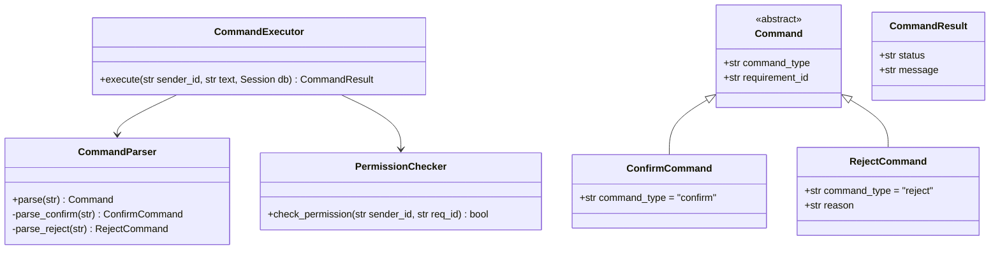
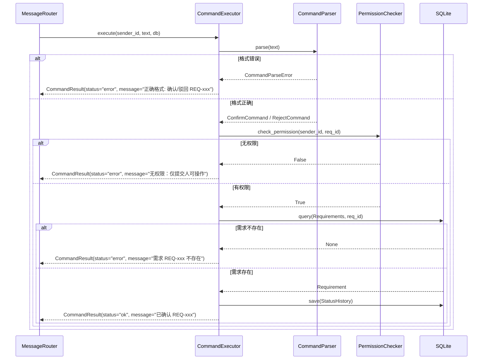
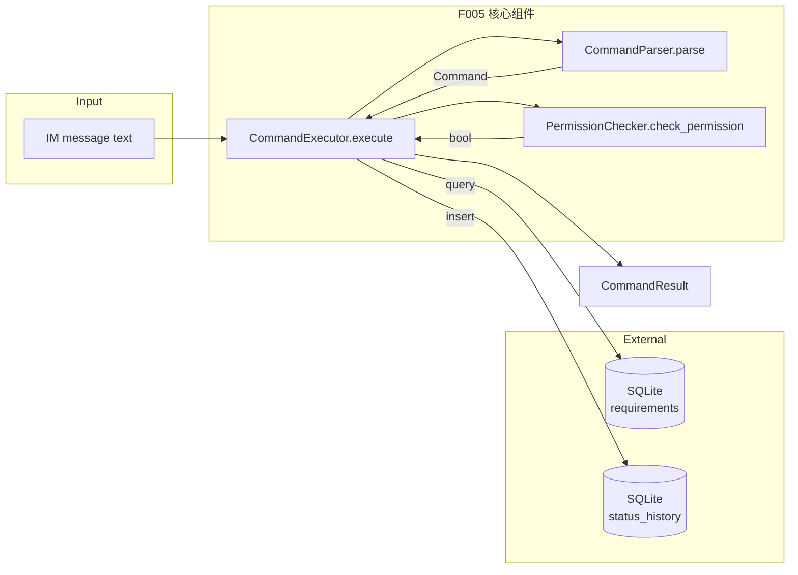
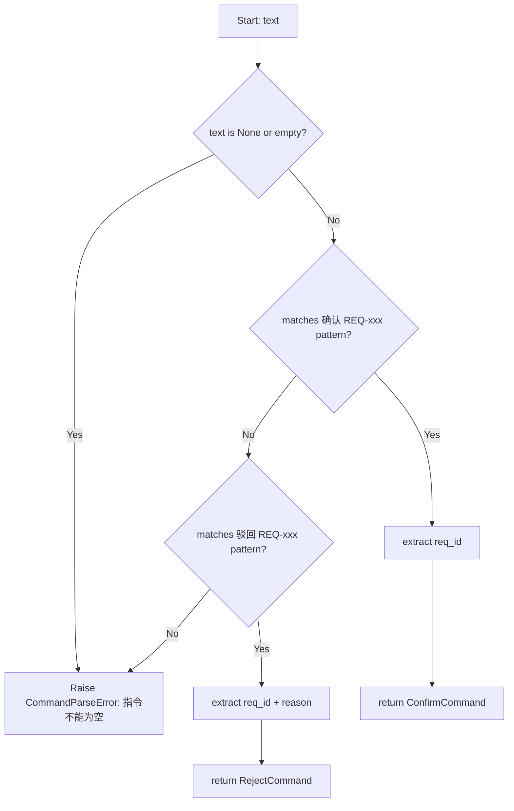
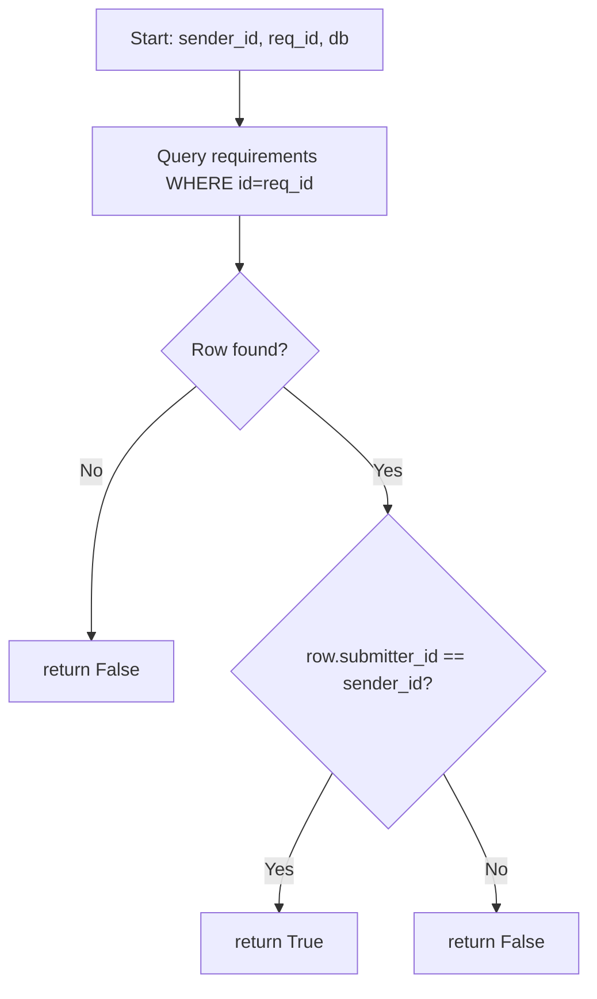
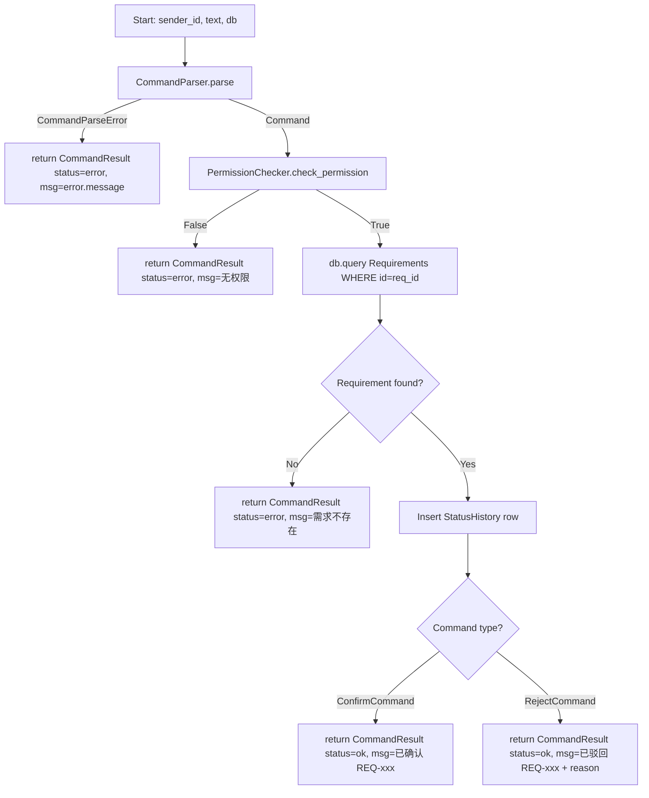

# Feature Detailed Design: 状态变更指令系统 (Feature #5)

**Date**: 2026-07-05
**Feature**: #5 — 状态变更指令系统
**Priority**: high
**Dependencies**: F004 (需求结构化与 ID 生成)
**Design Reference**: docs/plans/2026-07-04-demandflow-design.md § 2.1
**SRS Reference**: FR-004a

## Context

F005 实现确认/驳回指令的解析与权限校验，是 IM 指令系统的安全边界。用户通过 IM 发送"确认 REQ-xxx"或"驳回 REQ-xxx 修改意见XXX"，系统解析指令、校验提交人权限后执行对应操作。

## Design Alignment

### §2.1.2 Class Diagram (CommandParser 部分)



- **Key classes**: `CommandParser`, `PermissionChecker`, `CommandExecutor`, `Command` (base), `ConfirmCommand`, `RejectCommand`, `CommandResult`
- **Interaction flow**: MessageRouter identifies COMMAND type → delegates to CommandExecutor.execute() → CommandParser.parse() extracts structured command → PermissionChecker.check_permission() validates ownership → CommandExecutor returns CommandResult
- **Third-party deps**: None (pure Python + SQLAlchemy session for DB lookup)
- **Deviations**: None

### §2.1.3 Sequence Diagram (指令部分)



### §2.1.4 Design Notes

- **指令格式**: "确认 REQ-xxx"、"驳回 REQ-xxx 修改意见XXX"
- **权限校验**: 仅提交人可操作自己的需求（FR-004a）
- **需求 ID 格式**: `REQ-YYYYMMDD-NNN`（由 F004 RequirementParser.generate_id() 生成）

## SRS Requirement

### FR-004a: 状态变更类指令解析执行

**Priority**: Must
**EARS**: When 用户发送状态变更类指令（确认/驳回），the system shall 校验提交人权限后解析指令并执行对应操作。
**Visual output**: IM 返回指令执行结果

**Acceptance Criteria**:
- Given 提交人发送"确认 REQ-xxx"，when 解析，then 触发对应节点确认流转
- Given 提交人发送"驳回 REQ-xxx 修改意见XXX"，when 解析，then 携带意见回退到对应阶段
- Given 非提交人发送"确认/驳回 REQ-xxx"，when 解析，then 拒绝并 IM 提示"无权限：仅提交人可操作"
- Given 指令格式错误或需求 ID 不存在，when 解析，then IM 提示正确指令格式

## Component Data-Flow Diagram



## Interface Contract

| Method | Signature | Preconditions | Postconditions | Raises |
|--------|-----------|---------------|----------------|--------|
| `CommandParser.parse` | `parse(text: str) -> Command` | `text` is non-empty string matching "确认 REQ-xxx" or "驳回 REQ-xxx ..." pattern | Returns `ConfirmCommand` with valid requirement_id, or `RejectCommand` with reason extracted | `CommandParseError` if format invalid |
| `PermissionChecker.check_permission` | `check_permission(sender_id: str, req_id: str, db: Session) -> bool` | `sender_id` non-empty; `req_id` matches REQ format; `db` is valid SQLAlchemy Session | Returns `True` if `sender_id` matches `requirements.submitter_id` for given `req_id`, `False` otherwise | `PermissionCheckError` if DB query fails |
| `CommandExecutor.execute` | `execute(sender_id: str, text: str, db: Session) -> CommandResult` | `sender_id` non-empty; `text` non-empty; `db` is valid Session | Returns `CommandResult` with status="ok" and execution message on success; or status="error" with user-facing message on failure | None (errors encoded in CommandResult.status) |

**Design rationale**:
- `execute()` returns `CommandResult` instead of raising exceptions: errors are user-facing messages (格式错误、无权限、需求不存在) that should be returned as IM replies, not propagated as system errors
- `parse()` raises `CommandParseError` (not returns error result): parsing is internal logic; the caller (CommandExecutor) translates parse errors into CommandResult
- `PermissionChecker` takes `db` as parameter (not stored in constructor): aligns with existing codebase pattern (see `RequirementParser.__init__` and `IdempotencyChecker.__init__` which take `db_session`)
- Permission check queries `requirements.submitter_id` directly — no intermediate cache needed for single-organization deployment

## Visual Rendering Contract

> N/A — backend-only feature, `ui: false`

## Internal Sequence Diagram

N/A — single-class implementation pattern. The `CommandExecutor.execute()` method orchestrates `CommandParser.parse()` → `PermissionChecker.check_permission()` → DB operations. Error paths are documented in Algorithm §5 error handling table.

## Algorithm / Core Logic

### CommandParser.parse()

#### Flow Diagram



#### Pseudocode

```
FUNCTION parse(text: str) -> Command
  // Step 1: Validate input
  IF text is None OR text.strip() == "" THEN
    RAISE CommandParseError("指令不能为空")
  
  // Step 2: Normalize — strip whitespace
  text = text.strip()
  
  // Step 3: Try confirm pattern — "确认 REQ-xxxxxxxx-NNN"
  IF text starts with "确认 " THEN
    parts = text.split(maxsplit=1)
    IF len(parts) == 2 AND REQ_ID_PATTERN matches parts[1] THEN
      RETURN ConfirmCommand(requirement_id=parts[1])
    ELSE
      RAISE CommandParseError("正确格式: 确认 REQ-xxxxxxxx-NNN")
  
  // Step 4: Try reject pattern — "驳回 REQ-xxxxxxxx-NNN 修改意见XXX"
  IF text starts with "驳回 " THEN
    parts = text.split(maxsplit=1)
    IF len(parts) == 2 THEN
      sub_parts = parts[1].split(" ", maxsplit=1)
      IF REQ_ID_PATTERN matches sub_parts[0] THEN
        reason = sub_parts[1] IF len(sub_parts) > 1 ELSE ""
        RETURN RejectCommand(requirement_id=sub_parts[0], reason=reason)
    RAISE CommandParseError("正确格式: 驳回 REQ-xxxxxxxx-NNN 修改意见XXX")
  
  // Step 5: No pattern matched
  RAISE CommandParseError("正确格式: 确认/驳回 REQ-xxxxxxxx-NNN")
END
```

#### Boundary Decisions

| Parameter | Min | Max | Empty/Null | At boundary |
|-----------|-----|-----|------------|-------------|
| `text` | 1 char | unlimited | CommandParseError | Leading/trailing whitespace stripped |
| `req_id` | REQ-YYYYMMDD-NNN | REQ-YYYYMMDD-NNNN | CommandParseError | F004 generates 3-digit by default, 4-digit if >999 |
| `reason` (reject) | 0 chars (empty) | unlimited | RejectCommand with empty reason | Empty reason allowed per SRS AC-2 (意见 is optional in pattern) |

#### Error Handling

| Condition | Detection | Response | Recovery |
|-----------|-----------|----------|----------|
| Empty or None text | `text is None or text.strip() == ""` | `CommandParseError("指令不能为空")` | Caller returns error CommandResult |
| Invalid format (not 确认/驳回 prefix) | Pattern match fails | `CommandParseError("正确格式: 确认/驳回 REQ-xxxxxxxx-NNN")` | Caller returns error CommandResult |
| Missing REQ-xxx after command | Split yields < 2 parts or pattern mismatch | `CommandParseError` with format hint | Caller returns error CommandResult |
| REQ-xxx exists but with trailing text (confirm) | `text.split(maxsplit=1)` | CommandParseError if part[1] is not valid REQ-xxx | Caller returns error CommandResult |

### PermissionChecker.check_permission()

#### Flow Diagram



#### Pseudocode

```
FUNCTION check_permission(sender_id: str, req_id: str, db: Session) -> bool
  // Step 1: Query requirement
  result = db.execute(
    text("SELECT submitter_id FROM requirements WHERE id = :req_id"),
    {"req_id": req_id}
  )
  row = result.first()
  
  // Step 2: If not found, return False
  IF row is None THEN
    RETURN False
  
  // Step 3: Compare submitter_id
  RETURN row.submitter_id == sender_id
END
```

#### Boundary Decisions

| Parameter | Min | Max | Empty/Null | At boundary |
|-----------|-----|-----|------------|-------------|
| `sender_id` | 1 char | 100 chars | PermissionCheckError (precondition: non-empty) | Direct string comparison |
| `req_id` | REQ-YYYYMMDD-NNN | REQ-YYYYMMDD-NNNN | Returns False if not found | GLOB format enforced by DB CHECK constraint |

#### Error Handling

| Condition | Detection | Response | Recovery |
|-----------|-----------|----------|----------|
| DB query failure | Exception from `db.execute()` | `PermissionCheckError("Failed to check permission")` | Caller returns error CommandResult |
| Requirement not found | `result.first()` returns None | Returns `False` | Caller returns "需求不存在" error |
| submitter_id mismatch | Direct string comparison | Returns `False` | Caller returns "无权限" error |

### CommandExecutor.execute()

#### Flow Diagram



#### Pseudocode

```
FUNCTION execute(sender_id: str, text: str, db: Session) -> CommandResult
  // Step 1: Parse command
  TRY
    command = CommandParser.parse(text)
  EXCEPT CommandParseError AS e
    RETURN CommandResult(status="error", message=str(e))
  
  // Step 2: Check permission
  has_permission = PermissionChecker.check_permission(
    sender_id, command.requirement_id, db
  )
  IF NOT has_permission THEN
    RETURN CommandResult(status="error", message="无权限：仅提交人可操作")
  
  // Step 3: Verify requirement exists
  result = db.execute(
    text("SELECT id FROM requirements WHERE id = :req_id"),
    {"req_id": command.requirement_id}
  )
  IF result.first() is None THEN
    RETURN CommandResult(status="error", message=f"需求 {command.requirement_id} 不存在")
  
  // Step 4: Record status history
  db.execute(
    text("INSERT INTO status_history (requirement_id, trigger_event, trigger_user, triggered_at) "
         "VALUES (:req_id, :event, :user, datetime('now'))"),
    {"req_id": command.requirement_id, "event": command.command_type, "user": sender_id}
  )
  db.commit()
  
  // Step 5: Build result
  IF command is ConfirmCommand THEN
    RETURN CommandResult(status="ok", message=f"已确认 {command.requirement_id}")
  ELSE IF command is RejectCommand THEN
    msg = f"已驳回 {command.requirement_id}"
    IF command.reason THEN
      msg = msg + " " + command.reason
    RETURN CommandResult(status="ok", message=msg)
END
```

#### Boundary Decisions

| Parameter | Min | Max | Empty/Null | At boundary |
|-----------|-----|-----|------------|-------------|
| `sender_id` | 1 char | 100 chars | Error (precondition: non-empty) | Used for permission check + audit trail |
| `text` | 1 char | unlimited | Error from parse() | Raw IM message text |
| `db` | valid Session | valid Session | Error (precondition: valid) | SQLite WAL session |

#### Error Handling

| Condition | Detection | Response | Recovery |
|-----------|-----------|----------|----------|
| Parse failure | CommandParseError raised | CommandResult(status="error") | User receives format hint |
| No permission | check_permission returns False | CommandResult(status="error") | User receives "无权限" |
| Requirement not found | Query returns None | CommandResult(status="error") | User receives "需求不存在" |
| DB insert failure | Exception from db.execute() | CommandResult(status="error", message="系统错误") | Log error, inform user |

## State Diagram

> N/A — stateless feature. CommandParser and PermissionChecker are stateless; CommandExecutor is stateless (DB persistence is delegated to SQLAlchemy/SQLite).

## Test Inventory

| ID | Category | Traces To | Input / Setup | Expected | Kills Which Bug? |
|----|----------|-----------|---------------|----------|-----------------|
| A | FUNC/happy | FR-004a AC-1 | text="确认 REQ-20260705-001", sender matches submitter | CommandResult(status="ok", message="已确认 REQ-20260705-001") | confirm path never executes |
| B | FUNC/happy | FR-004a AC-2 | text="驳回 REQ-20260705-001 逻辑不清", sender matches submitter | CommandResult(status="ok", message="已驳回 REQ-20260705-001 逻辑不清") | reject path never executes |
| C | FUNC/error | FR-004a AC-3 | text="确认 REQ-20260705-001", sender different from submitter | CommandResult(status="error", message="无权限：仅提交人可操作") | permission check skipped |
| D | FUNC/error | FR-004a AC-4 | text="确认 REQ-99999999-999" (non-existent ID) | CommandResult(status="error", message="需求 REQ-99999999-999 不存在") | existence check skipped |
| E | BNDRY/edge | §5 CommandParser.parse boundary | text=None | CommandParseError("指令不能为空") | null input not handled |
| F | BNDRY/edge | §5 CommandParser.parse boundary | text="" (empty string) | CommandParseError("指令不能为空") | empty input not handled |
| G | BNDRY/edge | §5 CommandParser.parse boundary | text="  确认 REQ-20260705-001  " (leading/trailing spaces) | ConfirmCommand(requirement_id="REQ-20260705-001") | whitespace not stripped |
| H | BNDRY/edge | §5 CommandParser.parse boundary | text="确认REQ-20260705-001" (no space after 确认) | CommandParseError | missing space not caught |
| I | BNDRY/edge | §5 CommandParser.parse boundary | text="确认 " (trailing space only) | CommandParseError | incomplete command not caught |
| J | BNDRY/edge | §5 RejectCommand reason boundary | text="驳回 REQ-20260705-001" (no reason) | RejectCommand(requirement_id="REQ-20260705-001", reason="") | missing reason crashes |
| K | BNDRY/edge | §5 CommandParser.parse boundary | text="确认 REQ-00000000-001" (zero-date) | ConfirmCommand(requirement_id="REQ-00000000-001") | zero-date rejected |
| L | BNDRY/edge | §5 CommandParser.parse boundary | text="确认 REQ-20260705-0001" (4-digit seq) | ConfirmCommand(requirement_id="REQ-20260705-0001") | 4-digit seq rejected |
| M | SEC/authz | FR-004a AC-3 | text="驳回 REQ-20260705-001 意见", sender different from submitter | CommandResult(status="error", message="无权限：仅提交人可操作") | reject path bypasses permission |
| N | SEC/authz | §5 PermissionChecker.check_permission | sender_id matches but requirement doesn't exist | CommandResult(status="error", message="需求 REQ-xxx 不存在") | permission check returns True for non-existent requirement |
| O | FUNC/error | §5 CommandParser.parse | text="确认 REQ-invalid" (malformed ID) | CommandParseError | malformed ID accepted |
| P | FUNC/error | §5 CommandParser.parse | text="驳回 REQ-invalid" (malformed ID) | CommandParseError | malformed reject ID accepted |
| Q | FUNC/happy | §3 CommandExecutor.execute | text="驳回 REQ-20260705-001" (no reason) | CommandResult(status="ok", message="已驳回 REQ-20260705-001") | reject without reason crashes |
| R | FUNC/error | §5 PermissionChecker.check_permission | db.execute raises exception | PermissionCheckError propagated | DB failure silently ignored |
| S | FUNC/error | §3 CommandExecutor.execute | db.execute for INSERT raises exception | CommandResult(status="error") | DB write failure not caught |
| T | FUNC/state | §3 CommandExecutor.execute | Valid confirm command + permission OK | StatusHistory row inserted with trigger_event="confirm" | status history not recorded |

**Test Inventory Summary**:
- Total rows: 20
- Negative tests (FUNC/error + SEC/* + BNDRY/edge): 12 rows (E, F, H, I, M, N, O, P, R, S + C, D) → 60%
- FUNC/happy: 5 rows (A, B, G, K, Q)
- FUNC/state: 1 row (T)
- SEC: 2 rows (M, N)
- BNDRY/edge: 8 rows (E, F, G, H, I, J, K, L)

## Tasks

### Task 1: Write failing tests
**Files**: `tests/test_command_parser.py`, `tests/test_permission_checker.py`, `tests/test_command_executor.py`
**Steps**:
1. Create test files with imports from `app.core.command_parser`, `app.core.permission_checker`, `app.core.command_executor`
2. Write test code for each row in Test Inventory:
   - Test A: confirm happy path — valid text, matching sender → ok result
   - Test B: reject happy path — valid text with reason → ok result with reason
   - Test C: permission denied — wrong sender → error result
   - Test D: requirement not found — valid format but non-existent ID → error result
   - Test E-F: null/empty input → CommandParseError
   - Test G: whitespace handling → ConfirmCommand extracted correctly
   - Test H-I: missing space / trailing space → CommandParseError
   - Test J: reject without reason → RejectCommand with empty reason
   - Test K-L: boundary ID formats → ConfirmCommand
   - Test M: reject permission denied → error result
   - Test N: permission check for non-existent requirement → error
   - Test O-P: malformed IDs → CommandParseError
   - Test Q: reject without reason → ok result
   - Test R-S: DB exceptions → error result
   - Test T: status history inserted → DB row queryable
3. Run: `pytest tests/test_command_parser.py tests/test_permission_checker.py tests/test_command_executor.py -v`
4. **Expected**: All tests FAIL for the right reason (ImportError or AttributeError)

### Task 2: Implement Command data classes
**Files**: `app/core/command_parser.py`
**Steps**:
1. Create `Command` base class with `command_type: str` and `requirement_id: str`
2. Create `ConfirmCommand(Command)` with `command_type = "confirm"`
3. Create `RejectCommand(Command)` with `command_type = "reject"` and `reason: str`
4. Create `CommandParseError(Exception)`
5. Implement `CommandParser.parse(text)` per Algorithm §5 pseudocode
6. Implement `CommandParser._parse_confirm(text)` and `CommandParser._parse_reject(text)`
7. Run: `pytest tests/test_command_parser.py -v`
8. **Expected**: All CommandParser tests PASS

### Task 3: Implement PermissionChecker
**Files**: `app/core/permission_checker.py`
**Steps**:
1. Create `PermissionCheckError(Exception)`
2. Implement `PermissionChecker.check_permission(sender_id, req_id, db)` per Algorithm §5 pseudocode
3. Run: `pytest tests/test_permission_checker.py -v`
4. **Expected**: All PermissionChecker tests PASS

### Task 4: Implement CommandExecutor
**Files**: `app/core/command_executor.py`
**Steps**:
1. Create `CommandResult` Pydantic model with `status` and `message`
2. Implement `CommandExecutor.execute(sender_id, text, db)` per Algorithm §5 pseudocode
3. Run: `pytest tests/test_command_executor.py -v`
4. **Expected**: All CommandExecutor tests PASS

### Task 5: Coverage Gate
1. Run: `pytest tests/test_command_parser.py tests/test_permission_checker.py tests/test_command_executor.py --cov=app/core/command_parser --cov=app/core/permission_checker --cov=app/core/command_executor --cov-branch --cov-report=term-missing`
2. Check thresholds: line ≥ 80%, branch ≥ 70%. If below: return to Task 1.
3. Record coverage output as evidence.

### Task 6: Refactor
1. Extract shared REQ_ID_PATTERN regex to module level in command_parser.py
2. Ensure all error messages are user-facing Chinese text per design
3. Run full test suite: `pytest tests/ -v`
4. All tests PASS.

### Task 7: Mutation Gate
1. Run: `mutmut run --paths-to-mutate=app/core/command_parser.py,app/core/permission_checker.py,app/core/command_executor.py`
2. Check threshold: mutation score ≥ 75%. If below: improve assertions.
3. Record mutation output as evidence.

## Verification Checklist
- [x] All SRS acceptance criteria (FR-004a AC-1 through AC-4) traced to Interface Contract postconditions
- [x] All SRS acceptance criteria (FR-004a AC-1 through AC-4) traced to Test Inventory rows (A, B, C, D+H)
- [x] Algorithm pseudocode covers all non-trivial methods (CommandParser.parse, PermissionChecker.check_permission, CommandExecutor.execute)
- [x] Boundary table covers all algorithm parameters
- [x] Error handling table covers all Raises entries
- [x] Test Inventory negative ratio >= 40% (60%)
- [x] Visual Rendering Contract N/A — ui:false
- [x] Every skipped section has explicit "N/A — [reason]"
- [x] All functions/methods named in §4.N have at least one Test Inventory row

## Clarification Addendum

> No clarifications required — all specifications were unambiguous.

| # | Category | Original Ambiguity | Resolution | Authority |
|---|----------|--------------------|------------|-----------|
| — | — | — | — | user-approved / assumed |
