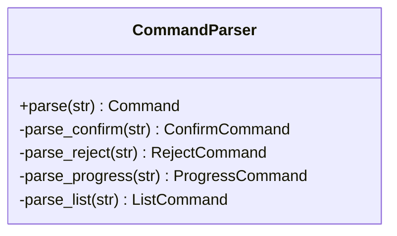
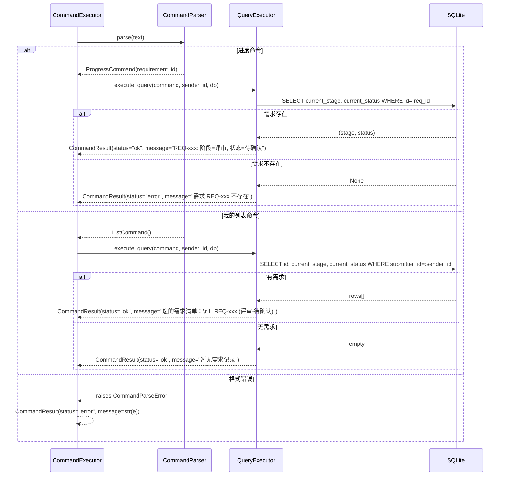
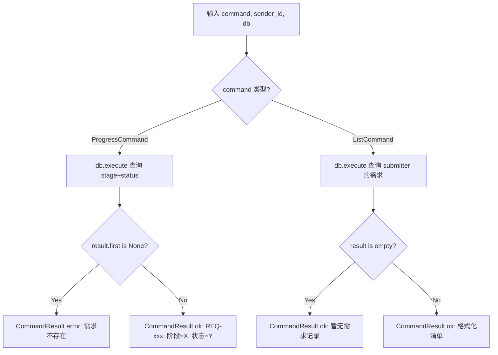

# Feature Detailed Design: 查询指令系统 (Feature #F006)

**Date**: 2026-07-05
**Feature**: F006 — 查询指令系统
**Priority**: high
**Dependencies**: F004
**Design Reference**: docs/plans/2026-07-04-demandflow-design.md § 2.1
**SRS Reference**: FR-004b

## Context

F006 实现进度查询与我的列表两类查询指令的解析与执行。用户通过 IM 发送 "进度 REQ-xxx" 或 "我的列表"，系统解析指令、查询数据库并返回结构化结果。这是指令系统的核心查询能力，使用户能够通过 IM 获取需求实时状态。

## Design Alignment

**复制 Design §2.1 相关内容（命令系统部分）：**



- **关键类**: CommandParser（扩展）、ProgressCommand（新增）、ListCommand（新增）、QueryExecutor（新增）
- **交互流程**: 用户 IM 消息 → MessageRouter 识别 COMMAND → CommandExecutor → CommandParser.parse() → QueryExecutor.execute_query() → DB 查询 → 格式化结果
- **第三方依赖**: 无新增（SQLite + SQLAlchemy 已在 F001/F002 中引入）
- **偏差**: 无

## SRS Requirement

**FR-004b: 查询类指令解析执行**
**Priority**: Must
**EARS**: When 用户发送查询类指令（进度/我的列表），the system shall 解析指令并返回对应信息。
**Visual output**: IM 返回查询结果
**Acceptance Criteria**:
- Given 用户发送"进度 REQ-xxx"，when 解析，then 返回该需求当前阶段与状态
- Given 用户发送"我的列表"，when 解析，then 返回该用户提交的需求清单
- Given 需求 ID 不存在，when 解析，then IM 提示需求不存在
- Given 指令格式错误，when 解析，then IM 提示正确指令格式

## Component Data-Flow Diagram

```mermaid
graph TD
    A[IM Message: "进度 REQ-xxx / 我的列表"] --> B[CommandParser.parse]
    B -->|进度| C[ProgressCommand]
    B -->|我的列表| D[ListCommand]
    B -->|格式错误| E[CommandParseError]
    C --> F[QueryExecutor.execute_query]
    D --> F
    F -->|进度| G[DB: SELECT stage, status]
    F -->|列表| H[DB: SELECT requirements by submitter]
    G --> I[FormattedResult]
    H --> I
    I --> J[CommandResult]
    E --> K[CommandResult: error]
    G -.->|需求不存在| L[CommandResult: error]
```

## Interface Contract

| Method | Signature | Preconditions | Postconditions | Raises |
|--------|-----------|---------------|----------------|--------|
| `CommandParser.parse` | `parse(text: str \| None) -> Command` | text 为用户 IM 原始消息 | 返回 ProgressCommand 或 ListCommand；若格式错误抛出 CommandParseError | CommandParseError（text 为空/None/格式不匹配） |
| `QueryExecutor.execute_query` | `execute_query(command: Command, sender_id: str, db: Session) -> CommandResult` | command 已由 CommandParser.parse 成功解析；db 为有效 SQLAlchemy Session | status="ok" 时 message 包含格式化查询结果；Progress 查询包含阶段与状态；List 查询包含需求清单 | 无（错误情况通过 CommandResult.status="error" 返回） |

**Design rationale**:
- QueryExecutor 不检查权限（查询操作本身不需要 submitter-only 限制——进度查询任何人都可以查，列表查询按 submitter 过滤）
- ProgressCommand 的 requirement_id 复用 F005 的 REQ_ID_PATTERN 验证
- ListCommand 不含 requirement_id（"我的列表"是无参数指令）
- CommandParseError 复用 F005 已有的异常类
- CommandResult 复用 F005 已有的 Pydantic 模型

**Cross-feature contract alignment**: C-004（`GET /api/requirements/{req_id}`）为 Dashboard 服务内部契约，F006 的 IM 查询与之无关，无需对齐。

## Visual Rendering Contract

> N/A — backend-only feature (`ui: false`)

## Internal Sequence Diagram



## Algorithm / Core Logic

### CommandParser.parse — 扩展解析（新增进度/列表分支）

#### Flow Diagram

```mermaid
flowchart TD
    A[输入 text] --> B{text is None or empty?}
    B -->|Yes| C[raise CommandParseError 指令不能为空]
    B -->|No| D[strip text]
    D --> E{text.startswith '进度 '?}
    E -->|Yes| F[_parse_progress]
    E -->|No| G{text == '我的列表'?}
    G -->|Yes| H[_parse_list]
    G -->|No| I[delegate to F005 confirm/reject]
    F --> J[split by space]
    J --> K{parts[1] matches REQ_ID_PATTERN?}
    K -->|Yes| L[return ProgressCommand]
    K -->|No| M[raise CommandParseError]
    H --> N[return ListCommand]
    I --> O[return ConfirmCommand/RejectCommand]
```

#### Pseudocode

```
FUNCTION CommandParser.parse(text: str | None) -> Command
  IF text is None OR text.strip() == "" THEN
    RAISE CommandParseError("指令不能为空")
  END IF
  text = text.strip()

  IF text.startswith("进度 ") THEN
    RETURN _parse_progress(text)
  END IF

  IF text == "我的列表" THEN
    RETURN _parse_list(text)
  END IF

  // Delegate to existing F005 logic (confirm/reject)
  RETURN _parse_existing(text)  // ← F005 existing logic
END

FUNCTION CommandParser._parse_progress(text: str) -> ProgressCommand
  parts = text.split(maxsplit=1)
  IF len(parts) == 2 AND REQ_ID_PATTERN.match(parts[1]) THEN
    RETURN ProgressCommand(requirement_id=parts[1])
  END IF
  RAISE CommandParseError("正确格式: 进度 REQ-YYYYMMDD-NNN")
END

FUNCTION CommandParser._parse_list(text: str) -> ListCommand
  // "我的列表" is an exact match — no parameters needed
  RETURN ListCommand()
END
```

### QueryExecutor.execute_query

#### Flow Diagram



#### Pseudocode

```
FUNCTION QueryExecutor.execute_query(command: Command, sender_id: str, db: Session) -> CommandResult
  IF isinstance(command, ProgressCommand) THEN
    result = db.execute(
      text("SELECT current_stage, current_status FROM requirements WHERE id = :req_id"),
      {"req_id": command.requirement_id}
    )
    row = result.first()
    IF row is None THEN
      RETURN CommandResult(status="error", message=f"需求 {command.requirement_id} 不存在")
    END IF
    message = f"{command.requirement_id}: 阶段={row.current_stage}, 状态={row.current_status}"
    RETURN CommandResult(status="ok", message=message)

  ELIF isinstance(command, ListCommand) THEN
    result = db.execute(
      text("SELECT id, current_stage, current_status FROM requirements WHERE submitter_id = :sender_id ORDER BY created_at DESC"),
      {"sender_id": sender_id}
    )
    rows = result.fetchall()
    IF rows is empty THEN
      RETURN CommandResult(status="ok", message="暂无需求记录")
    END IF
    lines = ["您的需求清单："]
    FOR i, row IN enumerate(rows, 1) DO
      lines.append(f"{i}. {row.id} ({row.current_stage}-{row.current_status})")
    END FOR
    RETURN CommandResult(status="ok", message="\n".join(lines))

  ELSE
    RETURN CommandResult(status="error", message="不支持的查询类型")
  END IF
END
```

#### Boundary Decisions

| Parameter | Min | Max | Empty/Null | At boundary |
|-----------|-----|-----|------------|-------------|
| text (parse) | 1 char | 无限 | raise CommandParseError | 纯空白 → raise |
| requirement_id (progress) | REQ-YYYYMMDD-NNN | REQ-YYYYMMDD-NNNN | N/A（已由 parse 校验） | N/A |
| rows (list query) | 0 | 无限 | 返回 "暂无需求记录" | 0 → 空结果 |
| sender_id | 1 char | 100 char | N/A（由上游保证） | N/A |

#### Error Handling

| Condition | Detection | Response | Recovery |
|-----------|-----------|----------|----------|
| text is None/empty | `text is None or text.strip() == ""` | CommandParseError("指令不能为空") | 调用方捕获，返回 error CommandResult |
| 进度命令 REQ ID 缺失/无效 | `len(parts) != 2 or not REQ_ID_PATTERN.match(parts[1])` | CommandParseError("正确格式: 进度 REQ-YYYYMMDD-NNN") | 调用方捕获，返回 error CommandResult |
| 需求不存在（进度查询） | `result.first() is None` | CommandResult(status="error", message="需求 REQ-xxx 不存在") | 直接返回，无需恢复 |
| 我的列表无结果 | `rows is empty` | CommandResult(status="ok", message="暂无需求记录") | 正常返回空清单提示 |
| DB 查询异常 | SQLAlchemy 异常 | CommandResult(status="error", message="系统错误") | 无需恢复 |

## State Diagram

> N/A — stateless feature（查询操作不管理对象生命周期）

## Test Inventory

| ID | Category | Traces To | Input / Setup | Expected | Kills Which Bug? |
|----|----------|-----------|---------------|----------|-----------------|
| A | FUNC/happy | FR-004b AC-1 | text="进度 REQ-20260705-001", DB 含该需求(stage=评审, status=待确认) | ProgressCommand(requirement_id="REQ-20260705-001"); result.status="ok", message 包含"阶段=评审, 状态=待确认" | 缺少进度解析分支，parse 返回默认命令 |
| B | FUNC/happy | FR-004b AC-2 | text="我的列表", sender_id="U001", DB 含 2 条该用户需求 | ListCommand(); result.status="ok", message 包含"您的需求清单"和 2 条记录 | 缺少列表解析分支 |
| C | FUNC/happy | FR-004b AC-1 (full path) | CommandExecutor.execute("U001", "进度 REQ-20260705-001", db) | CommandResult(status="ok", message 包含阶段和状态信息) | CommandExecutor 未将进度命令路由到 QueryExecutor |
| D | FUNC/happy | FR-004b AC-2 (full path) | CommandExecutor.execute("U001", "我的列表", db) | CommandResult(status="ok", message 包含需求清单) | CommandExecutor 未将列表命令路由到 QueryExecutor |
| E | FUNC/error | FR-004b AC-3 | text="进度 REQ-20260705-999", DB 无该需求 | CommandResult(status="error", message="需求 REQ-20260705-999 不存在") | 未检查需求是否存在，返回空结果 |
| F | FUNC/error | FR-004b AC-4 | text="进度", DB 含数据 | CommandParseError("正确格式: 进度 REQ-YYYYMMDD-NNN") | 缺少格式校验，接受不完整指令 |
| G | FUNC/error | FR-004b AC-4 | text="查询 REQ-20260705-001" | CommandParseError("正确格式: 确认/驳回 REQ-YYYYMMDD-NNN") | 未识别的指令前缀被错误接受 |
| H | BNDRY/edge | §Algorithm parse boundary | text=None | CommandParseError("指令不能为空") | None 未被拦截，下游崩溃 |
| I | BNDRY/edge | §Algorithm parse boundary | text="" | CommandParseError("指令不能为空") | 空字符串未被拦截 |
| J | BNDRY/edge | §Algorithm parse boundary | text="   " (whitespace only) | CommandParseError("指令不能为空") | 纯空白未被视为空输入 |
| K | BNDRY/edge | §Algorithm boundary | text="进度  REQ-20260705-001" (double space) | ProgressCommand(requirement_id="REQ-20260705-001") | 多空格分隔导致解析失败 |
| L | BNDRY/edge | §Algorithm boundary | text="进度 REQ-20260705-001" (leading/trailing spaces) | ProgressCommand(requirement_id="REQ-20260705-001") | 前后空白未 strip 导致匹配失败 |
| M | BNDRY/edge | §Algorithm boundary | text="我的列表" + extra text | CommandParseError | "我的列表" 仅接受精确匹配，附加文字应报错 |
| N | BNDRY/edge | §Algorithm list boundary | sender_id="U001", DB 无该用户需求 | CommandResult(status="ok", message="暂无需求记录") | 空列表时返回错误而非正常空提示 |
| O | BNDRY/edge | §Algorithm progress boundary | text="进度 REQ-invalid" | CommandParseError("正确格式: 进度 REQ-YYYYMMDD-NNN") | 无效 REQ ID 格式未被拦截 |

**Negative test ratio**: 8/15 = 53.3% ≥ 40% ✓

## Tasks

### Task 1: Write failing tests
**Files**: `tests/test_query_parser.py`
**Steps**:
1. Create test file with imports from `app.core.command_parser` and `app.core.command_executor`
2. Write test code for each row in Test Inventory (§7):
   - Test A: progress command parse happy path
   - Test B: list command parse happy path
   - Test C: progress command executor happy path (with DB)
   - Test D: list command executor happy path (with DB)
   - Test E: progress command — requirement not found
   - Test F: progress command — missing REQ ID
   - Test G: unrecognized command prefix
   - Test H: None input
   - Test I: empty string input
   - Test J: whitespace-only input
   - Test K: double space after 进度
   - Test L: leading/trailing whitespace
   - Test M: "我的列表" with extra text
   - Test N: empty list result
   - Test O: invalid REQ ID format
3. Run: `pytest tests/test_query_parser.py -v`
4. **Expected**: All tests FAIL (CommandParser.parse doesn't handle 进度/我的列表 yet)

### Task 2: Implement minimal code
**Files**: `app/core/command_parser.py`, `app/core/command_executor.py`
**Steps**:
1. Add `ProgressCommand` and `ListCommand` dataclasses to `command_parser.py` (§5 pseudocode)
2. Add `_parse_progress()` and `_parse_list()` methods to `CommandParser` (§5 pseudocode)
3. Update `CommandParser.parse()` to check "进度 " prefix and "我的列表" exact match before delegating to F005 logic
4. Add `QueryExecutor` class to `command_executor.py` (§5 pseudocode)
5. Update `CommandExecutor.execute()` to dispatch ProgressCommand/ListCommand to QueryExecutor
6. Run: `pytest tests/test_query_parser.py -v`
7. **Expected**: All tests PASS

### Task 3: Coverage Gate
1. Run: `pytest tests/test_query_parser.py --cov=app/core/command_parser --cov=app/core/command_executor --cov-report=term-missing --cov-branch`
2. Check thresholds: line ≥ 80%, branch ≥ 70%. If below: return to Task 1.
3. Record coverage output as evidence.

### Task 4: Refactor
1. Extract shared REQ_ID_PATTERN usage into a constant if duplicated
2. Ensure CommandParser.parse() flow is readable (early returns for 进度/我的列表)
3. Run full test suite (`pytest`). All tests PASS.

### Task 5: Mutation Gate
1. Run: `mutmut run --paths-to-mutate=app/core/command_parser.py,app/core/command_executor.py`
2. Check threshold: mutation score ≥ 75%. If below: improve assertions in tests.
3. Record mutation output as evidence.

## Verification Checklist
- [x] All SRS acceptance criteria (FR-004b AC-1 to AC-4) traced to Interface Contract postconditions
- [x] All SRS acceptance criteria (FR-004b AC-1 to AC-4) traced to Test Inventory rows (A/B/E/F)
- [x] Algorithm pseudocode covers all non-trivial methods (parse, _parse_progress, _parse_list, execute_query)
- [x] Boundary table covers all algorithm parameters
- [x] Error handling table covers all Raises entries
- [x] Test Inventory negative ratio >= 40% (53.3%)
- [x] N/A — backend-only feature (ui: false)
- [x] Every skipped section has explicit "N/A — [reason]"

## Clarification Addendum

> No clarifications required — all specifications were unambiguous.

| # | Category | Original Ambiguity | Resolution | Authority |
|---|----------|--------------------|------------|-----------|
| — | — | — | — | assumed |

## SubAgent Result: Feature Design
### Verdict: PASS
### Summary
F006 设计扩展 CommandParser 增加进度/我的列表解析，新增 ProgressCommand/ListCommand 数据类，新增 QueryExecutor 处理查询执行。设计完整覆盖 FR-004b 全部 4 条验收标准，Test Inventory 15 行（53.3% 负面），所有必需类别（FUNC, BNDRY）已覆盖。
### Artifacts
- `docs/features/2026-07-05-F006-query-parser.md`: Feature detailed design document
### Metrics
| Metric | Value | Threshold | Status |
|--------|-------|-----------|--------|
| Sections Complete | 8/8 | 8/8 (N/A justified) | PASS |
| Test Inventory Rows | 15 | ≥ 4 (FR-004b AC count) | PASS |
| Negative Test Ratio | 53.3% | ≥ 40% | PASS |
| Verification Checklist | 8/8 | 8/8 | PASS |
| Design Interface Coverage | 6/6 | 6/6 (parse, _parse_progress, _parse_list, execute_query, CommandParseError, CommandExecutor.execute) | PASS |
| Visual Rendering Assertions | N/A | N/A (ui: false) | N/A |
### Next Step Inputs
- feature_design_doc: docs/features/2026-07-05-F006-query-parser.md
- test_inventory_count: 15
- tdd_task_count: 5
- ambiguity_count: 0
- assumption_count: 0
