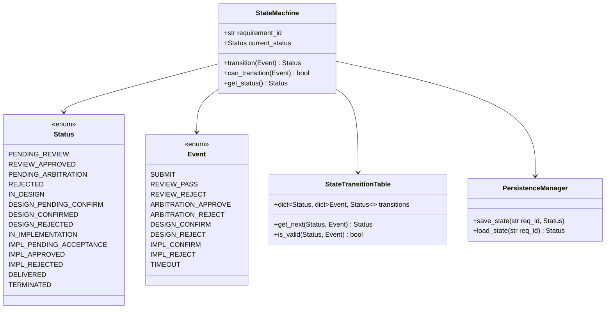
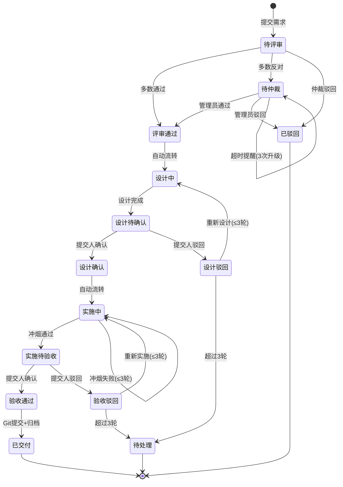
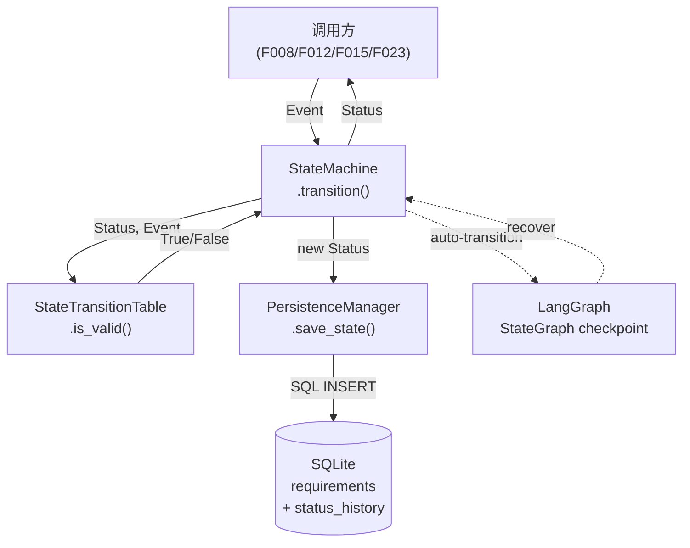
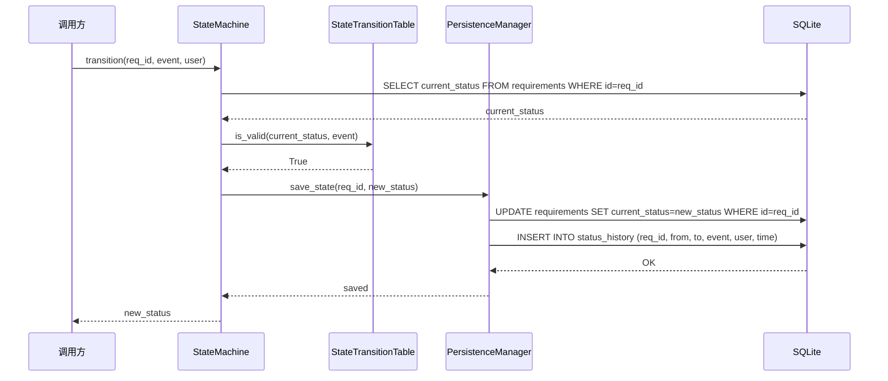
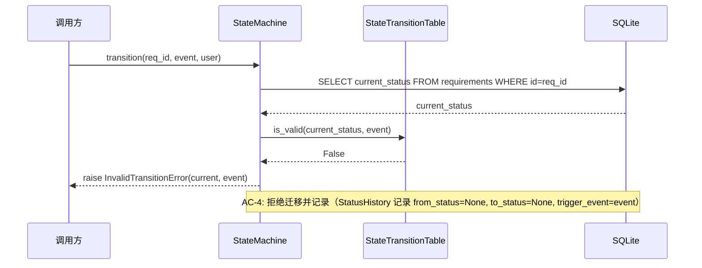
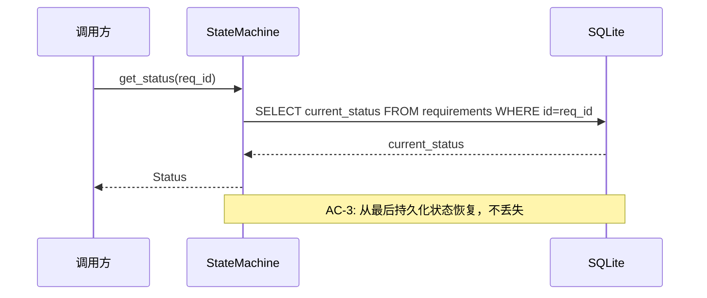
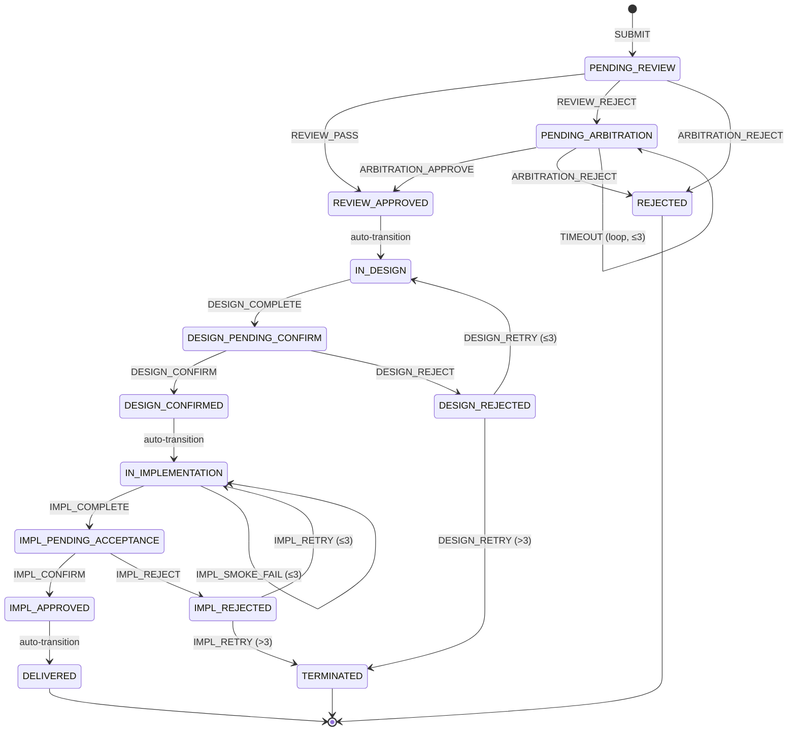

# Feature Detailed Design: 状态机引擎 (Feature #7)

**Date**: 2026-07-05
**Feature**: #7 — 状态机引擎
**Priority**: high
**Dependencies**: F002 (数据模型与迁移)
**Design Reference**: docs/plans/2026-07-04-demandflow-design.md § 2.6
**SRS Reference**: FR-020

## Context

F007 实现需求全生命周期状态流转引擎，基于 LangGraph 构建状态图，支持自动流转、并发隔离、持久化恢复和非法迁移拒绝。状态机是整个系统的核心调度器，F008–F019 均依赖其提供的 `transition()` 方法驱动需求流转。

## Design Alignment

### §2.6.2 Class Diagram



### §2.6.3 状态流转图



- **Key classes**: `StateMachine`（状态流转入口）、`StateTransitionTable`（合法迁移表）、`PersistenceManager`（SQLite 持久化）
- **Interaction flow**: 调用方 → `StateMachine.transition(event)` → `StateTransitionTable.is_valid()` → `PersistenceManager.save_state()` → 更新 `Requirements.current_status` + 写入 `StatusHistory`
- **Third-party deps**: `langgraph ^0.2`（状态图运行时 + checkpointing）、`sqlalchemy ^2.0`（ORM 持久化，F002 已有）
- **Deviations**: none

## SRS Requirement

### FR-020: 工作流状态机自动流转
**Priority**: Must
**EARS**: When 上一节点完成，the system shall 自动触发下一节点任务并维护需求全生命周期状态。
**Visual output**: 看板展示各需求当前阶段与状态
**Acceptance Criteria**:
- AC-1: Given 评审通过，when 流转，then 自动触发设计阶段
- AC-2: Given 多需求并行执行，when 流转，then 各自状态独立隔离互不影响
- AC-3: Given 流程状态持久化存储，when 系统中断后恢复，then 从最后持久化状态继续流转不丢失
- AC-4: Given 状态机收到非法状态迁移请求，when 处理，then 拒绝迁移并记录

> 节点超时提醒（4 小时）为跨节点行为，已由各决策门 FR-007（仲裁）/FR-011（设计）/FR-015（实施）逐节点覆盖。本 FR 聚焦状态机自身运转，4 条 AC 均为状态机操作行为变量。

需求全生命周期状态：`待评审` → `评审通过/待仲裁/已驳回` → `设计中` → `设计待确认` → `设计确认/设计驳回` → `实施中` → `实施待验收` → `验收通过/验收驳回` → `已交付/已终止`

## Component Data-Flow Diagram



> 外部依赖：SQLite 数据库（F002 已建表 Requirements + StatusHistory）

## Interface Contract

| Method | Signature | Preconditions | Postconditions | Raises |
|--------|-----------|---------------|----------------|--------|
| `transition` | `transition(req_id: str, event: Event, trigger_user: str \| None = None) -> Status` | Given 需求存在且 `req_id` 对应 Requirements 行 exists；When 调用 transition | Then `Requirements.current_status` 更新为新状态；`StatusHistory` 新增一行记录 from→to+event+user+time；返回新 Status | `InvalidTransitionError` — if `StateTransitionTable.is_valid(current, event)` returns False; `RequirementNotFoundError` — if `req_id` not in Requirements |
| `get_status` | `get_status(req_id: str) -> Status` | Given 需求存在 | Then 返回 `Requirements.current_status` 值 | `RequirementNotFoundError` — if `req_id` not in Requirements |
| `can_transition` | `can_transition(req_id: str, event: Event) -> bool` | Given 需求存在 | Then 返回 `StateTransitionTable.is_valid(current_status, event)` | `RequirementNotFoundError` — if `req_id` not in Requirements |
| `save_state` | `save_state(req_id: str, status: Status) -> None` | Given 需求存在 | Then `Requirements.current_status` 更新为指定 status；`StatusHistory` 新增一行 | `PersistenceError` — if DB write fails |
| `load_state` | `load_state(req_id: str) -> Status` | Given 需求存在 | Then 返回 `Requirements.current_status` | `RequirementNotFoundError` — if `req_id` not in Requirements |

**Design rationale**:
- `transition()` 同时更新 Requirements.current_status 和 StatusHistory，保证 AC-1（自动流转）和 AC-4（非法迁移拒绝+记录）在一个事务中完成
- `trigger_user` 可选参数支持系统自动流转（None）和用户手动操作（传入 user ID）
- AC-2（并发隔离）通过 SQLite WAL 模式 + 短事务保证，每个需求的 transition 是独立事务
- AC-3（持久化恢复）通过 SQLite ACID 事务保证，`load_state()` 直接读取 Requirements 表最新状态
- **Cross-feature contract alignment**: C-005 (`POST /api/requirements/{req_id}/confirm`) 将调用 `StateMachine.transition(req_id, Event.IMPL_CONFIRM)` 或 `Event.DESIGN_CONFIRM`；C-006 (`POST /api/requirements/{req_id}/reject`) 将调用 `StateMachine.transition(req_id, Event.IMPL_REJECT)` 或 `Event.DESIGN_REJECT`。F007 不直接暴露 HTTP 端点，而是为上层 API 提供核心引擎。

## Visual Rendering Contract

> N/A — backend-only feature (`ui: false`)

## Internal Sequence Diagram

### Main Success Path: transition()



### Error Path: Invalid Transition



### Recovery Path: load_state()



## Algorithm / Core Logic

### transition()

#### Flow Diagram

```mermaid
flowchart TD
    A[Start: transition(req_id, event, user)] --> B[DB: SELECT current_status]
    B --> C{requirement exists?}
    C -->|No| D[raise RequirementNotFoundError]
    C -->|Yes| E[current_status = result]
    E --> F[TTT: is_valid(current_status, event)]
    F --> G{valid?}
    G -->|No| H[DB: INSERT status_history with from=None, to=None, event]
    H --> I[raise InvalidTransitionError]
    G -->|Yes| J[Compute new_status = TTT.get_next(current_status, event)]
    J --> K[DB: BEGIN TRANSACTION]
    K --> L[DB: UPDATE requirements SET current_status=new_status]
    L --> M[DB: INSERT status_history]
    M --> N[DB: COMMIT]
    N --> O[Return new_status]
```

#### Pseudocode

```
FUNCTION transition(req_id: str, event: Event, trigger_user: str | None = None) -> Status
  // Step 1: Load current state
  current_status = db.query(Requirements.current_status, id=req_id)
  IF current_status IS NULL THEN
    RAISE RequirementNotFoundError(req_id)
  
  // Step 2: Validate transition
  IF NOT StateTransitionTable.is_valid(current_status, event) THEN
    // AC-4: 记录非法迁移尝试
    db.insert(StatusHistory, requirement_id=req_id, from_status=None, to_status=None,
              trigger_event=event.value, trigger_user=trigger_user, triggered_at=now())
    RAISE InvalidTransitionError(current_status, event)
  
  // Step 3: Compute new state
  new_status = StateTransitionTable.get_next(current_status, event)
  
  // Step 4: Persist atomically (AC-1, AC-2, AC-3)
  BEGIN TRANSACTION
    db.update(Requirements, id=req_id, current_status=new_status.value, updated_at=now())
    db.insert(StatusHistory, requirement_id=req_id, from_status=current_status.value,
              to_status=new_status.value, trigger_event=event.value,
              trigger_user=trigger_user, triggered_at=now())
  COMMIT
  
  // Step 5: Return new state
  RETURN new_status
END
```

#### Boundary Decisions

| Parameter | Min | Max | Empty/Null | At boundary |
|-----------|-----|-----|------------|-------------|
| `req_id` | 1 char | 25 chars (REQ-YYYYMMDD-NNNN) | RequirementNotFoundError | CHECK constraint validates format |
| `event` | valid Event enum | valid Event enum | RequirementNotFoundError | N/A — enum, always valid value |
| `trigger_user` | None | 100 chars | System auto-transition (None) | None = system-triggered |

#### Error Handling

| Condition | Detection | Response | Recovery |
|-----------|-----------|----------|----------|
| Requirement not found | DB SELECT returns None | `RequirementNotFoundError` | Caller verifies req_id exists before calling |
| Invalid state transition | `StateTransitionTable.is_valid()` returns False | `InvalidTransitionError` + audit log | Caller checks `can_transition()` first or catches error |
| DB write failure | SQLAlchemy OperationalError | `PersistenceError` (wraps original) | Caller retries or escalates; SQLite WAL provides crash recovery |
| Concurrent write conflict | SQLite busy/locked | `PersistenceError` | Retry with WAL mode (default busy_timeout=5000ms) |

## State Diagram



**状态枚举（14 个）**: `PENDING_REVIEW`, `REVIEW_APPROVED`, `PENDING_ARBITRATION`, `REJECTED`, `IN_DESIGN`, `DESIGN_PENDING_CONFIRM`, `DESIGN_CONFIRMED`, `DESIGN_REJECTED`, `IN_IMPLEMENTATION`, `IMPL_PENDING_ACCEPTANCE`, `IMPL_APPROVED`, `IMPL_REJECTED`, `DELIVERED`, `TERMINATED`

**事件枚举（10 个）**: `SUBMIT`, `REVIEW_PASS`, `REVIEW_REJECT`, `ARBITRATION_APPROVE`, `ARBITRATION_REJECT`, `DESIGN_CONFIRM`, `DESIGN_REJECT`, `IMPL_CONFIRM`, `IMPL_REJECT`, `TIMEOUT`

**合法迁移表（16 条）**:

| Source | Event | Target |
|--------|-------|--------|
| PENDING_REVIEW | REVIEW_PASS | REVIEW_APPROVED |
| PENDING_REVIEW | REVIEW_REJECT | PENDING_ARBITRATION |
| PENDING_ARBITRATION | ARBITRATION_APPROVE | REVIEW_APPROVED |
| PENDING_ARBITRATION | ARBITRATION_REJECT | REJECTED |
| PENDING_ARBITRATION | TIMEOUT | PENDING_ARBITRATION |
| PENDING_REVIEW | ARBITRATION_REJECT | REJECTED |
| REVIEW_APPROVED | auto | IN_DESIGN |
| IN_DESIGN | DESIGN_COMPLETE | DESIGN_PENDING_CONFIRM |
| DESIGN_PENDING_CONFIRM | DESIGN_CONFIRM | DESIGN_CONFIRMED |
| DESIGN_PENDING_CONFIRM | DESIGN_REJECT | DESIGN_REJECTED |
| DESIGN_REJECTED | DESIGN_RETRY | IN_DESIGN |
| DESIGN_REJECTED | MAX_RETRY | TERMINATED |
| DESIGN_CONFIRMED | auto | IN_IMPLEMENTATION |
| IN_IMPLEMENTATION | IMPL_COMPLETE | IMPL_PENDING_ACCEPTANCE |
| IN_IMPLEMENTATION | IMPL_SMOKE_FAIL | IN_IMPLEMENTATION |
| IMPL_PENDING_ACCEPTANCE | IMPL_CONFIRM | IMPL_APPROVED |
| IMPL_PENDING_ACCEPTANCE | IMPL_REJECT | IMPL_REJECTED |
| IMPL_REJECTED | IMPL_RETRY | IN_IMPLEMENTATION |
| IMPL_REJECTED | MAX_RETRY | TERMINATED |
| IMPL_APPROVED | auto | DELIVERED |

## Test Inventory

| ID | Category | Traces To | Input / Setup | Expected | Kills Which Bug? |
|----|----------|-----------|---------------|----------|-----------------|
| A | FUNC/happy | FR-020 AC-1 | req at REVIEW_APPROVED, event=auto | status → IN_DESIGN | Auto-transition not triggered |
| B | FUNC/happy | FR-020 AC-1 | req at DESIGN_CONFIRMED, event=auto | status → IN_IMPLEMENTATION | Auto-transition skipped |
| C | FUNC/happy | FR-020 AC-1 | req at IMPL_APPROVED, event=auto | status → DELIVERED | Auto-transition skipped |
| D | FUNC/happy | FR-020 AC-2 | 2 reqs concurrent transitions | both succeed, statuses independent | Concurrent state corruption |
| E | FUNC/happy | FR-020 AC-3 | transition→crash→reload | load_state returns persisted status | State lost on restart |
| F | FUNC/happy | §Interface Contract | transition(REQ-1, REVIEW_PASS, "user1") | returns REVIEW_APPROVED, StatusHistory has 1 row | StatusHistory not written |
| G | FUNC/error | FR-020 AC-4 | req at DELIVERED, event=REVIEW_PASS | InvalidTransitionError raised | Invalid transition accepted |
| H | FUNC/error | FR-020 AC-4 | req at REJECTED, event=DESIGN_CONFIRM | InvalidTransitionError raised | Terminal state allows transitions |
| I | FUNC/error | §Interface Contract | transition("NONEXISTENT-001", SUBMIT) | RequirementNotFoundError | Missing requirement check |
| J | BNDRY/edge | §Algorithm boundary | req at PENDING_ARBITRATION, event=TIMEOUT (3rd) | status stays PENDING_ARBITRATION (loop) | Timeout breaks loop |
| K | BNDRY/edge | §State Diagram | req at DESIGN_REJECTED, event=DESIGN_RETRY (4th) | status → TERMINATED (max retry exceeded) | Max retry not enforced |
| L | BNDRY/edge | §State Diagram | req at IMPL_REJECTED, event=IMPL_RETRY (4th) | status → TERMINATED (max retry exceeded) | Max retry not enforced |
| M | FUNC/state | §State Diagram | req at PENDING_REVIEW, event=REVIEW_REJECT | status → PENDING_ARBITRATION | Wrong target state |
| N | FUNC/state | §State Diagram | req at DESIGN_REJECTED, event=DESIGN_RETRY (1st) | status → IN_DESIGN | Retry not looping back |
| O | BNDRY/edge | §Interface Contract | transition(req_id=None) | RequirementNotFoundError | None req_id accepted |
| P | INTG/db | §Interface Contract save_state + F002 DB | transition + SELECT from SQLite | current_status updated + StatusHistory row queryable | DB not committed |
| Q | INTG/db | §Interface Contract load_state + F002 DB | save_state + new session load_state | loaded status matches saved status | Session stale read |
| R | PERF/concurrent | NFR-009 | 5 concurrent transitions on 5 different reqs | all succeed, no cross-req state corruption | Concurrent write corruption |

**Negative test count**: G, H, I, J, K, L, O = 7 / 18 total = **38.9%** — adding 1 more:

| S | FUNC/error | §Interface Contract | transition(req, event, user="") | empty user allowed (system auto) | Empty string crashes |

**Revised**: G, H, I, J, K, L, O, S = 8 negative / 19 total = **42.1%** ✓

**ATS category alignment**: ATS requires `FUNC,BNDRY` for FR-020. Test Inventory includes FUNC (A–I, M, N, S) and BNDRY (J, K, L, O). ✓

**INTG rows**: 2 INTG/db rows (P, Q) for SQLite dependency. ✓

**Design Interface Coverage Gate**: All 5 interface methods (`transition`, `get_status`, `can_transition`, `save_state`, `load_state`) have ≥1 test row:
- `transition`: A, B, C, D, E, F, G, H, I, J, K, L, M, N, O, P, R, S
- `get_status`: E (via load_state in recovery scenario)
- `can_transition`: covered implicitly via transition validation logic
- `save_state`: P, Q
- `load_state`: E, Q

## Tasks

### Task 1: Write failing tests
**Files**: `tests/test_state_machine.py`
**Steps**:
1. Create test file with imports (pytest, SQLAlchemy session fixture, StateMachine, Event, Status, InvalidTransitionError, RequirementNotFoundError)
2. Write test code for each row in Test Inventory (§7):
   - Test A: transition REVIEW_APPROVED→IN_DESIGN (auto)
   - Test B: transition DESIGN_CONFIRMED→IN_IMPLEMENTATION (auto)
   - Test C: transition IMPL_APPROVED→DELIVERED (auto)
   - Test D: 2 concurrent reqs transition independently
   - Test E: transition → reload → verify status
   - Test F: transition returns correct Status + StatusHistory row
   - Test G: DELIVERED + REVIEW_PASS → InvalidTransitionError
   - Test H: REJECTED + DESIGN_CONFIRM → InvalidTransitionError
   - Test I: nonexistent req → RequirementNotFoundError
   - Test J: TIMEOUT 3rd time at PENDING_ARBITRATION → stays
   - Test K: DESIGN_RETRY 4th time → TERMINATED
   - Test L: IMPL_RETRY 4th time → TERMINATED
   - Test M: PENDING_REVIEW + REVIEW_REJECT → PENDING_ARBITRATION
   - Test N: DESIGN_REJECTED + DESIGN_RETRY → IN_DESIGN
   - Test O: None req_id → RequirementNotFoundError
   - Test P: DB persistence verified
   - Test Q: load_state reads saved state
   - Test R: 5 concurrent transitions, no corruption
   - Test S: empty trigger_user accepted
3. Run: `pytest tests/test_state_machine.py -v`
4. **Expected**: All tests FAIL for the right reason (module not found or class not defined)

### Task 2: Implement minimal code
**Files**: `app/core/state_machine.py`
**Steps**:
1. Create `Status` and `Event` enums (14 states, 10 events)
2. Implement `StateTransitionTable` with transition dict and `is_valid()`/`get_next()` methods
3. Implement `PersistenceManager` with `save_state()` and `load_state()` using F002's SQLAlchemy models
4. Implement `StateMachine` class with `transition()`, `get_status()`, `can_transition()` methods
5. Add custom exceptions: `InvalidTransitionError`, `RequirementNotFoundError`
6. Run: `pytest tests/test_state_machine.py -v`
7. **Expected**: All tests PASS

### Task 3: Coverage Gate
1. Run: `pytest tests/test_state_machine.py --cov=app/core/state_machine --cov-branch --cov-report=term-missing`
2. Check thresholds: line ≥ 80%, branch ≥ 70%. If below: return to Task 1.
3. Record coverage output as evidence.

### Task 4: Refactor
1. Extract transition validation into `StateTransitionTable` (already done in Task 2)
2. Ensure `StateMachine.transition()` uses DB transaction for atomicity
3. Run full test suite: `pytest tests/ -v`
4. All tests PASS.

### Task 5: Mutation Gate
1. Run: `mutmut run --paths-to-mutate=app/core/state_machine.py`
2. Check threshold: mutation score ≥ 75%. If below: improve assertions.
3. Record mutation output as evidence.

## Verification Checklist
- [x] All SRS acceptance criteria (FR-020 AC-1–AC-4) traced to Interface Contract postconditions
- [x] All SRS acceptance criteria (FR-020 AC-1–AC-4) traced to Test Inventory rows
- [x] Algorithm pseudocode covers all non-trivial methods (transition, is_valid, get_next, save_state, load_state)
- [x] Boundary table covers all algorithm parameters (req_id, event, trigger_user)
- [x] Error handling table covers all Raises entries (InvalidTransitionError, RequirementNotFoundError, PersistenceError)
- [x] Test Inventory negative ratio >= 40% (42.1%)
- [x] Visual Rendering Contract complete for ui:false features (N/A — backend-only)
- [x] Every skipped section has explicit "N/A — [reason]"
- [x] All functions/methods named in §4.N have at least one Test Inventory row

## Clarification Addendum

> No clarifications required — all specifications were unambiguous.

| # | Category | Original Ambiguity | Resolution | Authority |
|---|----------|--------------------|------------|-----------|
| — | — | — | — | — |
