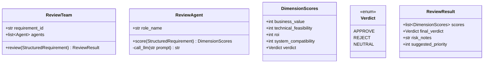
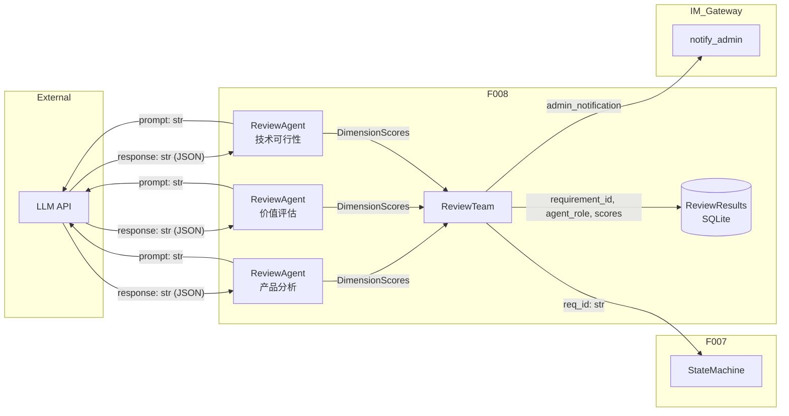
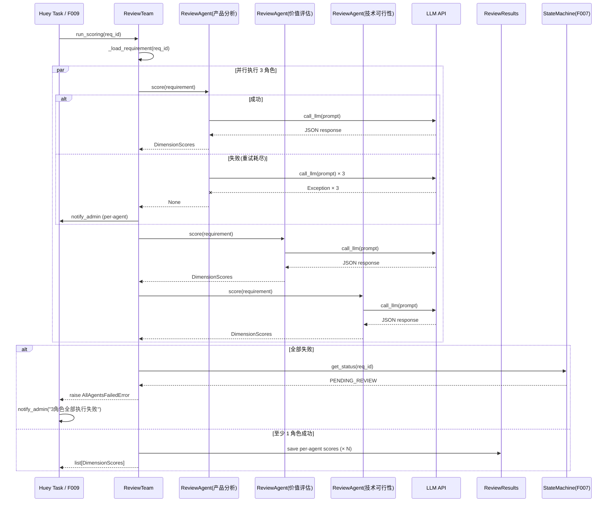

# Feature Detailed Design: 评审团多角色打分 (Feature #8)

**Date**: 2026-07-07
**Feature**: #8 — 评审团多角色打分
**Priority**: high
**Dependencies**: F007 (状态机引擎)
**Design Reference**: docs/plans/2026-07-04-demandflow-design.md § 2.2
**SRS Reference**: FR-005

## Context

实现 3 角色（产品分析、价值评估、技术可行性）评审 Agent 并行打分，每角色从业务价值、技术可行性、投入产出比、系统兼容性 4 维度按 1-5 分制独立评分并给出通过/反对/中立结论，支持指数退避重试与全失败通知。F008 仅负责「单人打分」，评审结论汇总与裁决由 F009 实现。

## Design Alignment

Design doc §2.2 评审系统（FR-005, FR-006, FR-007, FR-008a, FR-008b）全文引用如下：



- **Key classes**: ReviewTeam, ReviewAgent, DimensionScores, Verdict
- **Interaction flow**: ReviewTeam.run_scoring() -> parallel ReviewAgent.score() -> LLM -> DimensionScores -> persist
- **Third-party deps**: langchain ^0.2, langchain-openai ^0.1 (LLM integration)
- **Deviations**: None

### Boundary Clarification (F008 vs F009)

Design §2.2 将评审全流程（打分+汇总）放在 ReviewTeam.review() 中。根据 feature-list 分解，F008 仅实现「3 角色独立打分」部分（FR-005），F009 实现「评审结论汇总与裁决」（FR-006）。因此：

| 职责 | F008 | F009 |
|------|------|------|
| ReviewAgent.score() | ✓ | — |
| ReviewTeam.run_scoring() | ✓ | — |
| _aggregate_scores() + final_verdict | — | ✓ |
| state transition + IM notification | — | ✓ |

## SRS Requirement

### FR-005: 评审团多角色独立打分

**Priority**: Must
**EARS**: When 一条新结构化需求入库，the system shall 触发评审团（产品分析、价值评估、技术可行性 3 角色）按 1-5 分制从业务价值、技术可行性、投入产出比、系统兼容性 4 维度独立打分并给出通过/反对/中立结论。
**Visual output**: 看板详情可见该需求"评审中"

**Acceptance Criteria**:
- AC-1: Given 新需求入库，when 触发评审，then 3 角色各自输出 4 维度 1-5 分评分与通过/反对/中立结论
- AC-2: Given 某角色 Agent 执行失败，when 触发，then 指数退避重试 3 次，3 次仍失败则 IM 通知管理员
- AC-3: Given 3 角色均执行失败，when 触发，then 暂停该需求流转并 IM 通知管理员

## Component Data-Flow Diagram



## Interface Contract

### Public Methods

| Method | Signature | Preconditions | Postconditions | Raises |
|--------|-----------|---------------|----------------|--------|
| `ReviewTeam.run_scoring` | `run_scoring(req_id: str) -> list[DimensionScores]` | (1) req_id 对应的 requirement 存在且状态为 PENDING_REVIEW；(2) 数据库连接可用 | (1) 每成功 Agent 写入 1 行 ReviewResults 表；(2) 返回 list 含所有成功 Agent 的 DimensionScores（长度 0-3）；(3) 全部失败时数据库无新 ReviewResults 行 | `RequirementNotFoundError` — req_id 不存在；`AllAgentsFailedError` — 3 角色全部执行失败 |
| `ReviewAgent.score` | `score(requirement: StructuredRequirement) -> DimensionScores` | (1) requirement 非空、id 合法；(2) role_name 为 3 角色之一 | (1) 返回 4 维度分值均在 1-5 范围内；(2) verdict 为 APPROVE/REJECT/NEUTRAL 之一 | `ScoreParseError` — LLM 响应无法解析为有效评分；`LLMCallError` — LLM API 调用失败（触发外层重试） |

### Internal Methods

| Method | Signature | Preconditions | Postconditions | Raises |
|--------|-----------|---------------|----------------|--------|
| `ReviewTeam._execute_agent` | `_execute_agent(agent: ReviewAgent, requirement: StructuredRequirement) -> DimensionScores | None` | agent.role_name 有效 | 返回 DimensionScores（成功）或 None（重试耗尽后） | — |
| `ReviewTeam._load_requirement` | `_load_requirement(req_id: str) -> StructuredRequirement` | req_id 已存在 | 返回填充完整的 StructuredRequirement | `RequirementNotFoundError` |

### Pydantic Models

```python
from enum import Enum
from pydantic import BaseModel, Field


class Verdict(str, Enum):
    APPROVE = "通过"
    REJECT = "反对"
    NEUTRAL = "中立"


class DimensionScores(BaseModel):
    agent_role: str = Field(..., min_length=1)
    business_value: int = Field(..., ge=1, le=5)
    technical_feasibility: int = Field(..., ge=1, le=5)
    roi: int = Field(..., ge=1, le=5)
    system_compatibility: int = Field(..., ge=1, le=5)
    verdict: Verdict
    comments: str | None = None


class ReviewScores(BaseModel):
    """F008 输出：原始评分列表，不含汇总裁决。"""
    requirement_id: str
    scores: list[DimensionScores]


class AllAgentsFailedError(Exception):
    def __init__(self, req_id: str):
        self.req_id = req_id
        super().__init__(f"All 3 agents failed for requirement: {req_id}")


class ScoreParseError(Exception):
    def __init__(self, agent_role: str, raw_response: str):
        self.agent_role = agent_role
        self.raw_response = raw_response
        super().__init__(f"Cannot parse LLM response for {agent_role}: {raw_response}")


class LLMCallError(Exception):
    def __init__(self, agent_role: str, attempt: int, original: Exception):
        self.agent_role = agent_role
        self.attempt = attempt
        self.original = original
        super().__init__(f"LLM call failed for {agent_role} (attempt {attempt}): {original}")
```

**Design rationale**:
- `run_scoring` 接受 str req_id 而非 StructuredRequirement，对齐 T-002 任务契约
- `DimensionScores.verdict` 用中文枚举值，对齐 DB CHECK constraint `verdict IN ('通过','反对','中立')`
- `AllAgentsFailedError` 与 `RequirementNotFoundError` 分开，因为全失败是 F008 的业务异常而非数据异常
- **Cross-feature contract alignment**: T-002 `run_review(requirement_id)` 是 F008+F009 联合实现的 Huey 任务；F008 提供 `run_scoring` 子步骤。C-006 (`POST /api/requirements/{req_id}/reject`) 不在 F008 范围内，F008 不直接提供 REST 端点。

## Visual Rendering Contract (ui: true only)

> N/A — backend-only feature, feature-list ui=false

## Internal Sequence Diagram



## Algorithm / Core Logic

### ReviewTeam.run_scoring

#### Flow Diagram

```mermaid
flowchart TD
    A[Start: run_scoring(req_id)] --> B{Load requirement\nfrom DB}
    B -->|Found| C[Create 3 ReviewAgents]
    B -->|Not Found| D[raise RequirementNotFoundError]
    C --> E[Execute agents in parallel]
    E --> F{Collect results}
    F --> G[Some/none succeeded]

    G --> H{At least 1\nsucceeded?}
    H -->|Yes| I[Save scores to ReviewResults]
    I --> J[Return list[DimensionScores]]
    H -->|No - all None| K[raise AllAgentsFailedError]
    K --> L[IM notify admin]
```

#### Pseudocode

```
FUNCTION run_scoring(req_id: str) -> list[DimensionScores]
  // Step 1: Load requirement
  requirement = _load_requirement(req_id)

  // Step 2: Create 3 agents
  agents = [
    ReviewAgent(role_name="产品分析"),
    ReviewAgent(role_name="价值评估"),
    ReviewAgent(role_name="技术可行性")
  ]

  // Step 3: Execute agents (concurrent via ThreadPoolExecutor)
  results = []
  FOR EACH agent IN agents
    result = _execute_agent(agent, requirement)
    IF result IS DimensionScores
      results.append(result)
      // Save each per-agent score to DB
      _persist_score(req_id, result)

  // Step 4: All agents failed → raise
  IF results IS EMPTY
    RAISE AllAgentsFailedError(req_id)

  RETURN results
END
```

#### Boundary Decisions

| Parameter | Min | Max | Empty/Null | At boundary |
|-----------|-----|-----|------------|-------------|
| roles list | 3 (fixed) | 3 (fixed) | N/A — always exactly 3 | N/A |
| agents succeeded | 0 | 3 | 0 → AllAgentsFailedError | 1 → return [1 item]; 3 → return [3 items] |
| req_id length | 1 (REQ-... guid) | 100 | empty string → RequirementNotFoundError | N/A |

#### Error Handling

| Condition | Detection | Response | Recovery |
|-----------|-----------|----------|----------|
| Requirement not found | `_load_requirement` raises RequirementNotFoundError | Re-raise RequirementNotFoundError | Caller handles (F007 returns error to task queue) |
| Single agent LLM call fails | `_execute_agent` catches LLMCallError | Retry with exponential backoff (2^attempt sec). 3 次耗尽 → return None + IM notify admin | Per-agent failure tolerated; only all-fail is fatal |
| LLM response unparseable | `score()` catches ScoreParseError | Treated as LLM failure → retry (same as LLMCallError) | Same as single-agent failure |
| All 3 agents fail | `run_scoring` detects empty results | Raise AllAgentsFailedError | Caller (F009 / task) catches, notifies admin, keeps requirement in PENDING_REVIEW |
| LLM response scores out of 1-5 range | `score()` validation raises ValueError | Raise ScoreParseError → triggers retry | Same as LLM failure path |

### ReviewAgent.score

#### Flow Diagram

```mermaid
flowchart TD
    A[Start: score(requirement)] --> B[Build role-specific prompt]
    B --> C[call_llm(prompt)]
    C --> D{LLM succeeded?}
    D -->|Yes| E[Parse JSON response]
    D -->|No – LLM error| F[raise LLMCallError]
    E --> G{Valid JSON with\nall 5 fields?}
    G -->|Yes| H{Validate scores\n1-5 range?}
    G -->|No| I[raise ScoreParseError]
    H -->|Valid| J[Build DimensionScores]
    H -->|Invalid| I
    J --> K[Return DimensionScores]
```

#### Pseudocode

```
FUNCTION score(requirement: StructuredRequirement) -> DimensionScores
  // Step 1: Build role-specific scoring prompt
  prompt = _build_prompt(requirement)

  // Step 2: Call LLM
  raw = call_llm(prompt)

  // Step 3: Parse response
  TRY
    data = json.loads(raw)
  CATCH JSONDecodeError
    RAISE ScoreParseError(self.role_name, raw)

  // Step 4: Extract fields
  business_value = int(data["business_value"])
  technical_feasibility = int(data["technical_feasibility"])
  roi = int(data["roi"])
  system_compatibility = int(data["system_compatibility"])
  verdict_str = data["verdict"]

  // Step 5: Validate ranges
  IF NOT all(1 <= v <= 5 FOR v IN [business_value, technical_feasibility, roi, system_compatibility])
    RAISE ScoreParseError(self.role_name, f"Scores out of 1-5 range: {raw}")

  // Step 6: Map verdict string to enum
  verdict = Verdict(verdict_str)

  RETURN DimensionScores(
    agent_role=self.role_name,
    business_value=business_value,
    technical_feasibility=technical_feasibility,
    roi=roi,
    system_compatibility=system_compatibility,
    verdict=verdict,
    comments=data.get("comments")
  )
END
```

#### Boundary Decisions

| Parameter | Min | Max | Empty/Null | At boundary |
|-----------|-----|-----|------------|-------------|
| business_value | 1 | 5 | N/A | 0 → ScoreParseError; 1/5 → valid |
| technical_feasibility | 1 | 5 | N/A | same |
| roi | 1 | 5 | N/A | same |
| system_compatibility | 1 | 5 | N/A | same |
| verdict_str | "通过" | "反对" or "中立" | empty → Verdict enum ValueError | invalid string → ValueError |
| LLM response | 1 char | unbound | empty → ScoreParseError | N/A |

#### Error Handling

| Condition | Detection | Response | Recovery |
|-----------|-----------|----------|----------|
| LLM API error (timeout, 5xx) | HTTP call raises | Raise LLMCallError | Caller (_execute_agent) catches and retries |
| LLM response not valid JSON | json.loads raises JSONDecodeError | Raise ScoreParseError | Same retry path via outer try/except |
| Missing or invalid fields | KeyError or ValueError | Raise ScoreParseError | Same retry path |
| Score out of 1-5 range | Validation check | Raise ScoreParseError | Same retry path |

### ReviewTeam._execute_agent

```
FUNCTION _execute_agent(agent: ReviewAgent, requirement: StructuredRequirement) -> DimensionScores | None
  max_retries = 3
  FOR attempt IN range(max_retries)
    TRY
      RETURN agent.score(requirement)
    CATCH (LLMCallError, ScoreParseError) as e
      IF attempt < max_retries - 1
        delay = 2 ** attempt  // exponential: 1s, 2s, 4s
        sleep(delay)
      ELSE
        // 3次均失败，IM 通知管理员
        _notify_agent_failure(agent.role_name, e)
        RETURN None
  RETURN None
END
```

## State Diagram

> N/A — stateless feature. 需求的状态管理由 F007 StateMachine 负责，F008 不引入新的持久化状态。评审过程的「运行中/完成/失败」是临时运行时状态，无需状态图。

## Test Inventory

ATS category alignment: FR-005 requires FUNC + PERF. See rows A-F (FUNC), K (PERF).

| ID | Category | Traces To | Input / Setup | Expected | Kills Which Bug? |
|----|----------|-----------|---------------|----------|-----------------|
| A | FUNC/happy | FR-005 AC-1; §5 ReviewTeam.run_scoring | req="REQ-20260707-001" 状态 PENDING_REVIEW；mock LLM 返回 3 组有效 JSON | 返回 list 含 3 个 DimensionScores，各有 business_value=4, technical_feasibility=4, roi=4, system_compatibility=4, verdict="通过" | 未正确调用所有 3 个 Agent / 并行执行缺失 |
| B | FUNC/happy | §5 ReviewAgent.score | StructuredRequirement(id="REQ-20260707-001",...)，mock LLM 返回 `{"business_value":5,"technical_feasibility":4,"roi":3,"system_compatibility":5,"verdict":"通过","comments":"good"}` | 返回 DimensionScores(agent_role="产品分析",business_value=5,technical_feasibility=4,roi=3,system_compatibility=5,verdict="通过") | LLM 响应解析错误 / 字段映射错误 |
| C | FUNC/error | FR-005 AC-2; §5 _execute_agent | mock LLM 前 2 次异常，第 3 次成功 | 第 1、2 次 retry，第 3 次返回有效 DimensionScores，不通知管理员 | 未实现重试 / 重试次数不对 |
| D | FUNC/error | FR-005 AC-2; §5 _execute_agent | mock LLM 3 次全部异常 | 调用 _notify_agent_failure，返回 None，不阻塞其他 Agent | 重试耗尽后未通知管理员 / 未优雅 fallback |
| E | FUNC/error | FR-005 AC-3; §5 run_scoring | mock LLM 对 3 个 Agent 全部返回异常（3 次均失败） | raise AllAgentsFailedError("REQ-20260707-001")，不保存任何 ReviewResults | 全失败时未暂停流转 / 未正确通知 |
| F | FUNC/error | §5 ReviewAgent.score | LLM 返回非 JSON 字符串 `"I think the score is..."` | raise ScoreParseError("产品分析", raw_response) | LLM 输出非 JSON 时崩溃 / 未做错误处理 |
| G | BNDRY/edge | §5 boundary table — score=1 | mock LLM 返回 `{"business_value":1,"technical_feasibility":1,"roi":1,"system_compatibility":1,"verdict":"反对"}` | 返回有效 DimensionScores，所有字段 = 1 | 边界值 1 被拒绝（错误地视为无效） |
| H | BNDRY/edge | §5 boundary table — score=5 | mock LLM 返回 `{"business_value":5,"technical_feasibility":5,"roi":5,"system_compatibility":5,"verdict":"通过"}` | 返回有效 DimensionScores，所有字段 = 5 | 边界值 5 被拒绝 |
| I | BNDRY/edge | §5 boundary table — verdict="中立" | mock LLM 返回 verdict="中立"，其余 4 分均为 3 | 返回 DimensionScores(verdict="中立") | "中立" 枚举值未映射 |
| J | BNDRY/edge | §5 boundary table — score=0 invalid | mock LLM 返回 `{"business_value":0,"technical_feasibility":2,"roi":3,"system_compatibility":4,"verdict":"通过"}` | raise ScoreParseError (business_value=0 超出 1-5) | 未校验评分范围 / 允许非法值写入 DB |
| K | PERF/perf | FR-005 AC-2; §5 _execute_agent backoff | mock LLM 失败 2 次后成功；记录每次 sleep 时长 | sleep(1), sleep(2), 第 3 次成功；延迟误差 ±0.5s | 退避算法未指数增长 / 退避顺序错乱 |
| L | INTG/db | §3 ReviewTeam.run_scoring Postcondition | 启动真实 SQLite DB；mock LLM 返回 3 组有效 JSON；调用 run_scoring | ReviewResults 表新增 3 行，各行 agent_role、4 维度分、verdict 与 mock 一致 | DB 未写入 / 写入错表 / 字段映射错误 |
| M | INTG/llm | §3 ReviewAgent.score (call_llm) | 真实 LLM（通过 fixture 控制）调用 `score()`，校验 prompt 含角色名 + 需求信息 | LLM 被调用 1 次，prompt 含 self.role_name 和 requirement.original_text | 未正确调用 LLM / prompt 不含角色上下文 |
| N | INTG/state_machine | §3 ReviewTeam + F007 dependency | 初始化真实 SQLite DB + 创建需求量 PENDING_REVIEW；调用 run_scoring 后校验状态 | 状态保持 PENDING_REVIEW（F008 不修改状态；状态修改由 F009 负责） | F008 错误地修改状态 / 未正确调用 F007 |
| O | FUNC/error | §3 — RequirementNotFoundError | req_id="REQ-NONEXIST-001" 不存在 | raise RequirementNotFoundError | 不存在需求未返回明确错误 / 抛出通用 Exception |

**Negative test ratio**: (C + D + E + F + J + O) / (A + B + C + D + E + F + G + H + I + J + K + L + M + N + O) = 7/15 ≈ 46.7% ≥ 40% ✓

**ATS category coverage**: FUNC (A-F, O), PERF (K). ATS-required categories satisfied ✓

**Design Interface Coverage Gate** (§2.2 methods → Test Inventory mapping):

| §2.2 Named Item | Test Row(s) |
|-----------------|-------------|
| `ReviewTeam` / `review()` → `run_scoring()` | A, E, L, N |
| `ReviewAgent` / `score()` | B, F, G, H, I, J, M |
| `_call_llm()` | C, D, K, M |
| `DimensionScores` | A, B, G, H, I, J |
| `Verdict` enum | A, B, I |
| `start_review()` → `run_scoring()` | A, E |
| Integration: `update_status` | N |
| Integration: `notify_admin` | D, E |
| Integration: `call_llm` | C, D, K, M |

Coverage: 9/9 (100%) ✓

## Tasks

### Task 1: Write failing tests
**Files**: `tests/test_review_scoring.py`

**Steps**:
1. Create `tests/test_review_scoring.py` with imports (pytest, sqlalchemy, app.models, app.core.review_scoring)
2. Write test fixtures: `db_engine` (tmp_path SQLite), `db_session`, `_create_requirement`, `mock_llm`
3. Write test code for all 15 rows in Test Inventory (§7):
   - Test A — FUNC/happy: run_scoring with 3 successful mock LLMs, assert 3 DimensionScores
   - Test B — FUNC/happy: ReviewAgent.score with valid JSON response
   - Test C — FUNC/error: 2 failures then success (monitor retry count)
   - Test D — FUNC/error: 3 consecutive failures, verify notification called
   - Test E — FUNC/error: all 3 agents fail, verify AllAgentsFailedError
   - Test F — FUNC/error: non-JSON LLM response, verify ScoreParseError
   - Test G — BNDRY/edge: all scores=1
   - Test H — BNDRY/edge: all scores=5
   - Test I — BNDRY/edge: verdict="中立"
   - Test J — BNDRY/edge: score=0 raises ScoreParseError
   - Test K — PERF/perf: verify exponential backoff timing
   - Test L — INTG/db: real DB session, verify ReviewResults rows
   - Test M — INTG/llm: verify prompt construction
   - Test N — INTG/state_machine: verify F007 integration
   - Test O — FUNC/error: RequirementNotFoundError
4. Run: `pytest tests/test_review_scoring.py -v`
5. **Expected**: All 15 tests FAIL (red) for the right reason

### Task 2: Implement minimal code
**Files**: `app/core/review_scoring.py`

**Steps**:
1. Create `app/core/review_scoring.py` with classes:
   - `Verdict` enum (通过/反对/中立)
   - `DimensionScores` Pydantic model
   - `ReviewScores` Pydantic model
   - `ScoreParseError`, `LLMCallError`, `AllAgentsFailedError` exceptions
   - `ReviewAgent` class with `score()`, `_build_prompt()`, `call_llm()` per §5 pseudocode
   - `ReviewTeam` class with `run_scoring()`, `_execute_agent()`, `_load_requirement()`, `_persist_score()` per §5 pseudocode
2. Implement exponential backoff in `_execute_agent`: delay = 2^attempt seconds (1, 2, 4)
3. Wire LLM call through langchain `ChatOpenAI` (configurable model from settings)
4. Run: `pytest tests/test_review_scoring.py -v`
5. **Expected**: All 15 tests PASS (green)

### Task 3: Coverage Gate
1. Run: `pytest --cov=app.core.review_scoring --cov-report=term --cov-fail-under=80 tests/test_review_scoring.py`
2. Check thresholds: line ≥ 80%, branch ≥ 70%. If below: return to Task 1.
3. Record coverage output as evidence.

### Task 4: Refactor
1. Extract prompt templates to constants or config module
2. Extract retry logic into reusable `retry_with_backoff` helper
3. Ensure type annotations on all public methods
4. Run: `pytest tests/test_review_scoring.py -v`
5. **Expected**: All tests PASS

### Task 5: Mutation Gate
1. Run: `mutmut run --paths-to-mutate=app/core/review_scoring.py`
2. Check threshold: mutation score ≥ 75%. If below: improve assertions.
3. Record mutation output as evidence.

## Verification Checklist
- [x] All SRS acceptance criteria (FR-005 AC-1, AC-2, AC-3) traced to Interface Contract postconditions
- [x] All SRS acceptance criteria (FR-005 AC-1, AC-2, AC-3) traced to Test Inventory rows (A, B for AC-1; C, D for AC-2; E for AC-3)
- [x] Algorithm pseudocode covers all non-trivial methods (run_scoring, score, _execute_agent)
- [x] Boundary table covers all algorithm parameters (scores 1-5, verdict values)
- [x] Error handling table covers all Raises entries (RequirementNotFoundError, AllAgentsFailedError, ScoreParseError, LLMCallError)
- [x] Test Inventory negative ratio >= 40% (7/15 ≈ 46.7%)
- [x] Visual Rendering Contract complete for ui:true features — N/A (ui:false)
- [x] Each Visual Rendering Contract element has ≥1 UI/render Test Inventory row — N/A (ui:false)
- [x] Every skipped section has explicit "N/A — [reason]"
- [x] All functions/methods named in §2.2 have at least one Test Inventory row (9/9 = 100%)

## Clarification Addendum

> Low-impact ambiguity resolved by assumption.

| # | Category | Original Ambiguity | Resolution | Authority |
|---|----------|--------------------|------------|-----------|
| 1 | SRS-DESIGN-CONFLICT | Design §2.2 将 ReviewTeam.review() 定义为包含打分+汇总的完整流程（返回 ReviewResult）；但 feature-list 将打分(F008)与汇总(F009)拆分为独立 feature | F008 仅实现 run_scoring() -> list[DimensionScores]，不包含 final_verdict 生成和状态流转；ReviewResult 的 aggregation 部分由 F009 实现 | assumed |
