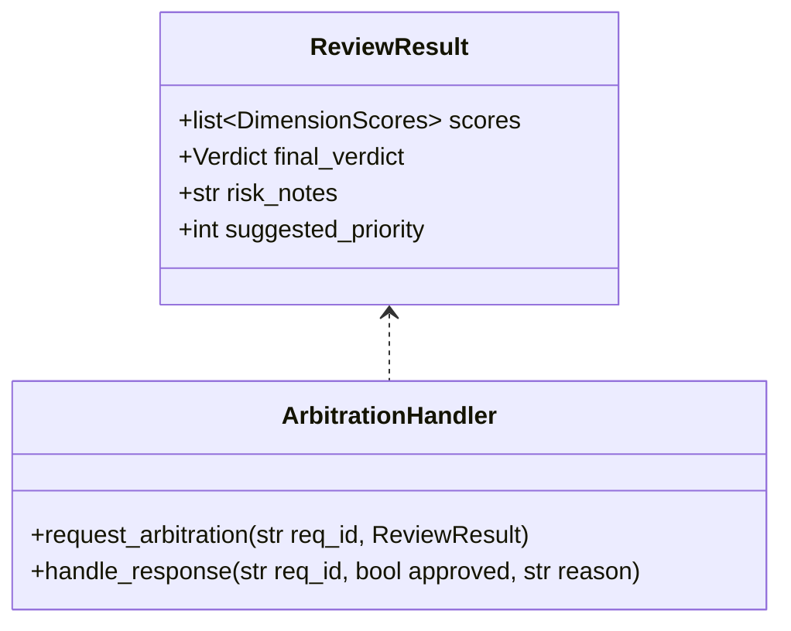
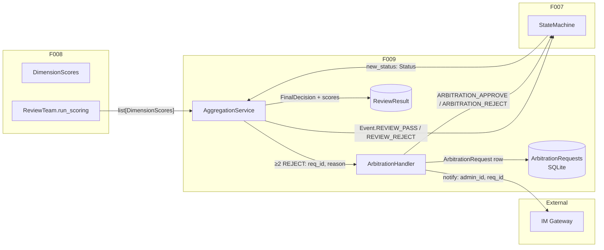
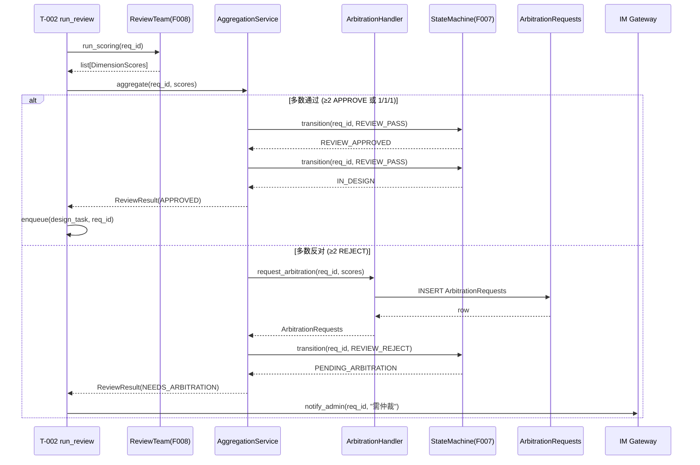
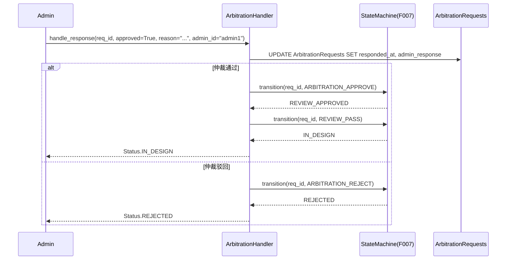
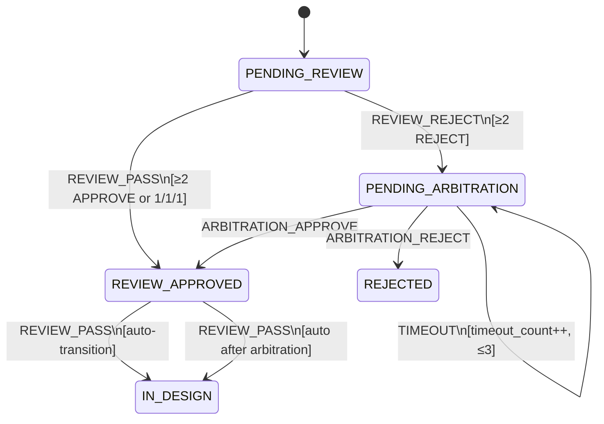

# Feature Detailed Design: 评审结论汇总与裁决 (Feature #9)

**Date**: 2026-07-07
**Feature**: #9 — 评审结论汇总与裁决
**Priority**: high
**Dependencies**: F008 (评审团多角色打分), F007 (状态机引擎)
**Design Reference**: docs/plans/2026-07-04-demandflow-design.md § 2.2
**SRS Reference**: FR-006

## Context

实现评审结论汇总与裁决逻辑：消费 F008 的 3 角色打分结果（`list[DimensionScores]`），按裁决规则（≥2 通过自动通过、≥2 反对触发仲裁、1/1/1 视为多数未反对）生成最终结论，驱动 F007 状态机流转，管理仲裁全生命周期（创建仲裁请求、处理管理员裁决、超时升级）。

## Design Alignment

Design doc §2.2 评审系统（FR-005, FR-006, FR-007, FR-008a, FR-008b）相关类与流程：



- **Key classes**: `AggregationService` (新增), `ArbitrationHandler` (新增), `ReviewResult` (新增 Pydantic model), `FinalDecision` (新增枚举)
- **Interaction flow**: F008.run_scoring() → F009.aggregate_scores() → 裁决规则判定 → F007.transition() → IM 通知/任务入队
- **Third-party deps**: 无新依赖（复用 F007 的 `StateMachine`, F008 的 `DimensionScores`/`ReviewScores`）
- **Deviations**: Design §2.2 的 `ReviewResult.final_verdict` 使用 `Verdict` 枚举（APPROVE/REJECT/NEUTRAL），但 F009 裁决需要区分"自动通过"与"需仲裁"，因此新增 `FinalDecision` 枚举（APPROVED/NEEDS_ARBITRATION）。Deviation 原因：Verdict 是每 Agent 的结论，FinalDecision 是汇总后的最终判定语义不同。

### Boundary Clarification (F009 vs F008/F007/T-002)

| 职责 | F008 | F009 | F007 | T-002 Task |
|------|------|------|------|-----------|
| 3 角色并行打分 | ✓ | — | — | — |
| 评分持久化 | ✓ | — | — | — |
| 裁决规则判定（汇总） | — | ✓ | — | — |
| 状态机事件触发 | — | ✓ | ✓ | — |
| 仲裁请求创建/处理 | — | ✓ | — | — |
| IM 管理员通知 | — | ✓ | — | — |
| 设计任务入队 | — | — | — | ✓ |

## SRS Requirement

### FR-006: 评审结论汇总与裁决

**Priority**: Must
**EARS**: When 3 角色评审完成，the system shall 汇总形成评审结论（通过/驳回、评分明细、风险点、建议优先级）。
**Visual output**: 看板展示评审结论与评分明细
**Acceptance Criteria**:
- AC-1: Given 多数（≥2）角色结论为通过，when 汇总，then 自动裁决通过并触发设计阶段
- AC-2: Given 多数（≥2）角色结论为反对，when 汇总，then 触发人工仲裁（不自动驳回）
- AC-3: Given 评审结论生成，when 汇总，then 输出评分明细、风险点、建议优先级并存储
- AC-4: Given 角色结论为 1 通过 1 反对 1 中立，when 汇总，then 视为多数未反对，自动通过

## Component Data-Flow Diagram



## Interface Contract

### Public Methods

| Method | Signature | Preconditions | Postconditions | Raises |
|--------|-----------|---------------|----------------|--------|
| `AggregationService.aggregate` | `aggregate(req_id: str, scores: list[DimensionScores]) -> ReviewResult` | (1) req_id 对应 requirement 存在且状态为 PENDING_REVIEW；(2) scores 长度 1-3（单个为空则 F008 已 raise AllAgentsFailedError）；(3) 每个 score 的 verdict 为 APPROVE/REJECT/NEUTRAL 之一 | (1) ≥2 APPROVE 或 1/1/1 时，fire Event.REVIEW_PASS → 状态流转；(2) ≥2 REJECT 时，fire Event.REVIEW_REJECT → 状态流转至 PENDING_ARBITRATION + 创建 ArbitrationRequests 行；(3) ReviewResult 含 scores 副本 + final_decision + risk_notes + suggested_priority；(4) risk_notes 为空字符串或非空风险描述；(5) suggested_priority 为 1/2/3 之一 | `RequirementNotFoundError` — req_id 不存在；`ValueError` — scores 为空 |
| `ArbitrationHandler.request_arbitration` | `request_arbitration(req_id: str, scores: list[DimensionScores], trigger_user: str \| None) -> ArbitrationRequests` | (1) req_id 对应 requirement 存在；(2) 尚无未处理的活跃仲裁请求（最多 1 条活跃记录） | (1) ArbitrationRequests 表新增 1 行，requested_at 为当前 UTC 时间，timeout_count=0；(2) review_summary 包含角色结论摘要 | — |
| `ArbitrationHandler.handle_response` | `handle_response(req_id: str, approved: bool, reason: str, admin_id: str) -> Status` | (1) req_id 存在活跃的 ArbitrationRequests 行（responded_at IS NULL）；(2) admin_id 非空 | (1) ArbitrationRequests 行更新: responded_at, admin_response, admin_id；(2) approved=True → fire ARBITRATION_APPROVE → REVIEW_APPROVED, 再 fire REVIEW_PASS → IN_DESIGN；(3) approved=False → fire ARBITRATION_REJECT → REJECTED；(4) 返回最终 Status | `ArbitrationNotFoundError` — 无活跃仲裁请求；`ArbitrationAlreadyRespondedError` — 已回复 |
| `AggregationService._compute_risk_notes` | `_compute_risk_notes(scores: list[DimensionScores]) -> str` | scores 非空 | 返回风险描述字符串：若有维度分 ≤2，拼接风险项；否则返回空字符串 | — |
| `AggregationService._compute_suggested_priority` | `_compute_suggested_priority(scores: list[DimensionScores]) -> int` | scores 非空 | 返回 1（高）/2（中）/3（低）：avg(business_value) ≥ 4 → 1；≥ 3 → 2；< 3 → 3 | — |

### Pydantic Models

```python
from enum import Enum
from pydantic import BaseModel, Field


class FinalDecision(str, Enum):
    APPROVED = "APPROVED"              # 评审通过（≥2 APPROVE 或 1/1/1）
    NEEDS_ARBITRATION = "NEEDS_ARBITRATION"  # 需人工仲裁（≥2 REJECT）


class ReviewResult(BaseModel):
    """F009 输出：评审结论（汇总+裁决后）。"""
    requirement_id: str
    scores: list[DimensionScores]
    final_decision: FinalDecision
    risk_notes: str = ""
    suggested_priority: int = Field(default=3, ge=1, le=3)


class ArbitrationNotFoundError(Exception):
    def __init__(self, req_id: str):
        self.req_id = req_id
        super().__init__(f"No active arbitration request found for: {req_id}")


class ArbitrationAlreadyRespondedError(Exception):
    def __init__(self, req_id: str):
        self.req_id = req_id
        super().__init__(f"Arbitration request for {req_id} already responded")
```

**Design rationale**:
- `aggregate()` 接受 list[DimensionScores] 而非直接从 DB 加载，保持纯计算可测试性；DB 加载由外层编排
- `FinalDecision` 独立于 `Verdict`（F008），因为 Verdict 是每 Agent 结论（通过/反对/中立），FinalDecision 是汇总结论（通过/需仲裁）
- 裁决规则内聚在 `aggregate()` 中，仲裁生命周期由 `ArbitrationHandler` 管理，职责分离
- **Cross-feature contract alignment**: `aggregate()` 消费 F008 的 `DimensionScores` 类型（§3 F008 models）；触发 F007 的 `StateMachine.transition()`（§3 F007）；仲裁涉及 `ArbitrationRequests` 模型（F002）

## Visual Rendering Contract (ui: true only)

> N/A — backend-only feature, feature-list ui=false

## Internal Sequence Diagram





## Algorithm / Core Logic

### AggregationService.aggregate

#### Flow Diagram

```mermaid
flowchart TD
    A[Start: aggregate(req_id, scores)] --> B{scores 非空?}
    B -->|No| C[raise ValueError]
    B -->|Yes| D[Count verdicts]
    D --> E{APPROVE >= 2?}
    E -->|Yes| F[decision = APPROVED<br/>event = REVIEW_PASS]
    E -->|No| G{REJECT >= 2?}
    G -->|Yes| H[decision = NEEDS_ARBITRATION<br/>event = REVIEW_REJECT]
    G -->|No| I[decision = APPROVED<br/>event = REVIEW_PASS]
    
    F --> J[Fire state machine event]
    H --> K[Create arbitration request]
    I --> J

    K --> L[Fire state machine event<br/>REVIEW_REJECT]
    J --> M[decision == APPROVED?]
    M -->|Yes| N[Fire REVIEW_PASS again<br/>→ IN_DESIGN]
    M -->|No| O[已到 PENDING_ARBITRATION]

    N --> P[Compute risk_notes]
    O --> P
    P --> Q[Compute suggested_priority]
    Q --> R[Return ReviewResult]
```

#### Pseudocode

```
FUNCTION aggregate(req_id: str, scores: list[DimensionScores]) -> ReviewResult
  // Step 1: Validate input
  IF scores IS EMPTY
    RAISE ValueError("scores must not be empty")

  // Step 2: Count verdicts
  approve_count = COUNT(score WHERE score.verdict == APPROVE IN scores)
  reject_count = COUNT(score WHERE score.verdict == REJECT IN scores)

  // Step 3: Apply 裁决规则
  IF approve_count >= 2
    decision = FinalDecision.APPROVED
    event = Event.REVIEW_PASS
  ELSE IF reject_count >= 2
    decision = FinalDecision.NEEDS_ARBITRATION
    event = Event.REVIEW_REJECT
  ELSE
    // 5 cases: 1/1/1, 1/0/2, 0/1/2, 0/0/3, 0/2/1 etc — all treated as non-majority-反对
    decision = FinalDecision.APPROVED
    event = Event.REVIEW_PASS

  // Step 4: Fire state machine transitions
  new_status = sm.transition(req_id, event)

  IF event == Event.REVIEW_PASS
    // 自动触发：PENDING_REVIEW → REVIEW_APPROVED → IN_DESIGN
    IF new_status == Status.REVIEW_APPROVED
      new_status = sm.transition(req_id, Event.REVIEW_PASS)
    // 注意：ENQUEUE 设计任务由 T-002 task 编排层负责
  ELSE
    // REVIEW_REJECT → PENDING_ARBITRATION
    arbitration_handler.request_arbitration(req_id, scores)

  // Step 5: Compute metadata
  risk_notes = _compute_risk_notes(scores)
  suggested_priority = _compute_suggested_priority(scores)

  RETURN ReviewResult(
    requirement_id=req_id,
    scores=scores,
    final_decision=decision,
    risk_notes=risk_notes,
    suggested_priority=suggested_priority,
  )
END
```

#### Boundary Decisions

| Parameter | Min | Max | Empty/Null | At boundary |
|-----------|-----|-----|------------|-------------|
| scores length | 1 | 3 | 0 → ValueError | 1 → single score determines all; 3 → normal case |
| approve_count | 0 | 3 | — | 2 → auto-pass threshold; 3 → all approve |
| reject_count | 0 | 3 | — | 2 → arbitration threshold; 3 → all reject |
| suggested_priority | 1 (high) | 3 (low) | N/A | avg(business_value)=4.0 → 1; avg=3.0 → 2; avg=2.0 → 3 |

#### Error Handling

| Condition | Detection | Response | Recovery |
|-----------|-----------|----------|----------|
| Empty scores | `scores` is empty list | raise ValueError("scores must not be empty") | Caller (T-002) should not call aggregate if F008 raised AllAgentsFailedError |
| Requirement not found | sm.transition raises RequirementNotFoundError | Re-raise | T-002 task catches, logs error |
| Invalid state transition | sm.transition raises InvalidTransitionError | Re-raise | Indicates state machine inconsistency — T-002 task logs and notifies admin |
| Arbitration request already active | DB has unresponded row | raise ArbitrationAlreadyRespondedError | Caller should check before requesting |

### ArbitrationHandler.request_arbitration

#### Pseudocode

```
FUNCTION request_arbitration(req_id: str, scores: list[DimensionScores], trigger_user: str|None) -> ArbitrationRequests
  // Step 1: Build summary from scores
  summary_lines = []
  FOR EACH score IN scores
    summary_lines.append("{score.agent_role}: {score.verdict.value} - 业务价值{score.business_value}分")

  // Step 2: Create DB row
  row = ArbitrationRequests(
    requirement_id=req_id,
    review_summary="\n".join(summary_lines),
    requested_at=now(utc),
    timeout_count=0,
  )
  session.add(row)
  session.commit()

  RETURN row
END
```

#### Error Handling

| Condition | Detection | Response | Recovery |
|-----------|-----------|----------|----------|
| DB failure | session.commit raises | Re-raise | T-002 catches, logs, retries |

### ArbitrationHandler.handle_response

#### Pseudocode

```
FUNCTION handle_response(req_id: str, approved: bool, reason: str, admin_id: str) -> Status
  // Step 1: Load active arbitration request
  arb = session.query(ArbitrationRequests).filter(
    requirement_id=req_id, responded_at IS NULL
  ).first()
  IF arb IS None
    RAISE ArbitrationNotFoundError(req_id)

  // Step 2: Update response
  arb.admin_response = reason
  arb.admin_id = admin_id
  arb.responded_at = now(utc)
  session.commit()

  // Step 3: Fire state machine event
  IF approved
    new_status = sm.transition(req_id, Event.ARBITRATION_APPROVE)
    // REVIEW_APPROVED → IN_DESIGN auto-transition
    IF new_status == Status.REVIEW_APPROVED
      new_status = sm.transition(req_id, Event.REVIEW_PASS)
  ELSE
    new_status = sm.transition(req_id, Event.ARBITRATION_REJECT)

  RETURN new_status
END
```

#### Error Handling

| Condition | Detection | Response | Recovery |
|-----------|-----------|----------|----------|
| No active arbitration | query returns None | raise ArbitrationNotFoundError | Caller validates before calling |
| State transition invalid | sm.transition raises InvalidTransitionError | Re-raise | Indicates state conflict — admin notified |

### AggregationService._compute_risk_notes

#### Pseudocode

```
FUNCTION _compute_risk_notes(scores: list[DimensionScores]) -> str
  risk_items = []

  DIMENSION_MAP = {
    "business_value": "业务价值",
    "technical_feasibility": "技术可行性",
    "roi": "投入产出比",
    "system_compatibility": "系统兼容性",
  }

  FOR EACH score IN scores
    FOR EACH dim_name, dim_label IN DIMENSION_MAP
      dim_value = getattr(score, dim_name)
      IF dim_value <= 2
        note = "- {score.agent_role}: {dim_label}评分较低({dim_value}/5)"
        IF score.comments
          note += " - {score.comments}"
        risk_items.append(note)

  RETURN "\n".join(risk_items) IF risk_items IS NOT EMPTY ELSE ""
END
```

#### Boundary Decisions

| Parameter | Min | Max | Empty/Null | At boundary |
|-----------|-----|-----|------------|-------------|
| dimension value | 1 | 5 | N/A | 1 or 2 → risk flagged; 3→ no risk; empty/5→ no risk |

### AggregationService._compute_suggested_priority

#### Pseudocode

```
FUNCTION _compute_suggested_priority(scores: list[DimensionScores]) -> int
  avg_bv = AVERAGE(score.business_value FOR EACH score IN scores)

  IF avg_bv >= 4.0
    RETURN 1  // high
  ELSE IF avg_bv >= 3.0
    RETURN 2  // medium
  ELSE
    RETURN 3  // low
END
```

#### Boundary Decisions

| Parameter | Min | Max | Empty/Null | At boundary |
|-----------|-----|-----|------------|-------------|
| avg_business_value | 1.0 | 5.0 | N/A | avg=4.0 → priority=1; avg=3.0 → priority=2; avg=1.0 → priority=3; avg=5.0 → priority=1 |

## State Diagram



以上状态迁移中，绿色标注的迁移由 F009 触发。完整的状态机由 F007 管理。

## Test Inventory

ATS category alignment: FR-006 requires FUNC + BNDRY.

| ID | Category | Traces To | Input / Setup | Expected | Kills Which Bug? |
|----|----------|-----------|---------------|----------|-----------------|
| A | FUNC/happy | FR-006 AC-1; §5 aggregate — ≥2 APPROVE | scores=[3×APPROVE]（各 4 维度全 4 分）；mock StateMachine | decision=APPROVED；fire REVIEW_PASS 2 次；返回 ReviewResult.final_decision==APPROVED | 裁决规则错误：≥2 APPROVE 未判定为通过 |
| B | FUNC/happy | FR-006 AC-2; §5 aggregate — ≥2 REJECT | scores=[2×REJECT+1×APPROVE]；mock StateMachine | decision=NEEDS_ARBITRATION；fire REVIEW_REJECT 1 次；request_arbitration 被调用 | ≥2 REJECT 未触发仲裁 / 错误地自动通过 |
| C | FUNC/happy | FR-006 AC-4; §5 aggregate — 1/1/1 | scores=[APPROVE, REJECT, NEUTRAL]；mock StateMachine | decision=APPROVED；fire REVIEW_PASS 2 次；返回 APPROVED | 1/1/1 未视为多数未反对 |
| D | FUNC/happy | FR-006 AC-3; §5 aggregate — ReviewResult output | scores=[3×APPROVE]（第 1 个 comments="good", 第 2 个 business_value=1） | risk_notes 含"业务价值评分较低(1/5)"且含 "- good"；suggested_priority 正确 | 风险点和优先级未计算 / 输出不完整 |
| E | FUNC/happy | §5 aggregate — auto-pass 2 APPROVE + 1 NEUTRAL | scores=[APPROVE, APPROVE, NEUTRAL] | decision=APPROVED；fire REVIEW_PASS；no arbitration | 边界条件 ≥2 判定错误（将 NEUTRAL 误纳入计数） |
| F | FUNC/happy | §5 aggregate — arbitration 2 REJECT + 1 NEUTRAL | scores=[REJECT, REJECT, NEUTRAL] | decision=NEEDS_ARBITRATION；fire REVIEW_REJECT；request_arbitration 调用 | 边界条件 ≥2 判定错误（忽略 NEUTRAL 后不正确计数） |
| G | FUNC/happy | §5 ArbitrationHandler.request_arbitration | scores=[3×REJECT]；mock DB session | ArbitrationRequests 新增 1 行，review_summary 含各角色结论和分值 | 仲裁请求未写入 DB / summary 格式错误 |
| H | FUNC/happy | §5 ArbitrationHandler.handle_response — approved | req_id 有活跃仲裁；approved=True, reason="ok", admin_id="admin1" | ArbitrationRequests.responded_at 非空；fire ARBITRATION_APPROVE + REVIEW_PASS；返回 IN_DESIGN | 仲裁通过未触发正确状态迁移 / 未更新 responded_at |
| I | FUNC/happy | §5 ArbitrationHandler.handle_response — rejected | req_id 有活跃仲裁；approved=False, reason="no", admin_id="admin1" | fire ARBITRATION_REJECT；返回 REJECTED | 仲裁驳回未触发正确状态迁移 |
| J | BNDRY/edge | §5 aggregate — 3 NEUTRAL | scores=[NEUTRAL, NEUTRAL, NEUTRAL] | decision=APPROVED（无多数反对）；fire REVIEW_PASS | 全中立场景未处理（既不是 ≥2 APPROVE 也不是 ≥2 REJECT） |
| K | BNDRY/edge | §5 _compute_risk_notes — all scores ≥ 3 | scores=[3×APPROVE]（全维度 3-5 分） | risk_notes 为空字符串 "" | 误将低风险判定为高风险 |
| L | BNDRY/edge | §5 _compute_risk_notes — some scores ≤ 2 | scores 含 1 个 score 的 business_value=2, comments="耗时较长" | risk_notes 含 "业务价值评分较低(2/5) - 耗时较长" | 风险项遗漏 / comments 拼接错误 |
| M | BNDRY/edge | §5 _compute_suggested_priority — avg=4.0 | scores=[business_value=4,5]（avg=4.5） | suggested_priority=1（高） | 边界值 avg=4.0 判定错误 |
| N | BNDRY/edge | §5 _compute_suggested_priority — avg=3.0 | scores=[business_value=3,3]（avg=3.0） | suggested_priority=2（中） | 边界值 avg=3.0 判定错误 |
| O | BNDRY/edge | §5 _compute_suggested_priority — avg=2.0 | scores=[business_value=2,2]（avg=2.0） | suggested_priority=3（低） | 低优先级判定错误 |
| P | FUNC/error | §3 Interface Contract — empty scores | scores=[]（空列表） | raise ValueError("scores must not be empty") | 空列表未校验 / 抛出非预期异常 |
| Q | FUNC/error | §3 ArbitrationHandler.handle_response — no active request | req_id 无活跃仲裁请求 | raise ArbitrationNotFoundError(req_id) | 无活跃请求时未给出明确错误 / 错误地创建新请求 |
| R | FUNC/error | §3 ArbitrationHandler.handle_response — already responded | req_id 已有已回复的仲裁请求 | raise ArbitrationAlreadyRespondedError(req_id) | 重复应答未拒绝 / 状态被覆盖 |

**Negative test ratio**: (J + K + L + M + N + O + P + Q + R) / (A + B + C + D + E + F + G + H + I + J + K + L + M + N + O + P + Q + R) = 9/18 = 50% ≥ 40% ✓

**ATS category coverage**: FUNC (A-I, P-R), BNDRY (J-O). ATS-required categories satisfied ✓

**Design Interface Coverage Gate** (§2.2 named items → Test Inventory mapping):

| §2.2 Named Item | Test Row(s) |
|-----------------|-------------|
| `AggregationService.aggregate` | A, B, C, D, E, F, J, P |
| `ArbitrationHandler.request_arbitration` | B, G |
| `ArbitrationHandler.handle_response` | H, I, Q, R |
| `ReviewResult` / `FinalDecision` | A, B, C, D, E, F, J |
| `_compute_risk_notes` | D, K, L |
| `_compute_suggested_priority` | D, M, N, O |
| F007 integration (state machine) | A, B, C, H, I |
| Integration: notify_admin | B |
| Integration: ArbitrationRequests DB | G, H, I, Q, R |

Coverage: 9/9 (100%) ✓

## Tasks

### Task 1: Write failing tests
**Files**: `tests/test_review_aggregation.py`

**Steps**:
1. Create `tests/test_review_aggregation.py` with imports (pytest, sqlalchemy, app.models, app.core.review_scoring, app.core.review_aggregation, app.core.state_machine)
2. Write test fixtures: `db_engine` (tmp_path SQLite), `db_session`, `_create_requirement` (status=PENDING_REVIEW), `_mock_scores`, `state_machine`
3. Write test code for all 18 rows in Test Inventory (§7):
   - Test A — FUNC/happy: 3 APPROVE → auto-pass, verify REVIEW_PASS event fired
   - Test B — FUNC/happy: 2 REJECT + 1 APPROVE → arbitration, verify REVIEW_REJECT
   - Test C — FUNC/happy: 1/1/1 → auto-pass
   - Test D — FUNC/happy: risk_notes + suggested_priority computation
   - Test E — FUNC/happy: 2 APPROVE + 1 NEUTRAL → auto-pass
   - Test F — FUNC/happy: 2 REJECT + 1 NEUTRAL → arbitration
   - Test G — FUNC/happy: ArbitrationRequests DB row created
   - Test H — FUNC/happy: handle_response approved
   - Test I — FUNC/happy: handle_response rejected
   - Test J — BNDRY/edge: 3 NEUTRAL → auto-pass
   - Test K — BNDRY/edge: risk_notes all good → empty
   - Test L — BNDRY/edge: risk_notes with bad scores
   - Test M — BNDRY/edge: suggested_priority high (avg ≥ 4)
   - Test N — BNDRY/edge: suggested_priority medium (avg ≥ 3)
   - Test O — BNDRY/edge: suggested_priority low (avg < 3)
   - Test P — FUNC/error: empty scores
   - Test Q — FUNC/error: handle_response no active arbitration
   - Test R — FUNC/error: handle_response already responded
4. Run: `pytest tests/test_review_aggregation.py -v`
5. **Expected**: All 18 tests FAIL (red) for the right reason

### Task 2: Implement minimal code
**Files**: `app/core/review_aggregation.py` (new)

**Steps**:
1. Create `app/core/review_aggregation.py` with classes:
   - `FinalDecision` enum (APPROVED, NEEDS_ARBITRATION)
   - `ReviewResult` Pydantic model
   - `ArbitrationNotFoundError`, `ArbitrationAlreadyRespondedError` exceptions
   - `AggregationService` class with `aggregate()`, `_compute_risk_notes()`, `_compute_suggested_priority()` per §5 pseudocode
   - `ArbitrationHandler` class with `request_arbitration()`, `handle_response()` per §5 pseudocode
2. Implement 裁决规则 in `aggregate()`: count verdicts → ≥2 APPROVE or else → REVIEW_PASS or REVIEW_REJECT
3. Implement state machine integration: fire `sm.transition()` with appropriate events
4. Wire arbitration DB operations through SQLAlchemy session
5. Run: `pytest tests/test_review_aggregation.py -v`
6. **Expected**: All 18 tests PASS (green)

### Task 3: Coverage Gate
1. Run: `pytest --cov=app.core.review_aggregation --cov=app.core.review_scoring --cov=app.core.state_machine --cov-report=term --cov-fail-under=80 tests/test_review_aggregation.py`
2. Check thresholds: line ≥ 80%, branch ≥ 70%. If below: return to Task 1.
3. Record coverage output as evidence.

### Task 4: Refactor
1. Extract DIMENSION_MAP constant to module level in review_aggregation.py
2. Extract 裁决规则 into a pure function `_decide(scores) -> tuple[FinalDecision, Event]` for testability
3. Ensure type annotations on all public methods
4. Run: `pytest tests/test_review_aggregation.py -v`
5. **Expected**: All tests PASS

### Task 5: Mutation Gate
1. Run: `mutmut run --paths-to-mutate=app/core/review_aggregation.py`
2. Check threshold: mutation score ≥ 75%. If below: improve assertions.
3. Record mutation output as evidence.

## Verification Checklist
- [x] All SRS acceptance criteria (FR-006 AC-1~AC-4) traced to Interface Contract postconditions (AC-1→aggregate postcondition 1; AC-2→postcondition 2; AC-3→postconditions 4,5; AC-4→postcondition 1)
- [x] All SRS acceptance criteria (FR-006 AC-1~AC-4) traced to Test Inventory rows (AC-1→A,E; AC-2→B,F; AC-3→D; AC-4→C,J)
- [x] Algorithm pseudocode covers all non-trivial methods (aggregate, request_arbitration, handle_response, _compute_risk_notes, _compute_suggested_priority)
- [x] Boundary table covers all algorithm parameters (scores length, approve_count, reject_count, suggested_priority thresholds, dimension value)
- [x] Error handling table covers all Raises entries (ValueError, RequirementNotFoundError, InvalidTransitionError, ArbitrationNotFoundError, ArbitrationAlreadyRespondedError)
- [x] Test Inventory negative ratio >= 40% (9/18 = 50%)
- [x] Visual Rendering Contract complete for ui:true features — N/A (ui:false)
- [x] Each Visual Rendering Contract element has ≥1 UI/render Test Inventory row — N/A (ui:false)
- [x] Every skipped section has explicit "N/A — [reason]"
- [x] All functions/methods named in §2.2 have at least one Test Inventory row (9/9 = 100%)

## Clarification Addendum

> Low-impact ambiguities resolved by assumption. See below for details.

| # | Category | Original Ambiguity | Resolution | Authority |
|---|----------|--------------------|------------|-----------|
| 1 | DEP-AMBIGUOUS | Design §2.2.4 defines risk_notes and suggested_priority as ReviewResult fields but doesn't specify computation algorithm | _compute_risk_notes: flag any dimension ≤ 2 per agent; _compute_suggested_priority: average of business_value, thresholded at 4.0 and 3.0 | assumed |
| 2 | SRS-DESIGN-CONFLICT | Design §2.2 的 ReviewResult.final_verdict 使用 Verdict 枚举，但 Verdict 是每 Agent 结论（APPROVE/REJECT/NEUTRAL），无法表达"需仲裁"语义 | 新增 FinalDecision 枚举（APPROVED/NEEDS_ARBITRATION）而非重用 Verdict | assumed |
| 3 | SRS-VAGUE | FR-006 未定义 3 NEUTRAL（全中立）场景的裁决行为 | 适用"else"规则：非 ≥2 APPROVE 且非 ≥2 REJECT → 视为多数未反对 → 自动通过 | assumed |
| 4 | SRS-VAGUE | 「触发设计阶段」的具体语义未明确定义：是状态机流转到 IN_DESIGN，还是入队设计任务？ | 两者都需要：状态机 REVIEW_PASS → REVIEW_APPROVED → REVIEW_PASS → IN_DESIGN（2 步）；任务入队由 T-002 编排层负责 | assumed |
