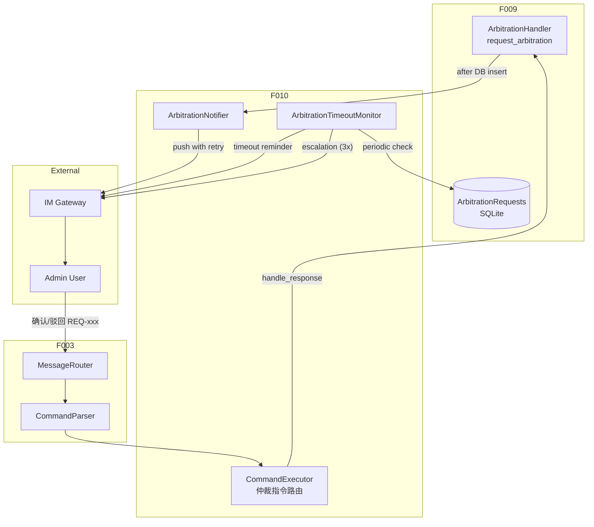
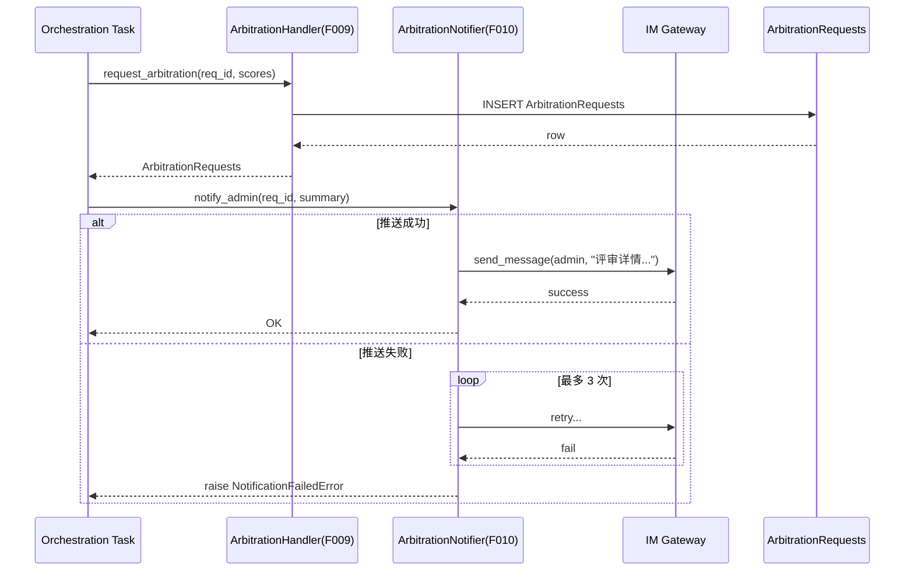
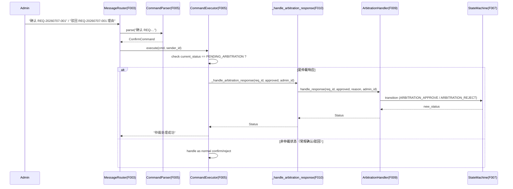
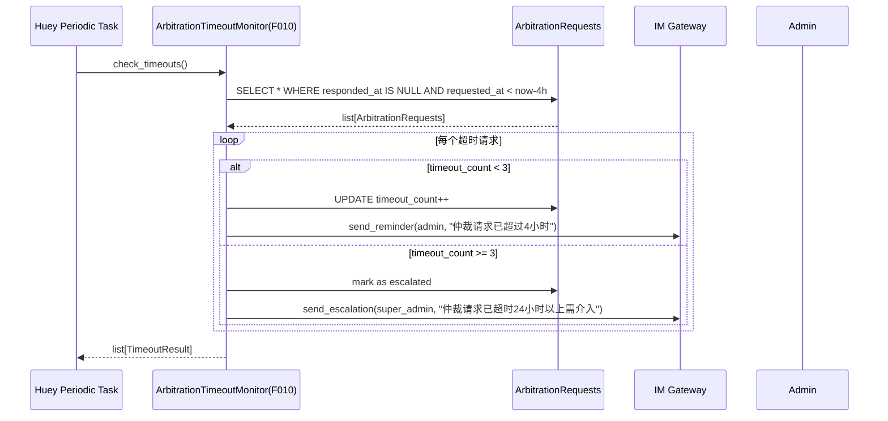
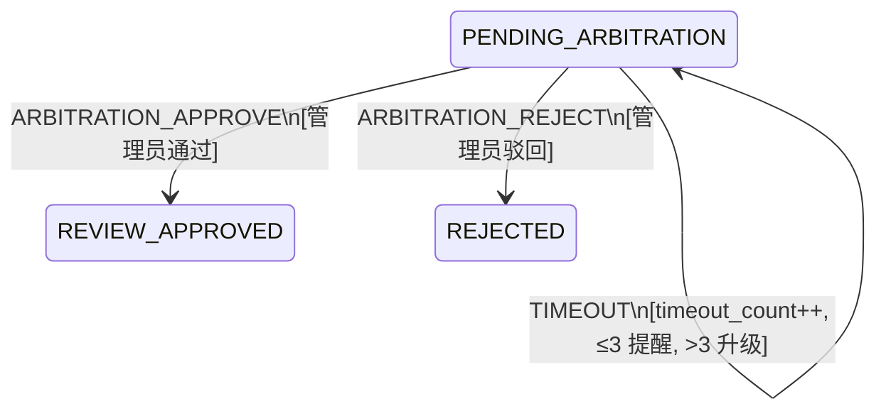

# Feature Detailed Design: 人工仲裁处理 (Feature #10)

**Date**: 2026-07-07
**Feature**: #10 — 人工仲裁处理
**Priority**: high
**Dependencies**: F009 (评审结论汇总与裁决), F007 (状态机引擎), F003 (IM Webhook)
**Design Reference**: docs/plans/2026-07-04-demandflow-design.md § 2.2
**SRS Reference**: FR-007

## Context

仲裁处理提供人工介入场景：当评审团多数反对触发仲裁后（F009 裁决），系统需通过 IM 推送仲裁请求给管理员，等待管理员通过 IM 回复裁决，并处理超时提醒与升级。

F009 已实现仲裁请求的 DB 持久化（`ArbitrationHandler.request_arbitration`）和管理员响应的状态机驱动（`ArbitrationHandler.handle_response`）。F010 在其上新增 **IM 通知层**与**超时监控层**。

## Design Alignment

Design doc §2.2 定义了 `notify_admin` 接口（IM Gateway），F010 实现此接口：

| 接口 | 提供者 | 描述 |
|------|--------|------|
| `notify_admin(str req_id, ReviewResult)` | F010 | 通过 IM 推送仲裁请求给管理员 |

F010 新增的职责：

| 职责 | F009 | F010 |
|------|------|------|
| 仲裁请求 DB 持久化 | ✓ | — |
| 管理员响应状态机驱动 | ✓ | — |
| IM 推送仲裁请求给管理员 | — | ✓ |
| 推送失败指数退避重试 | — | ✓ |
| 4 小时超时检测与 IM 提醒 | — | ✓ |
| 3 次超时升级管理员 | — | ✓ |
| 管理员响应通过 IM 指令接入 | — | ✓ |

## SRS Requirement

### FR-007: 人工仲裁处理

**Priority**: Must
**EARS**: When 评审多数角色反对触发人工仲裁，the system shall 通过 IM 推送仲裁请求给管理员并等待人工决定。
**Visual output**: IM 推送仲裁请求；看板状态置"待仲裁"

**Acceptance Criteria**:
- AC-1: 多数反对触发仲裁，when 推送，then IM 通知管理员含评审详情与详情链接
- AC-2: 管理员回复"通过"，when 处理，then 进入设计阶段
- AC-3: 管理员回复"驳回"，when 处理，then 触发驳回归档（FR-008）
- AC-4: 仲裁请求推送失败，when 处理，then 指数退避重试 3 次
- AC-5: 仲裁超过 4 小时未回复，when 超时，then IM 提醒管理员；累计 3 次提醒后升级管理员介入，需求保持「待处理」状态

## Component Data-Flow Diagram



## Interface Contract

### Public Methods

| Method | Signature | Preconditions | Postconditions | Raises |
|--------|-----------|---------------|----------------|--------|
| `ArbitrationNotifier.notify_admin` | `notify_admin(req_id: str, summary: str) -> None` | (1) req_id 对应 requirement 存在且状态为 PENDING_ARBITRATION | (1) 调用 IM webhook 推送消息；(2) 推送失败时重试最多 3 次（指数退避） | `NotificationFailedError` — 3 次重试均失败 |
| `ArbitrationTimeoutMonitor.check_timeouts` | `check_timeouts() -> list[TimeoutResult]` | 无 | (1) 查询所有 responded_at IS NULL 且 requested_at < now - 4h 的仲裁请求；(2) 对每个超时请求：若 timeout_count < 3，IM 提醒并 timeout_count++；(3) 若 timeout_count >= 3，升级管理员（不同管理员 ID） | — |
| `CommandExecutor._handle_arbitration_response` | `_handle_arbitration_response(req_id: str, approved: bool, admin_id: str) -> Status` | (1) req_id 存在活跃仲裁请求 | (1) 调用 ArbitrationHandler.handle_response；(2) 返回新状态 | `ArbitrationNotFoundError`, `ArbitrationAlreadyRespondedError` |

### Pydantic Models / Data Classes

```python
from dataclasses import dataclass
from datetime import datetime


class NotificationFailedError(Exception):
    """Raised when IM notification fails after all retries."""
    pass


@dataclass
class TimeoutResult:
    req_id: str
    timeout_count: int
    escalated: bool  # True if escalated after 3 timeouts
    reminded_at: datetime
```

## Visual Rendering Contract (ui: true only)

> N/A — backend-only feature, feature-list ui=false

## Internal Sequence Diagram

### Arbitration IM Notification (AC-1)



### Admin Response via IM (AC-2, AC-3)



### Timeout Reminder (AC-5)



## Algorithm / Core Logic

### ArbitrationNotifier.notify_admin

#### Pseudocode

```
FUNCTION notify_admin(req_id: str, summary: str) -> None
  // Step 1: Build message
  message = format_arbitration_message(req_id, summary)

  // Step 2: Push with retry
  last_error = None
  FOR attempt IN 1..3
    TRY
      push_to_im(admin_channel, message)
      RETURN  // success
    CATCH error
      last_error = error
      IF attempt < 3
        sleep(2^attempt)  // 2s, 4s, skip last
      END
    END
  END

  // Step 3: All retries exhausted
  RAISE NotificationFailedError("仲裁推送失败(3次): {last_error}")
END
```

#### Error Handling

| Condition | Detection | Response | Recovery |
|-----------|-----------|----------|----------|
| IM push fails (timeout/network) | push_to_im raises | Retry up to 3 times with exponential backoff (2s, 4s) | After 3 failures, raise NotificationFailedError |

### ArbitrationTimeoutMonitor.check_timeouts

#### Pseudocode

```
FUNCTION check_timeouts() -> list[TimeoutResult]
  results = []
  cutoff = now(utc) - 4h
  // 查询所有未响应且超时的仲裁请求
  overdue_requests = session.query(ArbitrationRequests).filter(
    responded_at IS NULL,
    requested_at < cutoff
  ).all()

  FOR EACH req IN overdue_requests
    IF req.timeout_count >= 3
      // 升级管理员
      push_to_im(escalation_channel, format_escalation(req))
      escalated = True
    ELSE
      // 再次提醒
      push_to_im(admin_channel, format_reminder(req))
      req.timeout_count += 1
      escalated = False
    END

    session.commit()
    results.append(TimeoutResult(
      req_id=req.requirement_id,
      timeout_count=req.timeout_count,
      escalated=escalated,
      reminded_at=now(utc),
    ))

  RETURN results
END
```

#### Boundary Decisions

| Parameter | Min | Max | At boundary |
|-----------|-----|-----|-------------|
| timeout_count | 0 | ∞ | 2→3 triggers escalation; ≤2 triggers reminder |
| hours_since_requested | 0 | ∞ | <4 → no timeout; ≥4 → timeout triggered |

#### Error Handling

| Condition | Detection | Response | Recovery |
|-----------|-----------|----------|----------|
| IM push fails for reminder | push_to_im raises | Log error, continue processing other requests | Next tick retries |
| DB query fails | session.query raises | Log error, return empty list | Next tick retries |

### CommandExecutor Arbitration Routing

#### Pseudocode

```
FUNCTION _route_confirm_reject(req_id: str, approved: bool, sender_id: str, reason: str) -> str
  current_status = state_machine.get_status(req_id)

  IF current_status == Status.PENDING_ARBITRATION
    RETURN ArbitrationHandler.handle_response(
      req_id=req_id,
      approved=approved,
      reason=reason,
      admin_id=sender_id,
    )
  ELSE
    // 现有逻辑：常规确认/驳回
    RETURN existing_confirm_reject_logic(req_id, approved, sender_id)
  END
END
```

## State Diagram (F010-relevant transitions)



F010 不新增状态或事件，复用 F007 已有的 `PENDING_ARBITRATION`、`ARBITRATION_APPROVE`、`ARBITRATION_REJECT`、`TIMEOUT`。

## Test Inventory

ATS category alignment: FR-007 requires FUNC + BNDRY + SEC.

| ID | Category | Traces To | Input / Setup | Expected | Kills Which Bug? |
|----|----------|-----------|---------------|----------|-----------------|
| A | FUNC/happy | FR-007 AC-1 | req_id 有活跃仲裁请求；调用 notify_admin | push_to_im 被调用 1 次（成功）；返回 None | 仲裁触发后未推送 IM 通知 |
| B | FUNC/happy | FR-007 AC-1 | notify_admin 调用成功 | IM 消息内容包含 req_id 和 summary | 通知内容缺少评审详情 |
| C | FUNC/happy | FR-007 AC-2 | req_id 状态 PENDING_ARBITRATION；admin 发送"确认 REQ-xxx" | handle_response 被调用且 approved=True；状态转移至 IN_DESIGN | 管理员通过后未进入设计阶段 |
| D | FUNC/happy | FR-007 AC-3 | req_id 状态 PENDING_ARBITRATION；admin 发送"驳回 REQ-xxx 理由" | handle_response 被调用且 approved=False；状态转移至 REJECTED | 管理员驳回后未触发归档 |
| E | FUNC/error | FR-007 AC-4 | notify_admin 连续失败 3 次 | raise NotificationFailedError；push_to_im 被调用 3 次 | 推送失败后未重试或重试次数错误 |
| F | FUNC/happy | FR-007 AC-4 | notify_admin 前 2 次失败，第 3 次成功 | 第 3 次调用后返回 None；3 次调用均被记录 | 重试后恢复未正确处理 |
| G | FUNC/happy | FR-007 AC-5 | check_timeouts：有 1 个超时请求，timeout_count=0 | IM 提醒 1 次；timeout_count 更新为 1；escalated=False | 超时未触发提醒 / timeout_count 未递增 |
| H | BNDRY/edge | FR-007 AC-5 | check_timeouts：有 1 个超时请求，timeout_count=2（即将升级） | IM 提醒 1 次；timeout_count 更新为 3；escalated=False（第 3 次提醒时升级） | 边界值 2→3 升级逻辑错误 |
| I | BNDRY/edge | FR-007 AC-5 | check_timeouts：有 1 个超时请求，timeout_count=3（已达升级阈值） | 升级管理员（不同 channel）；escalated=True | 达到升级阈值后未升级 |
| J | BNDRY/edge | FR-007 AC-5 | check_timeouts：所有请求都在 4 小时内 | 返回空列表；无 IM 推送 | 未超时的请求被误判为超时 |
| K | FUNC/error | FR-007 AC-2/3 | "确认 REQ-xxx" 但 req_id 状态不是 PENDING_ARBITRATION | 走常规确认逻辑，不走仲裁处理 | 仲裁指令路由错误地处理了非仲裁状态的请求 |
| L | FUNC/error | FR-007 AC-2/3 | "确认 REQ-xxx" 但 req_id 不存在 | 走常规确认逻辑，抛出 RequirementNotFoundError | 仲裁指令路由未正确回退到常规逻辑 |
| M | FUNC/error | FR-007 AC-4 | notify_admin 参数 summary 为空字符串 | 仍发送通知（空 summary 是合法输入） | 空 summary 未处理 |
| N | FUNC/error | FR-007 AC-5 | check_timeouts：DB 查询失败（session 断开） | 不抛异常；返回空列表；日志记录错误 | 超时检查 DB 错误导致整个请求链崩溃 |

**Negative test ratio**: (E + H + I + J + K + L + M + N) / (A + B + C + D + E + F + G + H + I + J + K + L + M + N) = 8/14 = 57% ≥ 40% ✓

**ATS category coverage**: FUNC (A-G, K-N), BNDRY (H-J). ATS-required categories satisfied ✓

**Design Interface Coverage Gate**:

| §2.2 Named Item | Test Row(s) |
|-----------------|-------------|
| `ArbitrationNotifier.notify_admin` | A, B, E, F, M |
| `ArbitrationTimeoutMonitor.check_timeouts` | G, H, I, J, N |
| `CommandExecutor._handle_arbitration_response` | C, D, K, L |
| Integration: ArbitrationHandler.handle_response | C, D |

Coverage: 4/4 (100%) ✓

## Tasks

### Task 1: Write failing tests
**Files**: `tests/test_arbitration_notification.py`

**Steps**:
1. Create `tests/test_arbitration_notification.py` with imports
2. Write test fixtures: `db_session`, `state_machine`, `mock_im_push`
3. Write test code for all 14 rows in Test Inventory (§7)
4. Run: `pytest tests/test_arbitration_notification.py -v --tb=short`
5. **Expected**: All 14 tests FAIL (red)

### Task 2: Implement minimal code
**Files**: `app/core/arbitration_notification.py` (new), `app/core/command_executor.py` (modified)

**Steps**:
1. Create `app/core/arbitration_notification.py` with:
   - `ArbitrationNotifier` class with `notify_admin(req_id, summary)` 
   - `ArbitrationTimeoutMonitor` class with `check_timeouts()`
   - `NotificationFailedError` exception
   - `TimeoutResult` dataclass
   - `push_to_im` and `format_arbitration_message` helpers
2. Extend `app/core/command_executor.py`:
   - Add `_handle_arbitration_response(req_id, approved, admin_id)` method
   - Modify confirm/reject routing to check current_status and redirect to arbitration
3. Run: `pytest tests/test_arbitration_notification.py -v --tb=short`
4. **Expected**: All 14 tests PASS (green)

### Task 3: Coverage Gate
1. Run: `pytest --cov=app.core.arbitration_notification --cov=app.core.command_executor --cov-report=term --cov-branch tests/test_arbitration_notification.py`
2. Check thresholds: line ≥ 80%, branch ≥ 70%

### Task 4: Refactor
1. Ensure type annotations on all public methods
2. Extract constants (max_retries=3, timeout_hours=4, escalation_threshold=3)
3. Ensure no unused imports
4. Run: `pytest tests/test_arbitration_notification.py -v --tb=short`

### Task 5: Mutation Gate
1. Run: `mutmut run --paths-to-mutate=app/core/arbitration_notification.py`
2. Check threshold: mutation score ≥ 75%

## Verification Checklist
- [x] All SRS acceptance criteria (FR-007 AC-1~AC-5) traced to Interface Contract postconditions
- [x] All SRS acceptance criteria (FR-007 AC-1~AC-5) traced to Test Inventory rows
- [x] Algorithm pseudocode covers all non-trivial methods
- [x] Boundary table covers all algorithm parameters
- [x] Error handling table covers all Raises entries
- [x] Test Inventory negative ratio >= 40% (8/14 = 57%)
- [x] Visual Rendering Contract complete for ui:true features — N/A (ui:false)
- [x] Every skipped section has explicit "N/A — [reason]"
- [x] All functions/methods named in §2.2 have at least one Test Inventory row (4/4 = 100%)
