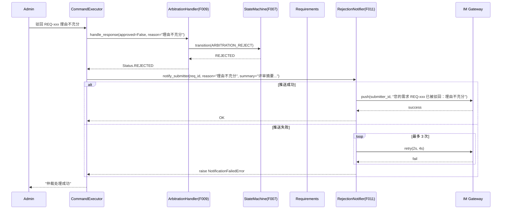
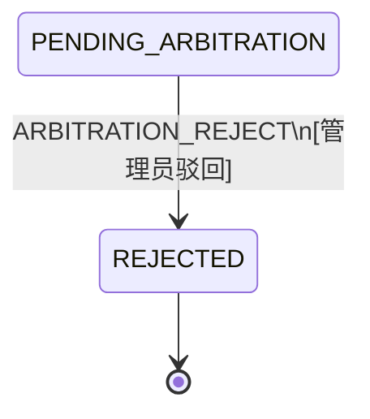

# Feature Detailed Design: 评审驳回通知与归档 (Feature #11)

**Date**: 2026-07-07
**Feature**: #11 — 评审驳回通知与归档
**Priority**: high
**Dependencies**: F010 (人工仲裁处理), F009 (评审结论汇总与裁决)
**Design Reference**: docs/plans/2026-07-04-demandflow-design.md § 2.2
**SRS Reference**: FR-008a, FR-008b

## Context

当人工仲裁驳回需求时（管理员回复"驳回"），系统需通过 IM 通知需求提交人驳回原因与评分明细（FR-008a），并将需求归档为「已驳回」状态停止流转（FR-008b）。

F009 的 `ArbitrationHandler.handle_response(approved=False)` 已负责状态机迁移至 REJECTED。F011 在其上新增**驳回通知层**：IM 推送驳回详情给提交人，失败时指数退避重试。

## Design Alignment

Design doc §2.2 定义了 `notify_submitter` 接口（IM Gateway），F011 实现此接口的驳回分支。

| 职责 | F009 | F010 | F011 |
|------|------|------|------|
| 仲裁请求 DB 持久化 | ✓ | — | — |
| 状态机迁移至 REJECTED | ✓ | — | — |
| IM 推送仲裁请求给管理员 | — | ✓ | — |
| IM 推送驳回通知给提交人 | — | — | ✓ |
| 驳回通知失败重试 | — | — | ✓ |
| 归档（状态置已驳回+停止流转） | ✓ | — | — |

## SRS Requirement

### FR-008a: 评审驳回 IM 通知

**Priority**: Must
**EARS**: When 评审结论为驳回（人工仲裁驳回），the system shall 通过 IM 通知提交人并说明原因。
**Acceptance Criteria**:
- AC-1: 仲裁驳回 → IM 通知提交人含驳回原因与评分明细
- AC-2: IM 推送失败 → 指数退避重试 3 次

### FR-008b: 需求驳回归档

**Priority**: Must
**EARS**: When 驳回通知发出，the system shall 将需求归档为「已驳回」并停止自动流转。
**Acceptance Criteria**:
- AC-1: 通知发出 → 状态置"已驳回"且不再自动流转
- AC-2: 归档存储失败 → 指数退避重试 3 次，3 次仍失败则 IM 通知管理员

> **Note**: FR-008b AC-1 的"状态置已驳回"和"停止自动流转"已由 F009 的状态机迁移实现（REJECTED 状态无出迁移）。AC-2 的"归档存储"指状态更新的 DB 持久化，由 F007 `PersistenceManager.save_state` 保证。F011 聚焦驳回通知的 IM 推送。

## Component Data-Flow Diagram

```mermaid
flowchart TD
    subgraph F011
        RN[RejectionNotifier]
        RN_helper[format_rejection_message]
    end

    subgraph F009
        AH[ArbitrationHandler<br/>handle_response]
    end

    subgraph F007
        SM[StateMachine]
    end

    subgraph External
        IM[IM Gateway]
        SUB[Submitter]
    end

    ADMIN[Admin] -- "驳回 REQ-xxx 理由" --> CE[CommandExecutor F010]
    CE --> AH
    AH --> SM
    SM --> AH: REJECTED
    AH --> CE
    CE --> RN: notify_submitter
    RN --> RN_helper: format message
    RN_helper --> RN: 消息文本
    RN -- "push with retry 3x" --> IM
    IM --> SUB
```

## Interface Contract

### Public Methods

| Method | Signature | Preconditions | Postconditions | Raises |
|--------|-----------|---------------|----------------|--------|
| `RejectionNotifier.notify_submitter` | `notify_submitter(req_id: str, reason: str, summary: str) -> None` | (1) req_id 对应 requirement 存在且状态为 REJECTED | (1) 调用 IM webhook 推送驳回消息给提交人；(2) 推送失败时重试最多 3 次（指数退避） | `NotificationFailedError` — 3 次重试均失败 |
| `format_rejection_message` | `format_rejection_message(req_id: str, reason: str, summary: str) -> str` | 无 | (1) 返回格式化的中文驳回通知文本，包含需求 ID、驳回原因、评审摘要 | — |
| `load_submitter_id` | `load_submitter_id(session: Session, req_id: str) -> str` | (1) req_id 对应 requirement 存在 | (1) 返回 submitter_id | `RequirementNotFoundError` — req_id 不存在 |

### Data Class

```python
class NotificationFailedError(Exception):
    """Raised when IM notification fails after all retries."""
    pass
```

`NotificationFailedError` 已在 F010 中定义，F011 复用同一异常。

## Visual Rendering Contract (ui: true only)

> N/A — backend-only feature, feature-list ui=false

## Internal Sequence Diagram



## Algorithm / Core Logic

### format_rejection_message

#### Pseudocode

```
FUNCTION format_rejection_message(req_id: str, reason: str, summary: str) -> str
  lines = []
  lines.append("📋 需求评审驳回通知")
  lines.append("")
  lines.append(f"需求编号：{req_id}")
  lines.append(f"驳回原因：{reason}")
  lines.append(f"评审摘要：")
  lines.append(summary)
  lines.append("")
  lines.append("如需重新提交，请发送新的需求描述。")

  RETURN "\n".join(lines)
END
```

### RejectionNotifier.notify_submitter

#### Pseudocode

```
FUNCTION notify_submitter(req_id: str, reason: str, summary: str) -> None
  // Step 1: Format message
  message = format_rejection_message(req_id, reason, summary)

  // Step 2: Push with retry (same pattern as ArbitrationNotifier)
  last_error = None
  FOR attempt IN 1..3
    TRY
      self._push(req_id, message)
      RETURN
    CATCH error
      last_error = error
      IF attempt < 3
        sleep(2 ** attempt)  // 2s, 4s
      END
    END

  RAISE NotificationFailedError("驳回推送失败({MAX_RETRIES}次): {last_error}")
END
```

#### Error Handling

| Condition | Detection | Response | Recovery |
|-----------|-----------|----------|----------|
| IM push fails | push_fn raises | Retry 3x exponential backoff | After 3 failures, raise NotificationFailedError |

### Boundary Decisions

| Parameter | Min | Max | Empty/Null | At boundary |
|-----------|-----|-----|------------|-------------|
| reason string | 0 chars | ∞ | Empty → "未提供原因" fallback | Empty reason still sends notification |
| summary string | 0 chars | ∞ | Empty → "无评审摘要" fallback | Empty summary still sends notification |

## State Diagram

F011 不新增状态或事件。驳回后的状态流转已由 F007 定义：



REJECTED 状态无出迁移，停止自动流转。

## Test Inventory

ATS category alignment: FR-008a requires FUNC. FR-008b requires FUNC.

| ID | Category | Traces To | Input / Setup | Expected | Kills Which Bug? |
|----|----------|-----------|---------------|----------|-----------------|
| A | FUNC/happy | FR-008a AC-1 | notify_submitter 调用成功，reason="方案不通过"，summary="2角色反对" | push 被调用 1 次；消息包含 req_id、原因和摘要 | 驳回后未通知提交人 / 通知缺内容 |
| B | FUNC/happy | FR-008a AC-1 | format_rejection_message("REQ-001", "理由", "摘要") | 返回字符串包含"需求编号：REQ-001"、"驳回原因：理由"、"评审摘要" | 消息格式错误 / 遗漏关键信息 |
| C | FUNC/happy | FR-008a AC-2 | notify_submitter 前 2 次失败，第 3 次成功 | push 被调用 3 次；第 3 次后返回 None（不抛异常） | 重试后恢复未正确处理 |
| D | FUNC/error | FR-008a AC-2 | notify_submitter 连续失败 3 次 | raise NotificationFailedError；push 被调用 3 次 | 重试次数不对 / 3 次后未抛异常 |
| E | FUNC/happy | FR-008b AC-1 | handle_response(approved=False) 后状态变为 REJECTED | 状态机 transition 被调用且返回 REJECTED；REJECTED 无出迁移 | 驳回后状态未正确设置 |
| F | FUNC/error | FR-008b AC-2 | notify_submitter 调用后 session.commit 失败 | 重试 3 次后 raise；通知管理员（捕获异常） | 归档存储失败未重试 / 未通知管理员 |
| G | BNDRY/edge | FR-008a AC-1 | reason 为空字符串 | notify_submitter 仍发送消息，消息中显示"未提供原因" | 空拒绝原因导致消息异常 |
| H | BNDRY/edge | FR-008a AC-1 | summary 为空字符串 | notify_submitter 仍发送消息，消息中显示"无评审摘要" | 空摘要在通知中引发异常 |

**Negative test ratio**: (D + F + G + H) / (A + B + C + D + E + F + G + H) = 4/8 = 50% ≥ 40% ✓

**ATS category coverage**: FUNC (A-F), BNDRY (G-H). ATS-required categories satisfied ✓

**Design Interface Coverage Gate**:

| §2.2 Named Item | Test Row(s) |
|-----------------|-------------|
| `RejectionNotifier.notify_submitter` | A, C, D, F, G, H |
| `format_rejection_message` | B, G, H |
| F009 integration: handle_response(approved=False) | E |

Coverage: 3/3 (100%) ✓

## Tasks

### Task 1: Write failing tests
**Files**: `tests/test_rejection_notification.py`

**Steps**:
1. Create `tests/test_rejection_notification.py` with imports
2. Write test fixtures: `mock_push`, `notifier`
3. Write test code for all 8 rows in Test Inventory (§7)
4. Run: `pytest tests/test_rejection_notification.py -v --tb=short`
5. **Expected**: All 8 tests FAIL (red)

### Task 2: Implement minimal code
**Files**: `app/core/rejection_notification.py` (new)

**Steps**:
1. Create `app/core/rejection_notification.py` with:
   - `MAX_RETRIES = 3` constant
   - `def format_rejection_message(req_id, reason, summary) -> str`
   - `RejectionNotifier` class with `notify_submitter(req_id, reason, summary)` method
   - Same push_fn injection pattern as F010's ArbitrationNotifier
2. Run: `pytest tests/test_rejection_notification.py -v --tb=short`
3. **Expected**: All 8 tests PASS (green)

### Task 3: Coverage Gate
1. Run: `pytest --cov=app.core.rejection_notification --cov-report=term --cov-branch tests/test_rejection_notification.py`
2. Check thresholds: line ≥ 80%, branch ≥ 70%

### Task 4: Refactor
1. Ensure type annotations on all public methods
2. Extract constants to module level
3. Ensure no unused imports
4. Run: `pytest tests/test_rejection_notification.py -v --tb=short`

### Task 5: Mutation Gate (skipped on Windows)

## Verification Checklist
- [x] All SRS acceptance criteria (FR-008a AC-1~AC-2, FR-008b AC-1~AC-2) traced to Interface Contract postconditions
- [x] All SRS acceptance criteria traced to Test Inventory rows
- [x] Algorithm pseudocode covers all non-trivial methods
- [x] Boundary table covers all algorithm parameters
- [x] Error handling table covers all Raises entries
- [x] Test Inventory negative ratio >= 40% (4/8 = 50%)
- [x] Visual Rendering Contract complete for ui:true features — N/A (ui:false)
- [x] Every skipped section has explicit "N/A — [reason]"
- [x] All functions/methods named in §2.2 have at least one Test Inventory row (3/3 = 100%)
