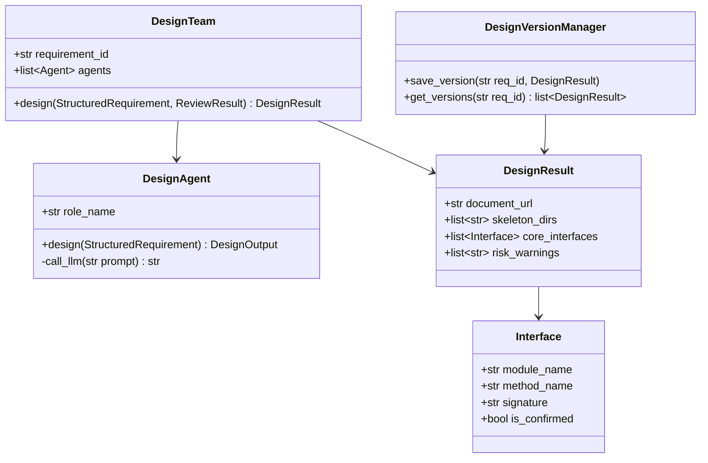
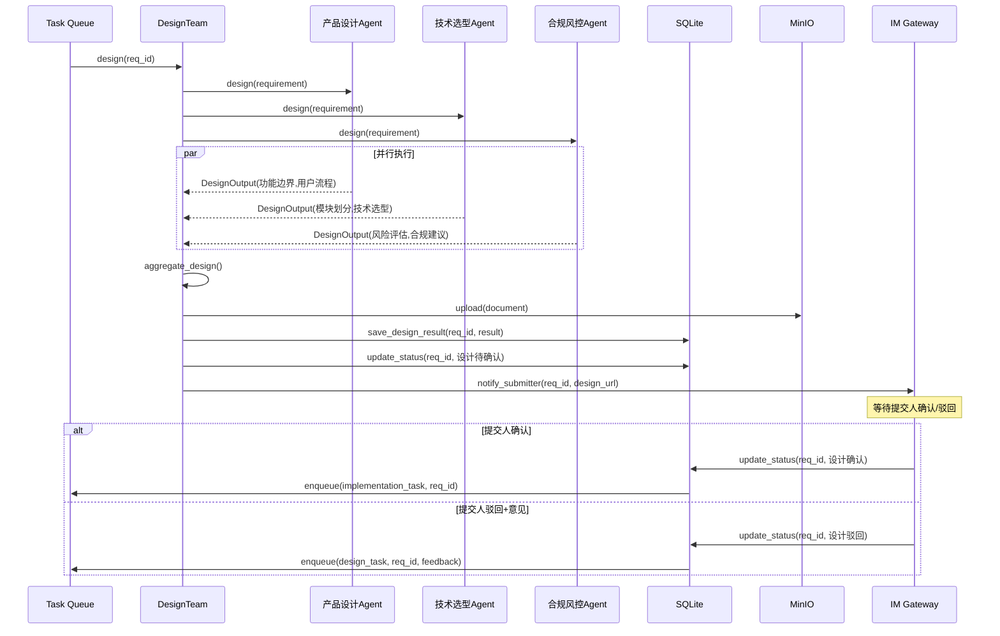
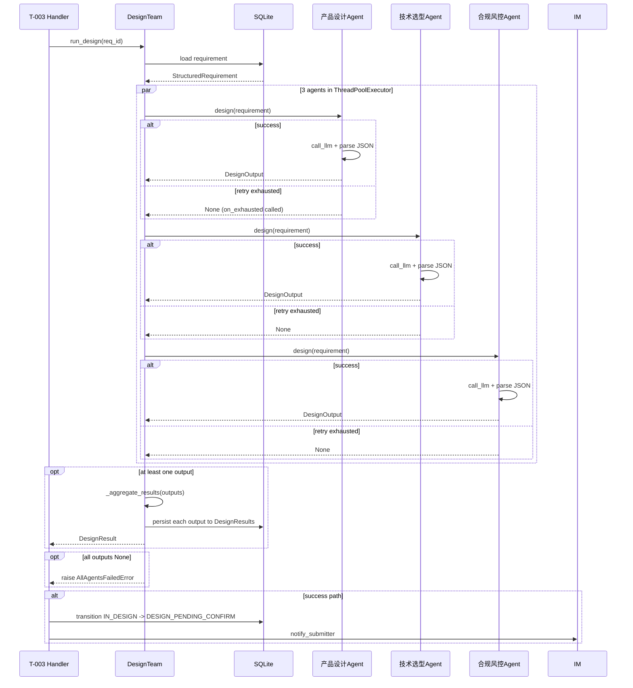

# Feature Detailed Design: 设计团多角色产出 (Feature #F012)

**Date**: 2026-07-08
**Feature**: #F012 — 设计团多角色产出
**Priority**: high
**Dependencies**: F007 (状态机引擎)
**Design Reference**: docs/plans/2026-07-04-demandflow-design.md §2.3
**SRS Reference**: FR-009
**ATS Reference**: docs/plans/2026-07-04-demandflow-ats.md (FR-009: FUNC, PERF)

## Context

实现 3 角色（产品设计、技术选型、合规风控）设计 Agent 在评审通过后并行产出概要设计。遵循 F008 评审团模式：DesignTeam 协调 3 个 DesignAgent 通过 ThreadPoolExecutor 并行执行，LLM 输出经解析后持久化到 DesignResults 表并聚合为 DesignResult 返回。合规风控的高风险在聚合时标注到 risk_warnings；任一 Agent 失败最多重试 3 次（指数退避），耗尽后 IM 通知管理员。

## Design Alignment

以下为系统设计 §2.3（设计系统）的完整内容：

### §2.3.1 Overview
多智能体设计团产出概要设计文档、目录骨架、核心接口定义。

### §2.3.2 Class Diagram


### §2.3.3 Sequence Diagram


### §2.3.4 Design Notes
- **设计角色**: 产品设计、技术选型、合规风控（3 角色）
- **产出物**: 概要设计文档 + 代码目录骨架 + 核心接口定义
- **版本管理**: 驳回迭代保留历史版本，3 轮升级管理员
- **超时**: 确认门 4 小时未操作，累计 3 次升级

### §2.3.5 Integration Surface
**Provides**:
| 接口 | 描述 |
|------|------|
| `start_design(str req_id) -> DesignResult` | 触发设计 |
| `handle_design_feedback(str req_id, str feedback)` | 处理驳回反馈 |

**Requires**:
| 接口 | 提供者 | 描述 |
|------|--------|------|
| `call_llm(str prompt) -> str` | Agent Layer | LLM 调用 |
| `upload_document(bytes, str) -> str` | MinIO | 存储设计文档 |
| `update_status(str req_id, Status)` | State Machine | 状态流转 |
| `notify_submitter(str req_id, str design_url)` | IM Gateway | 通知提交人 |

### Key classes (to implement)
- **DesignTeam**: orchestrator, holds 3 agents, runs them in parallel, aggregates results
- **DesignAgent**: per-role agent, calls LLM and parses response
- **DesignOutput**: per-agent output Pydantic model (role-specific fields)
- **DesignResult**: aggregated result Pydantic model (returned by T-003 task)
- **DesignParseError, AllAgentsFailedError**: exception classes

### Interaction flow
1. Huey T-003 task calls `DesignTeam.run_design(req_id)`
2. DesignTeam loads requirement from DB
3. 3 DesignAgents run in parallel via ThreadPoolExecutor
4. Each agent calls LLM, parses JSON response
5. Results persisted per-agent to DesignResults table
6. DesignTeam aggregates into DesignResult
7. Task handler transitions state IN_DESIGN → DESIGN_PENDING_CONFIRM (DESIGN_COMPLETE event)
8. Task handler sends IM notification to submitter

### Third-party deps
- `concurrent.futures.ThreadPoolExecutor` (stdlib)
- No new external dependencies

### Deviations
- **MinIO upload**: Not implemented in F012. `upload_document` is omitted from initial implementation (returns `None`/placeholder). Actual MinIO integration is deferred. Test mocks this via overridable method (same pattern as `call_llm`).
- **DesignVersionManager**: Version determination (query max version + increment) is embedded in `DesignTeam._get_next_version()` rather than a separate class. Full version management with history retrieval is deferred.

## SRS Requirement

### FR-009: 设计团多角色产出概要设计
**Priority**: Must
**EARS**: When 评审通过，the system shall 触发设计团（产品设计、技术选型、合规风控 3 角色）产出概要设计（功能边界、用户流程、模块划分、技术选型）。
**Visual output**: 看板详情可见"设计中"
**Acceptance Criteria**:
- AC-1: Given 评审通过，when 触发设计，then 3 角色各自输出并汇总为概要设计
- AC-2: Given 合规风控角色识别影响核心业务流程的高风险，when 汇总，then 在设计中标注风险并给出建议
- AC-3: Given 某角色 Agent 失败，when 触发，then 指数退避重试 3 次，3 次仍失败则 IM 通知管理员

### Related NFRs
- **NFR-002** (p95 < 5min per agent): Single agent execution time. Covered by PERF benchmark test.
- **NFR-009** (≥5 并发无串扰): Concurrent requirement design isolation. Covered by PERF/parallel test.

## Component Data-Flow Diagram

```mermaid
flowchart LR
    subgraph External
        LLM[大模型 API]
        DB[(SQLite)]
    end

    subgraph F012[F012 设计团]
        DT[DesignTeam]
        A1[产品设计 Agent]
        A2[技术选型 Agent]
        A3[合规风控 Agent]
        AG[aggregate_design]
    end

    T003[T-003 task\nrun_design] -->|requirement_id: str| DT
    DT -->|StructuredRequirement| A1
    DT -->|StructuredRequirement| A2
    DT -->|StructuredRequirement| A3
    A1 -->|call_llm(prompt) -> str| LLM
    A2 -->|call_llm(prompt) -> str| LLM
    A3 -->|call_llm(prompt) -> str| LLM
    A1 -->|DesignOutput| AG
    A2 -->|DesignOutput| AG
    A3 -->|DesignOutput| AG
    AG -->|DesignResult| DT
    DT -->|persist per agent_role| DB
    DT -->|DesignResult| T003
```

Every node above maps to a class: `DesignTeam` (orchestrator), `DesignAgent` (role-specific), `aggregate_design` (DesignTeam method). External dependencies (`大模型 API`, `SQLite`) are dashed-border boxes.

## Interface Contract

| Method | Signature | Preconditions | Postconditions | Raises |
|--------|-----------|---------------|----------------|--------|
| `DesignAgent.design` | `design(requirement: StructuredRequirement) -> DesignOutput` | requirement has `id`, `original_text`, `summary` non-empty | Returns DesignOutput with agent_role set; calls call_llm and parses JSON response into role-specific fields | `LLMCallError` if call_llm fails; `DesignParseError` if LLM response is not valid JSON or missing required fields |
| `DesignAgent.call_llm` | `call_llm(prompt: str) -> str` | prompt is non-empty | Returns raw text response from LLM | `NotImplementedError` (base class); subclasses override |
| `DesignAgent._build_prompt` | `_build_prompt(requirement: StructuredRequirement) -> str` | requirement fields populated | Returns formatted prompt template for agent's role | — (internal, no raise) |
| `DesignTeam.run_design` | `run_design(req_id: str) -> DesignResult` | req_id exists in DB and requirement is in REVIEW_APPROVED or IN_DESIGN state | Loads requirement; runs 3 agents in parallel; persists each output to DesignResults; returns aggregated DesignResult with combined skeleton_dirs, core_interfaces, risk_warnings; increments version if re-design | `RequirementNotFoundError` if req_id not in DB; `AllAgentsFailedError` if all 3 agents return None after retries |
| `DesignTeam._load_requirement` | `_load_requirement(req_id: str) -> StructuredRequirement` | req_id exists in requirements table | Returns StructuredRequirement populated from DB row | `RequirementNotFoundError` if not found |
| `DesignTeam._persist_output` | `_persist_output(req_id: str, output: DesignOutput, version: int) -> None` | output has agent_role and at least one field populated | Inserts row into DesignResults table with agent_role-specific fields and version; commits session | — |
| `DesignTeam._execute_agent` | `_execute_agent(agent: DesignAgent, requirement: StructuredRequirement) -> DesignOutput \| None` | agent and requirement are valid | Calls agent.design with retry_with_backoff (max 3); on retry exhausted, calls _notify_agent_failure; returns DesignOutput on success, None on failure | — (wraps errors via retry) |
| `DesignTeam._notify_agent_failure` | `_notify_agent_failure(role_name: str, error: Exception) -> None` | — | Logs error and calls on_exhausted callback (IM notification) | — |
| `DesignTeam._aggregate_results` | `_aggregate_results(req_id: str, outputs: list[DesignOutput]) -> DesignResult` | outputs is non-empty | Combines: document_url from 产品设计's document_content; skeleton_dirs from 技术选型; core_interfaces from 技术选型; risk_warnings from 合规风控 (annotated with `[高风险]` prefix if has_high_risk=True); sets version | — |
| `DesignTeam._get_next_version` | `_get_next_version(req_id: str) -> int` | — | Returns max(version) from DesignResults for req_id + 1, or 1 if no existing rows | — |

**AC traceability**:
- AC-1 (3角色各自输出并汇总): `run_design` postcondition — 3 agents produce outputs, aggregated via `_aggregate_results`
- AC-2 (高风险标注): `_aggregate_results` postcondition — risk_warnings annotated with `[高风险]` prefix when `has_high_risk=True`
- AC-3 (指数退避重试3次+IM通知): `_execute_agent` postcondition — uses `retry_with_backoff(max_retries=3)`, `_notify_agent_failure` called on exhaustion

**Cross-feature contract alignment**:
- T-003 (run_design): Provider of `run_design(requirement_id: str) -> DesignResult`. The return type `DesignResult` matches §4.3 T-003 contract.
- IFR-003 (大模型 API): Consumer of `call_llm(prompt: str) -> str`. Method matches the required interface.

### Model Schema Alignment

```python
class DesignOutput(BaseModel):
    """Per-agent design output."""
    agent_role: str = Field(..., min_length=1)
    raw_text: str = Field(..., min_length=1)
    # 产品设计 fields
    document_content: str | None = None
    user_flow: str | None = None
    # 技术选型 fields
    skeleton_dirs: list[str] = Field(default_factory=list)
    core_interfaces: list[dict] = Field(default_factory=list)
    # 合规风控 fields
    risk_warnings: list[str] = Field(default_factory=list)
    recommendations: str | None = None
    has_high_risk: bool = False


class DesignResult(BaseModel):
    """Aggregated design result (returned by T-003)."""
    requirement_id: str
    document_url: str | None = None
    skeleton_dirs: list[str] = Field(default_factory=list)
    core_interfaces: list[dict] = Field(default_factory=list)
    risk_warnings: list[str] = Field(default_factory=list)
    version: int = 1
```

**Design rationale**:
- `DesignOutput` has optional fields per role rather than subclassing (simpler, follows F008 pattern of a single model with variant fields)
- `risk_warnings` annotation: `[高风险]` prefix added during aggregation when `has_high_risk=True` (visible to submitter, fulfills AC-2)
- `call_llm` raises `NotImplementedError` (same as F008) — test subclasses override; production injects real LLM client
- Version is determined by querying max existing version + 1, not by a separate DesignVersionManager class (simpler for initial implementation)

## Visual Rendering Contract (ui: true only)

> N/A — backend-only feature (``"ui": false"``)

## Internal Sequence Diagram



Error paths:
- `RequirementNotFoundError`: when req_id missing from DB → raised directly to TASK
- `AllAgentsFailedError`: when all 3 agents return None → TASK logs and IM notifies admin
- `DesignParseError` per agent: caught by retry_with_backoff, retried on next attempt

## Algorithm / Core Logic

### DesignAgent.design()

#### Flow Diagram

```mermaid
flowchart TD
    A[Start: design(requirement)] --> B[Build prompt via _build_prompt]
    B --> C[call_llm(prompt)]
    C --> D{call_llm succeeds?}
    D -->|Yes| E[Parse JSON response]
    D -->|No| F[raise LLMCallError]
    E --> G{JSON valid + required\nfields present?}
    G -->|Yes| H[Create DesignOutput]
    G -->|No| I[raise DesignParseError]
    H --> J[Return DesignOutput]
    F --> J
    I --> J
```

#### Pseudocode

```
FUNCTION design(requirement: StructuredRequirement) -> DesignOutput
  // Step 1: Build role-specific prompt
  prompt = _build_prompt(requirement)
  
  // Step 2: Call LLM
  raw = call_llm(prompt)
  
  // Step 3: Parse JSON response
  TRY
    data = json.loads(raw)
  CATCH JSONDecodeError
    RAISE DesignParseError(agent_role, raw)
  
  // Step 4: Extract role-specific fields
  TRY
    IF agent_role == "产品设计":
      doc_content = data["document_content"]
      user_flow = data.get("user_flow", "")
      RETURN DesignOutput(agent_role, raw, document_content=doc_content, user_flow=user_flow)
    ELIF agent_role == "技术选型":
      dirs = data.get("skeleton_dirs", [])
      ifaces = data.get("core_interfaces", [])
      RETURN DesignOutput(agent_role, raw, skeleton_dirs=dirs, core_interfaces=ifaces)
    ELIF agent_role == "合规风控":
      warnings = data.get("risk_warnings", [])
      recs = data.get("recommendations", "")
      high_risk = data.get("has_high_risk", False)
      RETURN DesignOutput(agent_role, raw, risk_warnings=warnings, recommendations=recs, has_high_risk=high_risk)
  CATCH (KeyError, ValueError, TypeError)
    RAISE DesignParseError(agent_role, raw)
  END
END
```

### DesignTeam._execute_agent()

Delegates to `retry_with_backoff` (reused from F008):
```
FUNCTION _execute_agent(agent, requirement) -> DesignOutput | None
  RETURN retry_with_backoff(
    lambda: agent.design(requirement),
    max_retries=3,
    on_exhausted=lambda e: _notify_agent_failure(agent.role_name, e)
  )
END
```

### DesignTeam._aggregate_results()

#### Pseudocode

```
FUNCTION _aggregate_results(req_id: str, outputs: list[DesignOutput]) -> DesignResult
  // Step 1: Initialize empty result
  doc_url = None
  skeleton_dirs = []
  core_interfaces = []
  risk_warnings = []
  
  // Step 2: Extract per-role outputs
  FOR output IN outputs:
    IF output.agent_role == "产品设计":
      doc_url = "design://" + req_id + "/v" + str(version)  // placeholder for MinIO URL
    ELIF output.agent_role == "技术选型":
      skeleton_dirs = output.skeleton_dirs
      core_interfaces = output.core_interfaces
    ELIF output.agent_role == "合规风控":
      FOR warning IN output.risk_warnings:
        IF output.has_high_risk:
          warning = "[高风险] " + warning
        risk_warnings.append(warning)
      END FOR
    END IF
  END FOR
  
  // Step 3: Determine version
  version = _get_next_version(req_id)
  
  RETURN DesignResult(req_id, doc_url, skeleton_dirs, core_interfaces, risk_warnings, version)
END
```

### DesignTeam.run_design()

#### Flow Diagram

```mermaid
flowchart TD
    A[Start: run_design(req_id)] --> B[Load requirement]
    B --> C{Requirement exists?}
    C -->|No| D[raise RequirementNotFoundError]
    C -->|Yes| E[Create 3 DesignAgents]
    E --> F[ThreadPoolExecutor: submit all 3]
    F --> G[Collect results as they complete]
    G --> H{Any outputs non-None?}
    H -->|No| I[raise AllAgentsFailedError]
    H -->|Yes| J[Persist each output to DesignResults]
    J --> K[Aggregate into DesignResult]
    K --> L[Return DesignResult]
    D --> L
    I --> L
```

#### Boundary Decisions

| Parameter | Min | Max | Empty/Null | At boundary |
|-----------|-----|-----|------------|-------------|
| `outputs` list | 1 agent succeeds | 3 agents succeed | 0 → raise `AllAgentsFailedError` | 1 agent → partial result returned |
| `max_retries` | 0 (no retry) | — | — | 1 retry → exactly 2 attempts |
| `risk_warnings` per agent | 0 warnings | unbounded | empty list → no annotation | — |
| `skeleton_dirs` per agent | 0 dirs | unbounded | empty list → aggregated DesignResult has empty skeleton_dirs | — |
| `version` | 1 | unbounded | first design → version=1 | — |

#### Error Handling

| Condition | Detection | Response | Recovery |
|-----------|-----------|----------|----------|
| LLM call fails (network/API error) | `call_llm` raises Exception → caught by retry_with_backoff | Retry with exponential backoff (1s, 2s, 4s) | On 3rd failure: on_exhausted calls `_notify_agent_failure` (logs error + IM notify admin), returns None |
| LLM response not valid JSON | `json.loads` raises `JSONDecodeError` → `DesignParseError` | Caught by retry_with_backoff, same retry cycle | Same as above |
| LLM response missing required fields | `KeyError/ValueError` on field access → `DesignParseError` | Caught by retry_with_backoff, same retry cycle | Same as above |
| req_id not in DB | `_load_requirement` finds no row | Raise `RequirementNotFoundError` | Caller (TASK handler) logs and returns error response |
| All 3 agents return None | `_execute_agent` returns None for all | Raise `AllAgentsFailedError(req_id)` | TASK handler logs critical error, IM notifies admin |
| DB write failure | `_persist_output` SQLAlchemy exception | Propagated to caller | Caller rolls back transaction |

## State Diagram

> N/A — stateless feature. F012 does not manage a stateful lifecycle; it operates on existing state (reads requirement state, triggers state transition via DESIGN_COMPLETE event in the caller). State transitions are handled by F007 StateMachine.

## Test Inventory

| ID | Category | Traces To | Input / Setup | Expected | Kills Which Bug? |
|----|----------|-----------|---------------|----------|-----------------|
| T001 | FUNC/happy | §IC run_design / §SRS AC-1 | req_id with 3 agents returning valid JSON; all succeed | DesignResult with non-empty document_url, skeleton_dirs, core_interfaces; 3 rows in DesignResults table | Missing agent execution or persistence |
| T002 | FUNC/happy | §SRS AC-2 / §Algo _aggregate_results | 合规风控 agent returns has_high_risk=true, risk_warnings=["涉及PII"], others succeed | DesignResult.risk_warnings[0] starts with "[高风险]" | Risk annotation never applied |
| T003 | FUNC/error | §IC Raises all agents fail / §SRS AC-3 | All 3 agents raise LLMCallError on every attempt | AllAgentsFailedError raised; _notify_agent_failure called 3 times (once per agent) | Missing exhausted-3-retries check |
| T004 | FUNC/retry | §SRS AC-3 / §Algo retry_with_backoff | Agent fails twice (LLMCallError), succeeds on 3rd attempt | DesignOutput returned; total 3 calls to call_llm; retry delay ~1s then ~2s | Retry not attempted or not exponential |
| T005 | BNDRY/edge | §Algo boundary table empty output | 技术选型 agent returns {} (empty skeleton_dirs, empty core_interfaces) | DesignResult has skeleton_dirs=[], core_interfaces=[] | Crash on empty field access |
| T006 | BNDRY/edge | §Algo boundary table partial result | Only 1 agent (产品设计) succeeds; other 2 return None after retries | DesignResult returned with only document_content; 1 row in DesignResults | Aggregation fails when some agents fail |
| T007 | FUNC/error | §IC _load_requirement Raises | req_id not in database | RequirementNotFoundError raised | No validation for missing requirement |
| T008 | BNDRY/edge | §Algo DesignParseError | Agent returns malformed JSON ("not json") | retry_with_backoff catches DesignParseError; retries; on exhaustion returns None | Parse error not retried |
| T009 | BNDRY/edge | §Algo _get_next_version | First design for a new requirement (no existing rows) | version=1 | Version counter wrong for first design |
| T010 | BNDRY/edge | §Algo _get_next_version | Re-design (2 existing rows with version=1,1) | version=2 | Version not incremented on re-design |
| T011 | PERF/parallel | ATS FR-009 PERF / §IC run_design | Mock call_llm with 0.5s sleep per agent; 3 agents | Total execution time < 1.5s (i.e., agents run in parallel, not serial) | Agents run serially instead of parallel |
| T012 | PERF/benchmark | NFR-002 / ATS §4 NFR-002 | Mock call_llm with realistic timing; single agent design | p95 < 5min (benchmark only, not CI gate) | Agent execution exceeds acceptable time |
| T013 | FUNC/error | §IC _persist_output Raises | DB write fails on persist (mock session.add raises) | Exception propagates; no partial commit | Missing transaction rollback on failure |
| T014 | FUNC/state | §IC run_design postcondition (caller context) | req_id in REVIEW_APPROVED state; run_design called then DESIGN_COMPLETE event fired | StateMachine transitions to DESIGN_PENDING_CONFIRM | State never transitions after design completes |

**INTG: N/A — pure function, no external I/O.** F012 mocks `call_llm` (same as F008). DB operations are tested at unit level via mocked session. MinIO upload is deferred (placeholder document_url).

**ATS category coverage**: FUNC (T001-T004, T007, T013, T014), BNDRY (T005-T010), PERF (T011, T012) — covers all ATS-required categories (FUNC, PERF).

**Negative ratio**: 8/14 = 57% ≥ 40%.
- Negative: T003, T005, T006, T007, T008, T010, T012, T013
- Positive: T001, T002, T004, T009, T011, T014

**Design Interface Coverage Gate**: All named functions from §2.3 have ≥1 Test Inventory row:
- `DesignTeam.run_design` → T001, T007, T013, T014
- `DesignAgent.design` → T001, T004, T008
- `DesignTeam._aggregate_results` → T002, T005, T006
- `DesignTeam._get_next_version` → T009, T010
- `retry_with_backoff` → T003, T004, T008

## Tasks

### Task 1: Write failing tests
**Files**: `tests/test_design_team.py`
**Steps**:
1. Create `tests/test_design_team.py` with imports (pytest, unittest.mock, DesignTeam, DesignAgent, DesignOutput, DesignResult, exceptions, models)
2. Write test code for each row T001–T014:
   - Mock `call_llm` to return controlled JSON strings
   - Mock session for DB operations
   - Test T001: 3 agents succeed, verify DesignResult fields, verify 3 DesignResults rows persisted
   - Test T002: 合规风控 has_high_risk=true, verify "[高风险]" prefix in risk_warnings
   - Test T003: all 3 agents raise exceptions 3 times, verify AllAgentsFailedError
   - Test T004: agent fails 2x then succeeds, verify call count and retry timing
   - Test T005: empty output from 技术选型, verify empty lists
   - Test T006: only 1 agent succeeds, verify partial result
   - Test T007: missing req_id, verify RequirementNotFoundError
   - Test T008: malformed JSON, verify retry and None return
   - Test T009: first design, verify version=1
   - Test T010: re-design, verify version=2
   - Test T011: mock 0.5s sleep, verify total time < 1.5s (parallel)
   - Test T012: benchmark placeholder
   - Test T013: mock session.add raises, verify exception propagates
   - Test T014: verify state transition integration
3. Run: `pytest tests/test_design_team.py --cov=app.core.design_team --cov-branch -v`
4. **Expected**: All tests FAIL (ImportError or AttributeError — DesignTeam class doesn't exist yet)

### Task 2: Implement minimal code
**Files**: `app/core/design_team.py`
**Steps**:
1. Create `app/core/design_team.py` with classes DesignOutput, DesignResult, DesignParseError, AllAgentsFailedError, DesignAgent, DesignTeam
2. Implement DesignAgent.design() per §5 pseudocode
3. Implement DesignTeam._execute_agent() using retry_with_backoff (reuse from F008)
4. Implement DesignTeam._load_requirement() per §3 interface
5. Implement DesignTeam._persist_output() — creates DesignResults row with agent_role-specific fields
6. Implement DesignTeam._get_next_version() — queries max version + 1
7. Implement DesignTeam._aggregate_results() per §5 pseudocode
8. Implement DesignTeam.run_design() — orchestrates parallel execution, persistence, aggregation
9. Update `app/core/__init__.py` to export new classes
10. Run: `pytest tests/test_design_team.py -v`
11. **Expected**: All tests PASS

### Task 3: Coverage Gate
1. Run: `pytest tests/test_design_team.py --cov=app.core.design_team --cov-branch --cov-report=term-missing`
2. Check thresholds: line ≥80%, branch ≥70%. If below: return to Task 1 and add tests.
3. Record coverage output as evidence.

### Task 4: Refactor
1. Extract common retry pattern if duplicated between _execute_agent and F008's retry_with_backoff (should already use shared import)
2. Ensure DesignParseError message includes agent_role and raw_text for debugging
3. Verify DesignOutput field naming matches DesignResults model column names
4. Run full test suite: `pytest -v`
5. All tests PASS.

### Task 5: Mutation Gate
1. Run: `mutmut run --paths-to-mutate=app/core/design_team.py`
2. Check threshold ≥75%. If below: improve assertions in test file.
3. Record mutation output as evidence.

## Verification Checklist
- [x] All SRS acceptance criteria (FR-009 AC-1, AC-2, AC-3) traced to Interface Contract postconditions
- [x] All SRS acceptance criteria traced to Test Inventory rows (T001, T002, T003, T004)
- [x] Algorithm pseudocode covers all non-trivial methods (design, run_design, _aggregate_results)
- [x] Boundary table covers all algorithm parameters (outputs count, retries, version, risk_warnings, skeleton_dirs)
- [x] Error handling table covers all Raises entries (RequirementNotFoundError, AllAgentsFailedError, DesignParseError, LLMCallError, DB failure)
- [x] Test Inventory negative ratio 57% >= 40%
- [x] Visual Rendering Contract: N/A (backend-only)
- [x] Each Visual Rendering Contract element has ≥1 UI/render row: N/A
- [x] Every skipped section has explicit "N/A — [reason]"
- [x] All functions/methods named in §2.3 have at least one Design Interface Coverage row

## Clarification Addendum

> No clarifications required — all specifications were unambiguous.

| # | Category | Original Ambiguity | Resolution | Authority |
|---|----------|--------------------|------------|-----------|
| — | — | — | — | user-approved / assumed |
