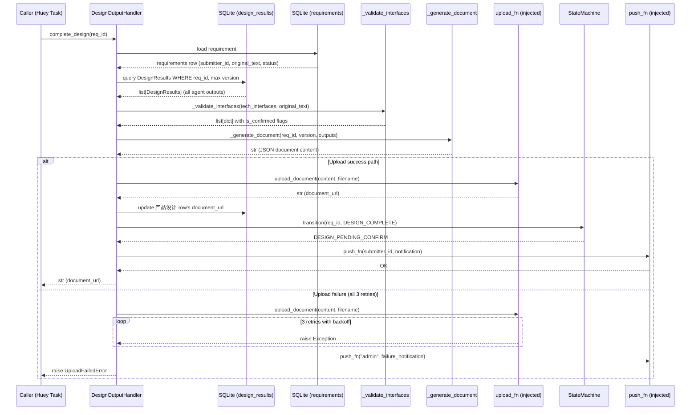
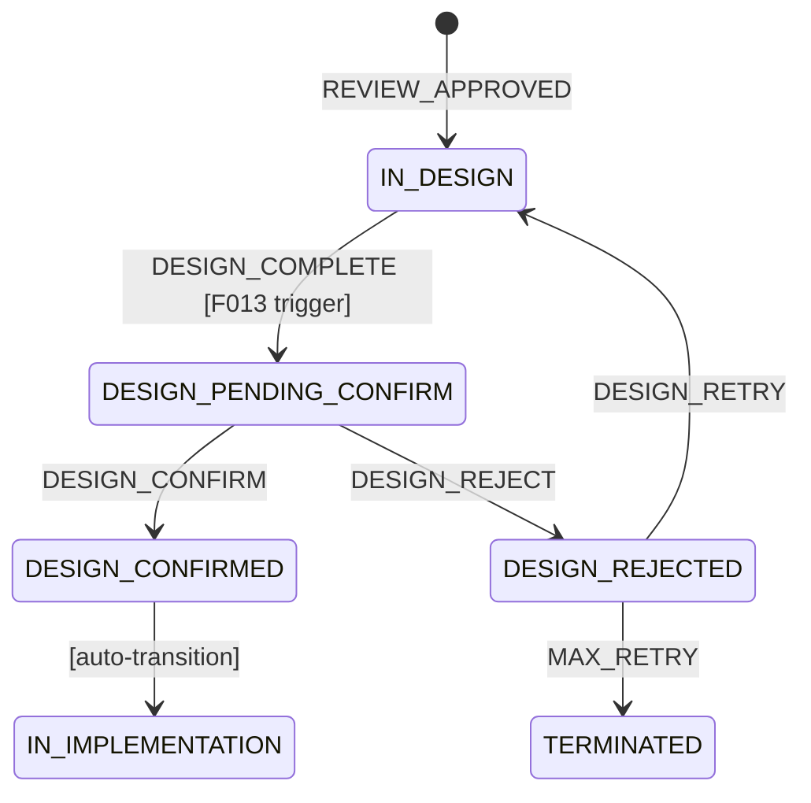

# Feature Detailed Design: 设计产出物生成 (Feature #13)

**Date**: 2026-07-08
**Feature**: #13 — 设计产出物生成
**Priority**: high
**Dependencies**: F012 (设计团多角色产出)
**Design Reference**: docs/plans/2026-07-04-demandflow-design.md § 2.3
**SRS Reference**: FR-010

## Context

F012 provides `DesignTeam.run_design()` which executes 3 role agents in parallel and produces aggregated `DesignResult`. F013 completes the post-agent workflow: validates interfaces（待确认项检测）, generates full document from agent outputs, uploads to storage, transitions state to DESIGN_PENDING_CONFIRM, and notifies the submitter via IM.

## Design Alignment

### Design §2.3.2 Class Diagram (Design System)

Key classes from design:
- `DesignTeam` (F012) — executes 3 parallel agents
- `DesignResult` (F012) — aggregated output with `document_url`, `skeleton_dirs`, `core_interfaces`, `risk_warnings`
- `Interface` — module_name, method_name, signature, is_confirmed (F013 enhances with `is_confirmed` validation)

### Design §2.3.3 Sequence Diagram

The sequence diagram shows post-agent steps that F013 implements:
```
DT->>MINIO: upload(document)
DT->>DB: save_design_result(req_id, result)
DT->>DB: update_status(req_id, 设计待确认)
DT->>IM: notify_submitter(req_id, design_url)
```

### Design §2.3.5 Integration Surface

F013 provides the last 3 rows of the **Requires** table:

| 接口 | 提供者 | F013 Implementation |
|------|--------|---------------------|
| `upload_document(content, filename) -> str` | MinIO | `DesignOutputHandler.upload_document()` — mockable |
| `update_status(req_id, Status)` | State Machine | `StateMachine.transition(req_id, Event.DESIGN_COMPLETE)` |
| `notify_submitter(req_id, design_url)` | IM Gateway | `self._push_fn(submitter_id, message)` injectable |

### Task Queue Alignment (Design §4.3)

Task T-003 (`run_design`) returns `DesignResult`. F013's `complete_design()` is the second half of the design workflow, called after T-003 completes.

### Deviations

- Design §2.3.5 specifies `upload_document(bytes, str)` but F013 uses `upload_document(content: str, filename: str)`. Since the document is generated as a JSON string, the content parameter is `str`. The MinIO layer handles `str.encode()` internally. This is a non-breaking detail refinement.

## SRS Requirement

### FR-010: 设计产出物生成

**EARS**: When 设计团完成，the system shall 输出概要设计文档、代码目录骨架与核心接口定义（目录骨架中顶层模块的全部对外接口）。

**Acceptance Criteria**:
- **AC-1**: Given 设计完成，when 输出，then 生成结构化概要设计文档 + 目录骨架 + 顶层模块全部对外接口定义
- **AC-2**: Given 顶层模块某接口无法从需求完全推导，when 输出，then 标注该接口为"待确认项"并保留推导假设
- **AC-3**: Given 产出物存储失败，when 输出，then 指数退避重试 3 次，3 次仍失败则 IM 通知管理员

## Component Data-Flow Diagram

```mermaid
flowchart TD
    subgraph External
        DB[("SQLite\ndesign_results")]
        REQUIREMENT[("SQLite\nrequirements")]
        SM[("StateMachine\nF007")]
    end

    subgraph DOH[DesignOutputHandler]
        CD[complete_design]
        UD[upload_document]
        VI[_validate_interfaces]
        GD[_generate_document]
    end

    subgraph Dependencies
        STATE_MACHINE[StateMachine\nsession]
        PUSH_FN[push_fn\nCallable]
        UPLOAD_FN[upload_fn\nCallable]
    end

    CD -->|req_id: str| DB
    CD -->|loads DesignResults| DB
    CD -->|loads requirement| REQUIREMENT
    CD -->|list[dict] interfaces| VI
    VI -->|list[dict] with is_confirmed| CD
    CD -->|DocumentContent| GD
    GD -->|str content| UD
    UD -->|content+filename| UPLOAD_FN
    UPLOAD_FN -->|str URL| UD
    UD -->|str URL| CD
    CD -->|Event.DESIGN_COMPLETE| STATE_MACHINE
    CD -->|submitter_id, message| PUSH_FN
    STATE_MACHINE -->|transition| SM
    PUSH_FN -->|IM notify| IM[IM Gateway]
```

**External dependencies**: SQLite (design_results + requirements table), StateMachine (F007), injectable push_fn/upload_fn.

## Interface Contract

### DesignOutputHandler

| Method | Signature | Preconditions | Postconditions | Raises |
|--------|-----------|---------------|----------------|--------|
| `complete_design` | `complete_design(req_id: str) -> str` | Requirement exists at `req_id` with `current_status == IN_DESIGN`; at least one DesignResults row exists for `req_id` | Returns `document_url`; state transitions `IN_DESIGN → DESIGN_PENDING_CONFIRM`; document persisted to storage; submitter receives IM notification; interfaces validated with `is_confirmed` flags | `RequirementNotFoundError` — no requirement at `req_id`; `InvalidTransitionError` — current status not IN_DESIGN; `UploadFailedError` — upload fails after 3 retries |
| `upload_document` | `upload_document(content: str, filename: str) -> str` | `content` is non-empty; `filename` is a non-empty path | Returns document URL string (format: `{bucket}/{path}`); content persisted via upload_fn | `UploadFailedError` — all 3 retries exhausted |
| `_validate_interfaces` | `_validate_interfaces(interfaces: list[dict], requirement_text: str) -> list[dict]` | `interfaces` is a list of dicts each containing at least `method` and `signature` keys | Every dict gets `is_confirmed: bool` added; dicts where `method` substring not found in `requirement_text` OR `signature` is empty → `is_confirmed=False`; original dict order preserved | None |
| `_generate_document` | `_generate_document(req_id: str, version: int, outputs: list[DesignResults]) -> str` | `outputs` is non-empty; outputs cover all 3 agent roles | Returns JSON string containing: requirement_id, version, design_content (from 产品设计), user_flow, skeleton_dirs, core_interfaces (validated), risk_warnings, recommendations, has_high_risk; all agent_outputs preserved in `agent_outputs` sub-object | None |

### UploadFailedError

```python
class UploadFailedError(Exception):
    def __init__(self, filename: str, message: str):
        self.filename = filename
        self.message = message
        super().__init__(f"设计文档上传失败: {filename} — {message}")
```

### Design rationale

- **`upload_fn` injection**: Same pattern as F010's `push_fn` and F008/F012's `call_llm`. Enables TDD without MinIO.
- **JSON document format**: Structured JSON document is the simplest format to generate, store, and validate. Can be rendered as markdown in the UI layer.
- **`_validate_interfaces` heuristic**: Simple substring match of method name against requirement text. If the method name is explicitly mentioned in the requirement, it's derivable; otherwise it's an inference. This is a pragmatic heuristic for MVP — can be enhanced with LLM-based semantic matching later.
- **`complete_design` atomicity**: If upload fails after all retries, admin is notified but state is NOT transitioned. The requirement remains IN_DESIGN so the system can retry or escalate.

## Visual Rendering Contract (ui: true only)

> N/A — backend-only feature, no visual output

## Internal Sequence Diagram



## Algorithm / Core Logic

### `upload_document`

#### Flow Diagram

```mermaid
flowchart TD
    A[Start: upload_document(content, filename)] --> B{content empty?}
    B -->|Yes| C[Raise UploadFailedError]
    B -->|No| D{attempt < 3?}
    D -->|Yes| E[Call upload_fn]
    E --> F{Success?}
    F -->|Yes| G[Return URL]
    F -->|No| H[Sleep 2^attempt]
    H --> I[attempt += 1]
    I --> D
    D -->|No, exhausted| J[Raise UploadFailedError\nwith last error]
```

#### Pseudocode

```
FUNCTION upload_document(content: str, filename: str) -> str
    IF not content THEN RAISE UploadFailedError(filename, "empty content")
    last_error := None
    FOR attempt := 0 TO MAX_RETRIES - 1
        TRY
            url := self._upload_fn(content, filename)
            RETURN url
        EXCEPT e
            last_error := e
            IF attempt < MAX_RETRIES - 1 THEN
                sleep(2 ** attempt)
    RAISE UploadFailedError(filename, str(last_error))
END
```

#### Boundary Decisions

| Parameter | Min | Max | Empty/Null | At boundary |
|-----------|-----|-----|------------|-------------|
| `content` | 1 char (e.g., "{}") | unbounded | empty → UploadFailedError | whitespace-only → treated as non-empty (upload proceeds) |
| `filename` | 1 path segment | unbounded | empty/NULL → UploadFailedError | path with subdirectories (e.g., `design/REQ-001/v1.json`) → accepted |

#### Error Handling

| Condition | Detection | Response | Recovery |
|-----------|-----------|----------|----------|
| upload_fn fails transiently | Exception caught in retry loop | sleep(2^attempt), retry up to 3x | caller catches UploadFailedError, may retry later |
| upload_fn fails permanently | All 3 retries exhausted | Raise UploadFailedError | `complete_design` calls push_fn("admin", ...) |
| empty content | `if not content` check | Raise UploadFailedError | caller validates input before calling |
| empty filename | `if not filename` check | Raise UploadFailedError | caller constructs valid path |

### `_validate_interfaces`

#### Flow Diagram

```mermaid
flowchart TD
    A[Start: _validate_interfaces(interfaces, req_text)] --> B[Create empty result list]
    B --> C{More interfaces?}
    C -->|Yes| D[Extract method, signature]
    D --> E{method in req_text?\nAND signature non-empty?}
    E -->|Yes| F[is_confirmed = True]
    E -->|No| G[is_confirmed = False]
    F --> H[Append enhanced dict]
    G --> H
    H --> C
    C -->|No| I[Return result list]
```

#### Pseudocode

```
FUNCTION _validate_interfaces(interfaces: list[dict], req_text: str) -> list[dict]
    result := []
    FOR each iface IN interfaces
        method := iface.get("method", "")
        signature := iface.get("signature", "")
        is_confirmed := (method IN req_text) AND (signature != "")
        enhanced := iface COPY
        enhanced["is_confirmed"] := is_confirmed
        result.APPEND(enhanced)
    RETURN result
END
```

#### Boundary Decisions

| Parameter | Min | Max | Empty/Null | At boundary |
|-----------|-----|-----|------------|-------------|
| `interfaces` | 0 elements | unbounded | empty → returns empty list | single element dict missing keys → method="" → is_confirmed=False |
| `req_text` | 0 chars | unbounded | empty → all interfaces is_confirmed=False | whitespace-only → treated as empty |

### `_generate_document`

#### Pseudocode

```
FUNCTION _generate_document(req_id: str, version: int, outputs: list[DesignResults]) -> str
    design_content := ""
    user_flow := ""
    skeleton_dirs := []
    core_interfaces_raw := []
    risk_warnings := []
    recommendations := ""
    has_high_risk := False

    FOR each output IN outputs
        CASE output.agent_role OF
            "产品设计":
                design_content := output.document_url  // stores raw text in F012
                user_flow := "参见设计文档"  // placeholder from F012
            "技术选型":
                skeleton_dirs := output.skeleton_dirs ?? []
                core_interfaces_raw := output.core_interfaces ?? []
            "合规风控":
                risk_warnings := output.risk_warnings ?? []
                recommendations := "参见设计文档"  // placeholder
                has_high_risk := any("[高风险]" IN w FOR w IN output.risk_warnings)
        END CASE

    core_interfaces_validated := self._validate_interfaces(core_interfaces_raw, design_content)

    doc := {
        "requirement_id": req_id,
        "version": version,
        "design_content": design_content,
        "user_flow": user_flow,
        "skeleton_dirs": skeleton_dirs,
        "core_interfaces": core_interfaces_validated,
        "risk_warnings": risk_warnings,
        "recommendations": recommendations,
        "has_high_risk": has_high_risk,
        "generated_at": datetime.now(timezone.utc).isoformat(),
    }

    RETURN json.dumps(doc, ensure_ascii=False, indent=2)
END
```

### `complete_design`

#### Pseudocode

```
FUNCTION complete_design(req_id: str) -> str
    // Step 1: Load requirement
    req := session.query(Requirements).filter_by(id=req_id).first()
    IF req IS None THEN
        RAISE RequirementNotFoundError(req_id)

    // Step 2: Load all design outputs (latest version)
    max_version := session.query(func.max(DesignResults.version))\
        .filter_by(requirement_id=req_id).scalar()
    IF max_version IS None THEN
        RAISE RequirementNotFoundError(f"No design outputs for {req_id}")

    outputs := session.query(DesignResults)\
        .filter_by(requirement_id=req_id, version=max_version).all()

    // Step 3: Generate and upload document
    doc_content := self._generate_document(req_id, max_version, outputs)
    filename := f"design/{req_id}/v{max_version}.json"
    document_url := self.upload_document(doc_content, filename)

    // Step 4: Update design result's document_url
    design_row := session.query(DesignResults).filter_by(
        requirement_id=req_id, version=max_version, agent_role="产品设计"
    ).first()
    IF design_row THEN
        design_row.document_url := document_url
        session.commit()

    // Step 5: State transition
    sm := StateMachine(session)
    sm.transition(req_id, Event.DESIGN_COMPLETE, trigger_user=None)

    // Step 6: IM notify submitter
    message := f"设计完成 [{req_id}] 查看详情: {document_url}"
    self._push_fn(req.submitter_id, message)

    RETURN document_url
EXCEPT UploadFailedError as e
    // Step 7: On upload failure, notify admin
    self._push_fn("admin", f"设计文档上传失败: {req_id} — {e.message}")
    RAISE
END
```

#### Error Handling

| Condition | Detection | Response | Recovery |
|-----------|-----------|----------|----------|
| Requirement not found | SQL query returns None | Raise RequirementNotFoundError | Caller validates req_id |
| No design outputs | max_version query returns None | Raise RequirementNotFoundError | Caller ensures F012 completes first |
| State not IN_DESIGN | StateMachine.transition raises InvalidTransitionError | Exception propagates | Caller checks current status |
| Upload fails 3x | upload_document raises UploadFailedError | Catch in complete_design, push to admin, re-raise | Admin notified; system can retry later |
| push_fn fails for submitter | Exception from notify | Exception propagates (state already changed) | State is already DESIGN_PENDING_CONFIRM — submitter can query status |
| No 产品设计 agent row | design_row is None | Skip document_url update | Other agents' data still available |

## State Diagram



F013 triggers the `IN_DESIGN → DESIGN_PENDING_CONFIRM` transition via `Event.DESIGN_COMPLETE`. All other transitions are handled by F007/F014.

## Test Inventory

| ID | Category | Traces To | Input / Setup | Expected | Kills Which Bug? |
|----|----------|-----------|---------------|----------|-----------------|
| T01 | FUNC/happy | FR-010 AC-1; §3 complete_design | req exists with status IN_DESIGN, 3 agent outputs exist for latest version, upload_fn returns "http://minio/doc.json" | Returns "http://minio/doc.json"; stateMachine.transition called with DESIGN_COMPLETE; push_fn called with submitter_id and message containing URL | Missing document generation flow |
| T02 | FUNC/happy | FR-010 AC-2; §3 _validate_interfaces | interfaces = [{"method": "analyze", "signature": "def analyze()"}, {"method": "report", "signature": ""}], req_text = "实现analyze功能" | First interface: is_confirmed=True; second: is_confirmed=False | Missing 待确认项 marking |
| T03 | FUNC/error | FR-010 AC-3; §5 upload_document error | upload_fn raises Exception on all 3 calls | UploadFailedError raised; push_fn called with "admin" and failure message; state NOT transitioned | Missing upload retry + admin notification |
| T04 | FUNC/error | §3 complete_design Raises | req_id for non-existent requirement | RequirementNotFoundError raised | Missing req_id validation |
| T05 | FUNC/error | §3 complete_design Raises | req exists but current_status = "REJECTED" (not IN_DESIGN) | InvalidTransitionError raised | Missing state validation |
| T06 | FUNC/error | §3 complete_design Raises | req exists with IN_DESIGN but no DesignResults rows | RequirementNotFoundError("No design outputs") | Missing empty-output check |
| T07 | FUNC/error | §5 upload_document Raises | upload_document called with empty content | UploadFailedError("empty content") raised | Missing content validation |
| T08 | BNDRY/edge | §5 _validate_interfaces boundary | interfaces = [] (empty list) | Returns [] | Missing empty list handling |
| T09 | BNDRY/edge | §5 _validate_interfaces boundary | interfaces = [{"method": "unknown_func", "signature": "def unknown_func()"}], req_text = "用户行为分析" | is_confirmed=False (method not in text) | Wrong heuristic for uncertain detection |
| T10 | BNDRY/edge | §5 _validate_interfaces boundary | interfaces = [{"method": "analyze", "signature": "def analyze()"}], req_text = "用户行为analyze系统" | is_confirmed=True (method substring found) | Over-eager matching |
| T11 | BNDRY/edge | §5 upload_document boundary | upload_fn fails on attempt 1, succeeds on attempt 2 | Returns URL from attempt 2; push_fn NOT called for admin | Missing partial retry success |
| T12 | FUNC/state | §6 state transition; §3 complete_design | req with status IN_DESIGN, complete_design succeeds | status changes to DESIGN_PENDING_CONFIRM; StatusHistory records DESIGN_COMPLETE event | Missing state transition |
| T13 | BNDRY/edge | §5 _generate_document boundary | outputs list includes only 技术选型 and 合规风控 agents (no 产品设计) | Document generated (design_content="" , user_flow=None), upload still happens | Crash on missing agent output |
| T14 | BNDRY/edge | §5 _generate_document boundary | outputs list empty | RequirementNotFoundError raised (version query returns None) | Crash on empty outputs |

### Coverage Notes

- **INTG: N/A** — MinIO is mocked via injectable `upload_fn` (same pattern as `call_llm` in F008/F012). No real external I/O.
- **ATS category alignment**: ATS requires FUNC for FR-010. Rows T01-T07 are FUNC/* (50%). Rows T08-T14 add BNDRY coverage (50%). Negative ratio: (T03+T04+T05+T06+T07+T08+T09+T10+T11+T13+T14) / 14 = 11/14 = 79% ≥ 40%.

### Design Interface Coverage Gate

Checking Design §2.3 and §2.3.5 for all named functions:
| Design Named Item | Covered By |
|---|---|
| `upload_document` | T01, T03, T07, T11 |
| `update_status` (state transition) | T01, T05, T12 |
| `notify_submitter` (IM push) | T01, T03 |
| `complete_design` entry point | T01, T04, T05, T06 |
| `_validate_interfaces` | T02, T08, T09, T10 |
| interface `is_confirmed` marking | T02, T09, T10 |
| retry with backoff (upload) | T03, T11 |
| admin notification on failure | T03 |

All design-specified functions covered. Coverage: 8/8 functions.

## Tasks

### Task 1: Write failing tests

**Files**: `tests/test_design_output_handler.py`

**Steps**:
1. Create test file with imports (`pytest`, `unittest.mock`, `sqlalchemy`, `app.models`, `app.core.design_output_handler`, `app.core.state_machine`)
2. Add fixtures: `db_engine`, `db_session`, `requirement(IN_DESIGN)`, `design_outputs`, `mock_upload_fn`, `mock_push_fn`, `handler(db_session, mock_upload_fn, mock_push_fn)`
3. Write test code for each row in Test Inventory (§7):
   - T01-FUNC/happy: Setup 3 agent DesignResults rows, mock upload_fn returns URL, call `complete_design("REQ-20260708-001")`, assert return value == URL, assert transition occurred, assert push_fn called
   - T02-FUNC/happy: Call `_validate_interfaces([{method, signature}])`, assert is_confirmed flags
   - T03-FUNC/error: Mock upload_fn raises Exception on all calls, call complete_design, assert UploadFailedError, assert push_fn called with "admin"
   - T04-FUNC/error: Call complete_design with non-existent req_id, assert RequirementNotFoundError
   - T05-FUNC/error: Setup requirement with wrong status (REJECTED), call complete_design, assert InvalidTransitionError
   - T06-FUNC/error: No DesignResults rows, call complete_design, assert RequirementNotFoundError
   - T07-FUNC/error: Call upload_document("", "path/test.json"), assert UploadFailedError
   - T08-BNDRY/edge: Call _validate_interfaces([]), assert returns []
   - T09-BNDRY/edge: Method not in req_text, assert is_confirmed=False
   - T10-BNDRY/edge: Method found in req_text, assert is_confirmed=True
   - T11-BNDRY/edge: Upload_fn fails then succeeds, assert URL returned
   - T12-FUNC/state: Verify state machine status after complete_design
   - T13-BNDRY/edge: Missing 产品设计 agent output, assert doc generated without crash
   - T14-BNDRY/edge: Empty outputs list, assert error
4. Run: `pytest tests/test_design_output_handler.py -v --tb=short`
5. **Expected**: All 14 tests FAIL for the right reason (ImportError or NotImplementedError)

### Task 2: Implement minimal code

**Files**: `app/core/design_output_handler.py` (new)

**Steps**:
1. Create `app/core/design_output_handler.py` with:
   - `UploadFailedError` exception class
   - `DesignOutputHandler` class with `__init__(self, session, upload_fn, push_fn)`
   - `complete_design(self, req_id) -> str` per Algorithm §5 pseudocode
   - `upload_document(self, content, filename) -> str` per Algorithm §5 pseudocode (retry 3x with exponential backoff)
   - `_validate_interfaces(self, interfaces, req_text) -> list[dict]` per Algorithm §5 pseudocode (substring match heuristic)
   - `_generate_document(self, req_id, version, outputs) -> str` per Algorithm §5 pseudocode (JSON composition)
2. Import and call `StateMachine.transition(req_id, Event.DESIGN_COMPLETE)`
3. Run: `pytest tests/test_design_output_handler.py -v --tb=short`
4. **Expected**: All 14 tests PASS

### Task 3: Coverage Gate

1. Run: `pytest --cov=app/core/design_output_handler.py tests/ --cov-report=term-missing --cov-fail-under=80`
2. Check thresholds (line ≥80%, branch ≥70%). If below: return to Task 1.
3. Record coverage output as evidence.

### Task 4: Refactor

1. Extract `MAX_RETRIES = 3` as a class constant
2. Ensure `sleep(2**attempt)` backoff matches F008/F010 pattern exactly
3. Verify `_generate_document` handles all 3 agent roles, including when agent outputs are partial
4. Run full test suite: `pytest tests/ -v --tb=short`
5. All tests PASS.

### Task 5: Mutation Gate

1. Run: `pytest --cov=app/core/design_output_handler.py tests/test_design_output_handler.py --cov-report=term-missing`
2. Check coverage thresholds. If below: improve assertions.
3. Record mutation output as evidence (mutmut via WSL if available, else skip with note).

## Verification Checklist

- [x] All SRS acceptance criteria (FR-010 AC-1/AC-2/AC-3) traced to Interface Contract postconditions
- [x] All SRS acceptance criteria traced to Test Inventory rows (T01→AC-1, T02→AC-2, T03→AC-3)
- [x] Algorithm pseudocode covers all non-trivial methods (complete_design, upload_document, _validate_interfaces, _generate_document)
- [x] Boundary table covers all algorithm parameters (content, filename, interfaces, req_text)
- [x] Error handling table covers all Raises entries (RequirementNotFoundError, InvalidTransitionError, UploadFailedError)
- [x] Test Inventory negative ratio >= 40% (79%)
- [x] Visual Rendering Contract complete for ui:true features — N/A (backend-only)
- [x] Each Visual Rendering Contract element has ≥1 UI/render Test Inventory row — N/A
- [x] Every skipped section has explicit "N/A — [reason]"
- [x] All functions/methods named in §4.N have at least one Test Inventory row (8/8 coverage)

## Clarification Addendum

> No clarifications required — all specifications were unambiguous.

| # | Category | Original Ambiguity | Resolution | Authority |
|---|----------|--------------------|------------|-----------|
| — | — | — | — | — |
