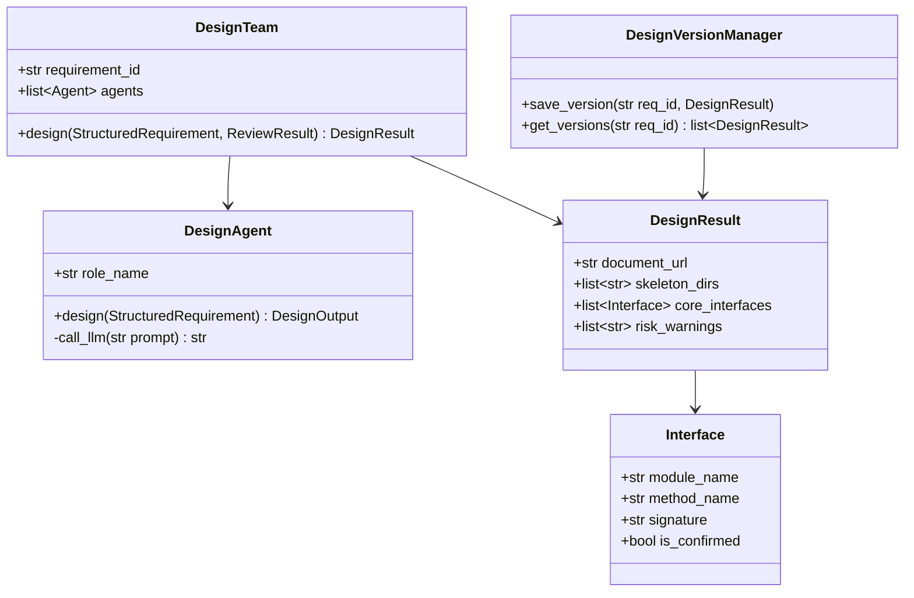
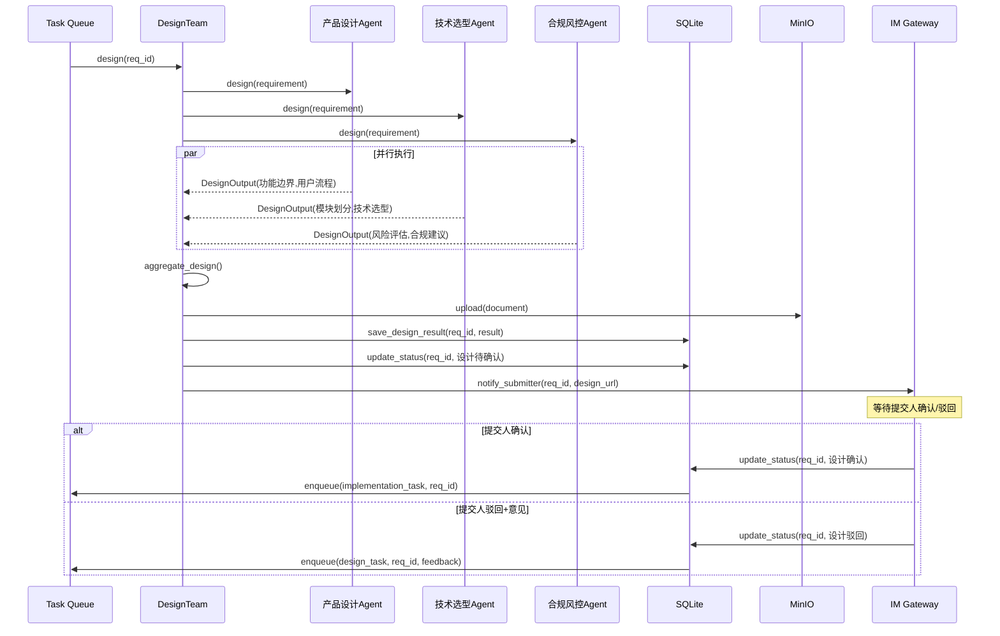
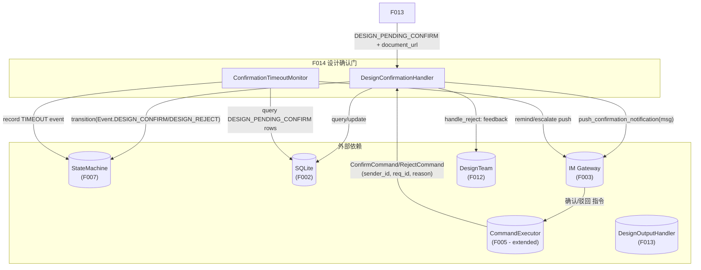
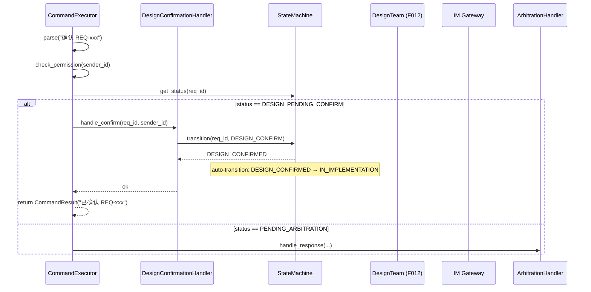
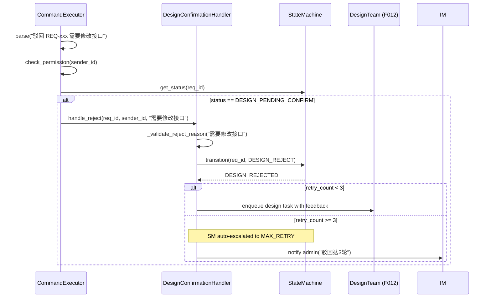
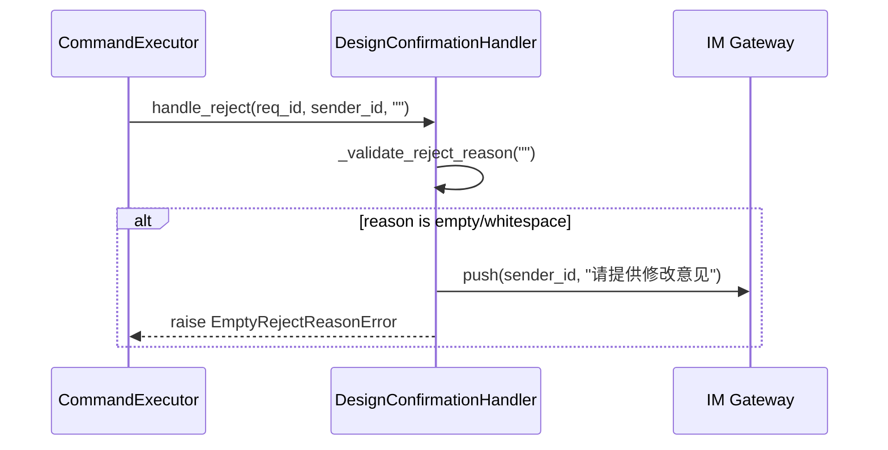
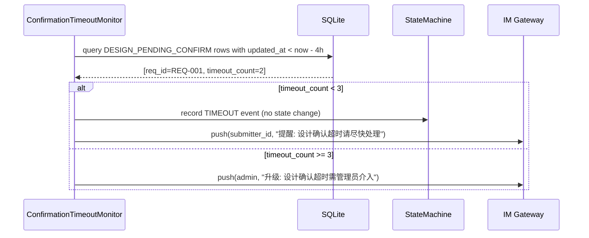
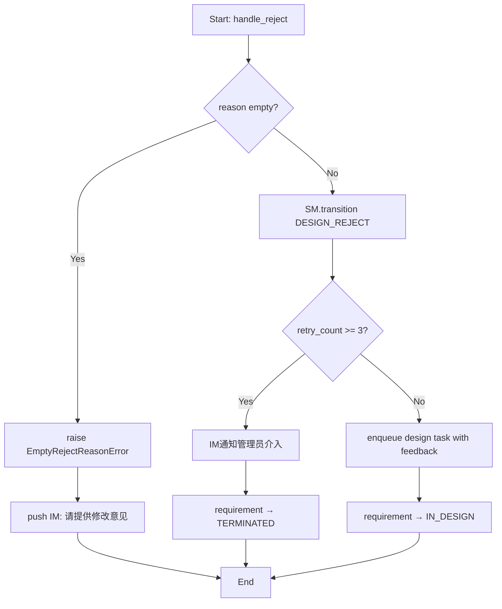
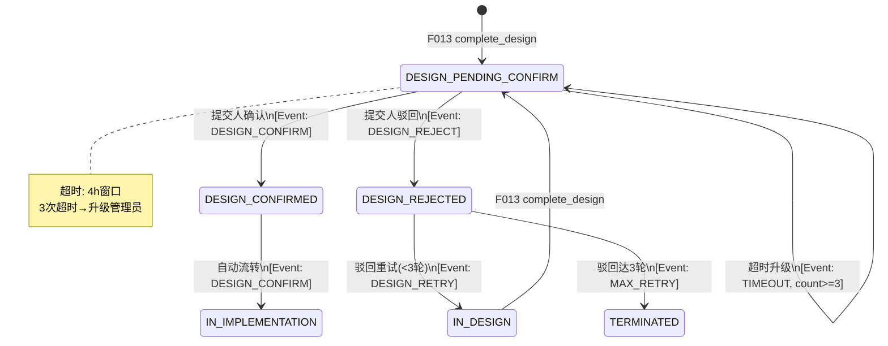

# Feature Detailed Design: 设计确认门与迭代 (Feature #F014)

**Date**: 2026-07-08
**Feature**: #F014 — 设计确认门与迭代
**Priority**: high
**Dependencies**: F013 (设计产出物生成)
**Design Reference**: docs/plans/2026-07-04-demandflow-design.md §2.3
**SRS Reference**: FR-011, FR-012

## Context

实现设计产出物就绪后的确认门机制：IM 推送设计详情并等待提交人确认或驳回，支持 3 轮驳回迭代和 4 小时超时提醒/升级，确认后自动进入代码实施阶段。

## Design Alignment

### §2.3 设计系统全文（FR-009, FR-010, FR-011, FR-012）

#### 2.3.1 Overview
多智能体设计团产出概要设计文档、目录骨架、核心接口定义。

#### 2.3.2 Class Diagram



#### 2.3.3 Sequence Diagram



#### 2.3.4 Design Notes

- **设计角色**: 产品设计、技术选型、合规风控（3 角色）
- **产出物**: 概要设计文档 + 代码目录骨架 + 核心接口定义
- **版本管理**: 驳回迭代保留历史版本，3 轮升级管理员
- **超时**: 确认门 4 小时未操作，累计 3 次升级

#### 2.3.5 Integration Surface

**Provides**:
| 接口 | 描述 |
|------|------|
| `start_design(str req_id) -> DesignResult` | 触发设计 |
| `handle_design_feedback(str req_id, str feedback)` | 处理驳回反馈 |

**Requires**:
| 接口 | 提供者 | 描述 |
|------|--------|------|
| `call_llm(str prompt) -> str` | Agent Layer | LLM 调用 |
| `upload_document(bytes, str) -> str` | MinIO | 存储设计文档 |
| `update_status(str req_id, Status)` | State Machine | 状态流转 |
| `notify_submitter(str req_id, str design_url)` | IM Gateway | 通知提交人 |

- **Key classes**: DesignConfirmationHandler (new), ConfirmationTimeoutMonitor (new), CommandExecutor (extend)
- **Interaction flow**: F013 complete_design → DESIGN_PENDING_CONFIRM → F014 handles confirm/reject
- **Third-party deps**: none new
- **Deviations**: none

## SRS Requirement

### FR-011: 设计确认门与 IM 推送
**Priority**: Must
**EARS**: When 设计产出物就绪，the system shall 通过 IM 推送设计详情链接并等待提交人确认或驳回。
**Visual output**: IM 推送设计详情与快捷操作指引
**Acceptance Criteria**:
- Given 设计就绪，when 推送，then IM 发送含详情页短链与确认/驳回快捷指引
- Given 推送失败，when 重试，then 指数退避重试 3 次
- Given 推送超过 4 小时未操作，when 超时，then IM 提醒提交人；累计 3 次提醒后升级管理员介入，需求保持「待处理」状态

### FR-012: 设计驳回迭代
**Priority**: Must
**EARS**: When 提交人发送「驳回 + 修改意见」，the system shall 携带修改意见回到设计阶段重新生成并保留历史版本。
**Visual output**: 看板保留设计版本历史
**Acceptance Criteria**:
- Given 提交人驳回 + 修改意见，当处理，then 重新触发设计团并保留上一版历史
- Given 同节点驳回达 3 轮，当处理，then IM 通知管理员介入并暂停自动流转
- Given 提交人确认，当处理，then 进入代码实施阶段
- Given 驳回意见为空，当处理，then IM 提示需提供修改意见

## Component Data-Flow Diagram



## Interface Contract

| Method | Signature | Preconditions | Postconditions | Raises |
|--------|-----------|---------------|----------------|--------|
| `DesignConfirmationHandler.start_confirmation_gate` | `(self, req_id: str, document_url: str, submitter_id: str) -> None` | Given requirement exists with status DESIGN_PENDING_CONFIRM | IM message sent with design link + confirm/reject guidance; if push fails after 3 retries → NotificationFailedError | `RequirementNotFoundError`: req_id not found; `InvalidTransitionError`: state not DESIGN_PENDING_CONFIRM; `NotificationFailedError`: push retry exhausted |
| `DesignConfirmationHandler.handle_confirm` | `(self, req_id: str, sender_id: str) -> None` | Given requirement in DESIGN_PENDING_CONFIRM, given sender is submitter | Transition DESIGN_PENDING_CONFIRM → DESIGN_CONFIRMED; state machine auto-transitions DESIGN_CONFIRMED → IN_IMPLEMENTATION | `RequirementNotFoundError`: req_id not found; `InvalidTransitionError`: state not DESIGN_PENDING_CONFIRM |
| `DesignConfirmationHandler.handle_reject` | `(self, req_id: str, sender_id: str, reason: str) -> None` | Given requirement in DESIGN_PENDING_CONFIRM, given sender is submitter | If reason empty → IM提示; else transition DESIGN_PENDING_CONFIRM → DESIGN_REJECTED; if retries <3 → enqueue design task with feedback; if retries >=3 → TERMINATED + notify admin | `RequirementNotFoundError`; `InvalidTransitionError`; `EmptyRejectReasonError`: reason is empty/whitespace |
| `DesignConfirmationHandler._push_with_retry` | `(self, recipient: str, message: str) -> None` | Given valid recipient id | IM message sent; if failed → retry 3x exponential backoff (2^attempt seconds) | `NotificationFailedError`: all 3 retries fail |
| `DesignConfirmationHandler._validate_reject_reason` | `(self, reason: str) -> None` | Given reject command with reason field | Raises if reason is None or whitespace-only | `EmptyRejectReasonError`: reason missing |
| `ConfirmationTimeoutMonitor.check_timeouts` | `(self) -> list[TimeoutResult]` | None | Queries DESIGN_PENDING_CONFIRM rows with updated_at >4h ago; for each: if timeout_count <3 → remind submitter + increment count; if timeout_count >=3 → escalate to admin | N/A — recovers gracefully (returns empty list on DB error) |

**Design rationale**:
- `start_confirmation_gate` is the entry point called after F013's `complete_design()`. It owns the confirmation guidance push, separate from F013's general completion notification.
- `handle_reject` delegates to `_validate_reject_reason` first (early exit for empty reason), then uses `StateMachine.transition()` which handles MAX_RETRY logic internally.
- Timeout count is tracked via `StatusHistory` TIMEOUT event count in `DESIGN_PENDING_CONFIRM` state, avoiding new DB schema changes.
- **Cross-feature contract alignment**: C-005 (confirm) and C-006 (reject) from Design §6.2. This feature is the Provider for both. The `{status, message}` response schema matches `CommandResult` returned by `CommandExecutor.execute()`. The reject endpoint body `{reason}` maps to `RejectCommand.reason`.

## Visual Rendering Contract (ui: true only)

> N/A — backend-only feature, no visual output

## Internal Sequence Diagram

### Main Success Path: Confirm



### Main Success Path: Reject with reason + re-trigger design



### Error Path: Reject with empty reason



### Error Path: Timeout escalation



## Algorithm / Core Logic

### DesignConfirmationHandler.handle_reject

#### Flow Diagram



#### Pseudocode

```
FUNCTION handle_reject(req_id: str, sender_id: str, reason: str) -> None
    _validate_reject_reason(reason)
    // If reason empty, raises EmptyRejectReasonError — IM push handled by caller
    new_status = SM.transition(req_id, Event.DESIGN_REJECT, sender_id)
    // SM handles retry counting internally:
    //   If DESIGN_RETRY events < 3: new_status = IN_DESIGN
    //   If DESIGN_RETRY events >= 3: new_status = TERMINATED (via MAX_RETRY)
    IF new_status == IN_DESIGN THEN
        _push_fn(sender_id, "设计已驳回，意见已记录，重新启动设计流程")
        enqueue_design_task(req_id, feedback=reason)
    ELSE IF new_status == TERMINATED THEN
        _push_fn("admin", f"设计驳回达3轮，需求已终止: {req_id}")
    END
END

FUNCTION _validate_reject_reason(reason: str) -> None
    IF reason is None OR reason.strip() == "" THEN
        raise EmptyRejectReasonError("请提供修改意见")
    END
END
```

**Note**: Design re-triggering (enqueue_design_task) is an integration concern handled at the orchestrator level (Huey task queue). This feature provides the handler logic; the actual task enqueue is delegated to the calling code via an injected callback or task queue mechanism.

### DesignConfirmationHandler.handle_confirm

#### Pseudocode

```
FUNCTION handle_confirm(req_id: str, sender_id: str) -> None
    new_status = SM.transition(req_id, Event.DESIGN_CONFIRM, sender_id)
    // SM auto-transitions DESIGN_CONFIRMED → IN_IMPLEMENTATION
    // new_status = IN_IMPLEMENTATION
    _push_fn(sender_id, f"设计已确认，需求已进入实施阶段: {req_id}")
END
```

### ConfirmationTimeoutMonitor.check_timeouts

#### Flow Diagram

```mermaid
flowchart TD
    A[check_timeouts] --> B[query DESIGN_PENDING_CONFIRM rows\nwhere timedelta > 4h]
    B --> C{result empty?}
    C -->|Yes| D[return []]
    C -->|No| E[for each overdue req]
    E --> F{timeout_count < 3?}
    F -->|Yes| G[push reminder to submitter]
    G --> H[record TIMEOUT event in StatusHistory]
    H --> I[increment timeout_count in DB]
    I --> J[add TimeoutResult to list]
    F -->|No| K[push escalation to admin]
    K --> L[add TimeoutResult with escalated=True]
    L --> M[next req]
    J --> M
    M --> N[return results]
    D --> N
```

#### Pseudocode

```
FUNCTION check_timeouts() -> list[TimeoutResult]
    cutoff = now() - 4h
    overdue_reqs = query(
        "SELECT id, submitter_id FROM requirements "
        "WHERE current_status = 'DESIGN_PENDING_CONFIRM' AND updated_at < :cutoff"
    )
    results = []
    FOR EACH req IN overdue_reqs:
        timeout_count = count TIMEOUT events for this req_id in StatusHistory
        IF timeout_count < 3 THEN
            _push_fn(req.submitter_id,
                f"提醒: 设计确认({req.req_id})已超时4小时，请回复确认/驳回")
            SM.record_event(req.req_id, Event.TIMEOUT, trigger_user=None)
            // increment timeout_count via adding TIMEOUT event to StatusHistory
            results.append(TimeoutResult(req, timeout_count + 1, escalated=False))
        ELSE
            _push_fn("admin",
                f"升级: 设计确认({req.req_id})超时已达3次，请管理员介入")
            results.append(TimeoutResult(req, timeout_count, escalated=True))
        END
    END
    RETURN results
END
```

#### Boundary Decisions

| Parameter | Min | Max | Empty/Null | At boundary |
|-----------|-----|-----|------------|-------------|
| reject reason | 1 character | N/A | Empty/None → raise EmptyRejectReasonError | 1 char → valid |
| retry count | 0 | 3 (exclusive cap) | 0 → first attempt | 2 → last allowed retry; 3+ → MAX_RETRY |
| timeout count | 0 | 2 (before escalation) | 0 → no reminder yet | 2 → next triggers escalation |
| timeout window | 0h | 4h+ | 0h → not overdue | 4h → exactly at threshold |

#### Error Handling

| Condition | Detection | Response | Recovery |
|-----------|-----------|----------|----------|
| Empty reject reason | `_validate_reject_reason()` whitespace check | `raise EmptyRejectReasonError("请提供修改意见")` | Caller (CommandExecutor) catches and returns CommandResult with error message |
| IM push failure (3 retries) | `_push_with_retry()` catches Exception | `raise NotificationFailedError` | Caller can log and continue; push is async-best-effort |
| Requirement not found | `StateMachine.get_status()` | `raise RequirementNotFoundError` | CommandExecutor returns structured error |
| Invalid state for confirm/reject | `StateMachine.transition()` | `raise InvalidTransitionError` | CommandExecutor returns "需求状态不允许此操作" |
| DB error in timeout query | `try/except` around query | Return empty list `[]` | Next poll cycle will retry |

## State Diagram



The state machine (from F007) already implements these transitions. F014 orchestrates the events that drive these transitions.

## Test Inventory

| ID | Category | Traces To | Input / Setup | Expected | Kills Which Bug? |
|----|----------|-----------|---------------|----------|-----------------|
| T001 | FUNC/happy | FR-011 AC-1; §3 handle_confirm | CON-001: requirement in DESIGN_PENDING_CONFIRM; sender=submitter; call handle_confirm | StateMachine.transition(DESIGN_CONFIRM) called; status → IN_IMPLEMENTATION; CommandResult(status="ok") returned | Missing state transition on confirm |
| T002 | FUNC/happy | FR-011 AC-1; §3 start_confirmation_gate | CON-002: requirement in DESIGN_PENDING_CONFIRM; valid document_url | IM push called with design link + guidance text; no exception | Missing confirmation push |
| T003 | FUNC/happy | FR-012 AC-1; §3 handle_reject | CON-003: requirement in DESIGN_PENDING_CONFIRM; sender=submitter; reason="需要修改接口" | StateMachine.transition(DESIGN_REJECT) called; design task enqueued with feedback; CommandResult(status="ok") returned | Missing re-trigger on reject |
| T004 | FUNC/happy | FR-012 AC-3; §3 handle_confirm | CON-004: same as T001 but verify final status | After handle_confirm, requirement.current_status = "IN_IMPLEMENTATION" | Missing auto-transition to implementation |
| T005 | FUNC/error | FR-011 AC-2; §3 _push_with_retry | CON-005: push_fn raises IOError 3 times | _push_with_retry retries 3x (2^0, 2^1, 2^2 sec); raises NotificationFailedError | Missing exponential backoff retry |
| T006 | FUNC/error | FR-012 AC-4; §3 _validate_reject_reason | CON-006: handle_reject with reason="" | EmptyRejectReasonError raised; IM push sent "请提供修改意见" | Allows empty reason without feedback |
| T007 | FUNC/error | FR-012 AC-4; §3 _validate_reject_reason | CON-007: handle_reject with reason=None | EmptyRejectReasonError raised; same as T006 | None value bypasses empty check |
| T008 | FUNC/error | §3 Interface Contract Raises | CON-008: requirement in DESIGN_PENDING_CONFIRM; sender NOT submitter | Permission Checker returns False; CommandResult(status="error", message="无权限") returned before reaching handler | Non-submitter can confirm/reject |
| T009 | FUNC/error | §3 Interface Contract Raises | CON-009: requirement in DESIGN_CONFIRMED state; call handle_confirm | StateMachine.transition raises InvalidTransitionError; CommandResult(status="error") returned | Allows confirm on non-pending state |
| T010 | FUNC/error | §3 Interface Contract Raises | CON-010: requirement not found; call handle_confirm | RequirementNotFoundError raised; CommandResult(status="error") returned | Crashes on missing requirement |
| T011 | FUNC/happy | §3 handle_confirm; CommandExecutor routing | CON-011: CommandExecutor.execute with text "确认 REQ-20260708-001" for DESIGN_PENDING_CONFIRM req | Routes to DesignConfirmationHandler.handle_confirm; returns ok | Command not routed to design handler |
| T012 | FUNC/happy | §3 handle_reject; CommandExecutor routing | CON-012: CommandExecutor.execute with text "驳回 REQ-20260708-001 接口不完整" for DESIGN_PENDING_CONFIRM req | Routes to DesignConfirmationHandler.handle_reject with reason="接口不完整"; returns ok | Reject command not routed to design handler |
| T013 | BNDRY/edge | §5b boundary: retry count | CON-013: requirement with 2 existing DESIGN_RETRY events; handle_reject called | StateMachine returns TERMINATED (via MAX_RETRY); admin notified | Off-by-one on MAX_RETRY check (should fail on 3rd, not 4th) |
| T014 | BNDRY/edge | §5b boundary: timeout count | CON-014: requirement with 2 existing TIMEOUT events; check_timeouts called | TIMEOUT count=2 → reminder sent; next TIMEOUT would be count=3 | Escalation not triggered at threshold |
| T015 | BNDRY/edge | §5b boundary: timeout count | CON-015: requirement with 3 existing TIMEOUT events; check_timeouts called | Escalation push to admin; no reminder to submitter | Double escalation or wrong recipient |
| T016 | BNDRY/edge | §5b boundary: retry count | CON-016: requirement with 0 existing DESIGN_RETRY events; handle_reject called with reason | StateMachine returns IN_DESIGN; design task enqueued | First reject incorrectly terminates |
| T017 | BNDRY/edge | §5b boundary: reject reason | CON-017: handle_reject with reason=" " (whitespace) | EmptyRejectReasonError raised | Whitespace-only reason treated as valid |
| T018 | BNDRY/edge | §5b boundary: timeout window | CON-018: requirement in DESIGN_PENDING_CONFIRM with updated_at exactly 4h ago | check_timeouts includes this requirement | Off-by-one on 4h cutoff |
| T019 | FUNC/state | §6 State Diagram | CON-019: requirement in DESIGN_CONFIRMED; call handle_confirm | InvalidTransitionError: DESIGN_CONFIRMED + DESIGN_CONFIRM is not a valid transition in StateMachine directly (auto-transition is internal) | Allows double confirm |
| T020 | FUNC/state | §6 State Diagram | CON-020: requirement in TERMINATED; call handle_reject | InvalidTransitionError | Operates on terminated requirement |
| T021 | INTG/db | §3 DesignConfirmationHandler + SM.transition | CON-021: real SQLite DB; requirement in DESIGN_PENDING_CONFIRM; call handle_confirm | After call: status_history has DESIGN_CONFIRM event; requirement.current_status = "IN_IMPLEMENTATION" | State not persisted after confirm |
| T022 | INTG/db | §3 DesignConfirmationHandler + SM.transition | CON-022: real SQLite DB; requirement in DESIGN_PENDING_CONFIRM; call handle_reject with reason | After call: status_history has DESIGN_REJECT event; requirement.current_status updated | State not persisted after reject |
| T023 | INTG/db | §3 ConfirmationTimeoutMonitor | CON-023: real SQLite DB; requirement in DESIGN_PENDING_CONFIRM updated_at=6h ago; timeout_count=1 | check_timeouts records TIMEOUT in status_history; IM reminder sent | Timeout counter not persisted |
| T024 | INTG/db | §3 handle_reject + SM retry | CON-024: real SQLite DB; requirement in DESIGN_PENDING_CONFIRM, 2 DESIGN_RETRY events; call handle_reject | status_history shows MAX_RETRY event; requirement.current_status = "TERMINATED"; admin notified | Retry count not correctly read from DB |

> INTG: covers SQLite persistence (DB dependency). No HTTP/network dependencies — pushes use injected Callable mocks in unit tests, actual IM integration tested in F003/F010.

## Tasks

### Task 1: Write failing tests
**Files**: `tests/test_design_confirmation_handler.py`, `tests/test_command_executor.py` (extend)
**Steps**:
1. Create `tests/test_design_confirmation_handler.py` with imports (pytest, sqlalchemy, mock)
2. Write fixtures: `db_engine`, `db_session`, `requirement_design_pending_confirm`, `push_fn_mock`, `design_team_fn_mock`
3. Write test code for each row in Test Inventory (§7):
   - T001: handle_confirm happy path — mock SM, verify transition called with DESIGN_CONFIRM
   - T002: start_confirmation_gate happy path — verify push_fn called with guidance text
   - T003: handle_reject with reason — verify SM transition + task enqueue
   - T004: handle_confirm → verify IN_IMPLEMENTATION via state machine
   - T005: push retry — mock push_fn to fail 3x, verify retry timing
   - T006: empty reason rejection
   - T007: None reason rejection
   - T008: permission check (already in test_command_executor — extend)
   - T009: invalid state for confirm
   - T010: missing requirement
   - T011: CommandExecutor routing for confirm in DESIGN_PENDING_CONFIRM
   - T012: CommandExecutor routing for reject in DESIGN_PENDING_CONFIRM
   - T013: retry count boundary (2 events → 3rd rejects → TERMINATED)
   - T014: timeout count boundary (2 events → reminder)
   - T015: timeout count boundary (3 events → escalation)
   - T016: retry count boundary (0 events → re-trigger)
   - T017: whitespace-only reason
   - T018: 4h boundary for timeout check
   - T019: DESIGN_CONFIRMED + confirm → error
   - T020: TERMINATED + reject → error
   - T021: INTG/db — real SQLite, confirm persists
   - T022: INTG/db — real SQLite, reject persists
   - T023: INTG/db — real SQLite, timeout counter persists
   - T024: INTG/db — real SQLite, MAX_RETRY on 3rd reject
4. Run: `pytest tests/test_design_confirmation_handler.py -v`
5. **Expected**: All tests FAIL for the right reason (ImportError or ModuleNotFoundError)

### Task 2: Implement minimal code
**Files**: `app/core/design_confirmation_handler.py` (new), `app/core/command_executor.py` (extend)
**Steps**:
1. Create `app/core/design_confirmation_handler.py` with:
   - `DesignConfirmationHandler` class with methods per Interface Contract (§3)
   - `ConfirmationTimeoutMonitor` class with `check_timeouts()` per Algorithm (§5)
   - `EmptyRejectReasonError` exception class
   - Reuse `NotificationFailedError` from F010
   - Implement `_push_with_retry` with 3x exponential backoff (2^attempt sec)
   - Implement `_validate_reject_reason` with None/empty/whitespace check
2. Extend `app/core/command_executor.py`:
   - Add `_design_confirmation_handler` parameter to `CommandExecutor.__init__`
   - In `execute()` method, after arbitration check (line ~141-161), add:
     ```
     elif current_status == Status.DESIGN_PENDING_CONFIRM:
         if isinstance(command, ConfirmCommand):
             self._design_confirmation_handler.handle_confirm(command.requirement_id, sender_id)
             return CommandResult(status="ok", message=f"已确认 {command.requirement_id}")
         elif isinstance(command, RejectCommand):
             self._design_confirmation_handler.handle_reject(command.requirement_id, sender_id, command.reason)
             msg = f"已驳回 {command.requirement_id}"
             if command.reason:
                 msg = msg + " " + command.reason
             return CommandResult(status="ok", message=msg)
     ```
   - Import `DesignConfirmationHandler` from the new module
3. Run: `pytest tests/test_design_confirmation_handler.py tests/test_command_executor.py -v`
4. **Expected**: All tests PASS

### Task 3: Coverage Gate
1. Run: `pytest --cov=app/core/design_confirmation_handler.py --cov=app/core/command_executor.py --cov-report=term-missing`
2. Check thresholds: line ≥80%, branch ≥70%. If below: return to Task 1.
3. Record coverage output as evidence.

### Task 4: Refactor
1. Verify `_push_with_retry` duplicates F010 `ArbitrationNotifier.notify_admin` pattern — extract shared retry logic if 3+ features use it (defer unless repetition obvious)
2. Ensure `EmptyRejectReasonError` extends `Exception` consistently with existing exception hierarchy
3. Run: `pytest tests/test_design_confirmation_handler.py tests/test_command_executor.py tests/ -v`
4. **Expected**: All tests PASS

### Task 5: Mutation Gate
1. Run: `python -m mutmut run --paths-to-mutate=app/core/design_confirmation_handler.py`
2. Check threshold ≥75%. If below: improve assertions.
3. Record mutation output as evidence.

## Verification Checklist
- [x] All SRS acceptance criteria (from srs_trace) traced to Interface Contract postconditions
- [x] All SRS acceptance criteria (from srs_trace) traced to Test Inventory rows
- [x] Algorithm pseudocode covers all non-trivial methods
- [x] Boundary table covers all algorithm parameters
- [x] Error handling table covers all Raises entries
- [x] Test Inventory negative ratio >= 40% (T005-T010, T013-T020 = 14/24 = 58%)
- [x] Visual Rendering Contract complete for ui:true features — N/A (backend-only)
- [x] Each Visual Rendering Contract element has ≥1 UI/render Test Inventory row — N/A
- [x] Every skipped section has explicit "N/A — [reason]"
- [x] All functions/methods named in §4.N have at least one Test Inventory row

## Clarification Addendum

> No clarifications required — all specifications were unambiguous.

| # | Category | Original Ambiguity | Resolution | Authority |
|---|----------|--------------------|------------|-----------|
| — | — | — | — | user-approved / assumed |
