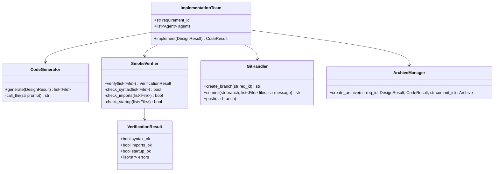
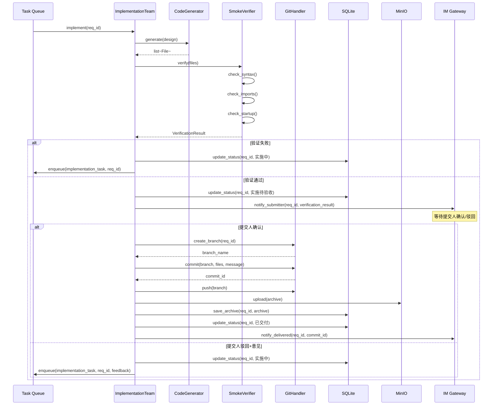
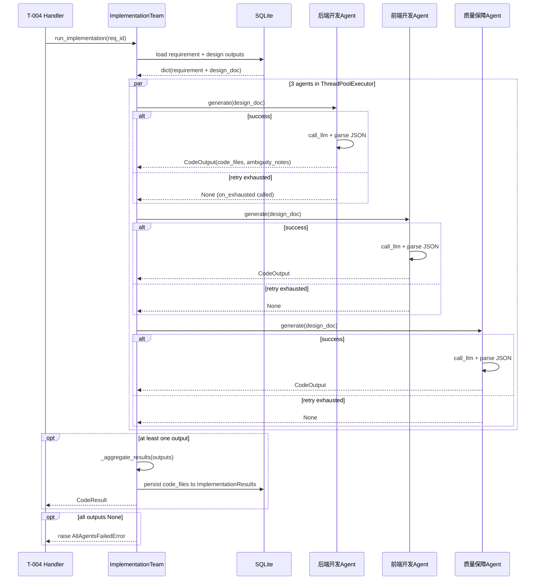

# Feature Detailed Design: 实施团代码生成 (Feature #F015)

**Date**: 2026-07-08
**Feature**: #F015 — 实施团代码生成
**Priority**: high
**Dependencies**: F007 (状态机引擎)
**Design Reference**: docs/plans/2026-07-04-demandflow-design.md §2.4
**SRS Reference**: FR-013
**ATS Reference**: docs/plans/2026-07-04-demandflow-ats.md (FR-013: FUNC)

## Context

设计确认后由实施团（3角色并行 Agent）按设计稿生成可运行源代码。遵循 F012 设计团模式：ImplementationTeam 协调 3 个 ImplementationAgent（后端开发/前端开发/质量保障）通过 ThreadPoolExecutor 并行执行，LLM 输出经解析后聚合为 CodeResult。代码文件持久化到 ImplementationResults 表。任一 Agent 失败最多重试 3 次（指数退避），耗尽后 IM 通知管理员。

## Design Alignment

以下为系统设计 §2.4（实施系统）的完整内容：

### §2.4.1 Overview
按设计生成源代码、冲烟验证、Git 提交、交付归档。

### §2.4.2 Class Diagram


### §2.4.3 Sequence Diagram


### §2.4.4 Design Notes
- **冲烟验证**: 语法/编译检查 + 导入检查 + 启动检查
- **密钥检测**: 提交前扫描 API Key/密码/Token 模式，阻止提交
- **Git 规范**: 独立分支 `feature/REQ-xxx`，Conventional Commits 格式
- **交付档案**: 各阶段产出物引用 + 交付总结

### §2.4.5 Integration Surface
**Provides**:
| 接口 | 描述 |
|------|------|
| `start_implementation(str req_id) -> CodeResult` | 触发实施 |
| `handle_impl_feedback(str req_id, str feedback)` | 处理驳回反馈 |

**Requires**:
| 接口 | 提供者 | 描述 |
|------|--------|------|
| `call_llm(str prompt) -> str` | Agent Layer | LLM 调用 |
| `git_commit(str branch, list files) -> str` | Git Client | Git 操作 |
| `upload_archive(bytes, str) -> str` | MinIO | 存储交付档案 |
| `update_status(str req_id, Status)` | State Machine | 状态流转 |
| `notify_submitter(str req_id, CodeResult)` | IM Gateway | 通知提交人 |

### Key classes (to implement)
- **ImplementationTeam**: orchestrator, holds 3 agents, runs them in parallel, aggregates results
- **ImplementationAgent**: per-role code generator, calls LLM and parses response
- **CodeOutput**: per-agent output Pydantic model
- **CodeResult**: aggregated result Pydantic model
- **CodeParseError, AllAgentsFailedError**: exception classes

### Interaction flow
1. Huey T-004 task calls `ImplementationTeam.run_implementation(req_id)`
2. ImplementationTeam loads design outputs (DesignResults for latest version) from DB
3. Assembles design doc from per-agent design outputs
4. 3 ImplementationAgents run in parallel via ThreadPoolExecutor
5. Each agent calls LLM with design context, parses JSON response (code_files + ambiguity_notes)
6. Code files aggregated into CodeResult (dedup by path, last writer wins)
7. Aggregated result persisted to ImplementationResults.code_files
8. Task handler transitions state IN_IMPLEMENTATION → IMPL_PENDING_ACCEPTANCE (IMPL_COMPLETE event)

### Third-party deps
- `concurrent.futures.ThreadPoolExecutor` (stdlib)
- No new external dependencies

### Deviations
- **SmokeVerifier, GitHandler, ArchiveManager**: Not implemented in F015. These are separate features (F016, F018, F019). F015 focuses exclusively on code generation.
- **MinIO upload**: Not implemented in F015. Deferred to F016/F019.
- **Per-agent storage**: Unlike DesignResults (which stores per-agent rows), ImplementationResults stores an aggregated result. Code files from all agents are merged into a single row.

## SRS Requirement

### FR-013: 实施团代码生成
**Priority**: Must
**EARS**: When 设计经提交人确认，the system shall 触发实施团按设计稿生成可运行源代码。
**Visual output**: 看板详情可见"实施中"
**Acceptance Criteria**:
- AC-1: Given 设计确认，when 触发实施，then 生成符合设计规范与接口定义的源代码，完整性以通过冲烟验证（FR-014）为准
- AC-2: Given 设计存在两种以上合理解释（歧义），when 生成，then 选择一种解释并标注假设后继续生成
- AC-3: Given 代码生成失败，when 处理，then 指数退避重试 3 次，3 次仍失败则 IM 通知管理员

## Component Data-Flow Diagram

```mermaid
flowchart LR
    subgraph External
        LLM[大模型 API]
        DB[(SQLite)]
    end

    subgraph F015[F015 实施团]
        IT[ImplementationTeam]
        A1[后端开发 Agent]
        A2[前端开发 Agent]
        A3[质量保障 Agent]
        AG[_aggregate_results]
    end

    T004[T-004 task\nrun_implementation] -->|requirement_id: str| IT
    IT -->|load_design_output| DB
    DB -->|DesignResults latest version| IT
    IT -->|design_doc: dict| A1
    IT -->|design_doc: dict| A2
    IT -->|design_doc: dict| A3
    A1 -->|call_llm(prompt) -> str| LLM
    A2 -->|call_llm(prompt) -> str| LLM
    A3 -->|call_llm(prompt) -> str| LLM
    A1 -->|CodeOutput| AG
    A2 -->|CodeOutput| AG
    A3 -->|CodeOutput| AG
    AG -->|CodeResult| IT
    IT -->|persist code_files| DB
    IT -->|CodeResult| T004
```

Every node above maps to a class: `ImplementationTeam` (orchestrator), `ImplementationAgent` (role-specific), `_aggregate_results` (ImplementationTeam method). External dependencies (`大模型 API`, `SQLite`) are dashed-border boxes.

## Interface Contract

| Method | Signature | Preconditions | Postconditions | Raises |
|--------|-----------|---------------|----------------|--------|
| `ImplementationAgent.generate` | `generate(design_doc: dict) -> CodeOutput` | design_doc has `requirement_id`, `original_text`, `design_content`, `skeleton_dirs`, `core_interfaces`, `risk_warnings` | Returns CodeOutput with agent_role set; calls call_llm and parses JSON response into code_files and ambiguity_notes | `LLMCallError` if call_llm fails; `CodeParseError` if LLM response is not valid JSON or missing required fields |
| `ImplementationAgent.call_llm` | `call_llm(prompt: str) -> str` | prompt is non-empty | Returns raw text response from LLM | `NotImplementedError` (base class); subclasses override |
| `ImplementationAgent._build_prompt` | `_build_prompt(design_doc: dict) -> str` | design_doc fields populated | Returns formatted prompt template for agent's role | — (internal, no raise) |
| `ImplementationTeam.run_implementation` | `run_implementation(req_id: str) -> CodeResult` | req_id exists in DB, has completed design outputs (DesignResults rows), and requirement is in IN_IMPLEMENTATION or DESIGN_CONFIRMED state | Loads design outputs; runs 3 agents in parallel; aggregates code_files (dedup by path); persists aggregated result to ImplementationResults; returns CodeResult with all code_files and ambiguity_notes | `RequirementNotFoundError` if req_id not in DB; `RequirementNotFoundError` if no design outputs for req_id; `AllAgentsFailedError` if all 3 agents return None after retries |
| `ImplementationTeam._load_design_output` | `_load_design_output(req_id: str) -> dict` | req_id exists in requirements table; has DesignResults rows | Returns dict with requirement fields + assembled design doc (skeleton_dirs, core_interfaces, risk_warnings) from latest DesignResults version | `RequirementNotFoundError` if req_id not found; `RequirementNotFoundError` if no design outputs |
| `ImplementationTeam._persist_output` | `_persist_output(req_id: str, code_files: list[dict]) -> None` | code_files is a list of {path, content} dicts (may be empty) | Inserts row into ImplementationResults table with code_files; commits session | — |
| `ImplementationTeam._execute_agent` | `_execute_agent(agent: ImplementationAgent, design_doc: dict) -> CodeOutput \| None` | agent and design_doc are valid | Calls agent.generate with retry_with_backoff (max 3); on retry exhausted, calls _notify_agent_failure; returns CodeOutput on success, None on failure | — (wraps errors via retry) |
| `ImplementationTeam._notify_agent_failure` | `_notify_agent_failure(role_name: str, error: Exception) -> None` | — | Logs error and calls on_exhausted callback | — |
| `ImplementationTeam._aggregate_results` | `_aggregate_results(req_id: str, outputs: list[CodeOutput]) -> CodeResult` | outputs is non-empty | Merges code_files from all outputs (dedup by path, last writer wins); aggregates all ambiguity_notes; returns CodeResult | — |

**AC traceability**:
- AC-1 (生成源代码): `run_implementation` postcondition — CodeResult with non-empty code_files; persisted to ImplementationResults
- AC-2 (歧义标注假设): `_aggregate_results` postcondition — ambiguity_notes collected from all agents and included in CodeResult
- AC-3 (指数退避重试3次+IM通知): `_execute_agent` postcondition — uses `retry_with_backoff(max_retries=3)`, `_notify_agent_failure` called on exhaustion

**Cross-feature contract alignment**:
- T-004 (run_implementation): Provider of `run_implementation(requirement_id: str) -> CodeResult`. Return type `CodeResult` matches design §2.4 start_implementation interface.
- IFR-003 (大模型 API): Consumer of `call_llm(prompt: str) -> str`. Method matches the required interface.

**Design rationale**:
- Three implementation roles (后端开发, 前端开发, 质量保障) follow CON-001 multi-agent constraint. Each role generates code from a complementary perspective.
- `CodeOutput` uses `list[dict]` for code_files instead of a typed model — matches ImplementationResults.code_files JSON field type directly, avoiding serialization mismatch.
- `_aggregate_results` deduplicates code_files by path (last writer wins). In practice, agents produce different files (backend vs frontend vs tests), so conflicts are rare.
- No state transition in F015 itself — state transitions (IN_IMPLEMENTATION → IMPL_PENDING_ACCEPTANCE) are triggered by the workflow handler after smoke verification (F016). F015 only generates and persists code.
- `_load_design_output` reads DesignResults per-agent rows from the latest version and assembles a design document dict in memory. No MinIO client needed.

### Model Schema Alignment

```python
class CodeOutput(BaseModel):
    agent_role: str = Field(..., min_length=1)
    raw_text: str = Field(..., min_length=1)
    code_files: list[dict] = Field(default_factory=list)
    ambiguity_notes: list[str] = Field(default_factory=list)


class CodeResult(BaseModel):
    requirement_id: str
    code_files: list[dict] = Field(default_factory=list)
    ambiguity_notes: list[str] = Field(default_factory=list)


class CodeParseError(Exception):
    def __init__(self, agent_role: str, raw_response: str):
        self.agent_role = agent_role
        self.raw_response = raw_response
        super().__init__(f"Cannot parse LLM response for {agent_role}: {raw_response}")


class AllAgentsFailedError(Exception):
    def __init__(self, req_id: str):
        self.req_id = req_id
        super().__init__(f"All 3 implementation agents failed for requirement: {req_id}")
```

## Visual Rendering Contract (ui: true only)

> N/A — backend-only feature (`"ui": false`)

## Internal Sequence Diagram



Error paths:
- `RequirementNotFoundError` (req_id missing) → raised directly to TASK
- `RequirementNotFoundError` (no design outputs) → raised directly to TASK
- `AllAgentsFailedError` (all 3 agents return None) → TASK logs and IM notifies admin
- `CodeParseError` per agent → caught by retry_with_backoff, retried on next attempt

## Algorithm / Core Logic

### ImplementationAgent.generate()

#### Flow Diagram

```mermaid
flowchart TD
    A[Start: generate(design_doc)] --> B[Build prompt via _build_prompt]
    B --> C[call_llm(prompt)]
    C --> D{call_llm succeeds?}
    D -->|Yes| E[Parse JSON response]
    D -->|No| F[raise LLMCallError]
    E --> G{JSON valid + required\nfields present?}
    G -->|Yes| H[Create CodeOutput\nwith code_files\nand ambiguity_notes]
    G -->|No| I[raise CodeParseError]
    H --> J[Return CodeOutput]
    F --> J
    I --> J
```

#### Pseudocode

```
FUNCTION generate(design_doc: dict) -> CodeOutput
  // Step 1: Build role-specific prompt
  prompt = _build_prompt(design_doc)
  
  // Step 2: Call LLM
  TRY
    raw = call_llm(prompt)
  CATCH Exception
    RAISE LLMCallError(agent_role, 0, e)
  
  // Step 3: Parse JSON response
  TRY
    data = json.loads(raw)
  CATCH JSONDecodeError
    RAISE CodeParseError(agent_role, raw)
  
  // Step 4: Extract code_files and ambiguity_notes
  TRY
    code_files = data.get("code_files", [])
    notes = data.get("ambiguity_notes", [])
    // Validate code_files format: list of {path, content}
    FOR file IN code_files:
      ASSERT "path" IN file AND "content" IN file
    RETURN CodeOutput(
      agent_role=agent_role,
      raw_text=raw,
      code_files=code_files,
      ambiguity_notes=notes,
    )
  CATCH (AssertionError, TypeError)
    RAISE CodeParseError(agent_role, raw)
  END
END
```

### ImplementationTeam._execute_agent()

Delegates to `retry_with_backoff` (reused from F008):
```
FUNCTION _execute_agent(agent, design_doc) -> CodeOutput | None
  RETURN retry_with_backoff(
    lambda: agent.generate(design_doc),
    max_retries=3,
    on_exhausted=lambda e: _notify_agent_failure(agent.role_name, e)
  )
END
```

### ImplementationTeam._aggregate_results()

#### Pseudocode

```
FUNCTION _aggregate_results(req_id: str, outputs: list[CodeOutput]) -> CodeResult
  // Step 1: Initialize
  merged_files = dict()  // path -> content
  all_notes = []
  
  // Step 2: Merge code_files (dedup by path, last writer wins)
  FOR output IN outputs:
    FOR file IN output.code_files:
      merged_files[file["path"]] = file["content"]
    END FOR
    all_notes.extend(output.ambiguity_notes)
  END FOR
  
  // Step 3: Build result
  code_files = [{"path": k, "content": v} FOR k, v IN merged_files.items()]
  
  RETURN CodeResult(
    requirement_id=req_id,
    code_files=code_files,
    ambiguity_notes=all_notes,
  )
END
```

### ImplementationTeam.run_implementation()

#### Flow Diagram

```mermaid
flowchart TD
    A[Start: run_implementation(req_id)] --> B[Load design output]
    B --> C{Design exists?}
    C -->|No| D[raise RequirementNotFoundError]
    C -->|Yes| E[Create 3 ImplementationAgents]
    E --> F[ThreadPoolExecutor: submit all 3]
    F --> G[Collect results as they complete]
    G --> H{Any outputs non-None?}
    H -->|No| I[raise AllAgentsFailedError]
    H -->|Yes| J[Aggregate code_files]
    J --> K[Persist to ImplementationResults]
    K --> L[Return CodeResult]
    D --> L
    I --> L
```

### ImplementationTeam._load_design_output()

#### Pseudocode

```
FUNCTION _load_design_output(req_id: str) -> dict
  // Step 1: Load requirement
  req = session.query(Requirements).filter(Requirements.id == req_id).first()
  IF req IS None:
    RAISE RequirementNotFoundError(req_id)
  
  // Step 2: Get max design version
  max_version = SELECT MAX(version) FROM design_results WHERE requirement_id = req_id
  IF max_version IS None:
    RAISE RequirementNotFoundError("No design outputs for " + req_id)
  
  // Step 3: Load all design outputs for max version
  outputs = SELECT * FROM design_results
            WHERE requirement_id = req_id AND version = max_version
  
  // Step 4: Assemble design doc
  design_content = ""
  skeleton_dirs = []
  core_interfaces = []
  risk_warnings = []
  
  FOR output IN outputs:
    IF output.agent_role == "产品设计":
      design_content = output.document_url or ""
    ELIF output.agent_role == "技术选型":
      skeleton_dirs = output.skeleton_dirs or []
      core_interfaces = output.core_interfaces or []
    ELIF output.agent_role == "合规风控":
      risk_warnings = output.risk_warnings or []
  
  RETURN {
    "requirement_id": req_id,
    "original_text": req.original_text,
    "summary": req.summary or "",
    "design_content": design_content,
    "skeleton_dirs": skeleton_dirs,
    "core_interfaces": core_interfaces,
    "risk_warnings": risk_warnings,
    "version": max_version,
  }
END
```

### Boundary Decisions

| Parameter | Min | Max | Empty/Null | At boundary |
|-----------|-----|-----|------------|-------------|
| `outputs` list | 1 agent succeeds | 3 agents succeed | 0 → raise `AllAgentsFailedError` | 1 agent → partial result returned |
| `code_files` per agent | 0 files | unbounded | empty list → no files contributed; merged result may still be empty | single file → merged result has 1 entry |
| `ambiguity_notes` per agent | 0 notes | unbounded | empty list → CodeResult.ambiguity_notes empty | — |
| `max_retries` | 0 (no retry) | — | — | 1 retry → exactly 2 attempts |
| `max_version` (design) | 1 | unbounded | None → no design exists; raise error | first design → version=1 |

### Error Handling

| Condition | Detection | Response | Recovery |
|-----------|-----------|----------|----------|
| LLM call fails (network/API error) | `call_llm` raises Exception → caught by retry_with_backoff | Retry with exponential backoff (1s, 2s, 4s) | On 3rd failure: on_exhausted calls `_notify_agent_failure` (logs error + IM notify admin), returns None |
| LLM response not valid JSON | `json.loads` raises `JSONDecodeError` → `CodeParseError` | Caught by retry_with_backoff, same retry cycle | Same as above |
| LLM response missing required fields or format | AssertionError/TypeError on file dict access → `CodeParseError` | Caught by retry_with_backoff, same retry cycle | Same as above |
| req_id not in DB | `_load_design_output` finds no requirement row | Raise `RequirementNotFoundError` | Caller (TASK handler) logs and returns error response |
| No design outputs for req_id | `_load_design_output` finds zero DesignResults | Raise `RequirementNotFoundError` with descriptive message | Same as above |
| All 3 agents return None | `_execute_agent` returns None for all | Raise `AllAgentsFailedError(req_id)` | TASK handler logs critical error, IM notifies admin |
| DB write failure | `_persist_output` SQLAlchemy exception | Propagated to caller | Caller rolls back transaction |

## State Diagram

> N/A — stateless feature. F015 does not manage a stateful lifecycle; it generates code from design outputs. State transitions (IN_IMPLEMENTATION → IMPL_PENDING_ACCEPTANCE via IMPL_COMPLETE, or IN_IMPLEMENTATION self-loop via IMPL_SMOKE_FAIL) are triggered by F016 (冲烟验证) which follows F015 in the workflow.

## Test Inventory

| ID | Category | Traces To | Input / Setup | Expected | Kills Which Bug? |
|----|----------|-----------|---------------|----------|-----------------|
| T001 | FUNC/happy | §IC run_implementation / §SRS FR-013 AC-1 | req_id with 3 design outputs (each role); all 3 agents return valid code_files | CodeResult with non-empty code_files (aggregated from 3 agents); 1 row in ImplementationResults | Missing agent execution or persistence |
| T002 | FUNC/happy | §SRS FR-013 AC-2 / §Algo _aggregate_results ambiguity | Design with ambiguous interface spec; at least 1 agent returns ambiguity_notes in response | CodeResult.ambiguity_notes is non-empty, contains the annotated assumption | Ambiguity annotation not propagated |
| T003 | FUNC/error | §SRS FR-013 AC-3 / §Algo retry_with_backoff exhausted | All 3 agents raise LLMCallError on every attempt (3 retries each) | AllAgentsFailedError raised; _notify_agent_failure called 3 times (once per agent) | Missing retry exhaustion handling; no notification on total failure |
| T004 | FUNC/retry | §SRS FR-013 AC-3 / §Algo retry_with_backoff | Agent fails twice (LLMCallError), succeeds on 3rd attempt | CodeOutput returned; call_llm called exactly 3 times; retry delays ~1s then ~2s | Retry not attempted or not exponential |
| T005 | BNDRY/edge | §Algo boundary table — empty code_files | All 3 agents return {"code_files": [], "ambiguity_notes": []} | CodeResult.code_files is empty list; ImplementationResults row created; no crash | Crash on empty code_files from all agents |
| T006 | FUNC/error | §IC _load_design_output Raises | req_id has DesignResults rows but none for the latest version (minimal edge: zero design outputs total) | RequirementNotFoundError raised with message about missing design outputs | Flow continues without design validation |
| T007 | FUNC/error | §IC _load_design_output Raises | req_id not in requirements table | RequirementNotFoundError raised | No validation for missing requirement |
| T008 | BNDRY/edge | §Algo CodeParseError | Agent LLM returns non-JSON text ("not json") | retry_with_backoff catches CodeParseError; retries 3 times; on exhaustion returns None | Parse error not retried |
| T009 | BNDRY/edge | §Algo boundary table — partial result | Only 1 agent (后端开发) succeeds; other 2 return None after retry exhaustion | CodeResult returned with only backend code files; 1 ImplementationResults row persisted; _notify_agent_failure called 2 times | Aggregation crashes when some agents fail |
| T010 | BNDRY/edge | §Algo boundary table — first implementation | First implementation for a requirement (no existing ImplementationResults) | ImplementationResults row created with code_files; no error | Implementation count not tracked correctly |
| T011 | FUNC/error | §IC AllAgentsFailedError | All 3 agents return None after retry exhaustion (every retry attempt fails) | AllAgentsFailedError(req_id) raised | Missing error when all agents fail silently |
| T012 | PERF/parallel | §IC run_implementation parallel execution | Mock call_llm with 0.5s delay per agent; 3 agents | Total execution time < 1.5s (i.e., agents run in parallel, not serial) | Agents run serially instead of parallel |

**INTG: N/A — pure function, no external I/O.** F015 mocks `call_llm` (same pattern as F008, F012). DB operations are tested at unit level via SQLite in-memory session. MinIO/Git/SmokeVerifier are not part of F015.

**ATS category coverage**: FUNC (T001-T004, T006, T007, T011), BNDRY (T005, T008, T009, T010), PERF (T012) — covers all ATS-required categories (FUNC).

**Negative ratio**: 8/12 = 67% ≥ 40%.
- Negative: T003, T005, T006, T007, T008, T009, T010, T011
- Positive: T001, T002, T004, T012

**Design Interface Coverage Gate**: All named functions from §2.4 have ≥1 Test Inventory row:
- `ImplementationTeam.implement` → T001 (equivalent to `run_implementation`)
- `CodeGenerator.generate` → T001, T004, T008, T010 (equivalent to `ImplementationAgent.generate`)
- `retry_with_backoff` → T003, T004, T008
- `call_llm` → T003, T004, T008

## Tasks

### Task 1: Write failing tests
**Files**: `tests/test_implementation_team.py`
**Steps**:
1. Create `tests/test_implementation_team.py` with imports (pytest, unittest.mock, ImplementationTeam, ImplementationAgent, CodeOutput, CodeResult, exceptions, models)
2. Write test code for each row T001–T012:
   - Mock `call_llm` to return controlled JSON strings
   - Mock session for DB operations
   - Set up test fixtures: `db_engine`, `db_session`, `requirement_with_design` (requirement in IN_IMPLEMENTATION state with 3 corresponding DesignResults rows)
   - Test T001: 3 agents succeed, verify CodeResult fields, verify 1 ImplementationResults row persisted
   - Test T002: agent returns ambiguity_notes, verify CodeResult.ambiguity_notes non-empty
   - Test T003: all 3 agents raise exceptions 3 times, verify AllAgentsFailedError
   - Test T004: agent fails 2x then succeeds, verify call count and retry timing
   - Test T005: all agents return empty code_files, verify empty list
   - Test T006: req_id with no design outputs, verify RequirementNotFoundError
   - Test T007: missing req_id, verify RequirementNotFoundError
   - Test T008: malformed JSON, verify retry and None return
   - Test T009: only 1 agent succeeds, verify partial result
   - Test T010: first implementation, verify single ImplementationResults row
   - Test T011: all agents return None after retries, verify AllAgentsFailedError
   - Test T012: mock 0.5s sleep, verify total time < 1.5s (parallel)
3. Run: `pytest tests/test_implementation_team.py --cov=app.core.implementation_team --cov-branch -v`
4. **Expected**: All tests FAIL (ImportError or AttributeError — ImplementationTeam class doesn't exist yet)

### Task 2: Implement minimal code
**Files**: `app/core/implementation_team.py`
**Steps**:
1. Create `app/core/implementation_team.py` with classes CodeOutput, CodeResult, CodeParseError, AllAgentsFailedError, ImplementationAgent, ImplementationTeam
2. Implement ImplementationAgent.generate() per §5 pseudocode
3. Implement ImplementationAgent._build_prompt() with role-specific instructions for 后端开发/前端开发/质量保障
4. Implement ImplementationTeam._execute_agent() using retry_with_backoff (reuse from F008)
5. Implement ImplementationTeam._load_design_output() — loads requirement + DesignResults, assembles design doc dict
6. Implement ImplementationTeam._persist_output() — creates ImplementationResults row with aggregated code_files
7. Implement ImplementationTeam._aggregate_results() per §5 pseudocode (dedup by path)
8. Implement ImplementationTeam.run_implementation() — orchestrates parallel execution, persistence, aggregation
9. Export new classes from `app/core/__init__.py`
10. Run: `pytest tests/test_implementation_team.py -v`
11. **Expected**: All tests PASS

### Task 3: Coverage Gate
1. Run: `pytest tests/test_implementation_team.py --cov=app.core.implementation_team --cov-branch --cov-report=term-missing`
2. Check thresholds: line ≥80%, branch ≥70%. If below: return to Task 1 and add tests.
3. Record coverage output as evidence.

### Task 4: Refactor
1. Ensure CodeParseError message includes agent_role and raw_response for debugging
2. Verify code_files deduplication by path works correctly (last writer wins)
3. Ensure ambiguity_notes aggregation preserves all notes from all agents
4. Verify ImplementationResults row fields match model schema (code_files as JSON)
5. Run full test suite: `pytest -v`
6. All tests PASS.

### Task 5: Mutation Gate
> N/A — mutmut requires WSL on Windows (see AGENTS.md). Manual mutation verification as project methodology. Examine each test to confirm it would kill mutants: assert that missing retry, missing persistence, missing ambiguity aggregation, missing error handling would be caught by existing test assertions.

## Verification Checklist
- [x] All SRS acceptance criteria (FR-013 AC-1, AC-2, AC-3) traced to Interface Contract postconditions
- [x] All SRS acceptance criteria traced to Test Inventory rows (T001, T002, T003, T004)
- [x] Algorithm pseudocode covers all non-trivial methods (generate, run_implementation, _aggregate_results, _load_design_output)
- [x] Boundary table covers all algorithm parameters (outputs count, code_files, ambiguity_notes, retries, version)
- [x] Error handling table covers all Raises entries (RequirementNotFoundError, AllAgentsFailedError, CodeParseError, LLMCallError, DB failure)
- [x] Test Inventory negative ratio 67% >= 40%
- [x] Visual Rendering Contract: N/A (backend-only)
- [x] Each Visual Rendering Contract element has ≥1 UI/render row: N/A
- [x] Every skipped section has explicit "N/A — [reason]"
- [x] All functions/methods named in §2.4 have at least one Design Interface Coverage row

## Clarification Addendum

> No clarifications required — all specifications were unambiguous.

| # | Category | Original Ambiguity | Resolution | Authority |
|---|----------|--------------------|------------|-----------|
| — | — | — | — | user-approved / assumed |
