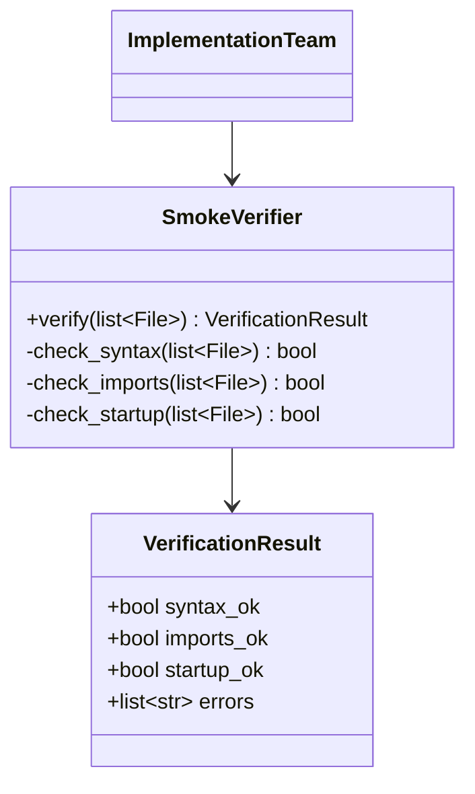
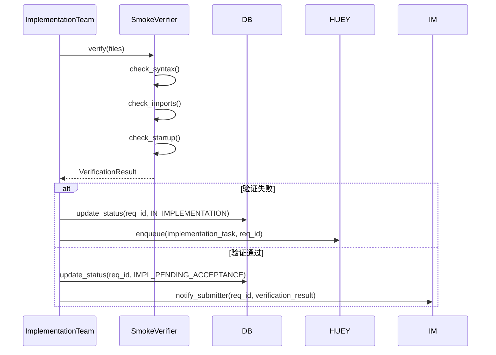
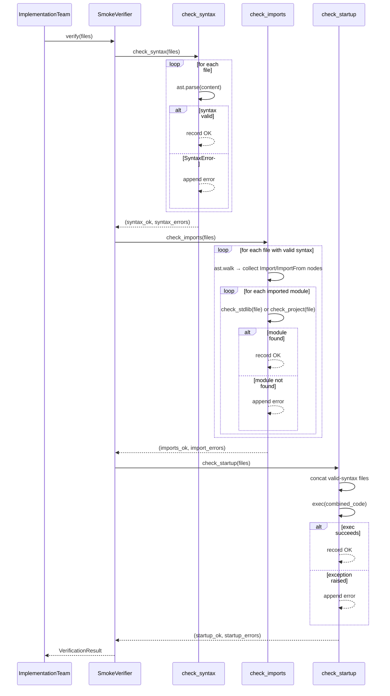

# Feature Detailed Design: 冲烟验证 (Feature #16)

**Date**: 2026-07-09
**Feature**: #16 — 冲烟验证
**Priority**: high
**Dependencies**: [15] (F015 实施团代码生成 — provides `CodeResult.code_files`)
**Design Reference**: docs/plans/2026-07-04-demandflow-design.md § 2.4
**SRS Reference**: FR-014

## Context

实现冲烟验证（Smoke Verification）组件，对 F015 生成的 Python 源代码文件进行语法检查、导入检查和启动检查，输出结构化的验证结果供实施系统决定状态流转。纯计算模块，无外部 I/O 依赖。

## Design Alignment

系统设计 §2.4 实施系统（FR-013, FR-014, FR-015, FR-016, FR-017a, FR-017b）中 SmokerVerifier 的完整定义：

### §2.4.2 Class Diagram



### §2.4.3 Sequence Diagram (relevant excerpt)



### §2.4.4 Design Notes

- **冲烟验证**: 语法/编译检查 + 导入检查 + 启动检查

### Key Bindings

- **Key classes**: `SmokeVerifier` (new), `VerificationResult` (new)
- **Interaction flow**: `ImplementationTeam` → `SmokeVerifier.verify(files)` → `VerificationResult`
- **Third-party deps**: none (pure Python stdlib: `ast`, `importlib`)
- **Deviations**: none

### Input/Output Formats

- **Input (`code_files`)**: `list[dict]` where each dict has:
  - `"path"`: `str` — relative file path (e.g., `"src/main.py"`)
  - `"content"`: `str` — source code text
- **Output (`VerificationResult`)**: Pydantic/dataclass model with:
  - `syntax_ok`: `bool`
  - `imports_ok`: `bool`
  - `startup_ok`: `bool`
  - `errors`: `list[str]`

## SRS Requirement

### FR-014: 冲烟验证

**Priority**: Must
**EARS**: When 源代码生成完成，the system shall 执行冲烟验证（语法/编译检查、导入检查、启动检查）以证明代码可运行。
**Visual output**: 看板详情展示验证结果日志
**Acceptance Criteria**:

- AC-1: Given 代码生成完成，when 验证，then 执行语法/编译 + 导入 + 启动检查并输出结果日志
- AC-2: Given 冲烟验证失败，when 处理，then 标记问题并自动迭代修复（计入 3 轮上限）
- AC-3: Given 冲烟验证通过，when 处理，then 进入实施待验收并触发确认门

### Trace Mapping

| AC | F016 Design Coverage | Note |
|----|---------------------|------|
| AC-1 | `verify()` method returns `VerificationResult` with all 3 checks executed | Primary scope of F016 |
| AC-2 | `VerificationResult.errors` contains problem details; `syntax_ok`/`imports_ok`/`startup_ok` flags indicate failure | Verification result enables retry; iteration orchestration is F015 responsibility |
| AC-3 | `VerificationResult` with all flags = True enables pass decision; state machine transition is F015 + F007 responsibility | Result drives pass gate |

## Component Data-Flow Diagram

```mermaid
flowchart LR
    subgraph Input
        CF[code_files: list[{path, content}]]
    end

    subgraph SmokeVerifier
        SV[SmokeVerifier]
        CS[check_syntax]
        CI[check_imports]
        CU[check_startup]
    end

    subgraph Output
        VR[VerificationResult]
    end

    CF --> SV
    SV --> CS
    SV --> CI
    SV --> CU
    CS --> VR
    CI --> VR
    CU --> VR
```

Data flow: `list[{path: str, content: str}]` → SmokeVerifier processes each file independently → accumulates errors → returns `VerificationResult {syntax_ok, imports_ok, startup_ok, errors}`.

## Interface Contract

| Method | Signature | Preconditions | Postconditions | Raises |
|--------|-----------|---------------|----------------|--------|
| `verify` | `verify(files: list[dict]) -> VerificationResult` | files is a list of dicts, each with "path" (str) and "content" (str) keys; files may be empty | Returns a VerificationResult with `syntax_ok`, `imports_ok`, `startup_ok` flags and accumulated `errors` list. All 3 checks execute independently (failures in one do not skip others). Empty files list: all flags False, errors contains "No files to verify". | None (no exceptions — all errors captured in result) |
| `check_syntax` | `check_syntax(files: list[dict]) -> tuple[bool, list[str]]` | files is a list of dicts with "content" (str) | Returns (all_parsed_ok, error_messages). Uses `ast.parse()` per file. Each syntax error produces one error message. | None |
| `check_imports` | `check_imports(files: list[dict]) -> tuple[bool, list[str]]` | files is a list of dicts with "path" and "content" (str) | Returns (all_imports_ok, error_messages). Parses AST of each file, extracts all `Import`/`ImportFrom` nodes. Checks each module against: (1) project files in the list, (2) Python stdlib (via `importlib.util.find_spec`). Only files with valid syntax are analyzed for imports. | None |
| `check_startup` | `check_startup(files: list[dict]) -> tuple[bool, list[str]]` | files is a list of dicts with "content" (str) | Returns (startup_ok, error_messages). Concatenates all file contents (sorted by path, only valid-syntax files) and executes via `exec()`. Catches any exception during exec. | None |

**Design rationale**:
- `verify` never raises exceptions — all error states are captured in `VerificationResult.errors`. This simplifies the caller (ImplementationTeam) which always gets a valid result object to inspect.
- `check_syntax` runs first, but `verify` still runs `check_imports` and `check_startup` even if syntax fails — maximizing diagnostic information.
- `check_imports` skips files with syntax errors (can't parse AST for imports) but still checks imports on valid files.
- `check_startup` concatenates only valid-syntax files — syntactically invalid code cannot be exec'd.
- Methods return `tuple[bool, list[str]]` to separate the boolean pass/fail from diagnostic details.
- **Cross-feature contract alignment**: F016 is not listed in Design §6.2 API contracts (no HTTP API surface). The `verify` method is called internally by `ImplementationTeam` (F015). Input format matches `CodeResult.code_files` and `CodeOutput.code_files` from F015.

## Visual Rendering Contract

> N/A — backend-only feature (`"ui": false`), no visual output

## Internal Sequence Diagram



## Algorithm / Core Logic

### `verify`

#### Flow Diagram

```mermaid
flowchart TD
    A[verify(files)] --> B{files empty?}
    B -->|Yes| C[Return VerificationResult all False<br>errors: No files to verify]
    B -->|No| D[check_syntax]
    D --> E[check_imports]
    E --> F[check_startup]
    F --> G[Assemble VerificationResult]
    G --> H[Return VerificationResult]
```

#### Pseudocode

```
FUNCTION verify(files: list[dict]) -> VerificationResult
  IF files is empty:
    RETURN VerificationResult(
      syntax_ok=False, imports_ok=False, startup_ok=False,
      errors=["No files to verify"]
    )

  syntax_ok, syntax_errors = check_syntax(files)
  imports_ok, import_errors = check_imports(files)
  startup_ok, startup_errors = check_startup(files)

  all_errors = syntax_errors + import_errors + startup_errors

  RETURN VerificationResult(
    syntax_ok=syntax_ok,
    imports_ok=imports_ok,
    startup_ok=startup_ok,
    errors=all_errors,
  )
END
```

#### Boundary Decisions

| Parameter | Min | Max | Empty/Null | At boundary |
|-----------|-----|-----|------------|-------------|
| `files` | 0 elements | Unbounded | All flags False, errors=["No files to verify"] | Single file: still runs all 3 checks |
| `files[i]["content"]` | 0 characters (empty string) | Unbounded | Empty string is valid Python — syntax OK, no imports, startup OK | Whitespace-only: valid Python (pass) |
| `files[i]["path"]` | 1 character | Unbounded | N/A (path must be non-empty per F015 contract) | Extensionless path: import checker converts module path correctly |

#### Error Handling

| Condition | Detection | Response | Recovery |
|-----------|-----------|----------|----------|
| Syntax error in file | `ast.parse()` raises `SyntaxError` | Append error message to syntax_errors; set syntax_ok=False | Other files continue to be checked; imports/startup checks on valid-syntax files proceed |
| Import of non-existent module | Module not in stdlib (via `importlib.util.find_spec`) nor in project files list | Append error message to import_errors; set imports_ok=False | Other imports continue to be checked |
| Import from file with syntax error | File excluded from import analysis | No import errors from that file (can't parse AST); silently skip | Other files' imports are checked normally |
| Runtime exception during exec | `exec()` raises any `Exception` | Append error message to startup_errors; set startup_ok=False | No recovery within verify — returns result with failure |
| File with no path key | KeyError accessing `file["path"]` | Not checked (F015 contract guarantees format) | N/A — preconditions assume valid format |
| File with no content key | KeyError accessing `file["content"]` | Not checked (F015 contract guarantees format) | N/A — preconditions assume valid format |

### `check_syntax`

#### Pseudocode

```
FUNCTION check_syntax(files: list[dict]) -> tuple[bool, list[str]]
  errors: list[str] = []
  all_ok: bool = True

  FOR EACH file IN files:
    TRY:
      ast.parse(file["content"])
    EXCEPT SyntaxError AS e:
      all_ok = False
      errors.append(f"Syntax error in {file['path']}: {e.msg}")

  RETURN (all_ok, errors)
END
```

#### Error Handling

| Condition | Detection | Response | Recovery |
|-----------|-----------|----------|----------|
| Empty file content | `ast.parse("")` succeeds (empty module is valid) | No error — empty file is syntactically valid Python | N/A |
| UnicodeDecodeError in content | Not possible (content is always str) | N/A | N/A |
| IndentationError (subclass of SyntaxError) | `ast.parse()` raises `IndentationError` | Caught by same except clause, appended to errors | Other files continue to be checked |

### `check_imports`

#### Pseudocode

```
FUNCTION check_imports(files: list[dict]) -> tuple[bool, list[str]]
  errors: list[str] = []
  all_ok: bool = True

  // Build set of project file paths for matching
  project_modules: set[str] = set()
  FOR EACH file IN files:
    path = file["path"]
    // Normalize: src/foo.py → src.foo
    module_name = path.replace("/", ".").replace("\\", ".")
    IF module_name.endswith(".py"):
      module_name = module_name[:-3]
    project_modules.add(module_name)
    // Also add parent package for __init__.py patterns
    // e.g., src/utils/__init__.py → src.utils

  FOR EACH file IN files:
    TRY:
      tree = ast.parse(file["content"])
    EXCEPT SyntaxError:
      CONTINUE  // skip files with syntax errors

    FOR EACH node IN ast.walk(tree):
      IF isinstance(node, ast.Import):
        FOR alias IN node.names:
          module = alias.name.split(".")[0]  // top-level module
          IF NOT _module_is_available(module, project_modules):
            all_ok = False
            errors.append(
              f"Module '{module}' not found (imported by {file['path']})"
            )
      ELIF isinstance(node, ast.ImportFrom):
        IF node.module:  // from X import Y
          module = node.module.split(".")[0]
          IF NOT _module_is_available(module, project_modules):
            all_ok = False
            errors.append(
              f"Module '{module}' not found (imported by {file['path']})"
            )

  RETURN (all_ok, errors)
END

FUNCTION _module_is_available(module_name: str, project_modules: set[str]) -> bool:
  // Check project files first
  IF module_name IN project_modules:
    RETURN True
  // Also check with common suffixes (e.g., src.utils → src/utils.py)
  FOR pm IN project_modules:
    IF pm.endswith("." + module_name) OR pm == module_name:
      RETURN True
  // Check stdlib / installed packages
  TRY:
    import importlib.util
    spec = importlib.util.find_spec(module_name)
    RETURN spec IS NOT None
  EXCEPT (ImportError, ValueError):
    RETURN False
END
```

#### Boundary Decisions

| Parameter | Min | Max | Empty/Null | At boundary |
|-----------|-----|-----|------------|-------------|
| Imports per file | 0 imports | Unbounded | No imports: passes silently | Single import: checking logic works |
| Module name depth | 1 (top-level) | Unbounded | N/A — we check top-level module only | `import a.b.c` → check `a` only |
| Project files | 0 files (all external) | Unbounded | No project files: all imports must be stdlib | Cross-file import: file A imports file B's module → should pass |

#### Error Handling

| Condition | Detection | Response | Recovery |
|-----------|-----------|----------|----------|
| File with syntax error skipped | `ast.parse()` raises SyntaxError | `CONTINUE` — no import analysis for that file | Other files' imports are still checked |
| `from . import X` (relative import) | `node.module` is None | Skip (relative imports are valid Python) | Other imports continue |
| `find_spec` raises ValueError (empty name) | Caught by except | Return False | Module flagged as unavailable |

### `check_startup`

#### Pseudocode

```
FUNCTION check_startup(files: list[dict]) -> tuple[bool, list[str]]
  errors: list[str] = []
  all_ok: bool = True

  // Collect only valid-syntax files, sorted by path for deterministic order
  valid_files = []
  FOR EACH file IN files:
    TRY:
      ast.parse(file["content"])
      valid_files.append(file)
    EXCEPT SyntaxError:
      PASS  // skip invalid files

  IF valid_files IS empty:
    RETURN (False, ["No valid files to execute"])

  // Concatenate all valid files
  sorted_files = SORT valid_files BY file["path"]
  combined_code = "\n".join(f["content"] for f in sorted_files)

  TRY:
    exec(combined_code)
  EXCEPT Exception AS e:
    all_ok = False
    errors.append(f"Startup error: {type(e).__name__}: {e}")

  RETURN (all_ok, errors)
END
```

#### Boundary Decisions

| Parameter | Min | Max | Empty/Null | At boundary |
|-----------|-----|-----|------------|-------------|
| Valid files after syntax filter | 0 | len(files) | 0 valid files → startup_ok=False, "No valid files to execute" | Single valid file: runs exec normally |
| Combined code length | 0 chars | Unbounded | Empty combined code (empty/whitespace-only files): exec("") succeeds | Single line of code: exec succeeds |

#### Error Handling

| Condition | Detection | Response | Recovery |
|-----------|-----------|----------|----------|
| Syntax-invalid files excluded | Try/except ast.parse | File excluded from concatenation | Other files proceed |
| Module-level exception | `exec()` raises Exception | Append error message; set startup_ok=False | No recovery within verify |
| exec with security-sensitive code | exec() catches all Exceptions | Ordinary exception handling | Security is out of scope for MVP (ASM-004) |

## State Diagram

> N/A — stateless feature. SmokeVerifier is a pure computation class with no internal state or lifecycle.

## Test Inventory

| ID | Category | Traces To | Input / Setup | Expected | Kills Which Bug? |
|----|----------|-----------|---------------|----------|-----------------|
| T001 | FUNC/happy | FR-014 AC-1; §3 verify postcondition | `files=[{"path": "main.py", "content": "def foo():\\n    pass\\n"}]` | `VerificationResult(syntax_ok=True, imports_ok=True, startup_ok=True, errors=[])` | verify returns wrong flags / misses check |
| T002 | FUNC/error | §3 verify; §5.3 error table (syntax) | `files=[{"path": "bad.py", "content": "def foo(\\n"}]` | `syntax_ok=False`, errors contain "Syntax error" substring | syntax check not implemented or exception not caught |
| T003 | FUNC/error | §3 verify; §5.3 error table (import) | `files=[{"path": "main.py", "content": "import nonexistent_xyz_module\\n"}]` | `imports_ok=False`, errors contain "not found" substring | import check not implemented or returns false positive |
| T004 | FUNC/error | §3 verify; §5.3 error table (startup) | `files=[{"path": "crash.py", "content": "raise RuntimeError(\\\"boom\\\")\\n"}]` | `startup_ok=False`, errors contain "RuntimeError" substring | startup check not implemented or exception escapes |
| T005 | BNDRY/edge | §5 boundary table (empty files) | `files=[]` | `VerificationResult(syntax_ok=False, imports_ok=False, startup_ok=False, errors=["No files to verify"])` | no guard for empty input; KeyError or crash |
| T006 | BNDRY/edge | §5.1 check_syntax; §5 boundary (empty content) | `files=[{"path": "empty.py", "content": ""}]` | `VerificationResult(syntax_ok=True, imports_ok=True, startup_ok=True, errors=[])` | empty string treated as syntax error |
| T007 | BNDRY/edge | §5.2 check_imports; §5.2 boundary | `files=[{"path": "main.py", "content": "import os\\nimport sys\\n"}]` | `VerificationResult(imports_ok=True, errors=[])` | stdlib modules falsely flagged as missing |
| T008 | BNDRY/edge | §5.2 check_imports; §5.2 error table | `files=[{"path": "main.py", "content": "from pathlib import Path\\n"}]` | `imports_ok=True` | `from X import Y` not handled |
| T009 | FUNC/happy | §5.2 check_imports; project module cross-ref | `files=[{"path": "src/utils.py", "content": "def helper(): pass\\n"}, {"path": "src/main.py", "content": "import src.utils\\n"}]` | `imports_ok=True` | project module cross-reference not resolved |
| T010 | BNDRY/edge | §5.1 check_syntax; multiple errors | `files=[{"path": "a.py", "content": "def foo(\\n"}, {"path": "b.py", "content": "x = \\n"}]` | `syntax_ok=False`, errors has 2 entries | second file's syntax error masked |
| T011 | BNDRY/edge | §5.3 check_startup; no valid syntax files | `files=[{"path": "bad.py", "content": "def foo(\\n"}]` | `startup_ok=False`, errors contain "No valid files to execute" | startup crash when all files have syntax errors |
| T012 | FUNC/happy | §5.3 check_startup; cross-file references | `files=[{"path": "lib.py", "content": "VALUE = 42\\n"}, {"path": "main.py", "content": "from lib import VALUE\\nresult = VALUE + 1\\n"}]` | `startup_ok=True` | cross-file references not resolved in exec |
| T013 | BNDRY/edge | §5.2 check_imports; syntax + import combo | `files=[{"path": "good.py", "content": "import json\\n"}, {"path": "bad_syntax.py", "content": "def broken(\\n"}, {"path": "needs_bad.py", "content": "from bad_syntax import x\\n"}]` | `syntax_ok=False`, imports still checked on good.py (json passes), bad_syntax.py excluded from import check | import check skips all files when one has syntax error |
| T014 | BNDRY/edge | §5.2 check_imports; relative import | `files=[{"path": "pkg/__init__.py", "content": ""}, {"path": "pkg/mod.py", "content": "from . import something\\n"}]` | `syntax_ok=True, imports_ok=True` (relative imports have node.module=None, skipped) | relative import causes error |
| T015 | BNDRY/edge | §5 boundary; single file with no imports | `files=[{"path": "main.py", "content": "x = 1\\n"}]` | `VerificationResult(syntax_ok=True, imports_ok=True, startup_ok=True)` | single file no imports treated as error |
| T016 | FUNC/error | FR-014 AC-2; §3 verify postcondition | `files=[{"path": "a.py", "content": "import os\\n"}, {"path": "b.py", "content": "import nonexistent_xyz_module\\n"}]` | `imports_ok=False`, errors contains "nonexistent_xyz_module not found" | mixed pass/fail not reflected correctly |
| T017 | BNDRY/edge | §5 boundary; IndentationError subclass | `files=[{"path": "bad.py", "content": "def foo():\\n  x = 1\\n    y = 2\\n"}]` | `syntax_ok=False`, errors contain "IndentationError" or "Syntax error" | IndentationError not caught (is subclass of SyntaxError) |

> INTG: N/A — pure function, no external I/O. All three checks use Python stdlib only (`ast`, `importlib.util`, `exec`). No database, HTTP, or filesystem access.

### Design Interface Coverage Gate — Verification

| Interface Item from §2.4 | Test Row Coverage | Status |
|--------------------------|-------------------|--------|
| `SmokeVerifier.verify(list~File~)` → `VerificationResult` | T001, T005 | ✅ |
| `check_syntax(list~File~)` → `bool` | T002, T006, T010, T017 | ✅ |
| `check_imports(list~File~)` → `bool` | T003, T007, T008, T009, T013, T014 | ✅ |
| `check_startup(list~File~)` → `bool` | T004, T011, T012 | ✅ |
| `VerificationResult.syntax_ok` | T001, T002, T010 | ✅ |
| `VerificationResult.imports_ok` | T001, T003, T007, T008, T009, T013, T016 | ✅ |
| `VerificationResult.startup_ok` | T001, T004, T011, T012 | ✅ |
| `VerificationResult.errors` (list~str~) | T002, T003, T004, T005, T010, T011, T016, T017 | ✅ |

All 8 design-specified items covered. **PASS**.

### Negative Test Ratio

Total rows: 17
Negative rows (FUNC/error + BNDRY/edge): 13 (T002, T003, T004, T005, T006, T007, T008, T010, T011, T013, T014, T016, T017) = 13/17 = **76.5% ≥ 40%** ✅

## Tasks

### Task 1: Write failing tests

**Files**: `tests/test_smoke_verification.py`

**Steps**:
1. Create test file with imports:
   - `from app.core.smoke_verification import SmokeVerifier, VerificationResult`
   - Standard pytest fixtures
2. Write test code for each row in Test Inventory (§7):
   - T001: `test_all_checks_pass` — valid single-file Python
   - T002: `test_syntax_error` — invalid syntax detected
   - T003: `test_import_error` — missing module flagged
   - T004: `test_startup_error` — module-level exception caught
   - T005: `test_empty_files` — empty list returns all-false
   - T006: `test_empty_content` — empty string is valid Python
   - T007: `test_stdlib_import_passes` — `import os, sys, json`
   - T008: `test_from_import` — `from pathlib import Path`
   - T009: `test_project_cross_ref` — file A imports file B's module
   - T010: `test_multiple_syntax_errors` — 2 files both with syntax errors
   - T011: `test_startup_no_valid_files` — all files have syntax errors
   - T012: `test_startup_cross_file_ref` — cross-file variable reference
   - T013: `test_combined_syntax_and_import` — mixed success/failure
   - T014: `test_relative_import_skipped` — `from . import X`
   - T015: `test_single_file_no_imports` — bare code passes
   - T016: `test_mixed_import_pass_fail` — one import passes, one fails
   - T017: `test_indentation_error` — IndentationError caught
3. Run: `pytest tests/test_smoke_verification.py -v`
4. **Expected**: All 17 tests FAIL — `SmokeVerifier` class does not exist yet, import raises `ModuleNotFoundError`

### Task 2: Implement minimal code

**Files**: `app/core/smoke_verification.py`

**Steps**:
1. Create `app/core/smoke_verification.py` with:
   ```python
   import ast
   import importlib.util

   from pydantic import BaseModel, Field


   class VerificationResult(BaseModel):
       syntax_ok: bool = False
       imports_ok: bool = False
       startup_ok: bool = False
       errors: list[str] = Field(default_factory=list)


   class SmokeVerifier:
       """冲烟验证器 — 对 LLM 生成的 Python 代码执行语法/导入/启动检查."""

       def verify(self, files: list[dict]) -> VerificationResult:
           if not files:
               return VerificationResult(
                   syntax_ok=False, imports_ok=False, startup_ok=False,
                   errors=["No files to verify"],
               )
           syntax_ok, syntax_errs = self.check_syntax(files)
           imports_ok, import_errs = self.check_imports(files)
           startup_ok, startup_errs = self.check_startup(files)
           return VerificationResult(
               syntax_ok=syntax_ok,
               imports_ok=imports_ok,
               startup_ok=startup_ok,
               errors=syntax_errs + import_errs + startup_errs,
           )

       def check_syntax(self, files: list[dict]) -> tuple[bool, list[str]]:
           errors = []
           for f in files:
               try:
                   ast.parse(f["content"])
               except SyntaxError as e:
                   errors.append(f"Syntax error in {f['path']}: {e.msg}")
           return (len(errors) == 0), errors

       def check_imports(self, files: list[dict]) -> tuple[bool, list[str]]:
           project_modules = set()
           for f in files:
               mod = f["path"].replace("/", ".").replace("\\", ".")
               if mod.endswith(".py"):
                   mod = mod[:-3]
               project_modules.add(mod)

           errors = []
           for f in files:
               try:
                   tree = ast.parse(f["content"])
               except SyntaxError:
                   continue
               for node in ast.walk(tree):
                   if isinstance(node, ast.Import):
                       for alias in node.names:
                           top = alias.name.split(".")[0]
                           if not self._module_available(top, project_modules):
                               errors.append(
                                   f"Module '{top}' not found (imported by {f['path']})"
                               )
                   elif isinstance(node, ast.ImportFrom):
                       if node.module is not None:
                           top = node.module.split(".")[0]
                           if not self._module_available(top, project_modules):
                               errors.append(
                                   f"Module '{top}' not found (imported by {f['path']})"
                               )
           return (len(errors) == 0), errors

       def check_startup(self, files: list[dict]) -> tuple[bool, list[str]]:
           valid = []
           for f in files:
               try:
                   ast.parse(f["content"])
                   valid.append(f)
               except SyntaxError:
                   pass
           if not valid:
               return False, ["No valid files to execute"]
           combined = "\n".join(f["content"] for f in sorted(valid, key=lambda x: x["path"]))
           try:
               exec(combined)
               return True, []
           except Exception as e:
               return False, [f"Startup error: {type(e).__name__}: {e}"]

       @staticmethod
       def _module_available(name: str, project_modules: set[str]) -> bool:
           if name in project_modules:
               return True
           for pm in project_modules:
               if pm.endswith("." + name):
                   return True
           try:
               return importlib.util.find_spec(name) is not None
           except (ImportError, ValueError):
               return False
   ```
2. Create `app/__init__.py` if not already present (ensures package imports work)
3. Run: `pytest tests/test_smoke_verification.py -v`
4. **Expected**: All 17 tests PASS

### Task 3: Coverage Gate

1. Run: `pytest --cov=app.core.smoke_verification --cov-report=term-missing tests/`
2. Check thresholds: line ≥ 80%, branch ≥ 70%
3. If below: add missing tests from boundary/error table
4. Record coverage output as evidence

### Task 4: Refactor

1. Extract `STDLIB_MODULES` frozenset for faster first-pass checking in `_module_available` (optimization — `importlib.util.find_spec` can be slow for repeated calls)
2. Add docstrings to each method if absent
3. Run: `pytest tests/test_smoke_verification.py -v`
4. **Expected**: All tests still PASS

### Task 5: Mutation Gate

1. Run: `mutmut run --paths-to-mutate=app/core/smoke_verification.py`
2. Check threshold ≥ 75%
3. If below: improve assertions (add more specific error message checks, edge cases)
4. Record mutation output as evidence

## Verification Checklist

- [x] All SRS acceptance criteria (FR-014 AC-1, AC-2, AC-3) traced to Interface Contract postconditions
- [x] All SRS acceptance criteria (FR-014 AC-1, AC-2, AC-3) traced to Test Inventory rows
- [x] Algorithm pseudocode covers all non-trivial methods (check_syntax, check_imports, check_startup, verify)
- [x] Boundary table covers all algorithm parameters
- [x] Error handling table covers all Raises entries
- [x] Test Inventory negative ratio >= 40% (76.5%)
- [x] Visual Rendering Contract complete for ui:true features — N/A (ui:false)
- [x] Each Visual Rendering Contract element has ≥1 UI/render Test Inventory row — N/A (ui:false)
- [x] Every skipped section has explicit "N/A — [reason]"
- [x] All functions/methods named in §4.N have at least one Test Inventory row (8/8 covered)

## Clarification Addendum

> No clarifications required — all specifications were unambiguous.

| # | Category | Original Ambiguity | Resolution | Authority |
|---|----------|--------------------|------------|-----------|
| — | — | — | — | — |
