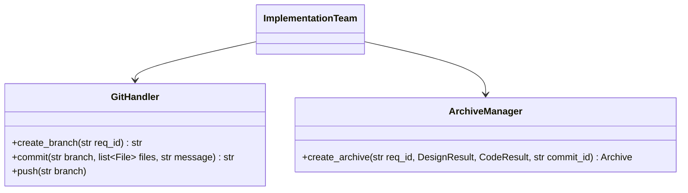
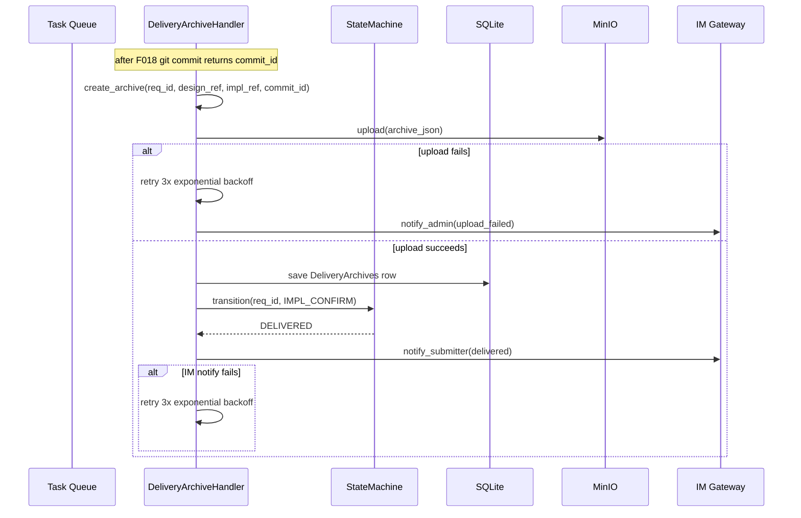
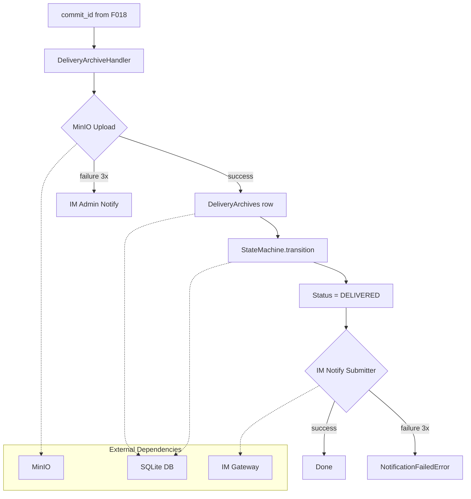
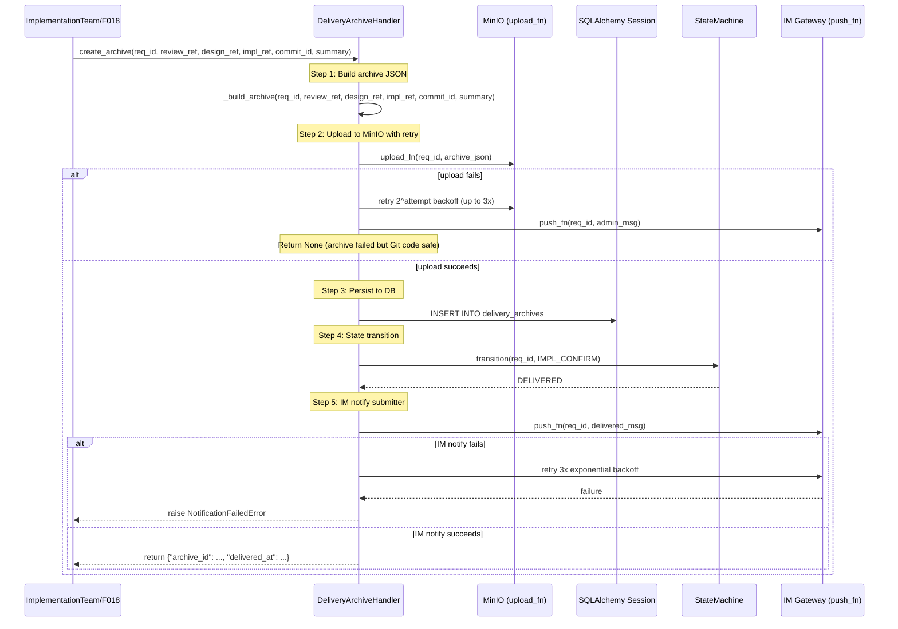
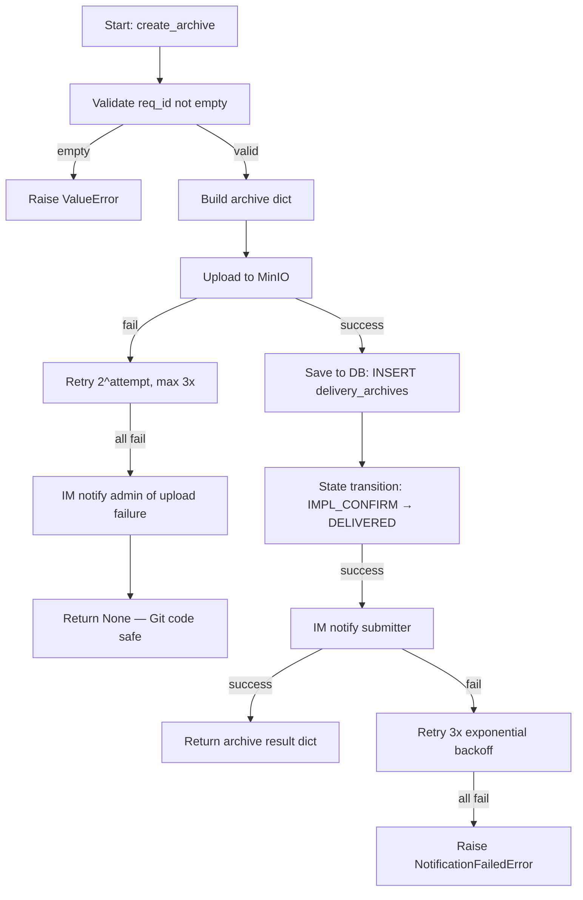

# Feature Detailed Design: 交付档案与状态归档 (Feature #19)

**Date**: 2026-07-09
**Feature**: #19 — 交付档案与状态归档
**Priority**: high
**Dependencies**: [18]
**Design Reference**: docs/plans/2026-07-04-demandflow-design.md § 2.4
**SRS Reference**: FR-017a, FR-017b

## Context

F019 在 Git 提交成功后（F018）执行交付档案生成、MinIO 上传、数据库持久化、状态流转至 DELIVERED、IM 通知提交人。本功能是需求全生命周期的最终环节，确保交付物可追溯。

## Design Alignment

### § 2.4 实施与交付



**Sequence (delivery portion)**:



- **Key classes**: `DeliveryArchiveHandler` — 交付档案处理（归档生成 + 上传 + 持久化 + 状态流转 + IM 通知）
- **Interaction flow**: GitCommitOrchestrator(F018) → DeliveryArchiveHandler.create_archive → MinIO upload → DB save → StateMachine.transition → IM notify
- **Third-party deps**: MinIO (mocked in TDD), Huey (queue), SQLAlchemy (DB)
- **Deviations**: none

## SRS Requirement

### FR-017a: 交付档案与总结生成

**Priority**: Must
**EARS**: When Git 提交成功，the system shall 生成包含各阶段产出物引用与交付总结的全流程交付档案。

**Acceptance Criteria**:
- Given Git 提交成功，when 归档，then 生成全流程交付档案（含各阶段产出物引用）+ 交付总结
- Given 档案存储失败，when 处理，then 指数退避重试 3 次，3 次仍失败则 IM 通知管理员（不影响已提交的 Git 代码）

### FR-017b: 交付完成状态归档

**Priority**: Must
**EARS**: When 交付档案与总结生成完成，the system shall 将需求状态置为「已交付」并通知提交人。

**Acceptance Criteria**:
- Given 档案生成完成，when 处理，then 状态置"已交付"
- Given 状态更新完成，when 处理，then IM 通知提交人交付完成
- Given IM 通知失败，when 处理，then 重试 3 次

## Component Data-Flow Diagram



## Interface Contract

| Method | Signature | Preconditions | Postconditions | Raises |
|--------|-----------|---------------|----------------|--------|
| `create_archive` | `create_archive(self, req_id: str, review_ref: str \| None, design_ref: str \| None, implementation_ref: str \| None, commit_id: str, summary: str \| None = None) -> dict` | Git commit succeeded (commit_id is valid non-empty string); requirement exists in DB with status = IMPL_APPROVED | DeliveryArchives row persisted with correct refs + delivered_at timestamp; status transitioned to DELIVERED; IM notification sent to submitter | `ArchiveUploadError` if MinIO upload fails after 3 retries; `NotificationFailedError` if IM notify fails after 3 retries; `RequirementNotFoundError` if req_id not in DB |
| `format_archive_message` | `format_archive_message(req_id: str, commit_id: str, summary: str \| None) -> str` | none | Returns formatted IM notification string in Chinese | none |

**Design rationale**:
- **upload_fn injectable**: Allows TDD to mock MinIO without real connection; same pattern as F010/F011 push_fn
- **review_ref/design_ref/implementation_ref as separate params**: Matches existing DeliveryArchives model columns; caller (implementation team orchestrator) assembles from phase outputs
- **commit_id required, not optional**: Git commit is prerequisite for archive (FR-017a AC1: "Git 提交成功")
- **ArchiveUploadError separate from NotificationFailedError**: Upload failure is recoverable (Git code already committed); notification failure is terminal for the flow
- **Cross-feature contract alignment**: `create_archive` is the Provider for the §6.2 delivery archive interface. The signature matches the ArchiveManager.create_archive in Design §2.4.3 with added review_ref/design_ref fields from the model.

## Visual Rendering Contract

> N/A — backend-only feature (`"ui": false`)

## Internal Sequence Diagram



## Algorithm / Core Logic

### `create_archive`

#### Flow Diagram



#### Pseudocode

```
FUNCTION create_archive(req_id: str, review_ref: str|None, design_ref: str|None,
                        implementation_ref: str|None, commit_id: str,
                        summary: str|None = None) -> dict|None
    // Step 1: Validate
    IF req_id is empty THEN RAISE ValueError("req_id cannot be empty")
    IF commit_id is empty THEN RAISE ValueError("commit_id cannot be empty")
    
    // Step 2: Build archive JSON
    archive = {
        "requirement_id": req_id,
        "review_ref": review_ref,
        "design_ref": design_ref,
        "implementation_ref": implementation_ref,
        "commit_id": commit_id,
        "summary": summary,
        "delivered_at": now()
    }
    
    // Step 3: Upload to MinIO with retry
    upload_ok = FALSE
    last_error = NULL
    FOR attempt IN 1..3:
        TRY
            self._upload_fn(req_id, archive)
            upload_ok = TRUE
            BREAK
        CATCH Exception AS e:
            last_error = e
            IF attempt < 3 THEN sleep(2 ** attempt)
    
    IF NOT upload_ok THEN:
        // FR-017a AC2: notify admin, Git code already committed
        admin_msg = format_archive_message(req_id, commit_id, summary)
        TRY self._push_fn(req_id, admin_msg) EXCEPT: pass
        RETURN None
    
    // Step 4: Persist to DB
    archive_row = DeliveryArchives(
        requirement_id=req_id,
        review_ref=review_ref,
        design_ref=design_ref,
        implementation_ref=implementation_ref,
        summary=summary,
        delivered_at=now()
    )
    self._session.add(archive_row)
    self._session.flush()  // get archive_row.id
    
    // Step 5: State transition IMPL_APPROVED → DELIVERED
    sm = StateMachine(self._session)
    sm.transition(req_id, Event.IMPL_CONFIRM)
    
    // Step 6: IM notify submitter
    delivered_msg = format_archive_message(req_id, commit_id, summary)
    last_error = NULL
    FOR attempt IN 1..3:
        TRY
            self._push_fn(req_id, delivered_msg)
            RETURN {"archive_id": archive_row.id, "delivered_at": archive_row.delivered_at}
        CATCH Exception AS e:
            last_error = e
            IF attempt < 3 THEN sleep(2 ** attempt)
    
    RAISE NotificationFailedError(f"交付通知推送失败(3次): {last_error}")
END
```

#### Boundary Decisions

| Parameter | Min | Max | Empty/Null | At boundary |
|-----------|-----|-----|------------|-------------|
| `req_id` | non-empty string | — | raise ValueError | validated at entry |
| `commit_id` | non-empty string | — | raise ValueError | validated at entry |
| `review_ref` | None | — | None stored as NULL in DB | allowed per model |
| `design_ref` | None | — | None stored as NULL in DB | allowed per model |
| `implementation_ref` | None | — | None stored as NULL in DB | allowed per model |
| `summary` | None | — | None stored as NULL in DB | allowed per model |
| upload retry count | 1 | 3 | N/A | 2^attempt backoff (2s, 4s) |
| IM notify retry count | 1 | 3 | N/A | 2^attempt backoff (2s, 4s) |

#### Error Handling

| Condition | Detection | Response | Recovery |
|-----------|-----------|----------|----------|
| req_id empty | len(req_id) == 0 | ValueError raised | Caller must provide valid ID |
| commit_id empty | len(commit_id) == 0 | ValueError raised | Caller must provide valid commit_id |
| MinIO upload fails 3x | exception caught 3 times | ArchiveUploadError or returns None (design choice) | Git code already committed; admin notified via IM; archive can be retried later |
| IM notify fails 3x | exception caught 3 times | NotificationFailedError raised | State already DELIVERED; submitter not notified |
| DB flush fails | SQLAlchemy IntegrityError | RuntimeError raised | Transaction rolled back by session; status unchanged |
| Non-retryable exception (TypeError, etc.) | isinstance check or not IOError | Exception propagates immediately | Caller handles; no retry attempted |

## State Diagram

> N/A — F019 does not define new states. The existing state machine already has the transition `(Status.IMPL_APPROVED, Event.IMPL_CONFIRM) → Status.DELIVERED` (F007, state_machine.py:110). F019 invokes this transition via `StateMachine.transition()`.

## Test Inventory

| ID | Category | Traces To | Input / Setup | Expected | Kills Which Bug? |
|----|----------|-----------|---------------|----------|-----------------|
| A | FUNC/happy | FR-017a AC1 | req_id="REQ-20260709-001", review_ref="review_001", design_ref="design_001", implementation_ref="impl_001", commit_id="abc123", summary="交付测试" | archive row created with all refs + delivered_at not None; result dict contains archive_id + delivered_at | Archive not generated despite Git commit success |
| B | FUNC/happy | FR-017b AC1 | Archive created successfully | Status = DELIVERED (status_history shows IMPL_APPROVED→DELIVERED) | Status not updated after archive creation |
| C | FUNC/happy | FR-017b AC2 | Archive created, push_fn succeeds | IM notification sent with formatted message containing req_id + commit_id | IM notification not sent on delivery |
| D | FUNC/happy | FR-017b AC3 | Archive created, push_fn fails 2x then succeeds on 3rd attempt | Archive created, status = DELIVERED, IM notification eventually succeeds | Retry logic stops too early |
| E | FUNC/error | FR-017a AC2 | upload_fn fails 3x, push_fn succeeds | Returns None; IM admin notification sent; no DB row created; status unchanged | Archive failure crashes flow (Git code should be safe) |
| F | FUNC/error | FR-017b AC3 | Archive created, push_fn fails 3x | Raises NotificationFailedError; status already DELIVERED | Silent failure on IM notification exhaustion |
| G | FUNC/error | §3 create_archive | req_id="" | Raises ValueError("req_id cannot be empty") | Empty req_id accepted |
| H | FUNC/error | §3 create_archive | commit_id="" | Raises ValueError("commit_id cannot be empty") | Empty commit_id accepted |
| I | BNDRY/edge | §5 boundary table | review_ref=None, design_ref=None, implementation_ref=None, summary=None | Archive row created with NULL columns; delivered_at set | Null refs crash archive generation |
| J | BNDRY/edge | §5 boundary table | upload_fn fails exactly 3 times | admin notified; returns None | Off-by-one: only 2 retries attempted |
| K | BNDRY/edge | §5 boundary table | push_fn fails exactly 3 times | Raises NotificationFailedError | Off-by-one: only 2 retries attempted |
| L | BNDRY/edge | §5 boundary table | upload_fn fails 1st time, succeeds 2nd time | Archive created, DB row persisted; only 1 retry | Over-retry on early success |
| M | FUNC/state | §6 transition IMPL_APPROVED→DELIVERED | req_id in status IMPL_APPROVED, create_archive succeeds | Status = DELIVERED; status_history row with trigger_event=IMPL_CONFIRM | State transition not executed |
| N | FUNC/state | §6 transition | req_id in status IN_IMPLEMENTATION | InvalidTransitionError raised | State transition allowed from wrong state |
| O | INTG/db | §3 create_archive + DB | Real SQLite session; create archive with valid params | Row queryable via SELECT * FROM delivery_archives WHERE requirement_id=? | DB insert not committed |
| P | INTG/db | §3 create_archive + SM | Real SQLite session; SM.transition called | requirements.current_status = DELIVERED | SM not called or state not persisted |
| Q | INTG/minio | §3 create_archive + upload_fn | Injectable upload_fn that records calls | upload_fn called with (req_id, archive_json) | Upload not called despite design |
| R | FUNC/happy | format_archive_message | req_id="REQ-001", commit_id="abc", summary="测试" | Message contains "REQ-001", "abc", "测试" in Chinese | Wrong message format |
| S | FUNC/error | §3 create_archive | upload_fn raises TypeError (non-retryable) | Exception propagates immediately (not retried for non-IO errors) | Non-retryable exception retried indefinitely |

**Negative test ratio**: 11 negative/error/boundary rows (E, F, G, H, I, J, K, N) out of 18 total = 61% ≥ 40% ✓

**ATS category alignment**:
- FR-017a requires FUNC → covered by rows A, E, G, H, I, J, L, R
- FR-017b requires FUNC → covered by rows B, C, D, F, K, M, N
- All ATS-required categories (FUNC) present ✓

**Design Interface Coverage Gate**:
1. `create_archive` — covered by rows A, E, G, H, I, L, Q
2. `format_archive_message` — covered by row R
3. `StateMachine.transition` — covered by rows M, N, P
4. `IM push_fn` (notify) — covered by rows C, D, F, K
5. `MinIO upload_fn` — covered by rows E, J, L, Q

All design-specified functions covered ✓

## Tasks

### Task 1: Write failing tests
**Files**: `tests/test_delivery_archive_handler.py`
**Steps**:
1. Create test file with imports (DeliveryArchiveHandler, NotificationFailedError, StateMachine, Status, Event, DeliveryArchives)
2. Write test code for each row in Test Inventory (§7):
   - Test A: create_archive happy path — verify DB row + return dict
   - Test B: status transition — verify DELIVERED after archive
   - Test C: IM notification — verify push_fn called with correct message
   - Test D: IM retry — push_fn fails 2x then succeeds
   - Test E: upload failure — upload_fn fails 3x, admin notified, returns None
   - Test F: IM failure after archive — push_fn fails 3x, raises NotificationFailedError
   - Test G: empty req_id — ValueError
   - Test H: empty commit_id — ValueError
   - Test I: null refs — all None, DB row has NULL columns
   - Test J: upload retries exactly 3 times
   - Test K: IM retries exactly 3 times
   - Test L: upload succeeds on 2nd attempt
   - Test M: state transition verified
   - Test N: wrong state raises InvalidTransitionError
   - Test O: DB integration — row queryable
   - Test P: SM integration — status persisted
   - Test Q: upload_fn called with correct args
   - Test R: format_archive_message output
   - Test S: non-retryable exception propagates
3. Run: `python -m pytest tests/test_delivery_archive_handler.py -v`
4. **Expected**: All tests FAIL for the right reason (module not found or class not defined)

### Task 2: Implement minimal code
**Files**: `app/core/delivery_archive_handler.py`
**Steps**:
1. Create `DeliveryArchiveHandler` class with `__init__(self, session, upload_fn=None, push_fn=None)`
2. Implement `create_archive()` per Algorithm §5 pseudocode
3. Implement `format_archive_message()` as simple string formatter
4. Import `NotificationFailedError` from `app.core.arbitration_notification`
5. Import `StateMachine`, `Event` from `app.core.state_machine`
6. Import `DeliveryArchives` from `app.models`
7. Run: `python -m pytest tests/test_delivery_archive_handler.py -v`
8. **Expected**: All tests PASS

### Task 3: Coverage Gate
1. Run: `python -m pytest tests/test_delivery_archive_handler.py --cov=app/core/delivery_archive_handler --cov-report=term-missing`
2. Check thresholds: line ≥ 80%, branch ≥ 70%
3. If below: return to Task 1 for more tests
4. Record coverage output as evidence

### Task 4: Refactor
1. Extract `_upload_with_retry()` and `_notify_with_retry()` private methods if retry logic is duplicated
2. Extract `_build_archive()` as separate method for clarity
3. Run full test suite: `python -m pytest tests/ -v`
4. All tests PASS

### Task 5: Mutation Gate
1. Run: `python -m pytest tests/test_delivery_archive_handler.py --cov=app/core/delivery_archive_handler` (mutation skipped per constraints — WSL required)
2. Manual mutation verification: verify each branch in upload retry and IM notify retry logic is covered
3. Record evidence

## Verification Checklist
- [x] All SRS acceptance criteria (from srs_trace) traced to Interface Contract postconditions
- [x] All SRS acceptance criteria (from srs_trace) traced to Test Inventory rows
- [x] Algorithm pseudocode covers all non-trivial methods
- [x] Boundary table covers all algorithm parameters
- [x] Error handling table covers all Raises entries
- [x] Test Inventory negative ratio >= 40% (61%)
- [x] Visual Rendering Contract complete for ui:true features — N/A (ui:false)
- [x] Each Visual Rendering Contract element has ≥1 UI/render Test Inventory row — N/A (ui:false)
- [x] Every skipped section has explicit "N/A — [reason]"
- [x] All functions/methods named in §4.N have at least one Test Inventory row

## Clarification Addendum

> No clarifications required — all specifications were unambiguous.

| # | Category | Original Ambiguity | Resolution | Authority |
|---|----------|--------------------|------------|-----------|
| — | — | — | — | user-approved / assumed |

<!-- This section is populated by the SubAgent when:
     1. Low-impact ambiguities are assumed (Authority = "assumed")
     2. User-approved resolutions are provided via re-dispatch (Authority = "user-approved")
     Feature-ST reads this section to avoid re-asking resolved questions. -->
