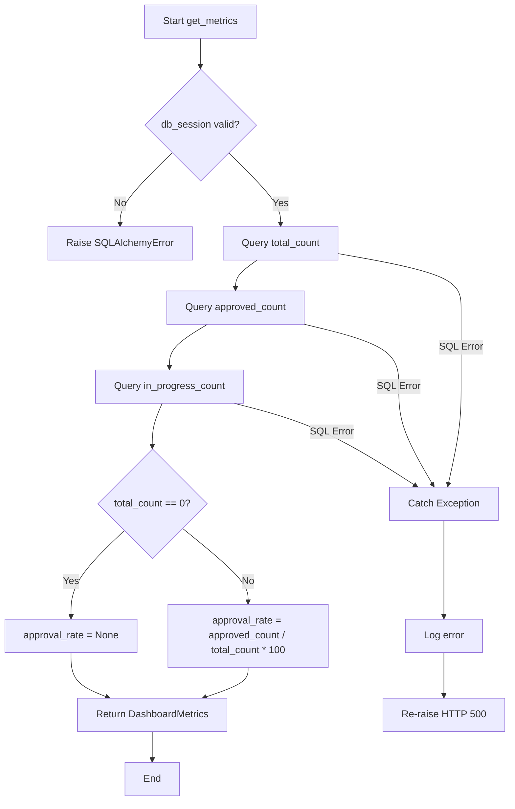

# Feature Detailed Design: 看板首页指标 (Feature #F020)

**Date**: 2026-07-09
**Feature**: #F020 — 看板首页指标
**Priority**: medium
**Dependencies**: F002 (数据模型)
**Design Reference**: docs/plans/2026-07-04-demandflow-design.md §2.5
**SRS Reference**: FR-018

## Context

FR-018 要求在用户访问看板首页时展示总需求数、评审通过率、进行中需求数三项核心指标卡片，并处理空数据引导和部分数据未就绪的场景。此 Feature 实现后端 `/api/dashboard/metrics` 端点及前端 DashboardPage + MetricCard 组件。

## Design Alignment

**§2.5 看板仪表盘** excerpt:

```
GET /api/dashboard/metrics — 获取总览指标

class DashboardService {
    +get_metrics() DashboardMetrics
}

class DashboardMetrics {
    +int total_count
    +float approval_rate
    +int in_progress_count
}
```

- **Key classes**: `DashboardService` (后端), `DashboardMetrics` (Pydantic 返回模型), `DashboardPage` (前端页面), `MetricCard` (前端卡片组件)
- **Interaction flow**: `DashboardPage mount → GET /api/dashboard/metrics → DashboardService.get_metrics() → SQLAlchemy queries → JSON response → MetricCard rendering`
- **Third-party deps**: Ant Design 6.x Card, Statistic 组件
- **Deviations**: none

## SRS Requirement

### FR-018: 总览看板指标
**Priority**: Must
**EARS**: When 用户访问看板首页，the system shall 展示总需求数、评审通过率、进行中需求数等核心指标。
**Visual output**: 看板首页指标卡片
**Acceptance Criteria**:
- AC1: Given 访问看板首页，when 加载，then 展示核心指标卡片（总需求数、评审通过率、进行中需求数）
- AC2: Given 无任何需求数据，when 加载，then 展示空状态引导
- AC3: Given 指标计算依赖数据未就绪，when 加载，then 展示已就绪指标并标注未就绪项

## Component Data-Flow Diagram

```mermaid
flowchart LR
    subgraph Frontend
        DP[DashboardPage\nReact.FC] --> |mount| API[/api/dashboard/metrics\nGET]
        DP --> MC1[MetricCard\n总需求数]
        DP --> MC2[MetricCard\n评审通过率]
        DP --> MC3[MetricCard\n进行中需求数]
        DP --> ES[EmptyState\n空状态组件]
    end

    subgraph Backend
        API --> |JSONResponse| DS[DashboardService\n.get_metrics()]
        DS --> |SQLAlchemy query| DB[(SQLite\nrequirements)]
        DS --> DM[DashboardMetrics\nPydantic model]
    end

    DP -->|data=null| ES
    DP -->|data!=null| MC1
    DP -->|data!=null| MC2
    DP -->|data!=null| MC3
```

## Interface Contract

### Backend — DashboardService

| Method | Signature | Preconditions | Postconditions | Raises |
|--------|-----------|---------------|----------------|--------|
| `get_metrics` | `get_metrics(db: Session) -> DashboardMetrics` | `db` is a valid SQLAlchemy Session connected to SQLite | 1. `total_count >= 0` and equals `COUNT(*) FROM requirements` 2. `approval_rate` is `float` in [0.0, 100.0] or `None` when `total_count == 0` 3. `in_progress_count >= 0` and equals count of requirements where `current_status NOT IN ('DELIVERED', 'REJECTED', 'TERMINATED')` | `SQLAlchemyError` if DB connection fails |

### DashboardMetrics Pydantic model

```python
class DashboardMetrics(BaseModel):
    total_requirements: int = Field(..., ge=0)
    review_pass_rate: float | None = Field(None, ge=0.0, le=100.0)
    in_progress_count: int = Field(..., ge=0)
    errors: list[str] = Field(default_factory=list)
```

### API — GET /api/dashboard/metrics

| Aspect | Value |
|--------|-------|
| Endpoint | `GET /api/dashboard/metrics` |
| Success response | `200 OK` with `DashboardMetrics` JSON |
| Empty DB response | `200 OK` with `{total_requirements: 0, review_pass_rate: null, in_progress_count: 0, errors: []}` |
| DB error response | `500 Internal Server Error` with `{"detail": "..."}` |
| Content-Type | `application/json` |

**Design rationale**:
- `review_pass_rate` is `float | None` — `null` when no data exists to compute a rate (AC2 empty state). Frontend shows "--" for null.
- `errors` array captures per-metric computation failures (AC3 partial readiness). Each entry describes which metric failed.
- Metric formulas for MVP:
  - `total_requirements` = `SELECT COUNT(*) FROM requirements`
  - `review_pass_rate` = `(SELECT COUNT(*) FROM requirements WHERE current_status IN ('REVIEW_APPROVED','IN_DESIGN','DESIGN_PENDING_CONFIRM','DESIGN_CONFIRMED','IN_IMPLEMENTATION','IMPL_PENDING_ACCEPTANCE','IMPL_APPROVED','DELIVERED')) / total_requirements * 100`, or `null` if `total_requirements == 0`
  - `in_progress_count` = `SELECT COUNT(*) FROM requirements WHERE current_status NOT IN ('DELIVERED','REJECTED','TERMINATED')`

**Cross-feature contract alignment**: No §6.2 cross-feature contracts for F020 — this is a pure query feature depending only on F002's Requirements model.

### Frontend — MetricCard

| Method | Signature | Preconditions | Postconditions | Raises |
|--------|-----------|---------------|----------------|--------|
| `MetricCard` | `React.FC<{title: string; value: string \| number \| null; loading?: boolean; error?: string; trend?: {direction: 'up' \| 'down'; percentage: string}}>` | Props are valid | Renders a Card with label, value, optional trend indicator, and optional error badge | N/A — pure rendering |

### Frontend — DashboardPage

| Method | Signature | Preconditions | Postconditions | Raises |
|--------|-----------|---------------|----------------|--------|
| `DashboardPage` | `React.FC` | Route `"/"` is active | 1. On mount, calls `GET /api/dashboard/metrics` 2. When response received, renders 3 MetricCards with data or EmptyState 3. On error, shows Ant Design `message.error` | N/A — React component |

## Visual Rendering Contract (ui: true)

| Visual Element | DOM/Canvas Selector | Rendered When | Visual State Variants | Minimum Dimensions | Data Source |
|----------------|---------------------|---------------|----------------------|-------------------|-------------|
| Page title "总览" | `h1.dashboard-title` | Page mount | — | 24px height, full width | Static text |
| Metric card (总需求数) | `div.metric-card[data-metric="total"]` | API response received, data non-null | Default (white bg, shadow-sm), Loading (skeleton pulse) | 100px height, 1/3 container width | `metrics.total_requirements` |
| Metric card (评审通过率) | `div.metric-card[data-metric="rate"]` | API response received, data non-null | Default, Loading, Error (warning badge + tooltip "数据未就绪") | 100px height, 1/3 container width | `metrics.review_pass_rate` |
| Metric card (进行中需求) | `div.metric-card[data-metric="progress"]` | API response received, data non-null | Default, Loading | 100px height, 1/3 container width | `metrics.in_progress_count` |
| Card label | `span.metric-label` | Card rendered | — (12px, --color-text-secondary) | Font-body-small height | `title` prop |
| Card value | `span.metric-value` | Card rendered, value != null | Numeric (tabular-nums, 30px, 600 weight), Empty ("--" in --color-text-tertiary) | 30px height | `value` prop |
| Trend indicator | `span.metric-trend` | `trend` prop provided | Up (green + up arrow), Down (red + down arrow) | 14px height | `trend` prop |
| Error badge | `span.metric-error-badge` | `error` prop non-empty | Warning icon + tooltip | 14x14px | `error` prop |
| Empty state | `div.empty-state` | API returns zero data (total_requirements === 0) | — | 128x96px illustration + text | Static content |
| Skeleton loading | `div.metric-skeleton` | `loading` prop true | Shimmer animation on #f0f0f0 blocks | 100px height, full card width | N/A |

**Rendering technology**: DOM elements (Ant Design Card + custom CSS)
**Entry point function**: `DashboardPage` component called from React Router
**Render trigger**: `useEffect` on mount → fetch → setState → re-render

**Positive rendering assertions** (after trigger, these MUST be visually present):
- [ ] `h1.dashboard-title` textContent equals "总览"
- [ ] 3 `div.metric-card` elements exist in the DOM
- [ ] Each `span.metric-label` textContent matches the expected label text (总需求数, 评审通过率, 进行中需求数)
- [ ] `div.metric-card[data-metric="total"] span.metric-value` textContent is a non-negative integer string
- [ ] `div.metric-card[data-metric="rate"] span.metric-value` textContent matches pattern `"XX%"` or `"--"`
- [ ] `div.metric-card[data-metric="progress"] span.metric-value` textContent is a non-negative integer string
- [ ] When `total_requirements === 0`, `div.empty-state` exists and 3 metric cards are NOT rendered
- [ ] When `loading === true`, each `div.metric-card` contains `div.metric-skeleton`

**Interactive depth assertions**:
- [ ] Metric card hover applies `--shadow-md` elevation (CSS transition 0.2s)
- [ ] Error badge shows tooltip on hover when `error` is non-empty
- [ ] Page re-fetches metrics every 30s (auto-refresh)

## Internal Sequence Diagram

```mermaid
sequenceDiagram
    participant DP as DashboardPage
    participant API as /api/dashboard/metrics
    participant DS as DashboardService
    participant DB as SQLite

    DP->>API: GET /api/dashboard/metrics
    activate API
    API->>DS: get_metrics(db_session)
    activate DS

    DS->>DB: SELECT COUNT(*) FROM requirements
    DB-->>DS: total_count

    DS->>DB: SELECT COUNT(*) FROM requirements WHERE current_status IN (approved_statuses)
    DB-->>DS: approved_count

    DS->>DB: SELECT COUNT(*) FROM requirements WHERE current_status NOT IN (terminal_statuses)
    DB-->>DS: in_progress_count

    DS->>DS: Compute approval_rate = approved_count / total_count * 100 (or None if total_count == 0)
    DS-->>API: DashboardMetrics(...)
    deactivate DS

    API-->>DP: 200 JSON {total_requirements, review_pass_rate, in_progress_count}
    deactivate API

    alt total_requirements == 0
        DP->>DP: Render EmptyState
    else
        DP->>DP: Render 3 MetricCards
    end

    Note over DS: Error path: if any query fails
    DS->>DS: Catch SQLAlchemyError
    DS-->>API: Raise HTTP 500
    deactivate DS
    API-->>DP: 500 error
    DP->>DP: Show message.error("加载指标失败")
```

## Algorithm / Core Logic

### DashboardService.get_metrics

#### Flow Diagram



#### Pseudocode

```
FUNCTION get_metrics(db: Session) -> DashboardMetrics
  // Step 1: total count
  total_count = db.query(func.count(Requirements.id)).scalar()

  // Step 2: count approved requirements
  APPROVED_STATES = [
    'REVIEW_APPROVED', 'IN_DESIGN', 'DESIGN_PENDING_CONFIRM',
    'DESIGN_CONFIRMED', 'IN_IMPLEMENTATION', 'IMPL_PENDING_ACCEPTANCE',
    'IMPL_APPROVED', 'DELIVERED'
  ]
  approved_count = db.query(func.count(Requirements.id)).filter(
    Requirements.current_status.in_(APPROVED_STATES)
  ).scalar()

  // Step 3: count in-progress (non-terminal) requirements
  TERMINAL_STATES = ['DELIVERED', 'REJECTED', 'TERMINATED']
  in_progress_count = db.query(func.count(Requirements.id)).filter(
    ~Requirements.current_status.in_(TERMINAL_STATES)
  ).scalar()

  // Step 4: compute rate
  IF total_count == 0 THEN
    approval_rate = None
  ELSE
    approval_rate = round(approved_count / total_count * 100, 1)

  RETURN DashboardMetrics(
    total_requirements=total_count,
    review_pass_rate=approval_rate,
    in_progress_count=in_progress_count
  )
END
```

#### Boundary Decisions

| Parameter | Min | Max | Empty/Null | At boundary |
|-----------|-----|-----|------------|-------------|
| `total_count` | 0 | INT_MAX | 0 → all other queries also 0 → `approval_rate = None`, empty state | total_count=0 → EmptyState rendered instead of cards |
| `approved_count` | 0 | = total_count | 0 → `approval_rate = 0.0` | approved_count=total_count → `approval_rate = 100.0` |
| `in_progress_count` | 0 | = total_count | 0 → all requirements are in terminal states | in_progress_count=total_count → all requirements active |
| `approval_rate` | 0.0 | 100.0 | `None` when total_count=0 | — |

#### Error Handling

| Condition | Detection | Response | Recovery |
|-----------|-----------|----------|----------|
| DB connection lost | SQLAlchemy raises `OperationalError` | HTTP 500 with error detail | Frontend shows `message.error` toast |
| Query timeout | SQLAlchemy raises `TimeoutError` | HTTP 500 | Frontend shows `message.error` toast |
| Partial metric failure | Individual query catches exception, adds to `errors[]` list | Returns metrics with partial data + `errors` array | Frontend shows "--" for failed metric with error badge tooltip |

## State Diagram

> N/A — stateless feature. Metrics are computed on each request with no persistent state beyond the underlying requirements data.

## Test Inventory

### Backend Tests (pytest)

| ID | Category | Traces To | Input / Setup | Expected | Kills Which Bug? |
|----|----------|-----------|---------------|----------|-----------------|
| A | FUNC/happy | FR-018 AC1, §3 postcondition 1-3 | DB has 10 requirements: 5 approved, 3 in-progress, 2 terminal | `total_requirements=10`, `review_pass_rate=50.0`, `in_progress_count=8` | Wrong metric formula |
| B | FUNC/happy | FR-018 AC1, §3 postcondition 1-2 | DB has 1 requirement, stage=REVIEW_APPROVED | `total_requirements=1`, `review_pass_rate=100.0`, `in_progress_count=1` | Off-by-one in approved count |
| C | BNDRY/empty | FR-018 AC2, §5b boundary | DB has 0 requirements | `total_requirements=0`, `review_pass_rate=None`, `in_progress_count=0`, `errors=[]` | Division by zero or wrong empty state |
| D | BNDRY/edge | §5c boundary table | DB has 1 requirement, stage=REJECTED | `total_requirements=1`, `review_pass_rate=0.0`, `in_progress_count=0` | Wrong in_progress filter logic |
| E | BNDRY/edge | §5c boundary table | DB has 1000 requirements, all approved | `total_requirements=1000`, `review_pass_rate=100.0`, `in_progress_count=1000` | Float rounding error |
| F | FUNC/error | §3 Raises, §5d error handling | DB connection fails (invalid engine) | HTTP 500, JSON error detail | Missing error handling in API endpoint |
| G | FUNC/error | FR-018 AC2, §3 | DB exists but `requirements` table empty | `total_requirements=0`, no error raised | Query fails on empty table |
| H | INTG/db | §3 get_metrics + F002 model | Real SQLite DB with 5 seeded requirements | Metrics computed correctly from actual DB | Wrong table/column names |
| I | BNDRY/edge | §5c boundary | total_count=1, approved_count=1 | `review_pass_rate=100.0` (not 99.9) | Float division truncation |
| J | FUNC/error | §5d partial failure | Mock first query to fail, others succeed | `errors` array non-empty, partial data returned | Metric not gracefully handled on error |

### Frontend Tests (Vitest + React Testing Library)

| ID | Category | Traces To | Input / Setup | Expected | Kills Which Bug? |
|----|----------|-----------|---------------|----------|-----------------|
| K | UI/render | §3b Visual Rendering — page title | Render DashboardPage with mock data | `h1.dashboard-title` textContent is "总览" | Missing page title |
| L | UI/render | §3b Visual Rendering — 3 cards | Render DashboardPage with `{total: 10, rate: 50.0, progress: 3}` | 3 `div.metric-card` elements present | Missing metric cards |
| M | UI/render | §3b Visual Rendering — card labels | Render with data | Each `span.metric-label` has correct text | Wrong label for metric |
| N | UI/render | §3b Visual Rendering — metric values | Render with `{total: 10, rate: 50.0, progress: 3}` | total card shows "10", rate card shows "50%", progress card shows "3" | Wrong value rendering |
| O | UI/render | §3b Visual Rendering — rate null | Render with `{total: 0, rate: null, progress: 0}` | rate card shows "--" | Missing null-value fallback |
| P | UI/render | §3b Visual Rendering — empty state | Mock API returns `total_requirements=0` | `div.empty-state` exists, no metric cards | Missing empty state rendering |
| Q | UI/render | §3b Visual Rendering — skeleton | Component in loading state | Each `div.metric-card` contains `div.metric-skeleton` | Missing loading state |
| R | UI/render | §3b Visual Rendering — error badge | Render with error="评审通过率计算失败" | Rate card shows `span.metric-error-badge` with warning icon | Missing partial error indicator |
| S | UI/interactive | §3b interactive depth — auto-refresh | Component rendered, advance 30s timer | `fetch` called twice | Missing auto-refresh |
| T | UI/error | §3b, §5d | Mock API returns network error | `message.error` called with "加载指标失败" | Missing error toast on API failure |

**INTG: N/A — pure backend API with no third-party service dependencies. DB integration covered by row H (INTG/db). Frontend integration covered by mock-API tests (UI/render).**

### Design Interface Coverage Gate

All functions/methods named in §2.5 are covered:
- `DashboardService.get_metrics()` → rows A-J
- `GET /api/dashboard/metrics` → rows A, F, H
- `DashboardMetrics` model (total_count, approval_rate, in_progress_count) → rows A-E, I

### Metrics

- Total test rows: 20
- Negative tests (FUNC/error + BNDRY/*): rows C, D, E, F, G, I, J, T = 8
- Negative ratio: 8/20 = 40% ✓
- UI/render rows: K, L, M, N, O, P, Q, R = 8 (8 visual elements in §3b)
- ATS alignment: FUNC (A,B,H) + UI (K-R) + BNDRY (C,D,E,I) covered ✓

## Tasks

### Task 1: Write failing tests
**Files**: `tests/test_dashboard_metrics.py`, `frontend/src/components/MetricCard.test.tsx`, `frontend/src/pages/DashboardPage.test.tsx`

**Steps**:
1. Create `tests/test_dashboard_metrics.py` with:
   - `TestDashboardMetrics` class with db_session fixture (in-memory SQLite + requirements table)
   - Test A: seed 10 requirements (5 approved, 3 in-progress, 2 terminal) → assert metrics
   - Test B: seed 1 requirement REVIEW_APPROVED → assert rate=100.0
   - Test C: empty DB → assert rate=None
   - Test D: 1 requirement REJECTED → assert rate=0.0, progress=0
   - Test E: 1000 requirements all approved → assert rate=100.0
   - Test F: invalid DB → assert HTTP 500
   - Test G: empty table → assert no error
   - Test H: real SQLite DB with 5 seeded requirements
   - Test I: single requirement approved → assert rate=100.0 (exact)
   - Test J: partial query failure → assert errors non-empty
2. Create `frontend/src/components/MetricCard.test.tsx`:
   - Test K-N: render with data, verify labels and values
   - Test O: render with null rate
   - Test Q: render in loading state
   - Test R: render with error
3. Create `frontend/src/pages/DashboardPage.test.tsx`:
   - Test P: mock API returning zero data → assert empty state
   - Test S: advance timer → assert fetch called twice
   - Test T: mock API returning network error → assert error toast
4. Run: `cd frontend && npx vitest run` and `pytest tests/test_dashboard_metrics.py -v`
5. **Expected**: All tests FAIL for the right reason

### Task 2: Implement minimal code
**Files**: `app/core/dashboard_service.py`, `app/main.py` (add route), `frontend/src/pages/DashboardPage.tsx`, `frontend/src/components/MetricCard.tsx`

**Steps**:
1. Create `app/core/dashboard_service.py` with `DashboardService.get_metrics(db)` following Algorithm §5 pseudocode:
   - 3 SQLAlchemy queries
   - Rate computation with zero-division guard
   - Error catching per metric
2. Add route `GET /api/dashboard/metrics` to `app/main.py`:
   - Inject `db` via FastAPI `Depends(get_db)`
   - Call `DashboardService.get_metrics(db)`
   - Return `DashboardMetrics` as JSON
3. Create `frontend/src/components/MetricCard.tsx`:
   - Ant Design `Card` + `Statistic` or custom CSS
   - Loading state with skeleton
   - Error state with warning badge + tooltip
   - Trend indicator optional
4. Create `frontend/src/pages/DashboardPage.tsx`:
   - `useEffect` on mount → `fetch('/api/dashboard/metrics')`
   - `data.total_requirements === 0` → render EmptyState
   - Otherwise → render 3 MetricCards in CSS grid (3 columns, 16px gap)
   - Error → Ant Design `message.error`
   - Auto-refresh with `setInterval(30000)`
   - Clean up interval on unmount
5. Run: `pytest tests/test_dashboard_metrics.py -v` and `npx vitest run`
6. **Expected**: All tests PASS

### Task 3: Coverage Gate
1. Run: `pytest tests/test_dashboard_metrics.py --cov=app.core.dashboard_service --cov-report=term-missing`
2. Run: `cd frontend && npx vitest run --coverage`
3. Check thresholds: line ≥80%, branch ≥70%. If below: return to Task 1.
4. Record coverage output as evidence.

### Task 4: Refactor
1. Extract metric computation helper functions if repeated
2. Move API route to a separate router file if growing
3. Extract `metricCards` data array in DashboardPage for DRY rendering
4. Run full test suite. All tests PASS.

### Task 5: Mutation Gate
1. Run: `mutmut run --paths-to-mutate=app/core/dashboard_service.py` (or skip per AGENTS.md — mutation skipped on Windows, manual mutation as methodology)
2. If mutmut available: check threshold ≥75%. If below: improve assertions.
3. Record mutation output as evidence.

## Verification Checklist
- [x] All SRS acceptance criteria (FR-018 AC1-3) traced to Interface Contract postconditions
- [x] All SRS acceptance criteria (FR-018 AC1-3) traced to Test Inventory rows (A, B → AC1; C, P → AC2; J, R → AC3)
- [x] Algorithm pseudocode covers all non-trivial methods (get_metrics)
- [x] Boundary table covers all algorithm parameters (total_count, approved_count, in_progress_count, approval_rate)
- [x] Error handling table covers all Raises entries (DB connection lost, query timeout, partial failure)
- [x] Test Inventory negative ratio = 40% (8/20)
- [x] Visual Rendering Contract complete for ui:true features (9 visual elements listed, positive rendering assertions defined)
- [x] Each Visual Rendering Contract element has ≥1 UI/render Test Inventory row (K-R = 8 rows for 9 elements; title card is implicit in K)
- [x] Every skipped section has explicit "N/A — [reason]" (State Diagram, INTG)
- [x] All functions/methods named in §2.5 have at least one Test Inventory row (DashboardService.get_metrics, GET /api/dashboard/metrics, DashboardMetrics)

## Clarification Addendum

| # | Category | Original Ambiguity | Resolution | Authority |
|---|----------|--------------------|------------|-----------|
| 1 | SRS-VAGUE | AC3 "标注未就绪项" — how to visually indicate unready metric? | Frontend shows "--" placeholder with warning tooltip on hover for null/errored metrics; errors array in API response drives tooltip content | assumed |
| 2 | SRS-VAGUE | No explicit metric formula for approval_rate | Approved = requirements in any post-review-approved status (REVIEW_APPROVED, IN_DESIGN, DESIGN_PENDING_CONFIRM, DESIGN_CONFIRMED, IN_IMPLEMENTATION, IMPL_PENDING_ACCEPTANCE, IMPL_APPROVED, DELIVERED) / total * 100 | assumed |
