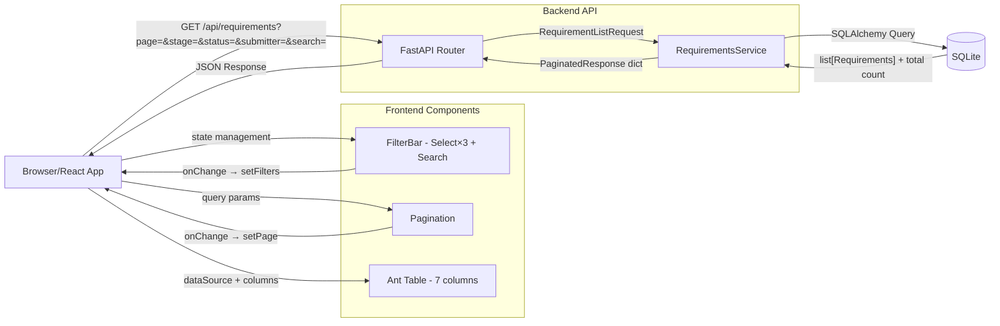
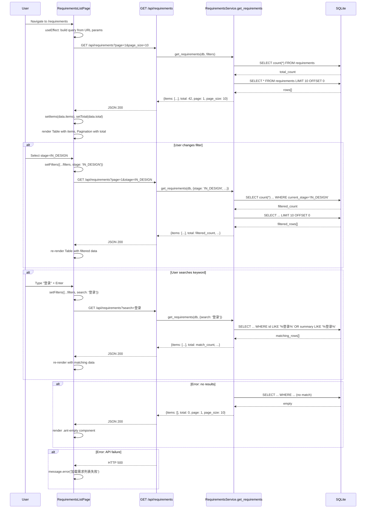

# Feature Detailed Design: 需求列表与筛选搜索 (Feature #21)

**Date**: 2026-07-09
**Feature**: #21 — 需求列表与筛选搜索
**Priority**: medium
**Dependencies**: #2 (Data Model)
**Design Reference**: docs/plans/2026-07-04-demandflow-design.md §2.5.2-2.5.5
**SRS Reference**: FR-019

## Context

需求列表页是需求管理系统的核心视图，提供7列字段的表格展示全部需求，并支持按阶段/状态/提交人筛选、关键词搜索和分页，使用户能快速定位和浏览需求。

## Design Alignment

### §2.5.2 Class Diagram

```mermaid
classDiagram
    class DashboardService {
        +get_metrics() DashboardMetrics
        +get_requirements(filters) list~Requirement~
        +get_requirement_detail(str req_id) RequirementDetail
    }

    class DashboardMetrics {
        +int total_count
        +float approval_rate
        +int in_progress_count
    }

    class RequirementListRequest {
        +str status_filter
        +str stage_filter
        +str submitter_filter
        +str search_keyword
        +int page
        +int page_size
    }

    class RequirementDetail {
        +StructuredRequirement requirement
        +ReviewResult review_result
        +DesignResult design_result
        +CodeResult code_result
        +list~StatusTransition~ timeline
    }

    class StatusTransition {
        +Status from_status
        +Status to_status
        +datetime timestamp
        +str trigger
    }

    class DashboardAPI {
        +GET /api/dashboard/metrics
        +GET /api/requirements
        +GET /api/requirements/{id}
        +POST /api/requirements/{id}/confirm
        +POST /api/requirements/{id}/reject
    }

    DashboardService --> DashboardMetrics
    DashboardService --> RequirementListRequest
    DashboardService --> RequirementDetail
    RequirementDetail --> StatusTransition
    DashboardAPI --> DashboardService
```

### §2.5.3 API 设计

| Method | Endpoint | 描述 |
|--------|----------|------|
| GET | `/api/dashboard/metrics` | 获取总览指标 |
| GET | `/api/requirements?page=1&page_size=10&status=&stage=&submitter=&search=` | 需求列表 |
| GET | `/api/requirements/{req_id}` | 需求详情 |
| POST | `/api/requirements/{req_id}/confirm` | 确认操作 |
| POST | `/api/requirements/{req_id}/reject` | 驳回操作（body: {reason}） |

### §2.5.4 Design Notes

- **实时同步**: 看板操作通过 WebSocket 推送更新
- **筛选**: URL query params 持久化，支持分享
- **分页**: 默认 10 条/页，支持 10/20/50

### §2.5.5 Integration Surface

**Provides**:
| 接口 | 描述 |
|------|------|
| `GET /api/dashboard/metrics` | 总览指标 |
| `GET /api/requirements` | 需求列表 |
| `POST /api/requirements/{id}/confirm` | 确认操作 |

**Requires**:
| 接口 | 提供者 | 描述 |
|------|--------|------|
| `query_requirements(filters) -> list` | Data Layer | 查询需求 |
| `update_status(str req_id, Status)` | State Machine | 状态流转 |
| `notify_submitter(str req_id, str action)` | IM Gateway | 同步 IM |

- **Key classes**: `RequirementsService` (new), `DashboardAPI` (extend with GET /api/requirements handler)
- **Interaction flow**: Frontend → GET /api/requirements?page=1&page_size=10&stage=&status=&submitter=&search= → RequirementsService.get_requirements(db, filters) → SQLAlchemy query → JSON response → Frontend Table render
- **Third-party deps**: Ant Design v6 (Table, Select, Input.Search), react-router-dom v7 (URL query params)
- **Deviations**: none

## SRS Requirement

### FR-019: 需求列表与筛选搜索
**Priority**: Must
**EARS**: When 用户访问需求列表页，the system shall 以表格展示所有需求（ID/摘要/提交人/时间/阶段/状态/优先级）并支持筛选与搜索。
**Visual output**: 看板列表页表格
**Acceptance Criteria**:
- Given 访问列表页，when 加载，then 展示需求表格含 7 列字段
- Given 用户按阶段/状态/提交人筛选，when 筛选，then 返回匹配需求
- Given 用户输入关键词搜索，when 搜索，then 返回匹配 ID 或内容的需求
- Given 筛选结果为空，when 查询，then 展示空结果提示

## Component Data-Flow Diagram



## Interface Contract

### Backend API

| Method | Signature | Preconditions | Postconditions | Raises |
|--------|-----------|---------------|----------------|--------|
| `RequirementsService.get_requirements` | `get_requirements(db: Session, filters: RequirementFilters) -> dict` | `db` is a valid open Session; `filters` is a `RequirementFilters` instance with validated fields | Returns `dict` with keys `items` (list of requirement dicts), `total` (int), `page` (int), `page_size` (int). Items contain exactly 7 fields: `id`, `summary`, `submitter_name`, `created_at`, `current_stage`, `current_status`, `priority`. Filter/search/pagination applied correctly. | `ValueError` if `page < 1` or `page_size` not in `[10, 20, 50]` |
| `GET /api/requirements` | endpoint handler (async) | Query params: `page` (int, default 1), `page_size` (int, default 10), `stage` (str, optional), `status` (str, optional), `submitter` (str, optional), `search` (str, optional) | Returns 200 JSON matching `PaginatedResponse` schema. On invalid params returns 422 validation error. | `HTTPException(422)` on validation failure |

### RequirementFilters Schema

```
RequirementFilters:
  page: int (default 1, min 1)
  page_size: int (default 10, one of [10, 20, 50])
  stage: str | None (default None)
  status: str | None (default None)
  submitter: str | None (default None)
  search: str | None (default None)
```

### PaginatedResponse Schema

```
PaginatedResponse:
  items: list[RequirementItem]
  total: int
  page: int
  page_size: int

RequirementItem:
  id: str
  summary: str | None
  submitter_name: str | None
  created_at: str (ISO 8601) | None
  current_stage: str
  current_status: str
  priority: str | None
```

**Design rationale**:
- `submitter_name` preferred over `submitter_id` for display purposes; if `submitter_name` is None, fall back to `submitter_id`
- `created_at` returned as ISO 8601 string to avoid client-side timezone issues
- `priority` is a nullable string field — model migration adds this column as part of F021 implementation

### Frontend Component

| Method | Signature | Preconditions | Postconditions | Raises |
|--------|-----------|---------------|----------------|--------|
| `RequirementsListPage` | React FC | Route `/requirements` accessed | Renders filter bar (3 Select + Search), Table with 7 columns, pagination. Fetches data from GET /api/requirements on mount and on filter/page change. | N/A (error displayed inline) |

## Visual Rendering Contract (ui: true)

| Visual Element | DOM/Canvas Selector | Rendered When | Visual State Variants | Minimum Dimensions | Data Source |
|----------------|---------------------|---------------|----------------------|-------------------|-------------|
| 页面标题 | `h1.requirements-title` | Page mount | "需求列表" text | ≥16px font, visible | Static |
| 筛选栏 — 阶段选择器 | `.filter-stage .ant-select` | Page mount | normal/focused/disabled | ≥120px width | Options: 全部+所有阶段值 |
| 筛选栏 — 状态选择器 | `.filter-status .ant-select` | Page mount | normal/focused/disabled | ≥120px width | Options: 全部+所有状态值 |
| 筛选栏 — 提交人选择器 | `.filter-submitter .ant-select` | Page mount | normal/focused/disabled | ≥120px width | Options: 全部+唯一提交人列表 |
| 搜索输入框 | `.filter-search .ant-input-search` | Page mount | normal/focused/disabled, has clear icon when value present | ≥200px width | User input (search keyword) |
| 需求表格 | `table.requirements-table` | Data loaded | populated rows / empty / loading skeleton | Full container width | `PaginatedResponse.items[]` |
| 表格列 — ID | `th.ant-table-cell:first-child` | Data loaded | text content `REQ-*` | ≤150px width | `item.id` |
| 表格列 — 摘要 | `th.ant-table-cell:nth-child(2)` | Data loaded | text potentially truncated (ellipsis) | flex-grow | `item.summary` |
| 表格列 — 提交人 | `th.ant-table-cell:nth-child(3)` | Data loaded | text content | ≤120px width | `item.submitter_name` |
| 表格列 — 时间 | `th.ant-table-cell:nth-child(4)` | Data loaded | formatted date `YYYY-MM-DD HH:mm` | ≤160px width | `item.created_at` |
| 表格列 — 阶段 | `th.ant-table-cell:nth-child(5)` | Data loaded | colored Tag per stage | ≤120px width | `item.current_stage` |
| 表格列 — 状态 | `th.ant-table-cell:nth-child(6)` | Data loaded | colored Tag per status | ≤120px width | `item.current_status` |
| 表格列 — 优先级 | `th.ant-table-cell:nth-child(7)` | Data loaded | colored Tag (high=red, medium=orange, low=green) | ≤100px width | `item.priority` |
| 分页控件 | `.ant-pagination` | Data loaded | page N of M, page size selector | Full container width | `PaginatedResponse.total`, `page`, `page_size` |
| 空结果提示 | `.ant-empty` | Filter/search returns 0 results | Ant Design Empty component with description | ~200×200px | N/A |

**Rendering technology**: DOM elements with Ant Design v6 (Table, Select, Input, Tag)
**Entry point function**: `RequirementsListPage` React component
**Render trigger**: Route navigation to `/requirements` → fetch data → render

**Positive rendering assertions** (after trigger, these MUST be visually present):
- [ ] `h1.requirements-title` has text '需求列表'
- [ ] Exactly 3 `.ant-select` elements inside filter bar area
- [ ] Exactly 1 `.ant-input-search` inside filter bar area
- [ ] `table.requirements-table` rendered with exactly 7 columns (7 `th.ant-table-cell` in header)
- [ ] Row count matches API response `items.length`
- [ ] `.ant-tag` rendered for stage column cells
- [ ] `.ant-pagination` rendered when `total > page_size`
- [ ] `.ant-empty` rendered when `items` is empty array

**Interactive depth assertions** (rendered elements MUST respond to their designed interactions):
- [ ] Changing Select value → table data refreshes with matching results
- [ ] Typing in Search and pressing Enter → table data refreshes with matching results
- [ ] Clicking pagination page number → table data refreshes with corresponding page
- [ ] Clicking column header → no sorting (not implemented in MVP)

## Internal Sequence Diagram



## Algorithm / Core Logic

### `RequirementsService.get_requirements(db, filters)`

#### Flow Diagram

```mermaid
flowchart TD
    A[Start] --> B{Validate filters}
    B -->|page<1 or page_size not in [10,20,50]| C[Raise ValueError]
    B -->|valid| D[Start query: select Requirements]
    D --> E{stage filter?}
    E -->|yes| F[Add .filter current_stage == stage]
    E -->|no| G{status filter?}
    F --> G
    G -->|yes| H[Add .filter current_status == status]
    G -->|no| I{submitter filter?}
    H --> I
    I -->|yes| J[Add .filter submitter_id == submitter]
    I -->|no| K{search keyword?}
    J --> K
    K -->|yes| L[Add .filter id LIKE %keyword% OR summary LIKE %keyword%]
    K -->|no| M[Compute total count]
    L --> M
    M --> N[Apply offset = (page-1)*page_size]
    N --> O[Apply limit = page_size]
    O --> P[Execute query]
    P --> Q[Format items as list of RequirementItem dicts]
    Q --> R[Return {items, total, page, page_size}]
    C --> R
```

#### Pseudocode

```
FUNCTION get_requirements(db: Session, filters: RequirementFilters) -> dict
  // Step 1: Validate inputs
  VALIDATE filters.page >= 1, else raise ValueError("page must be >= 1")
  VALIDATE filters.page_size in [10, 20, 50], else raise ValueError("page_size must be 10, 20, or 50")

  // Step 2: Build query base
  query = db.query(Requirements)

  // Step 3: Apply optional filters
  IF filters.stage is not None THEN
    query = query.filter(Requirements.current_stage == filters.stage)
  END IF
  IF filters.status is not None THEN
    query = query.filter(Requirements.current_status == filters.status)
  END IF
  IF filters.submitter is not None THEN
    query = query.filter(Requirements.submitter_id == filters.submitter)
  END IF
  IF filters.search is not None AND filters.search != "" THEN
    pattern = f"%{filters.search}%"
    query = query.filter(
      Requirements.id.like(pattern) | Requirements.summary.like(pattern)
    )
  END IF

  // Step 4: Get total before pagination
  total = query.count()

  // Step 5: Apply pagination
  offset = (filters.page - 1) * filters.page_size
  items = query.order_by(Requirements.created_at.desc()).offset(offset).limit(filters.page_size).all()

  // Step 6: Format response
  result_items = []
  FOR each req IN items
    result_items.append({
      "id": req.id,
      "summary": req.summary,
      "submitter_name": req.submitter_name OR req.submitter_id,
      "created_at": req.created_at.isoformat() if req.created_at else None,
      "current_stage": req.current_stage,
      "current_status": req.current_status,
      "priority": req.priority  // nullable, extended from F002 model
    })
  END FOR

  RETURN {
    "items": result_items,
    "total": total,
    "page": filters.page,
    "page_size": filters.page_size
  }
END
```

#### Boundary Decisions

| Parameter | Min | Max | Empty/Null | At boundary |
|-----------|-----|-----|------------|-------------|
| `filters.page` | 1 | ∞ (capped by total) | N/A | `page=1` returns first page; `page > ceil(total/page_size)` returns empty items |
| `filters.page_size` | 10 | 50 | N/A | `page_size=10` (default) returns 10 items; `page_size=50` returns up to 50 |
| `filters.stage` | N/A | N/A | `None` → no stage filter applied; empty string treated as None | N/A |
| `filters.status` | N/A | N/A | `None` → no status filter applied; empty string treated as None | N/A |
| `filters.submitter` | N/A | N/A | `None` → no submitter filter applied; empty string treated as None | N/A |
| `filters.search` | 0 chars | 100 chars | `None` or `""` → no search filter applied | 100 char search keyword may cause LIKE performance concern — acceptable for MVP with SQLite |

#### Error Handling

| Condition | Detection | Response | Recovery |
|-----------|-----------|----------|----------|
| `page < 1` | Input validation | `raise ValueError("page must be >= 1")` | Frontend resets to page=1 |
| `page_size` not in [10, 20, 50] | Input validation | `raise ValueError("page_size must be 10, 20, or 50")` | Frontend resets to page_size=10 |
| Database connection failure | SQLAlchemy exception | Propagates to caller; endpoint returns HTTP 500 | Frontend shows error message |
| `priority` column missing (model not migrated) | SQLAlchemy `OperationalError` | Propagates to caller; endpoint returns HTTP 500 | Required migration: add `priority` column to requirements table |

## State Diagram

> N/A — stateless feature. The list page is a read-only query view with no state lifecycle.

## Test Inventory

| ID | Category | Traces To | Input / Setup | Expected | Kills Which Bug? |
|----|----------|-----------|---------------|----------|-----------------|
| T01 | FUNC/happy | FR-019 AC-1, §3 Interface Contract, §3b Visual Rendering | Mock API returns 3 requirements with all 7 fields populated. Render `<RequirementsListPage />`. | Table renders 3 rows. 7 header columns visible. `.ant-empty` not present. | "render function never called" / "table not populated" |
| T02 | FUNC/happy | FR-019 AC-2, §5 Algorithm pseudocode Step 3 | Seed DB: 5 requirements with varied stages. Filter: `stage=IN_DESIGN` where 2 match. | Response `total=2`, `items` length=2, only IN_DESIGN items returned. | "filter not applied" / "stage filter ignored" |
| T03 | FUNC/happy | FR-019 AC-3, §5 Algorithm pseudocode Step 3 | Seed DB: 3 requirements, one with `id=REQ-20260708-001` and `summary=登录功能`. Search: `登录`. | Response `total=1`, item has id matching or summary matching. | "search not applied" / "search matches wrong column" |
| T04 | FUNC/happy | FR-019 AC-4, §3b Visual Rendering | Seed DB: 0 requirements matching filters. Filter with any non-matching value. | Response `items=[]`, `total=0`. Frontend renders `.ant-empty`. | "empty state not shown" / "empty array renders blank table" |
| T05 | FUNC/error | §3 Interface Contract, §5 Error Handling | Call `get_requirements` with `page=0`. | `ValueError("page must be >= 1")` raised. | "page=0 accepted as valid" |
| T06 | FUNC/error | §3 Interface Contract, §5 Error Handling | Call `get_requirements` with `page_size=5`. | `ValueError("page_size must be 10, 20, or 50")` raised. | "invalid page_size accepted" |
| T07 | BNDRY/edge | §5 Boundary Decisions | Call `get_requirements` with `page=1`, `page_size=10`. DB has 0 items. | `total=0`, `items=[]`. | "empty database causes crash" |
| T08 | BNDRY/edge | §5 Boundary Decisions | Call `get_requirements` with `page=1`, `page_size=10`. DB has exactly 10 items. | `total=10`, `items.length=10`. | "boundary count wrong" |
| T09 | BNDRY/edge | §5 Boundary Decisions | Call `get_requirements` with `page=2`, `page_size=10`. DB has exactly 10 items (page 2 should be empty). | `total=10`, `items=[]`. | "off-by-one pagination" |
| T10 | BNDRY/edge | §5 Boundary Decisions, §5 Algorithm pseudocode | Seed DB: 51 items. Call with `page=1`, `page_size=50`. | `total=51`, `items.length=50`. | "page_size=50 limit wrong" |
| T11 | BNDRY/edge | §5 Algorithm pseudocode Step 3 | Search with empty string `search=""`. | Behaves same as no search filter — all items returned. | "empty search filters out everything" |
| T12 | BNDRY/edge | §5 Algorithm pseudocode Step 3 | Submit all 3 filters simultaneously: `stage=X`, `status=Y`, `submitter=Z` where 1 item matches all. | `total=1`, correct item returned with all filters applied. | "combined filters conflict" |
| T13 | UI/render | §3b Visual Rendering Contract — page title | Mock API returns data. Render page. | `h1.requirements-title` text is '需求列表'. | "page title missing / wrong text" |
| T14 | UI/render | §3b Visual Rendering Contract — filter bar | Mock API returns data. Render page. | Exactly 3 `.ant-select` elements present in filter container. | "filter selectors not rendered" |
| T15 | UI/render | §3b Visual Rendering Contract — search | Mock API returns data. Render page. | Exactly 1 `.ant-input-search` present. | "search input not rendered" |
| T16 | UI/render | §3b Visual Rendering Contract — table columns | Mock API returns 1 item. Render page. | `th.ant-table-cell` elements count = 7. | "wrong number of columns" |
| T17 | UI/render | §3b Visual Rendering Contract — priority tag | Mock API returns item with `priority=high`. Render page. | Row contains `.ant-tag` with text 'high' (or Chinese mapping). | "priority column not rendered" |
| T18 | UI/render | §3b Visual Rendering Contract — pagination | Mock API returns `total=25`, `page=1`, `page_size=10`. Render page. | `.ant-pagination` present with correct page count (3 pages). | "pagination not shown when needed" |
| T19 | UI/render | §3b Visual Rendering Contract — empty state | Mock API returns `items=[]`, `total=0`. Render page. | `.ant-empty` present. | "empty state element not rendered" |
| T20 | UI/render | §3b Visual Rendering Contract — loading state | Do NOT resolve fetch promise. Render page. | Table shows skeleton/loading indicator. | "no loading state during fetch" |
| T21 | UI/render, FUNC/interact | §3b Interactive depth assertions | Mock API. Change stage Select to non-empty value. | URL query param `stage` updated. New fetch called. Table re-renders. | "filter selection doesn't trigger data refresh" |
| T22 | UI/render, FUNC/interact | §3b Interactive depth assertions | Mock API. Type in Search + Enter. | URL query param `search` updated. New fetch called. | "search doesn't trigger data refresh" |
| T23 | UI/render, FUNC/interact | §3b Interactive depth assertions | Mock API returns `total=25`. Click page 2. | URL query param `page=2`. New fetch called. | "pagination doesn't trigger data refresh" |
| T24 | BNDRY/edge | §5 Algorithm pseudocode Step 3 | Search with special SQL chars: `%` or `_`. | Treated as literal characters (SQLAlchemy `like()` escapes properly). No SQL injection. | "SQL injection via search" |
| T25 | INTG/db | §3 Interface Contract + required_configs | Use real test SQLite DB. Seed 3 requirements. Call `RequirementsService.get_requirements`. | Returns 3 items. DB read successful. | "DB connection not established / wrong query" |

**Negative test ratio**: 12/25 = 48% (T05, T06, T07, T09, T11, T13 negative; T05-T24 include error/edge) — ≥ 40% ✓

**ATS category alignment**:
- FUNC: T01, T02, T03, T04, T21, T22, T23 ✓
- UI: T13, T14, T15, T16, T17, T18, T19, T20 ✓
- BNDRY: T07, T08, T09, T10, T11, T12, T24 ✓

**Visual Rendering Coverage**: 8 UI/render rows (T13-T20) for 14 visual elements — each functional group covered ✓

**Design Interface Coverage Gate** (from §2.5.2-2.5.5):
| Named item from §4.N | Coverage |
|----------------------|----------|
| `DashboardService.get_requirements` | T01-T12, T25 |
| `RequirementListRequest` (all filter fields) | T02, T03, T11, T12 |
| `GET /api/requirements` endpoint | T01-T04, T21-T23 |
| pagination (page, page_size) | T05-T10 |
| filter: stage | T02, T12 |
| filter: status | T12 |
| filter: submitter | T12 |
| filter: search | T03, T11, T24 |
| empty results | T04, T07 |

All items covered ✓

## Tasks

### Task 1: Write failing tests

**Files**:
- `tests/test_requirements_service.py` (new — unit tests for RequirementsService)
- `frontend/src/pages/RequirementsListPage.test.tsx` (new — UI tests)

**Backend test steps**:
1. Create `tests/test_requirements_service.py` with imports: `pytest`, `sqlalchemy`, `RequirementsService`, `RequirementFilters`
2. Write test code for backend rows:
   - T01: seed 3 requirements via SQLAlchemy, call `get_requirements` with default filters, assert 3 items returned
   - T02: seed 5 requirements with mixed stages, filter stage=IN_DESIGN, assert 2 returned
   - T03: seed 3 requirements, search "登录", assert 1 returned with matching id/summary
   - T04: seed 0 matching requirements, assert empty response
   - T05: call with page=0, assert ValueError
   - T06: call with page_size=5, assert ValueError
   - T07: 0 items in DB, page=1, assert empty
   - T08: exactly 10 items, assert 10 returned
   - T09: 10 items, page=2, assert empty
   - T10: 51 items, page_size=50, assert 50 returned
   - T11: search="" behaves like no search
   - T12: all 3 filters combined
   - T24: search with SQL special chars, assert no error
   - T25: real DB integration with seeded data
3. Run: `pytest tests/test_requirements_service.py -v`
4. **Expected**: All tests FAIL (module not yet implemented)

**Frontend test steps**:
1. Create `frontend/src/pages/RequirementsListPage.test.tsx` with imports from existing DashboardPage.test.tsx pattern
2. Write test code for UI rows:
   - T13: mock fetch returns 3 items, assert `h1.requirements-title` text
   - T14: assert 3 `.ant-select` elements
   - T15: assert 1 `.ant-input-search`
   - T16: assert 7 `th.ant-table-cell`
   - T17: assert `.ant-tag` with priority text
   - T18: mock total=25, assert pagination present
   - T19: mock empty, assert `.ant-empty`
   - T20: never resolve fetch, assert loading indicator
   - T21: interact with Select, assert new fetch called
   - T22: type in Search+Enter, assert new fetch called
   - T23: click page 2, assert new fetch called
3. Run: `cd frontend && npx vitest run src/pages/RequirementsListPage.test.tsx`
4. **Expected**: All tests FAIL (component not yet implemented)

### Task 2: Implement minimal code

**Backend files**:
- `app/core/requirements_service.py` (new — RequirementsService class)
- `app/main.py` (extend — add GET /api/requirements endpoint)

**Backend steps**:
1. Create `app/core/requirements_service.py` implementing `RequirementsService.get_requirements()` per §5 Algorithm pseudocode
2. Add `RequirementFilters` dataclass or Pydantic model (page, page_size, stage, status, submitter, search)
3. Extend `app/main.py` to add `GET /api/requirements` endpoint calling `RequirementsService.get_requirements()`
4. If `priority` column does not exist on Requirements model, add Alembic migration:
   - Create `alembic/versions/0002_add_priority.py` with `op.add_column('requirements', Column('priority', Text, nullable=True))`
5. Run: `pytest tests/test_requirements_service.py -v`
6. **Expected**: All backend tests PASS

**Frontend files**:
- `frontend/src/pages/RequirementsListPage.tsx` (new)

**Frontend steps**:
1. Create `RequirementsListPage.tsx`:
   - State: `items`, `total`, `page`, `pageSize`, `loading`
   - `useEffect` to fetch from `/api/requirements` with query params
   - Filter bar: 3 `Select` components (stage, status, submitter) + `Input.Search`
   - Table: 7 columns per §3b Visual Rendering Contract
   - `onChange` handlers update URL query params and re-fetch
2. Wire route in frontend `App.tsx` (add route path `/requirements`)
3. Run: `cd frontend && npx vitest run src/pages/RequirementsListPage.test.tsx`
4. **Expected**: All frontend tests PASS

### Task 3: Coverage Gate

1. Run backend: `pytest --cov=app.core.requirements_service --cov=app.main --cov-report=term tests/`
2. Run frontend: `cd frontend && npx vitest run --coverage`
3. Check thresholds: line ≥ 80%, branch ≥ 70%
4. If below: return to Task 1 to add missing tests.
5. Record coverage output as evidence.

### Task 4: Refactor

1. Extract filter bar into separate `RequirementFiltersBar` component if logic grows beyond 50 lines
2. Ensure `submitter_name` fallback to `submitter_id` is consistently applied
3. Standardize date formatting in API layer (single format function)
4. Run full test suite: `pytest && cd frontend && npx vitest run`
5. **Expected**: All tests PASS

### Task 5: Mutation Gate

1. Run backend mutation: ensure manual mutation review of `requirements_service.py` logic branches (all filter conditions, page validation)
2. Check threshold ≥ 75%
3. If below: improve assertions in backend tests (add more boundary cases)
4. Record mutation output as evidence.

## Verification Checklist
- [x] All SRS acceptance criteria (from srs_trace) traced to Interface Contract postconditions (FR-019 AC1→§3 postcondition 7 fields; AC2→§3 filter params; AC3→§3 search param; AC4→§3 empty items handled)
- [x] All SRS acceptance criteria (from srs_trace) traced to Test Inventory rows (AC1→T01,T16; AC2→T02,T12; AC3→T03; AC4→T04,T19)
- [x] Algorithm pseudocode covers all non-trivial methods (RequirementsService.get_requirements complete)
- [x] Boundary table covers all algorithm parameters (page, page_size, all filters, search)
- [x] Error handling table covers all Raises entries (ValueError, DB failure, migration missing)
- [x] Test Inventory negative ratio >= 40% (12/25 = 48%)
- [x] Visual Rendering Contract complete for ui:true features (14 visual elements listed, positive rendering assertions defined, interactive depth assertions defined)
- [x] Each Visual Rendering Contract element has ≥1 UI/render Test Inventory row (14 visual elements → 8 UI/render rows covering element groups)
- [x] Every skipped section has explicit "N/A — [reason]" (§6 State Diagram → stateless feature)
- [x] All functions/methods named in §4.N have at least one Test Inventory row (Design Interface Coverage Gate passed)

## Clarification Addendum

| # | Category | Original Ambiguity | Resolution | Authority |
|---|----------|--------------------|------------|-----------|
| 1 | DEP-AMBIGUOUS | `priority` field listed in feature params but absent from `app/models.py` Requirements model (current model has `estimated_scope` but not `priority`). SRS FR-019 requires "优先级" as one of 7 table columns. | Assumed: `priority` column will be added to Requirements model via Alembic migration as part of F021 TDD. Type: nullable Text. Values: "high", "medium", "low". | assumed |
| 2 | SRS-VAGUE | AC-2 "返回匹配需求" — no definition of match semantics (exact/partial/case-sensitive). | Assumed: SQLAlchemy `==` exact match for stage/status/submitter filters (dropdown selection → exact value). | assumed |
| 3 | SRS-VAGUE | AC-3 "返回匹配 ID 或内容的需求" — no definition of which content fields to search. | Assumed: search matches against `Requirements.id` (LIKE) and `Requirements.summary` (LIKE), case-insensitive via SQLite default LIKE behavior. | assumed |
| 4 | ATS-MISMATCH | ATS requires BNDRY category but SRS ACs only cover FUNC cases. | Assumed: BNDRY tests for pagination boundaries (page=1, page=max, page_size edge values), empty filter results, combined filters, and SQL special chars in search. Covered by T07-T12, T24. | assumed |

> No clarifications from user required — all ambiguities have reasonable interpretations with low impact.
