# DemandFlow 智能需求交付系统 — Design Document

**Date**: 2026-07-04
**Status**: Approved
**SRS Reference**: docs/plans/2026-07-04-demandflow-srs.md
**UCD Reference**: docs/plans/2026-07-04-demandflow-ucd.md

## 1. Architecture

### 1.1 架构方案

**选择**: Approach B — 单体 + 异步 Worker（Monolith + Async Workers）

**核心决策**:
- FastAPI 主进程处理 API/Webhook
- Agent 任务通过 Huey 分发到独立 Worker 进程
- SQLite 作为数据库（WAL 模式）
- LangGraph 实现状态机

### 1.2 逻辑视图（Logical View）

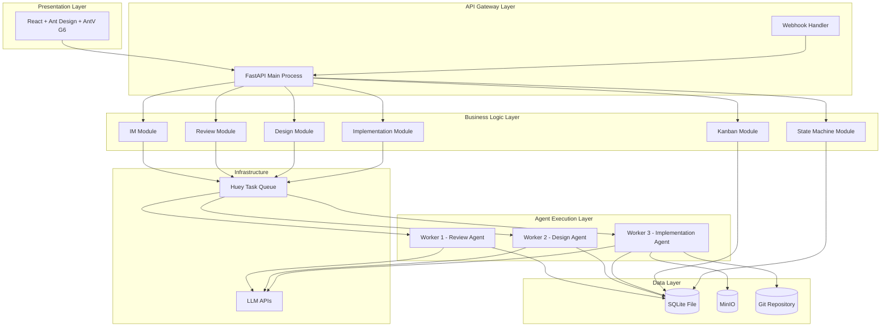

### 1.3 组件图（Component Diagram）

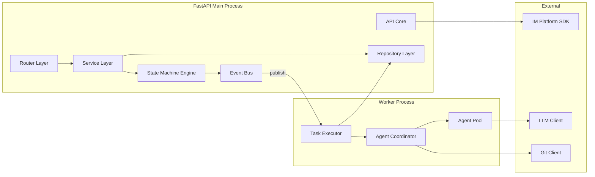

### 1.4 技术栈

| 层 | 技术选型 | 版本 | 理由 |
|---|---------|------|------|
| API | FastAPI | ^0.110 | SRS CON-003 指定，异步支持好 |
| ORM | SQLAlchemy | ^2.0 | FastAPI 生态标准，支持 SQLite |
| 任务队列 | Huey | ^2.5 | 轻量级，SQLite 后端，无额外依赖 |
| 数据库 | SQLite | ^3.45 | 轻量零配置，单文件部署 |
| 状态机 | LangGraph | ^0.2 | SRS CON-002 指定 |
| Agent 框架 | LangChain | ^0.2 | SRS CON-003 指定 |
| 对象存储 | MinIO | latest | SRS CON-003 指定 |
| 前端 | React | ^18 | SRS CON-003 指定 |
| UI 框架 | Ant Design | ^5.x | SRS CON-003 指定 |
| 可视化 | AntV G6 | ^5.x | SRS CON-003 指定 |
| Git 操作 | GitPython | ^3.1 | Python Git 操作标准库 |

### 1.5 NFR 满足策略

| NFR | 策略 |
|-----|------|
| NFR-001 (IM 响应 < 5s) | Webhook Handler 仅做消息验证+入队，返回 202；Huey 异步处理 |
| NFR-002 (Agent < 5min) | Worker 独立进程，LLM 调用超时 300s，Huey 自动重试 |
| NFR-003 (看板首屏 < 2s) | React lazy load + API 分页 |
| NFR-005 (可用性 ≥ 99%) | SQLite WAL 模式 + 文件备份 |
| NFR-009 (并发 5+) | Huey 多 Worker 进程 + SQLite WAL 并发读 |
| NFR-010 (可配置可替换) | SQLAlchemy 抽象层，未来可切换 PostgreSQL |

---

## 2. Key Feature Designs

### 2.1 IM 集成与指令系统（FR-001, FR-002, FR-003, FR-004a, FR-004b）

#### 2.1.1 Overview
处理 IM 消息接收、需求识别、结构化、指令解析，是系统的唯一入口。

#### 2.1.2 Class Diagram

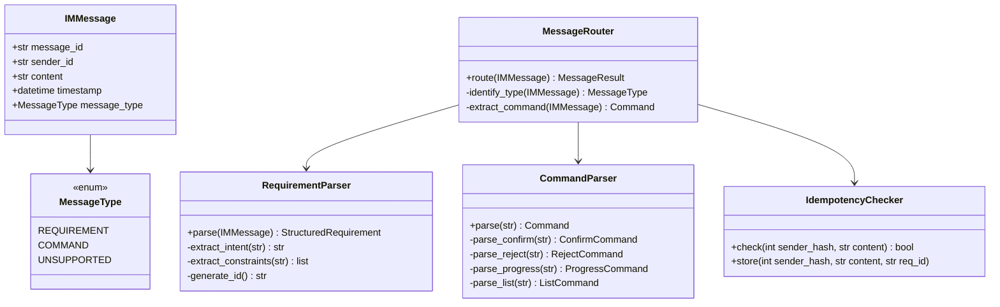

#### 2.1.3 Sequence Diagram

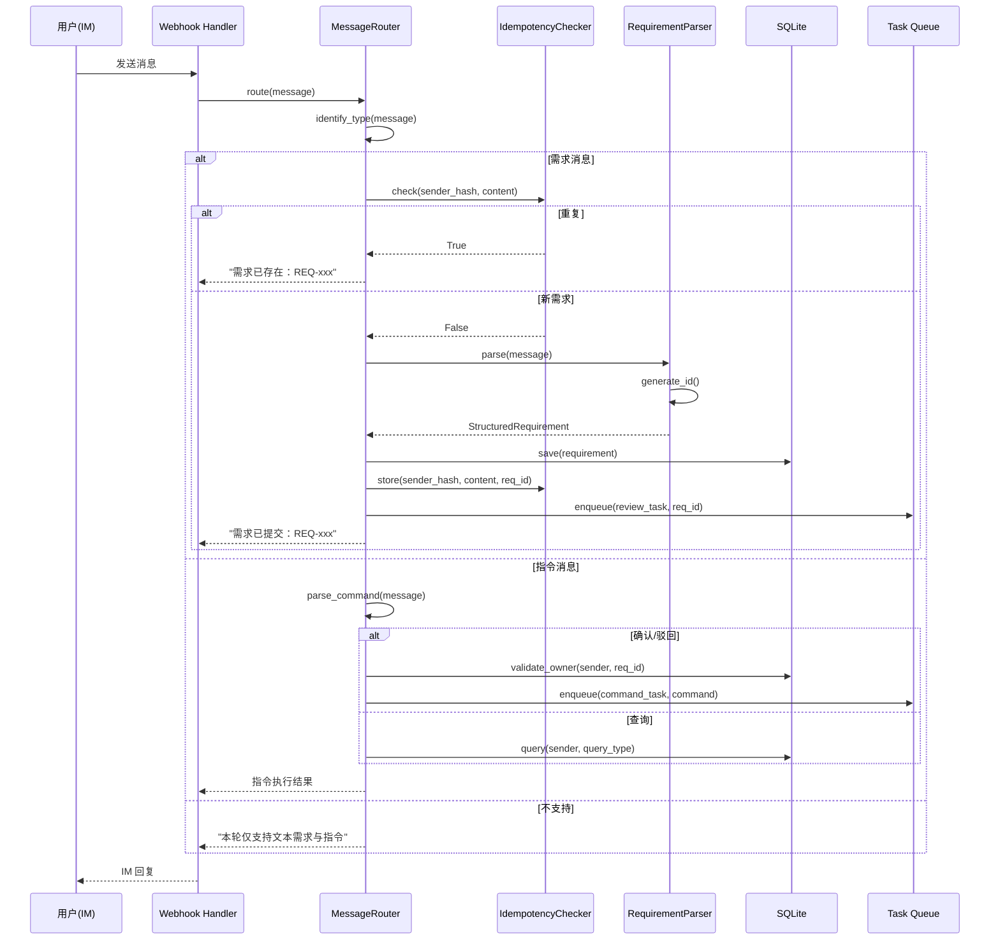

#### 2.1.4 Design Notes

- **需求 ID 格式**: `REQ-YYYYMMDD-NNN`（当日序号，满 999 扩展为 4 位）
- **幂等窗口**: 5 分钟内同提交人相同文本复用 ID
- **指令格式**: "确认 REQ-xxx"、"驳回 REQ-xxx 修改意见XXX"、"进度 REQ-xxx"、"我的列表"
- **权限校验**: 仅提交人可操作自己的需求（FR-004a）

#### 2.1.5 Integration Surface

**Provides**:
| 接口 | 描述 |
|------|------|
| `submit_requirement(IMMessage) -> StructuredRequirement` | 提交需求，触发评审 |
| `execute_command(Command) -> CommandResult` | 执行指令（确认/驳回/查询） |

**Requires**:
| 接口 | 提供者 | 描述 |
|------|--------|------|
| `save_requirement(StructuredRequirement)` | Data Layer | 持久化需求 |
| `validate_owner(str sender, str req_id) -> bool` | Data Layer | 权限校验 |
| `enqueue_review(str req_id)` | State Machine | 触发评审流程 |

---

### 2.2 评审系统（FR-005, FR-006, FR-007, FR-008a, FR-008b）

#### 2.2.1 Overview
多智能体评审团独立打分、汇总裁决、人工仲裁、驳回归档。

#### 2.2.2 Class Diagram

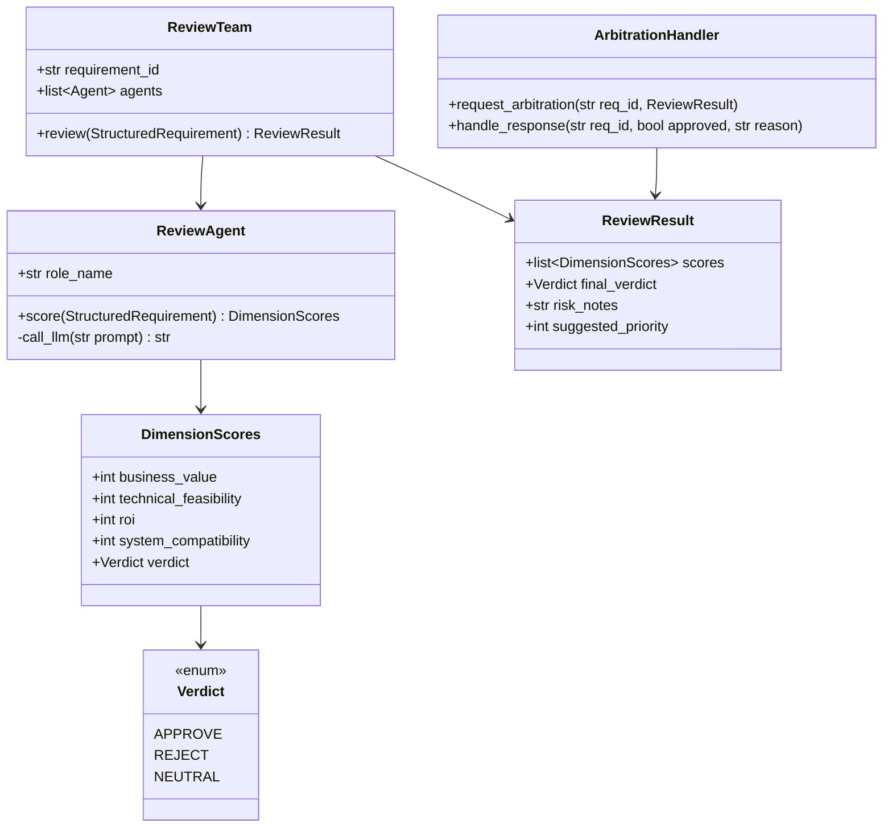

#### 2.2.3 Sequence Diagram

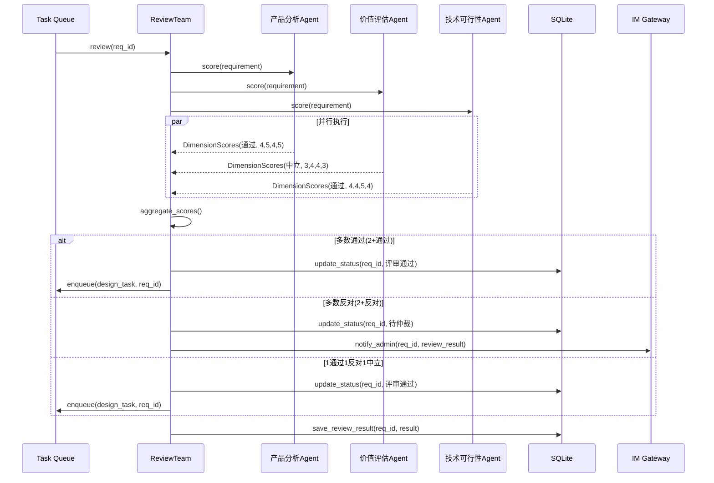

#### 2.2.4 Design Notes

- **评审角色**: 产品分析、价值评估、技术可行性（3 角色）
- **评分维度**: 业务价值、技术可行性、投入产出比、系统兼容性（1-5 分）
- **裁决规则**: ≥2 通过自动通过，≥2 反对触发仲裁，1通过1反对1中立视为多数未反对
- **Agent 失败处理**: 指数退避重试 3 次，3 次失败 IM 通知管理员
- **超时**: 仲裁请求 4 小时未回复，累计 3 次升级管理员

#### 2.2.5 Integration Surface

**Provides**:
| 接口 | 描述 |
|------|------|
| `start_review(str req_id) -> ReviewResult` | 触发评审 |
| `handle_arbitration(str req_id, bool approved, str reason)` | 处理仲裁结果 |

**Requires**:
| 接口 | 提供者 | 描述 |
|------|--------|------|
| `call_llm(str prompt) -> str` | Agent Layer | LLM 调用 |
| `update_status(str req_id, Status)` | State Machine | 状态流转 |
| `notify_admin(str req_id, ReviewResult)` | IM Gateway | 通知管理员 |

---

### 2.3 设计系统（FR-009, FR-010, FR-011, FR-012）

#### 2.3.1 Overview
多智能体设计团产出概要设计文档、目录骨架、核心接口定义。

#### 2.3.2 Class Diagram

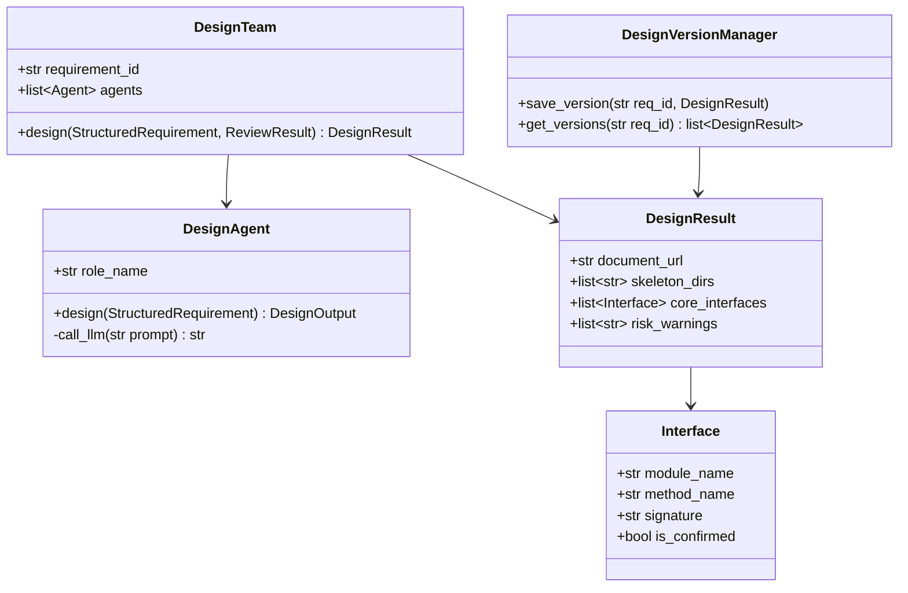

#### 2.3.3 Sequence Diagram

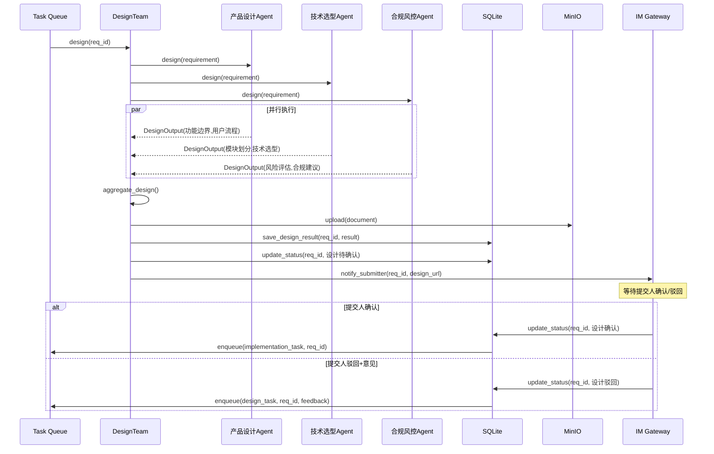

#### 2.3.4 Design Notes

- **设计角色**: 产品设计、技术选型、合规风控（3 角色）
- **产出物**: 概要设计文档 + 代码目录骨架 + 核心接口定义
- **版本管理**: 驳回迭代保留历史版本，3 轮升级管理员
- **超时**: 确认门 4 小时未操作，累计 3 次升级

#### 2.3.5 Integration Surface

**Provides**:
| 接口 | 描述 |
|------|------|
| `start_design(str req_id) -> DesignResult` | 触发设计 |
| `handle_design_feedback(str req_id, str feedback)` | 处理驳回反馈 |

**Requires**:
| 接口 | 提供者 | 描述 |
|------|--------|------|
| `call_llm(str prompt) -> str` | Agent Layer | LLM 调用 |
| `upload_document(bytes, str) -> str` | MinIO | 存储设计文档 |
| `update_status(str req_id, Status)` | State Machine | 状态流转 |
| `notify_submitter(str req_id, str design_url)` | IM Gateway | 通知提交人 |

---

### 2.4 实施系统（FR-013, FR-014, FR-015, FR-016, FR-017a, FR-017b）

#### 2.4.1 Overview
按设计生成源代码、冲烟验证、Git 提交、交付归档。

#### 2.4.2 Class Diagram

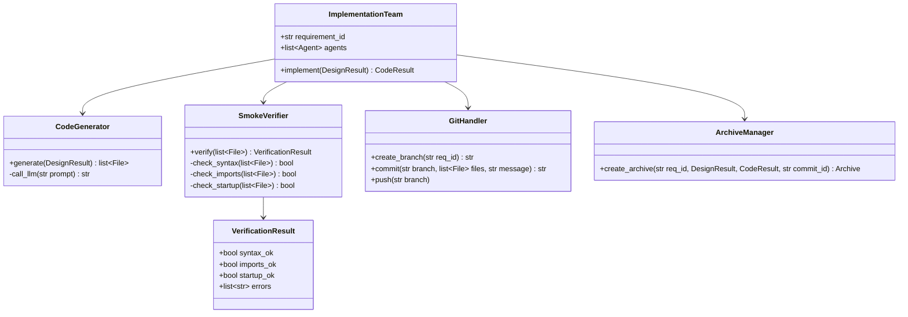

#### 2.4.3 Sequence Diagram

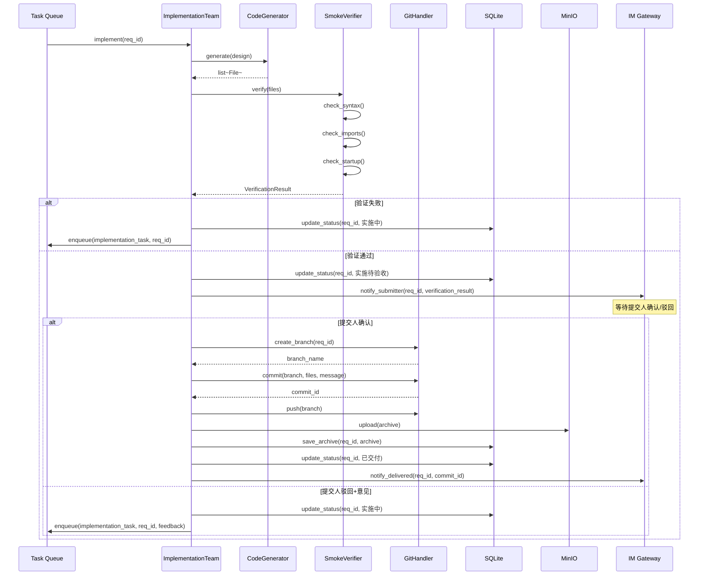

#### 2.4.4 Design Notes

- **冲烟验证**: 语法/编译检查 + 导入检查 + 启动检查
- **密钥检测**: 提交前扫描 API Key/密码/Token 模式，阻止提交
- **Git 规范**: 独立分支 `feature/REQ-xxx`，Conventional Commits 格式
- **交付档案**: 各阶段产出物引用 + 交付总结

#### 2.4.5 Integration Surface

**Provides**:
| 接口 | 描述 |
|------|------|
| `start_implementation(str req_id) -> CodeResult` | 触发实施 |
| `handle_impl_feedback(str req_id, str feedback)` | 处理驳回反馈 |

**Requires**:
| 接口 | 提供者 | 描述 |
|------|--------|------|
| `call_llm(str prompt) -> str` | Agent Layer | LLM 调用 |
| `git_commit(str branch, list files) -> str` | Git Client | Git 操作 |
| `upload_archive(bytes, str) -> str` | MinIO | 存储交付档案 |
| `update_status(str req_id, Status)` | State Machine | 状态流转 |
| `notify_submitter(str req_id, CodeResult)` | IM Gateway | 通知提交人 |

---

### 2.5 看板仪表盘（FR-018, FR-019, FR-021）

#### 2.5.1 Overview
总览指标、需求列表筛选搜索、看板操作与 IM 同步。

#### 2.5.2 Class Diagram

```mermaid
classDiagram
    class DashboardService {
        +get_metrics() DashboardMetrics
        +get_requirements(filters) list~Requirement~
        +get_requirement_detail(str req_id) RequirementDetail
    }
    
    class DashboardMetrics {
        +int total_count
        +float approval_rate
        +int in_progress_count
    }
    
    class RequirementListRequest {
        +str status_filter
        +str stage_filter
        +str submitter_filter
        +str search_keyword
        +int page
        +int page_size
    }
    
    class RequirementDetail {
        +StructuredRequirement requirement
        +ReviewResult review_result
        +DesignResult design_result
        +CodeResult code_result
        +list~StatusTransition~ timeline
    }
    
    class StatusTransition {
        +Status from_status
        +Status to_status
        +datetime timestamp
        +str trigger
    }
    
    class DashboardAPI {
        +GET /api/dashboard/metrics
        +GET /api/requirements
        +GET /api/requirements/{id}
        +POST /api/requirements/{id}/confirm
        +POST /api/requirements/{id}/reject
    }
    
    DashboardService --> DashboardMetrics
    DashboardService --> RequirementListRequest
    DashboardService --> RequirementDetail
    RequirementDetail --> StatusTransition
    DashboardAPI --> DashboardService
```

#### 2.5.3 API 设计

| Method | Endpoint | 描述 |
|--------|----------|------|
| GET | `/api/dashboard/metrics` | 获取总览指标 |
| GET | `/api/requirements?page=1&page_size=10&status=&stage=&submitter=&search=` | 需求列表 |
| GET | `/api/requirements/{req_id}` | 需求详情 |
| POST | `/api/requirements/{req_id}/confirm` | 确认操作 |
| POST | `/api/requirements/{req_id}/reject` | 驳回操作（body: {reason}） |

#### 2.5.4 Design Notes

- **实时同步**: 看板操作通过 WebSocket 推送更新
- **筛选**: URL query params 持久化，支持分享
- **分页**: 默认 10 条/页，支持 10/20/50

#### 2.5.5 Integration Surface

**Provides**:
| 接口 | 描述 |
|------|------|
| `GET /api/dashboard/metrics` | 总览指标 |
| `GET /api/requirements` | 需求列表 |
| `POST /api/requirements/{id}/confirm` | 确认操作 |

**Requires**:
| 接口 | 提供者 | 描述 |
|------|--------|------|
| `query_requirements(filters) -> list` | Data Layer | 查询需求 |
| `update_status(str req_id, Status)` | State Machine | 状态流转 |
| `notify_submitter(str req_id, str action)` | IM Gateway | 同步 IM |

---

### 2.6 状态机引擎（FR-020）

#### 2.6.1 Overview
需求全生命周期状态流转，基于 LangGraph 实现，支持自动流转、并发隔离、持久化恢复。

#### 2.6.2 Class Diagram

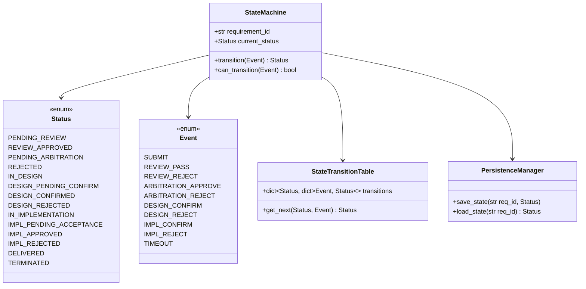

#### 2.6.3 状态流转图

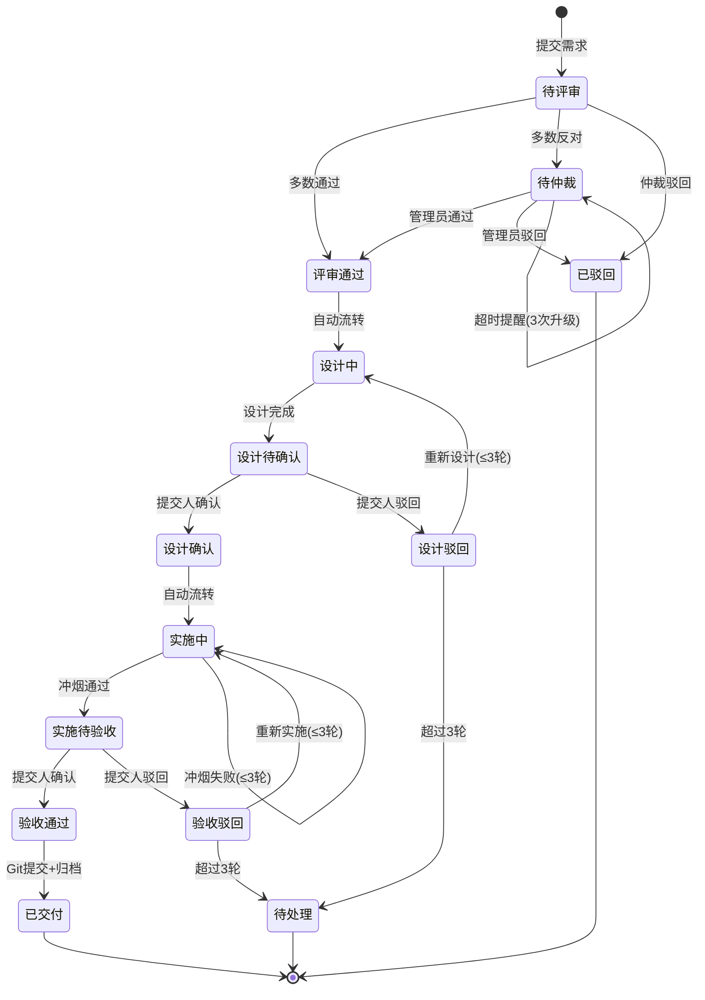

#### 2.6.4 Design Notes

- **状态持久化**: 每次流转写入 SQLite，系统重启从最后状态恢复
- **并发隔离**: 多需求状态独立，互不影响
- **非法迁移拒绝**: 状态机拒绝不合法的状态转换请求
- **超时提醒**: 决策门 4 小时未操作，累计 3 次升级管理员

#### 2.6.5 Integration Surface

**Provides**:
| 接口 | 描述 |
|------|------|
| `transition(str req_id, Event) -> Status` | 执行状态流转 |
| `get_status(str req_id) -> Status` | 获取当前状态 |
| `can_transition(str req_id, Event) -> bool` | 检查是否可流转 |

**Requires**:
| 接口 | 提供者 | 描述 |
|------|--------|------|
| `save_state(str req_id, Status)` | Data Layer | 持久化状态 |
| `load_state(str req_id) -> Status` | Data Layer | 加载状态 |

---

## 3. Data Model

### 3.1 ER Diagram

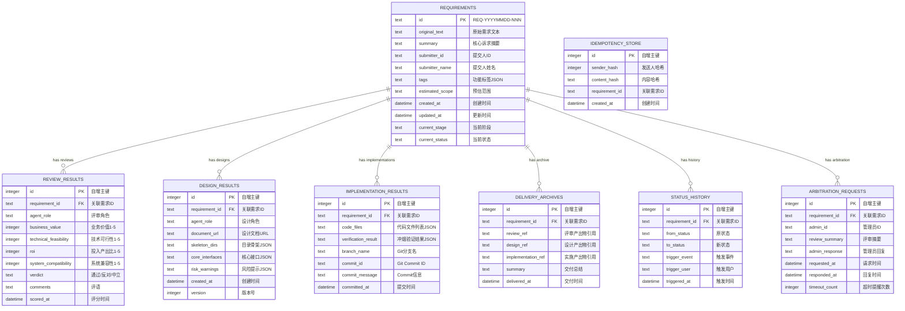

### 3.2 存储策略

| 表 | 预估行数(1年) | 索引策略 |
|---|--------------|---------|
| requirements | 10,000 | PK(id), IX(submitter_id), IX(current_stage, current_status) |
| review_results | 30,000 | IX(requirement_id), IX(agent_role) |
| design_results | 20,000 | IX(requirement_id), IX(version) |
| implementation_results | 15,000 | IX(requirement_id) |
| delivery_archives | 10,000 | IX(requirement_id) |
| status_history | 50,000 | IX(requirement_id), IX(triggered_at) |
| arbitration_requests | 1,000 | IX(requirement_id) |
| idempotency_store | 50,000 | IX(sender_hash, content_hash), TTL 5分钟过期清理 |

---

## 4. API / Interface Design

### 4.1 外部接口

| ID | 外部系统 | 方向 | 协议 | 数据格式 |
|----|---------|------|------|---------|
| IFR-001 | IM 平台（单渠道） | 双向 | Webhook + 事件订阅 | JSON |
| IFR-002 | Git 仓库 | 出站 | Git HTTPS/SSH | 代码 + Commit |
| IFR-003 | 大模型 API | 出站 | REST/HTTPS | JSON |
| IFR-005 | MinIO | 双向 | S3 API | 代码包/设计文档 |

### 4.2 内部 API 契约

| Method | Endpoint | Request | Response | Contract ID |
|--------|----------|---------|----------|-------------|
| POST | `/webhook/im/{platform}` | IM Webhook Payload | `{status, message}` | C-001 |
| GET | `/api/dashboard/metrics` | - | `DashboardMetrics` | C-002 |
| GET | `/api/requirements` | QueryParams | `PaginatedList<Requirement>` | C-003 |
| GET | `/api/requirements/{req_id}` | Path: req_id | `RequirementDetail` | C-004 |
| POST | `/api/requirements/{req_id}/confirm` | Path: req_id | `{status, message}` | C-005 |
| POST | `/api/requirements/{req_id}/reject` | Path: req_id, Body: `{reason}` | `{status, message}` | C-006 |

### 4.3 任务队列契约

| Task Name | Parameters | Return | Contract ID |
|-----------|-----------|--------|-------------|
| `process_im_message` | `message_id, sender_id, content` | `StructuredRequirement` | T-001 |
| `run_review` | `requirement_id` | `ReviewResult` | T-002 |
| `run_design` | `requirement_id` | `DesignResult` | T-003 |
| `run_implementation` | `requirement_id` | `CodeResult` | T-004 |
| `send_im_notification` | `recipient_id, message_type, content` | `bool` | T-005 |
| `backup_database` | - | `str` | T-006 |

---

## 5. UI/UX Design

### 5.1 前端架构

| 层 | 技术选型 | 版本 | 理由 |
|---|---------|------|------|
| 框架 | React | ^18 | SRS CON-003 指定 |
| 构建工具 | Vite | ^5.x | 快速开发体验 |
| UI 组件库 | Ant Design | ^5.x | SRS CON-003 + UCD 已定义 |
| 路由 | React Router | ^6.x | SPA 标准路由 |
| 状态管理 | Zustand | ^4.x | 轻量级 |
| 数据请求 | SWR | ^2.x | 缓存、重新验证 |
| 可视化 | AntV G6 | ^5.x | 状态机可视化 |

### 5.2 UCD 组件 → 实现映射

| UCD 组件 | 实现组件 | 文件路径 |
|----------|---------|---------|
| 顶部导航栏 | `Header` | `src/components/layout/Header.tsx` |
| 指标卡片 | `MetricCard` | `src/components/dashboard/MetricCard.tsx` |
| 筛选栏 | `FilterBar` | `src/components/requirements/FilterBar.tsx` |
| 数据表格 | `RequirementTable` | `src/components/requirements/RequirementTable.tsx` |
| 状态标签 | `StatusTag` | `src/components/common/StatusTag.tsx` |
| 操作确认弹窗 | `ActionModal` | `src/components/common/ActionModal.tsx` |
| 消息提示 | `message` (Ant Design) | 直接使用 |
| 空状态 | `EmptyState` | `src/components/common/EmptyState.tsx` |

### 5.3 路由设计

| Path | Component | 描述 |
|------|-----------|------|
| `/` | `DashboardPage` | 看板首页 |
| `/requirements` | `RequirementListPage` | 需求列表 |
| `/requirements/:id` | `RequirementDetailPage` | 需求详情 |

---

## 6. Third-Party Dependencies

### 6.1 Python 后端

| 库 | 版本 | 许可证 | 用途 |
|---|------|--------|------|
| fastapi | ^0.110 | MIT | Web API 框架 |
| uvicorn | ^0.27 | BSD | ASGI 服务器 |
| sqlalchemy | ^2.0 | MIT | ORM |
| alembic | ^1.13 | MIT | 数据库迁移 |
| huey | ^2.5 | MIT | 轻量级任务队列 |
| langchain | ^0.2 | MIT | Agent 框架 |
| langgraph | ^0.2 | MIT | 状态机引擎 |
| langchain-openai | ^0.1 | MIT | OpenAI 集成 |
| gitpython | ^3.1 | BSD | Git 操作 |
| minio | ^7.2 | Apache 2.0 | MinIO 客户端 |
| pydantic | ^2.6 | MIT | 数据验证 |
| httpx | ^0.27 | BSD | HTTP 客户端 |
| python-dotenv | ^1.0 | BSD | 环境变量 |
| cryptography | ^42.0 | Apache 2.0 | HMAC 签名验证 |

### 6.2 前端

| 库 | 版本 | 许可证 | 用途 |
|---|------|--------|------|
| react | ^18.3 | MIT | UI 框架 |
| react-dom | ^18.3 | MIT | React DOM 渲染 |
| react-router-dom | ^6.22 | MIT | 路由 |
| antd | ^5.15 | MIT | UI 组件库 |
| @ant-design/icons | ^5.3 | MIT | 图标 |
| @ant-design/g6 | ^5.x | MIT | 图可视化 |
| zustand | ^4.5 | MIT | 状态管理 |
| swr | ^2.2 | MIT | 数据请求 |
| dayjs | ^1.11 | MIT | 日期处理 |

### 6.3 依赖兼容性

| 组合 | 兼容性 | 备注 |
|------|--------|------|
| Python 3.10+ | ✓ | LangChain/LangGraph 最低要求 |
| FastAPI + SQLAlchemy 2.0 | ✓ | 官方推荐组合 |
| LangChain + LangGraph | ✓ | 同一生态 |
| React 18 + Ant Design 5 | ✓ | 官方支持 |
| Vite 5 + React 18 | ✓ | @vitejs/plugin-react 官方支持 |

---

## 7. Testing Strategy

### 7.1 测试哲学

- **TDD + 质量门禁**: Red → Green → Refactor → Coverage → Mutation
- **测试金字塔**: 单元测试 > 集成测试 > E2E 测试

### 7.2 工具选型

| 层 | 工具 | 版本 | 用途 |
|---|------|------|------|
| Python 测试 | pytest | ^8.0 | 测试框架 |
| Python 覆盖 | pytest-cov | ^4.1 | 覆盖率统计 |
| Python 变异 | mutmut | ^2.4 | 变异测试 |
| Mock | pytest-mock | ^3.12 | Mock 工具 |
| API 测试 | httpx | ^0.27 | FastAPI TestClient |
| 前端测试 | Vitest | ^1.6 | 前端单元测试 |
| 前端覆盖 | @vitest/coverage-v8 | ^1.6 | 前端覆盖率 |
| E2E 测试 | Playwright | ^1.42 | 浏览器自动化 |
| Lint | ESLint + Prettier | latest | 前端代码规范 |
| Lint | Ruff | ^0.4 | Python 代码规范 |

### 7.3 覆盖率门禁

| 指标 | 阈值 | 工具 |
|------|------|------|
| 行覆盖率 (Line) | >= 80% | pytest-cov / Vitest |
| 分支覆盖率 (Branch) | >= 70% | pytest-cov / Vitest |
| 变异得分 (Mutation) | >= 75% | mutmut |

---

## 8. Deployment / Infrastructure

### 8.1 部署架构

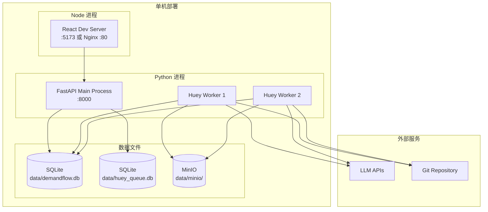

### 8.2 环境变量

| 变量 | 说明 | 默认值 |
|------|------|--------|
| `DATABASE_URL` | SQLite 文件路径 | `sqlite:///data/demandflow.db` |
| `HUEY_URL` | Huey 队列路径 | `sqlite:///data/huey_queue.db` |
| `LLM_API_KEY` | LLM API 密钥 | - |
| `LLM_MODEL` | LLM 模型名 | `gpt-4` |
| `GIT_REPO_URL` | Git 仓库地址 | - |
| `GIT_BRANCH_PREFIX` | 分支前缀 | `feature/` |
| `MINIO_ENDPOINT` | MinIO 地址 | `localhost:9000` |
| `MINIO_ACCESS_KEY` | MinIO 访问密钥 | - |
| `MINIO_SECRET_KEY` | MinIO 密钥 | - |
| `IM_PLATFORM` | IM 平台类型 | `dingtalk` |
| `IM_WEBHOOK_SECRET` | Webhook 签名密钥 | - |
| `DEBUG` | 调试模式 | `false` |

---

## 9. Development Plan

### 9.1 里程碑

| 里程碑 | 范围 | 退出标准 |
|--------|------|----------|
| **M1: Foundation** | 项目骨架、CI、核心抽象 | 项目可运行、测试可执行、CI 通过 |
| **M2: IM Integration** | IM 接入、指令系统、需求结构化 | 可通过 IM 提交需求并获取 ID |
| **M3: Review System** | 多智能体评审、仲裁、驳回 | 评审流程自动完成，仲裁可处理 |
| **M4: Design System** | 多智能体设计、确认门、迭代 | 设计产出物可生成，确认/驳回可操作 |
| **M5: Implementation** | 代码生成、冲烟验证、Git 提交 | 代码可生成并提交到 Git |
| **M6: Kanban Dashboard** | 看板首页、列表、详情、筛选 | 看板可查看所有需求状态 |
| **M7: Polish & Release** | NFR 验证、文档、示例 | 全部测试通过，NFR 达标 |

### 9.2 Feature 分解

| Feature ID | 名称 | Priority | Mapped FRs | 依赖 |
|------------|------|----------|------------|------|
| F001 | 项目骨架与基础设施 | P0 | - | - |
| F002 | 数据模型与迁移 | P0 | - | F001 |
| F003 | IM Webhook 接入 | P0 | FR-001 | F002 |
| F004 | 需求结构化与 ID 生成 | P0 | FR-002, FR-003 | F003 |
| F005 | 状态变更指令系统 | P0 | FR-004a | F004 |
| F006 | 查询指令系统 | P0 | FR-004b | F004 |
| F007 | 状态机引擎 | P0 | FR-020 | F002 |
| F008 | 评审团多角色打分 | P0 | FR-005 | F007 |
| F009 | 评审结论汇总与裁决 | P0 | FR-006 | F008 |
| F010 | 人工仲裁处理 | P0 | FR-007 | F009 |
| F011 | 评审驳回通知与归档 | P0 | FR-008a, FR-008b | F010 |
| F012 | 设计团多角色产出 | P0 | FR-009 | F007 |
| F013 | 设计产出物生成 | P0 | FR-010 | F012 |
| F014 | 设计确认门与迭代 | P0 | FR-011, FR-012 | F013 |
| F015 | 实施团代码生成 | P0 | FR-013 | F007 |
| F016 | 冲烟验证 | P0 | FR-014 | F015 |
| F017 | 实施确认门 | P0 | FR-015 | F016 |
| F018 | Git 提交与密钥检测 | P0 | FR-016 | F017 |
| F019 | 交付档案与状态归档 | P0 | FR-017a, FR-017b | F018 |
| F020 | 看板首页指标 | P1 | FR-018 | F002 |
| F021 | 需求列表与筛选搜索 | P1 | FR-019 | F002 |
| F022 | 需求详情页 | P1 | - | F020, F021 |
| F023 | 看板操作与 IM 同步 | P1 | FR-021 | F022 |

### 9.3 依赖链（Critical Path）

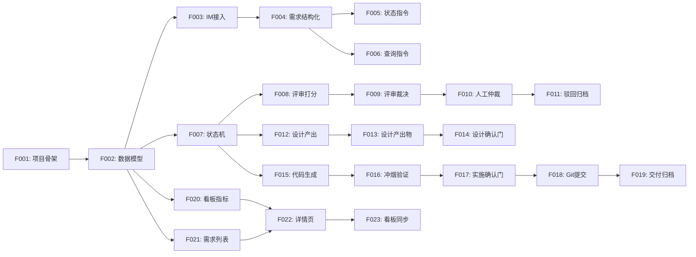

**关键路径**: F001 → F002 → F003 → F004 → F007 → F008 → F009 → F010 → F011

### 9.4 Milestone 计划

| Milestone | Features | 预估时间 |
|-----------|----------|----------|
| M1: Foundation | F001, F002 | 2 天 |
| M2: IM Integration | F003, F004, F005, F006 | 3 天 |
| M3: Review System | F007, F008, F009, F010, F011 | 4 天 |
| M4: Design System | F012, F013, F014 | 3 天 |
| M5: Implementation | F015, F016, F017, F018, F019 | 4 天 |
| M6: Kanban Dashboard | F020, F021, F022, F023 | 3 天 |
| M7: Polish & Release | NFR 验证、文档、示例 | 2 天 |
| **总计** | 23 Features | **21 天** |

### 9.5 风险登记

| 风险 | 影响 | 概率 | 缓解策略 |
|------|------|------|----------|
| LLM API 响应超时 | Agent 执行失败 | 中 | 指数退避 3 次 + 超时 300s |
| LLM 输出质量不稳定 | 评审/设计结果不可用 | 高 | Prompt 调优 + 人工仲裁兜底 |
| SQLite 并发写入瓶颈 | 状态流转失败 | 低 | WAL 模式 + 短事务 |
| Git 凭证失效 | 代码落盘失败 | 低 | 凭证检查 + IM 通知管理员 |
| IM 平台 API 变更 | 消息收发失败 | 低 | 抽象适配层 + 配置化 |

---

## 10. Additional Notes

### 10.1 未来迁移路径

**SQLite → PostgreSQL**: 当并发用户 > 50 或需求条目 > 10,000 时
**Huey → Celery**: 当需要分布式任务队列或 Redis/RabbitMQ 时

迁移方式：SQLAlchemy 支持多数据库，Huey 可切换 backend。

### 10.2 备份策略

```bash
# SQLite 热备份
sqlite3 data/demandflow.db ".backup data/backups/demandflow_$(date +%Y%m%d_%H%M%S).db"

# 定时任务（Huey scheduled task）
@huey.schedule(crontab(minute=0, hour=2))  # 每天凌晨2点
def backup_database():
    # 执行备份并上传到 MinIO
    pass
```

---

**Document ends.**
