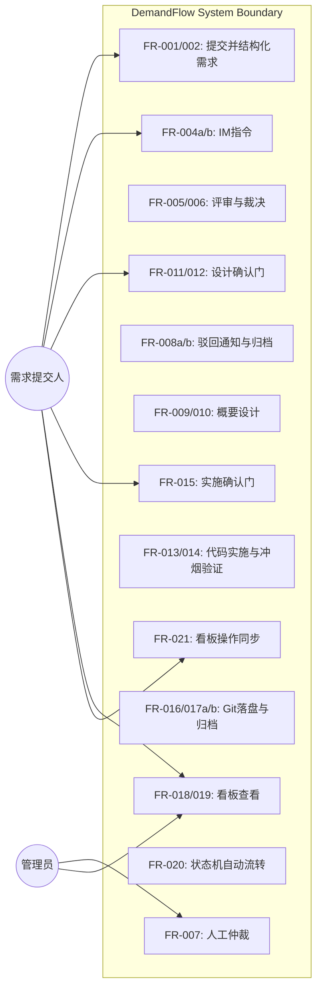
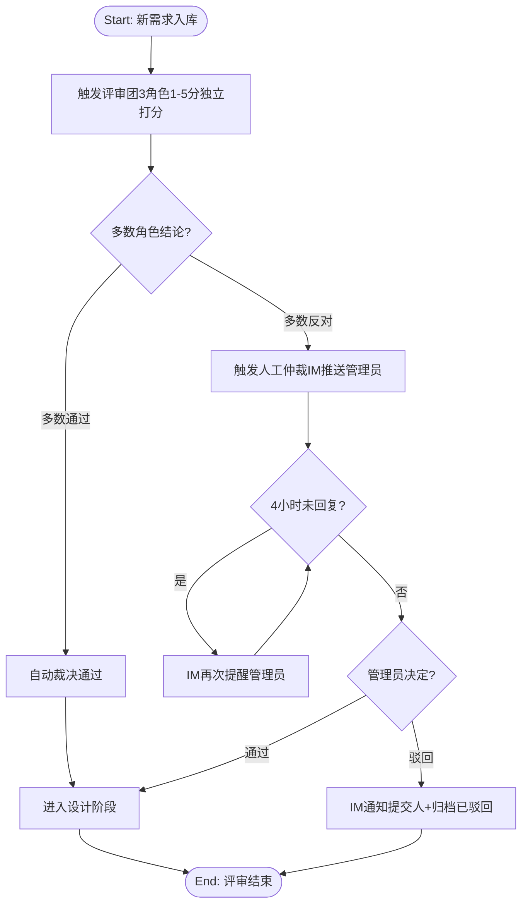
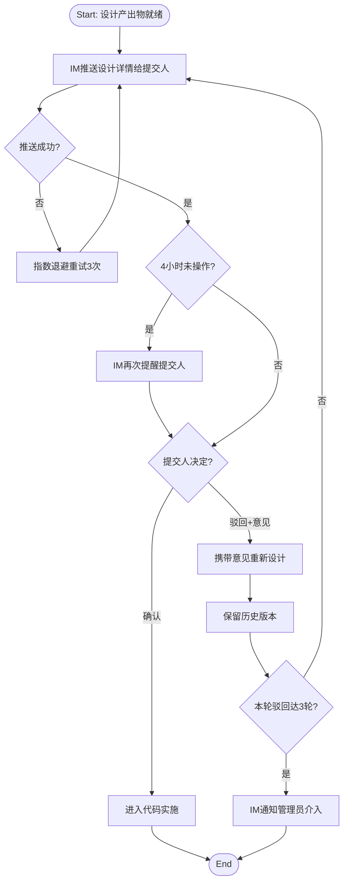
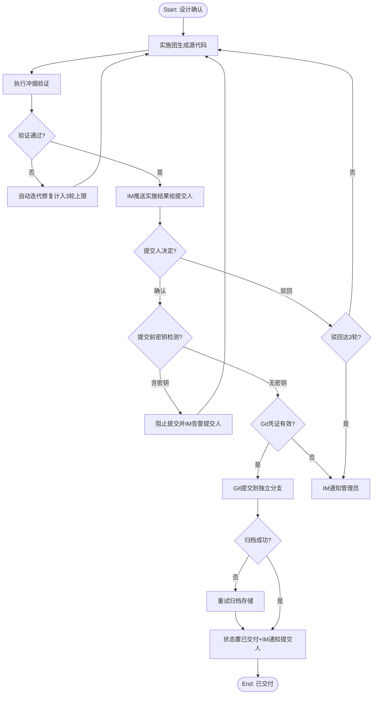

# DemandFlow 智能需求交付系统 — Software Requirements Specification

**Date**: 2026-07-04
**Status**: Approved
**Standard**: Aligned with ISO/IEC/IEEE 29148

## 1. Purpose & Scope

DemandFlow 是一套以 IM 为唯一交互入口、多智能体团队协同执行、全流程自动化流转的需求交付流水线。用户仅需通过即时通讯工具发送一句话需求，系统自动完成「需求接入→评审→概要设计→代码实施→代码落盘」全链路作业，人工仅在关键节点做确认/驳回决策，所有进度与产出在可视化看板呈现，形成"输入即触发、过程全自动、结果可追溯"的闭环。

本系统的核心价值（WHAT）：将本应聚焦关键决策的人从重复的评审/设计/编码执行中解放出来——执行交给多智能体团队自动完成，人工仅在确认/驳回决策门介入。

### 1.1 In Scope

本轮（最小闭环）覆盖：

- 单一 IM 渠道接入：消息接收、需求/指令识别、需求结构化与 ID 生成、基本幂等
- IM 指令体系（5 个）：提交需求（自动识别）、确认、驳回、进度、我的列表
- 需求评审：多智能体评审团（3 角色）独立打分、汇总裁决、多数反对触发人工仲裁、驳回归档
- 概要方案设计：多智能体设计团（3 角色）产出概要设计文档+目录骨架+核心接口、确认门、驳回多轮迭代
- 代码实施：多智能体实施团按设计生成完整源代码、冲烟验证、确认门、驳回多轮迭代
- 代码落盘：自动提交到指定 Git 仓库独立分支、规范 Commit、交付档案与状态归档
- 基础看板：总览指标、需求列表（筛选+搜索）、工作流状态机自动流转、看板与 IM 操作同步、超时提醒
- 全局协调与状态机：节点自动流转、多需求并发隔离、3 轮迭代上限升级、4 小时超时提醒

### 1.2 Out of Scope

明确不做的内容（部分为后续 SRS 轮次拾取，见延迟需求 backlog：[2026-07-04-demandflow-deferred.md](2026-07-04-demandflow-deferred.md)）：

- 非需求/指令的富媒体消息处理（图片/文件/语音，本轮仅文本）
- 语义级需求去重（本轮仅基本幂等）
- 详细架构与技术设计阶段（本轮概要设计直接驱动代码）
- 完整自动测试套件与代码审计（本轮仅冲烟验证）
- 多 IM 渠道（本轮单一渠道）
- 详情页时间轴/版本对比/执行日志（本轮基础看板）
- 历史方案复用与向量知识库（本轮最小使用）
- IM 追加补充/优先级设置指令（本轮 5 个指令）
- 非IM渠道提交（Web 表单/API）
- 多租户/组织隔离（单组织内部使用）
- 对接外部 CI/CD 或 Issue 系统（Jira/GitLab CI/GitHub Actions）
- 需求拆分合并与版本分支管理

### 1.3 Problem Statement

**Root Cause (5-Whys)**:
```
Symptom: 关键决策者每天被重复的需求评审/方案设计/代码实施执行工作淹没，本应聚焦决策却被执行稀释
Why 1: 因为评审、设计、编码这些环节缺少自动化执行，只能靠人工逐个完成
Why 2: 因为没有一条"需求接入→评审→设计→实施→落盘"全自动流转的流水线
Why 3: 因为交付链路缺少状态机驱动的自动流转与人工决策门，执行与决策未分离
Root Cause: 需求交付链路缺少"自动化执行引擎 + 关键节点人工决策门"，导致执行与决策混杂，人被淹没在重复执行中
```

**Jobs-to-be-Done**: 当一个新的需求被提出时，我想要只需在 IM 发一句话并由系统自动完成评审-设计-实施全链路，以便把精力集中在关键确认/驳回决策上，而交付快速、可追溯地自动完成。

**Pain Map**:
| Pain Point | Current Workaround | Frequency | Severity | Score |
|---|---|---|---|---|
| 执行淹没决策：决策者被重复评审/设计/编码执行淹没 | 人工逐环节串行执行，手工交接，靠经验拍板 | Daily | High | 9 |
| 交付链路长且进度不可见 | 散落 IM/文档/代码，靠口头/会议追问进度 | Daily | High | 9 |
| 历史方案/代码无沉淀，重复造轮子 | 复制粘贴旧代码，凭记忆找历史方案 | Weekly | Medium | 4 |
| 多 IM 渠道需求分散 | 逐个 IM 翻找，无统一入口 | Weekly | Medium | 4 |

**Alignment Validation**: PASS
- 根因覆盖：4/4 痛点已由 FR 覆盖或显式排除（复用/多 IM 部分覆盖、其余延后并记入 backlog）
- JTBD 结果：通过完成全部 Must 级 FR 可达成（一句话需求→自动交付可用代码，人工仅确认/驳回）
- Pre-mortem 发现：2 项记入 Open Questions（Agent 输出质量、冲烟验证不足以保证代码质量）
- 孤儿 FR：0（所有 FR 可追溯至 Pain Map/JTBD/走查）

## 2. Glossary & Definitions

| Term | Definition | Do NOT confuse with |
|------|-----------|---------------------|
| 需求条目 / 结构化需求 | 用户一句话需求经解析后带唯一 ID 的结构化记录（原始文本、功能标签、预估范围、提交人、时间） | 原始消息（未解析的 IM 文本） |
| 智能体团队（Agent Team） | 某阶段由分工明确的多角色 Agent + 协调 Agent 组成的协作单元 | 单个 Agent |
| 协调 Agent | 团队调度中枢，负责任务分发、结果汇总、异常处理、状态上报 | 业务角色 Agent |
| 评审团 / 设计团 / 实施团 | 分别负责评审、概要设计、代码实施阶段的智能体团队 | 全局协调 Agent |
| 冲烟验证（Smoke Verification） | 语法/编译检查 + 导入检查 + 启动检查，证明代码可运行（非完整测试） | 完整测试套件（已延后） |
| 中立 | 评审角色既不通过也不反对的中性结论（计入"多数未反对"判定） | 弃权 |
| 顶层模块 | 概要设计中最高层级的功能模块单元（其对外接口即"核心接口"） | 子模块 |
| 人工仲裁 | 评审多数角色反对时，由人工管理员做通过/驳回决定 | 自动裁决（多数通过时自动） |
| 决策门 | 流程中需提交人确认或驳回的关键节点 | 智能体自动执行节点 |
| 状态机 | 需求全生命周期状态流转模型（LangGraph 驱动） | 单一状态字段 |
| 概要设计 | 评审通过后由设计团产出的功能边界/用户流程/模块划分/技术选型设计 | 详细架构设计（已延后） |
| 代码落盘 | 实施确认后将代码自动提交到 Git 仓库独立分支并归档 | 仅展示代码不持久化 |
| IM 指令 | 用户通过 IM 文本执行的操作命令（确认/驳回/进度/我的列表） | 普通需求消息 |
| 功能标签 | 从需求文本中提取的关键词标签（用于分类与检索） | 功能域分类标签 |
| 预估范围 | 按工作量估算的需求实现范围（如涉及的模块/接口数量级） | 精确工作量评估 |
| 高风险 | 影响核心业务流程的风险（合规/安全/数据敏感/核心流程） | 一般性技术风险 |
| 指数退避 | 失败重试时按指数增长间隔重试的策略（如 1s/2s/4s） | 固定间隔重试 |
| 短链 | 指向看板详情页的简短可点击链接 | 完整 URL |
| Conventional Commits | Git Commit 信息规范（如 `feat: xxx`、`fix: xxx`） | 自由格式 Commit |

## 3. Stakeholders & User Personas

| Persona | Technical Level | Key Needs | Access Level |
|---------|----------------|-----------|--------------|
| 需求提交人（研发） | 高 | 一句话提交需求、快速确认/驳回、查看进度与自己列表 | 仅可操作自己提交的需求 |
| 管理员/仲裁人（技术 lead） | 高 | 处理评审分歧仲裁、介入迭代升级、查看全局进度 | 可仲裁任意需求 |

### 3.1 Use Case View



## 4. Functional Requirements

### FR-001: IM 消息接收与识别
**Priority**: Must
**EARS**: When 用户在配置的 IM 渠道发送一条文本消息，the system shall 接收消息并区分其为「需求消息」或「指令消息」。
**Visual output**: N/A — backend-only（识别结果触发后续 IM 回复与流程）
**Acceptance Criteria**:
- Given 用户发送普通文本"加一个登录页"，when 系统接收，then 识别为需求消息并进入结构化流程
- Given 用户发送"确认 REQ-20260704-001"，when 系统接收，then 识别为指令消息并路由到指令处理
- Given 用户发送非文本消息（图片/文件/语音），when 系统接收，then 回复提示"本轮仅支持文本需求与指令"
- Given 消息接收失败，when 系统处理，then 记录错误并按指数退避重试 3 次

### FR-002: 需求结构化与 ID 生成
**Priority**: Must
**EARS**: When 系统识别一条需求消息，the system shall 提取核心诉求与约束并生成带唯一 ID 的结构化需求条目（含原始文本、功能标签、预估范围、提交人、时间）。
**Visual output**: 看板需求列表实时新增该需求条目
**Acceptance Criteria**:
- Given 识别为需求消息，when 结构化，then 生成 REQ-YYYYMMDD-NNN 格式唯一 ID 并存储
- Given 需求文本为空或仅含指令关键词，when 结构化，then 拒绝生成需求并 IM 提示原因
- Given 提取的核心诉求为空（无法解析），when 结构化，then 仍生成条目并标记"待人工补充诉求"
- Given ID 序号当日已达 999 上限，when 生成，then 启用扩展位生成 4 位序号（REQ-YYYYMMDD-NNNN）

### FR-003: 重复提交幂等识别
**Priority**: Should
**EARS**: When 同一提交人在 5 分钟内发送相同文本的需求消息，the system shall 识别为重复并复用已生成的需求 ID 而非新建。
**Visual output**: IM 回复提示该需求已存在及对应 ID
**Acceptance Criteria**:
- Given 同一提交人 5 分钟内发送相同文本，when 接收，then 复用已有 ID 并 IM 回复"需求已存在：REQ-xxx"
- Given 超过 5 分钟或不同文本，when 接收，then 视为新需求正常结构化
- Given 不同提交人发送相同文本，when 接收，then 视为新需求（不做跨人去重）

### FR-004a: 状态变更类指令解析执行
**Priority**: Must
**EARS**: When 用户发送状态变更类指令（确认/驳回），the system shall 校验提交人权限后解析指令并执行对应操作。
**Visual output**: IM 返回指令执行结果
**Acceptance Criteria**:
- Given 提交人发送"确认 REQ-xxx"，when 解析，then 触发对应节点确认流转
- Given 提交人发送"驳回 REQ-xxx 修改意见XXX"，when 解析，then 携带意见回退到对应阶段
- Given 非提交人发送"确认/驳回 REQ-xxx"，when 解析，then 拒绝并 IM 提示"无权限：仅提交人可操作"
- Given 指令格式错误或需求 ID 不存在，when 解析，then IM 提示正确指令格式

### FR-004b: 查询类指令解析执行
**Priority**: Must
**EARS**: When 用户发送查询类指令（进度/我的列表），the system shall 解析指令并返回对应信息。
**Visual output**: IM 返回查询结果
**Acceptance Criteria**:
- Given 用户发送"进度 REQ-xxx"，when 解析，then 返回该需求当前阶段与状态
- Given 用户发送"我的列表"，when 解析，then 返回该用户提交的需求清单
- Given 需求 ID 不存在，when 解析，then IM 提示需求不存在
- Given 指令格式错误，when 解析，then IM 提示正确指令格式

### FR-005: 评审团多角色独立打分
**Priority**: Must
**EARS**: When 一条新结构化需求入库，the system shall 触发评审团（产品分析、价值评估、技术可行性 3 角色）按 1-5 分制从业务价值、技术可行性、投入产出比、系统兼容性 4 维度独立打分并给出通过/反对/中立结论。
**Visual output**: 看板详情可见该需求"评审中"
**Acceptance Criteria**:
- Given 新需求入库，when 触发评审，then 3 角色各自输出 4 维度 1-5 分评分与通过/反对/中立结论
- Given 某角色 Agent 执行失败，when 触发，then 指数退避重试 3 次，3 次仍失败则 IM 通知管理员
- Given 3 角色均执行失败，when 触发，then 暂停该需求流转并 IM 通知管理员

### FR-006: 评审结论汇总与裁决
**Priority**: Must
**EARS**: When 3 角色评审完成，the system shall 汇总形成评审结论（通过/驳回、评分明细、风险点、建议优先级）。
**Visual output**: 看板展示评审结论与评分明细
**Acceptance Criteria**:
- Given 多数（≥2）角色结论为通过，when 汇总，then 自动裁决通过并触发设计阶段
- Given 多数（≥2）角色结论为反对，when 汇总，then 触发人工仲裁（不自动驳回）
- Given 评审结论生成，when 汇总，then 输出评分明细、风险点、建议优先级并存储
- Given 角色结论为 1 通过 1 反对 1 中立，when 汇总，then 视为多数未反对，自动通过

### FR-007: 人工仲裁处理
**Priority**: Must
**EARS**: When 评审多数角色反对触发人工仲裁，the system shall 通过 IM 推送仲裁请求给管理员并等待人工决定。
**Visual output**: IM 推送仲裁请求；看板状态置"待仲裁"
**Acceptance Criteria**:
- Given 多数反对触发仲裁，when 推送，then IM 通知管理员含评审详情与详情链接
- Given 管理员回复"通过"，when 处理，then 进入设计阶段
- Given 管理员回复"驳回"，when 处理，then 触发驳回归档（FR-008）
- Given 仲裁请求推送失败，when 处理，then 指数退避重试 3 次
- Given 仲裁超过 4 小时未回复，when 超时，then IM 提醒管理员；累计 3 次提醒后升级管理员介入，需求保持「待处理」状态

### FR-008a: 评审驳回 IM 通知
**Priority**: Must
**EARS**: When 评审结论为驳回（人工仲裁驳回），the system shall 通过 IM 通知提交人并说明原因。
**Visual output**: IM 推送驳回通知
**Acceptance Criteria**:
- Given 仲裁驳回，when 处理，then IM 通知提交人含驳回原因与评分明细
- Given IM 推送失败，when 处理，then 指数退避重试 3 次

### FR-008b: 需求驳回归档
**Priority**: Must
**EARS**: When 驳回通知发出，the system shall 将需求归档为「已驳回」并停止自动流转。
**Visual output**: 看板状态置"已驳回"
**Acceptance Criteria**:
- Given 通知发出，when 归档，then 状态置"已驳回"且不再自动流转
- Given 归档存储失败，when 处理，then 指数退避重试 3 次，3 次仍失败则 IM 通知管理员

### FR-009: 设计团多角色产出概要设计
**Priority**: Must
**EARS**: When 评审通过，the system shall 触发设计团（产品设计、技术选型、合规风控 3 角色）产出概要设计（功能边界、用户流程、模块划分、技术选型）。
**Visual output**: 看板详情可见"设计中"
**Acceptance Criteria**:
- Given 评审通过，when 触发设计，then 3 角色各自输出并汇总为概要设计
- Given 合规风控角色识别影响核心业务流程的高风险，when 汇总，then 在设计中标注风险并给出建议
- Given 某角色 Agent 失败，when 触发，then 指数退避重试 3 次，3 次仍失败则 IM 通知管理员

### FR-010: 设计产出物生成
**Priority**: Must
**EARS**: When 设计团完成，the system shall 输出概要设计文档、代码目录骨架与核心接口定义（目录骨架中顶层模块的全部对外接口）。
**Visual output**: 看板详情展示设计产出物卡片
**Acceptance Criteria**:
- Given 设计完成，when 输出，then 生成结构化概要设计文档 + 目录骨架 + 顶层模块全部对外接口定义
- Given 顶层模块某接口无法从需求完全推导，when 输出，then 标注该接口为"待确认项"并保留推导假设
- Given 产出物存储失败，when 输出，then 指数退避重试 3 次，3 次仍失败则 IM 通知管理员

### FR-011: 设计确认门与 IM 推送
**Priority**: Must
**EARS**: When 设计产出物就绪，the system shall 通过 IM 推送设计详情链接并等待提交人确认或驳回。
**Visual output**: IM 推送设计详情与快捷操作指引
**Acceptance Criteria**:
- Given 设计就绪，when 推送，then IM 发送含详情页短链与确认/驳回快捷指引
- Given 推送失败，when 重试，then 指数退避重试 3 次
- Given 推送超过 4 小时未操作，when 超时，then IM 提醒提交人；累计 3 次提醒后升级管理员介入，需求保持「待处理」状态

### FR-012: 设计驳回迭代
**Priority**: Must
**EARS**: When 提交人发送「驳回 + 修改意见」，the system shall 携带修改意见回到设计阶段重新生成并保留历史版本。
**Visual output**: 看板保留设计版本历史
**Acceptance Criteria**:
- Given 提交人驳回 + 修改意见，when 处理，then 重新触发设计团并保留上一版历史
- Given 同节点驳回达 3 轮，when 处理，then IM 通知管理员介入并暂停自动流转
- Given 提交人确认，when 处理，then 进入代码实施阶段
- Given 驳回意见为空，when 处理，then IM 提示需提供修改意见

### FR-013: 实施团代码生成
**Priority**: Must
**EARS**: When 设计经提交人确认，the system shall 触发实施团按设计稿生成可运行源代码。
**Visual output**: 看板详情可见"实施中"
**Acceptance Criteria**:
- Given 设计确认，when 触发实施，then 生成符合设计规范与接口定义的源代码，完整性以通过冲烟验证（FR-014）为准
- Given 设计存在两种以上合理解释（歧义），when 生成，then 选择一种解释并标注假设后继续生成
- Given 代码生成失败，when 处理，then 指数退避重试 3 次，3 次仍失败则 IM 通知管理员

### FR-014: 冲烟验证
**Priority**: Must
**EARS**: When 源代码生成完成，the system shall 执行冲烟验证（语法/编译检查、导入检查、启动检查）以证明代码可运行。
**Visual output**: 看板详情展示验证结果日志
**Acceptance Criteria**:
- Given 代码生成完成，when 验证，then 执行语法/编译 + 导入 + 启动检查并输出结果日志
- Given 冲烟验证失败，when 处理，then 标记问题并自动迭代修复（计入 3 轮上限）
- Given 冲烟验证通过，when 处理，then 进入实施待验收并触发确认门

### FR-015: 实施结果确认门
**Priority**: Must
**EARS**: When 冲烟验证通过，the system shall 通过 IM 推送实施结果并等待提交人确认或驳回。
**Visual output**: IM 推送实施结果摘要与详情链接
**Acceptance Criteria**:
- Given 验证通过，when 推送，then IM 发送实施结果摘要 + 冲烟验证结果 + 详情链接
- Given 提交人确认，when 处理，then 进入代码落盘阶段
- Given 提交人驳回 + 意见，when 处理，then 携带意见重新实施（计入 3 轮上限）
- Given 驳回达 3 轮，when 处理，then IM 通知管理员介入
- Given 推送超过 4 小时未操作，when 超时，then IM 提醒提交人；累计 3 次提醒后升级管理员介入，需求保持「待处理」状态

### FR-016: Git 提交
**Priority**: Must
**EARS**: When 实施结果经提交人确认，the system shall 自动将代码提交到指定 Git 仓库的独立分支并生成规范 Commit 信息。
**Visual output**: 看板详情展示 Git 提交记录
**Acceptance Criteria**:
- Given 实施确认，when 提交，then 创建独立分支并提交代码 + 符合 Conventional Commits 规范的 Commit 信息
- Given Git 提交失败，when 处理，then 重试 3 次后 IM 通知管理员
- Given 代码含疑似密钥（API Key/密码/Token 模式），when 提交前，then 阻止提交并 IM 告警提交人
- Given 指定仓库写入凭证失效，when 提交，then IM 通知管理员检查凭证

### FR-017a: 交付档案与总结生成
**Priority**: Must
**EARS**: When Git 提交成功，the system shall 生成包含各阶段产出物引用与交付总结的全流程交付档案。
**Visual output**: 看板详情展示交付档案
**Acceptance Criteria**:
- Given Git 提交成功，when 归档，then 生成全流程交付档案（含各阶段产出物引用）+ 交付总结
- Given 档案存储失败，when 处理，then 指数退避重试 3 次，3 次仍失败则 IM 通知管理员（不影响已提交的 Git 代码）

### FR-017b: 交付完成状态归档
**Priority**: Must
**EARS**: When 交付档案与总结生成完成，the system shall 将需求状态置为「已交付」并通知提交人。
**Visual output**: 看板状态置"已交付"
**Acceptance Criteria**:
- Given 档案生成完成，when 处理，then 状态置"已交付"
- Given 状态更新完成，when 处理，then IM 通知提交人交付完成
- Given IM 通知失败，when 处理，then 重试 3 次

### FR-018: 总览看板指标
**Priority**: Must
**EARS**: When 用户访问看板首页，the system shall 展示总需求数、评审通过率、进行中需求数等核心指标。
**Visual output**: 看板首页指标卡片
**Acceptance Criteria**:
- Given 访问看板首页，when 加载，then 展示核心指标卡片（总需求数、评审通过率、进行中需求数）
- Given 无任何需求数据，when 加载，then 展示空状态引导
- Given 指标计算依赖数据未就绪，when 加载，then 展示已就绪指标并标注未就绪项

### FR-019: 需求列表与筛选搜索
**Priority**: Must
**EARS**: When 用户访问需求列表页，the system shall 以表格展示所有需求（ID/摘要/提交人/时间/阶段/状态/优先级）并支持筛选与搜索。
**Visual output**: 看板列表页表格
**Acceptance Criteria**:
- Given 访问列表页，when 加载，then 展示需求表格含 7 列字段
- Given 用户按阶段/状态/提交人筛选，when 筛选，then 返回匹配需求
- Given 用户输入关键词搜索，when 搜索，then 返回匹配 ID 或内容的需求
- Given 筛选结果为空，when 查询，then 展示空结果提示

### FR-020: 工作流状态机自动流转
**Priority**: Must
**EARS**: When 上一节点完成，the system shall 自动触发下一节点任务并维护需求全生命周期状态。
**Visual output**: 看板展示各需求当前阶段与状态
**Acceptance Criteria**:
- Given 评审通过，when 流转，then 自动触发设计阶段
- Given 多需求并行执行，when 流转，then 各自状态独立隔离互不影响
- Given 流程状态持久化存储，when 系统中断后恢复，then 从最后持久化状态继续流转不丢失
- Given 状态机收到非法状态迁移请求，when 处理，then 拒绝迁移并记录

> 节点超时提醒（4 小时）为跨节点行为，已由各决策门 FR-007（仲裁）/FR-011（设计）/FR-015（实施）逐节点覆盖。本 FR 聚焦状态机自身运转，4 条 AC 均为状态机操作行为变体。

需求全生命周期状态：`待评审` → `评审通过/待仲裁/已驳回` → `设计中` → `设计待确认` → `设计确认/设计驳回` → `实施中` → `实施待验收` → `验收通过/验收驳回` → `已交付/已终止`

### FR-021: 看板操作与 IM 同步
**Priority**: Must
**EARS**: When 用户在看板操作区对当前节点确认或驳回，the system shall 同步该操作至 IM 端并触发后续流转。
**Visual output**: 看板操作区状态实时更新
**Acceptance Criteria**:
- Given 提交人在看板确认，when 操作，then 同步状态并触发下一节点
- Given 提交人在看板驳回 + 意见，when 操作，then 同步并回退迭代
- Given 非提交人在看板操作，when 处理，then 拒绝并提示无权限
- Given IM 端与看板端同时操作同一需求，when 冲突，then 以先到达者为准并 IM 提示另一端"操作已被处理"

### 4.1 Process Flows

#### Flow: 需求评审与裁决



#### Flow: 设计确认门与迭代



#### Flow: 代码实施与落盘



## 5. Non-Functional Requirements

| ID | Category (ISO 25010) | Requirement | Measurable Criterion | Measurement Method |
|----|---------------------|-------------|---------------------|-------------------|
| NFR-001 | Performance | IM 消息接收确认时间 | p95 < 5s | Webhook 接收日志统计 |
| NFR-002 | Performance | 单 Agent 执行时间 | p95 < 5min | Agent 执行耗时埋点统计 |
| NFR-003 | Performance | 看板首屏加载时间 | p95 < 2s | 前端性能埋点（Lighthouse） |
| NFR-004 | Reliability | IM 消息推送可靠性 | 至少一次送达，失败重试 3 次（指数退避） | 推送日志 + 重试计数统计 |
| NFR-005 | Reliability | 系统可用性 | ≥ 99%（单实例，本轮非高可用） | 运行时间/故障时间统计 |
| NFR-006 | Security | 提交人身份鉴权 | 仅提交人可操作自己需求，越权操作 100% 拒绝 | 越权操作测试用例 |
| NFR-007 | Security | 操作审计 | 用户操作与 Agent 执行过程 100% 留痕可追溯 | 审计日志完整性校验 |
| NFR-008 | Security | Git 提交禁含密钥 | 含疑似密钥的提交 100% 被阻止 | 密钥模式扫描测试 |
| NFR-009 | Scalability | 并发处理 | 支持多需求并行执行，状态完全隔离 | 并发压力测试（≥5 并发无状态串扰） |
| NFR-010 | Maintainability | 可配置可替换 | IM 渠道与 LLM 供应商可配置替换，不硬编码 | 配置切换测试 |
| NFR-011 | Portability | 浏览器兼容 | 支持 Chrome/Edge/Firefox 最新 2 个大版本 | 跨浏览器兼容测试 |

## 6. Interface Requirements

| ID | External System | Direction | Protocol | Data Format |
|----|----------------|-----------|----------|-------------|
| IFR-001 | IM 平台（单渠道，可配置） | 双向 | Webhook + 事件订阅 | JSON |
| IFR-002 | Git 仓库（指定） | 出站 | Git HTTPS/SSH | 代码 + Commit |
| IFR-003 | 大模型 API | 出站 | REST/HTTPS | JSON（prompt/response） |
| IFR-004 | PostgreSQL | 双向 | SQL（驱动） | 业务数据 |
| IFR-005 | MinIO | 双向 | S3 API | 代码包/设计文档 |
| IFR-006 | Chroma（本轮最小使用） | 双向 | 向量 API | 向量知识库 |

## 7. Constraints

| ID | Constraint | Rationale |
|----|-----------|-----------|
| CON-001 | 多智能体团队协作架构为硬性约束：每阶段由分工明确的多角色 Agent + 协调 Agent 组成 | 用户既定架构决策（E1 确认） |
| CON-002 | 工作流编排基于状态机 + 事件驱动，使用 LangGraph 实现 | 用户既定技术选型 |
| CON-003 | 后端 FastAPI；Agent 层 LangChain/DeepAgents + 主流大模型 API；存储 PostgreSQL + MinIO + Git；前端 React + Ant Design + AntV G6 | 用户既定技术栈 |
| CON-004 | 本轮接入单一 IM 渠道（平台可配置） | 最小闭环范围 |
| CON-005 | 单组织内部使用，非多租户 | Out-of-scope 决策 |
| CON-006 | 不集成外部 CI/CD 或 Issue 系统 | Out-of-scope 决策 |
| CON-007 | 大模型 API 为外部依赖，受 API 速率与成本约束 | 外部服务固有约束 |

## 8. Assumptions & Dependencies

| ID | Assumption | Impact if Invalid |
|----|-----------|------------------|
| ASM-001 | 提交人 IM 身份可由 IM 平台 Webhook payload 可靠提供 | 无法执行"仅提交人"权限，需额外身份绑定机制 |
| ASM-002 | 指定 Git 仓库的写入凭证已配置且可用 | Git 落盘失败，需人工配置凭证 |
| ASM-003 | 大模型 API 服务可用且响应在可接受范围（p95 < 5min） | Agent 执行超时，流程停滞 |
| ASM-004 | 评审/设计/实施 Agent 的 Prompt 工程可在设计阶段调优至可用质量 | 输出质量不达标，需多轮迭代或人工介入 |
| ASM-005 | 单实例部署可满足本轮并发需求（≥5 并发） | 需引入水平扩展，超出本轮范围 |

## 9. Acceptance Criteria Summary

| ID | Acceptance Summary |
|----|-------------------|
| FR-001 | 需求/指令/非文本三类消息正确识别分流 |
| FR-002 | 需求结构化并生成唯一 ID，空诉求标记待补充，序号满启用扩展位 |
| FR-003 | 5 分钟内同提交人相同文本复用 ID |
| FR-004a | 确认/驳回指令权限校验执行，越权与错误格式拒绝 |
| FR-004b | 进度/我的列表查询返回，ID不存在与错误格式提示 |
| FR-005 | 评审团 3 角色 4 维度 1-5 分独立打分（通过/反对/中立），失败指数退避重试 |
| FR-006 | 多数通过自动通过、多数反对触发仲裁、结论含明细 |
| FR-007 | 仲裁 IM 推送，管理员通过/驳回处理，4h 超时 3 次后升级 |
| FR-008a | 驳回 IM 通知含原因与评分明细，失败指数退避重试 |
| FR-008b | 归档置已驳回停流转，存储失败重试通知管理员 |
| FR-009 | 设计团 3 角色产出概要设计，影响核心流程风险标注 |
| FR-010 | 生成设计文档+骨架+顶层模块对外接口，待确认项标注 |
| FR-011 | 设计 IM 推送含短链，失败重试，4h 超时 3 次后升级 |
| FR-012 | 驳回携带意见迭代，3 轮升级，历史保留 |
| FR-013 | 按设计生成源代码，完整性以冲烟验证为准，歧义标注假设 |
| FR-014 | 冲烟验证三检查执行，失败迭代修复 |
| FR-015 | 实施 IM 推送，确认落盘，驳回迭代，3 轮升级，4h 超时 3 次后升级 |
| FR-016 | Git 独立分支提交规范 Commit，密钥阻止，失败重试 |
| FR-017a | 交付档案+总结生成，存储失败重试 |
| FR-017b | 状态置已交付+IM 通知，通知失败重试 |
| FR-018 | 总览指标卡片展示，空状态处理 |
| FR-019 | 列表 7 列展示，筛选+搜索，空结果处理 |
| FR-020 | 自动流转，并发隔离，状态持久化恢复，非法迁移拒绝 |
| FR-021 | 看板操作同步 IM，越权拒绝，并发冲突先到为准 |

## 10. Traceability Matrix

| Requirement ID | Source (stakeholder need) | Pain Point Addressed | Verification Method |
|---------------|-------------------------|---------------------|-------------------|
| FR-001 | JTBD: 一句话需求接入 | 多IM分散（统一入口） | 集成测试 |
| FR-002 | JTBD: 自动结构化 | 执行淹没决策 | 集成测试 |
| FR-003 | E2 范围：基本幂等 | 多IM分散 | 集成测试 |
| FR-004a | 走查：IM 指令体系 | 执行淹没决策 | 集成测试 |
| FR-004b | 走查：IM 指令体系 | 执行淹没决策 | 集成测试 |
| FR-005 | JTBD: 多智能体评审 | 执行淹没决策 | 集成测试 |
| FR-006 | 走查：评审裁决 | 执行淹没决策 | 集成测试 |
| FR-007 | E4：人工仲裁 | 执行淹没决策 | 集成测试 |
| FR-008a | 走查：驳回归档 | 交付链路不可见 | 集成测试 |
| FR-008b | 走查：驳回归档 | 交付链路不可见 | 集成测试 |
| FR-009 | JTBD: 多智能体设计 + 痛点：写设计文档最痛 | 执行淹没决策 | 集成测试 |
| FR-010 | 走查：设计产出物 | 执行淹没决策 | 集成测试 |
| FR-011 | 走查：设计确认门 | 交付链路不可见 | 集成测试 |
| FR-012 | E4：驳回迭代 | 执行淹没决策 | 集成测试 |
| FR-013 | JTBD: 多智能体实施 | 执行淹没决策 | 集成测试 |
| FR-014 | E3：冲烟验证 | 执行淹没决策 | 集成测试 |
| FR-015 | 走查：实施确认门 | 交付链路不可见 | 集成测试 |
| FR-016 | E3：Git 落盘纳入闭环 | 档案缺失难复用 | 集成测试 |
| FR-017a | JTBD: 结果可追溯 | 档案缺失难复用 | 集成测试 |
| FR-017b | JTBD: 结果可追溯 | 档案缺失难复用 | 集成测试 |
| FR-018 | 走查：基础看板 | 交付链路不可见 | UI 测试 |
| FR-019 | 走查：基础看板 | 交付链路不可见 | UI 测试 |
| FR-020 | JTBD: 全流程自动流转 | 交付链路不可见 | 集成测试 |
| FR-021 | 走查：看板操作同步 | 交付链路不可见 | UI 测试 |
| NFR-001~011 | E6 NFR 量化 | 交付链路不可见（可靠性/性能） | 性能/安全测试 |

## 11. Open Questions

1. **Agent 输出质量保障**：评审/设计/实施 Agent 的输出质量依赖 Prompt 工程（ASM-004），设计阶段需建立质量基准与验收标准，本轮 SRS 未规定具体质量阈值（如设计文档完整度评分）。
2. **冲烟验证不足以保证代码质量**：本轮仅做语法/编译+导入+启动检查，不保证业务逻辑正确性（完整测试套件已延后），可能产生"可运行但行为错误"的代码。提交人确认门是最后防线。
3. **基本幂等 vs 语义去重边界**：FR-003 仅做 5 分钟内同提交人相同文本幂等，相似但不同文本的需求会重复处理（语义去重已延后），可能导致重复交付。
4. **LLM 供应商与 IM 平台具体选型**：本轮 SRS 保持可配置（CON-003/CON-004），具体供应商与 IM 平台在设计阶段确定。
5. **多角色 Agent 失败时的降级策略**：FR-005 规定单角色失败重试、全失败通知管理员，但未规定"2 角色成功 1 角色失败"时是否可用部分结论降级裁决——设计阶段需定义。
