# DemandFlow 智能需求交付系统 - Design Document (v2)

**Date**: 2026-07-08
**Status**: Draft（待评审）
**Supersedes**: [2026-07-04-demandflow-design.md](2026-07-04-demandflow-design.md)（v1）
**SRS Reference**: [2026-07-08-demandflow-srs.md](2026-07-08-demandflow-srs.md)

---

## 0. 变更摘要与设计基线

v1 的执行层（ReviewTeam/DesignTeam/ImplementationTeam）`call_llm` 全为 `NotImplementedError`，从未接通真实执行能力。v2 的核心设计工作即补上这一层，且**以可插拔方式**补上：引入 `CodeAgentAdapter` 抽象 + CLI 子进程实现，使 ClaudeCode / opencode 等代码类 CLI 均可作执行引擎。

**设计原则**：
1. 业务层（ReviewTeam 等）只依赖 `CodeAgentAdapter` 抽象，不感知具体 CLI（CON-008）
2. 控制面（后端）确定、可恢复、可审计；执行面（Code Agent）一次性、隔离、可丢弃（ADR-2）
3. 产物落文件系统，DB 存引用（ADR-3）
4. 每需求作业独立 worktree（ADR-4）
5. 新增 provider = 新增一个适配器类 + 配置注册（开闭原则）

**沿用 v1 的部分**：整体分层（Presentation/API/Business/Data）、控制面各模块（IM/StateMachine/Kanban）、数据模型主体、前端架构、部署拓扑基线。本文重点详写**执行层重构**与**受影响模块**，未变更模块引用 v1 不再重述。

---

## 1. Architecture

### 1.1 架构方案（*revised*）

**选择**: Approach B - 单体 + 异步 Worker（沿用 v1），新增**执行面适配层**。

**核心决策**:
- FastAPI 主进程处理 API/Webhook（控制面）
- Agent 作业通过 Huey 分发到 Worker 进程，Worker 经 `CodeAgentAdapter` 调起本地 Code Agent CLI 子进程（执行面）
- SQLite 作为数据库（WAL 模式）
- 手写 `StateTransitionTable` 状态机（沿用已落地实现，v1 设计的 LangGraph 未采用）
- **每需求作业在独立 git worktree 执行**

### 1.2 逻辑视图（*revised*）

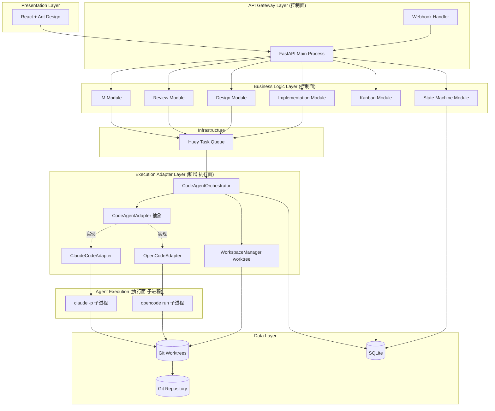

### 1.3 组件图（*revised*）

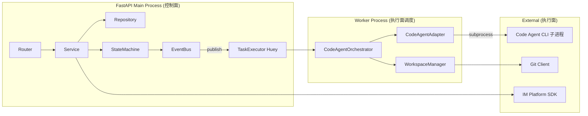

### 1.4 技术栈（*revised*）

| 层 | 技术选型 | 版本 | 理由 |
|---|---------|------|------|
| API | FastAPI | ^0.110 | 沿用 |
| ORM | SQLAlchemy | ^2.0 | 沿用 |
| 任务队列 | Huey | ^2.5 | 沿用 |
| 数据库 | SQLite | ^3.45 | 沿用 |
| 状态机 | 手写 StateTransitionTable | - | 已落地，v2 保留 |
| **执行适配** | **CodeAgentAdapter（自研抽象）** | - | **v2 新增，可插拔核心** |
| **默认执行器** | **ClaudeCode CLI** | latest | **v2 默认 provider** |
| **可切换执行器** | **opencode CLI** | latest | **v2 备选 provider** |
| 子进程 | Python subprocess | stdlib | 调用 CLI 的标准方式 |
| Git 操作 | GitPython + 原生 git worktree | ^3.1 | worktree 管理需原生 git |
| 前端 | React + Ant Design | ^18/^5 | 沿用 |

> **移除 v1 依赖**：`langchain`、`langgraph`、`langchain-openai`、`minio`（产物改落 worktree，MinIO 降为可选）。这简化了依赖链并消除厂商绑定。

### 1.5 NFR 满足策略（*revised*）

| NFR | 策略 |
|-----|------|
| NFR-001 (IM 响应 < 5s) | Webhook 仅验证+入队返回 202，沿用 |
| NFR-002 (Agent < 10min *revised*) | 适配器 subprocess 超时 600s，Huey 重试；worktree 内作业避免大仓库全量操作 |
| NFR-010 (provider 可替换 *revised*) | 适配器模式 + 配置注册，业务层零感知 |
| NFR-012 (CLI 可用性自检 *new*) | 启动时 `CodeAgentRegistry.health_check()` 探测各 provider CLI |
| NFR-013 (worktree 隔离 *new*) | WorkspaceManager 强制 `{req_id}` 路径隔离 + 路径校验防穿越 |
| NFR-014 (资源回收 *new*) | Huey 定时任务清理超期 terminated worktree |

---

## 2. Key Feature Designs

### 2.1 IM 集成与指令系统（沿用 v1）
FR-001~004b，设计不变。`MessageRouter`/`RequirementParser`/`CommandParser`/`IdempotencyChecker` 沿用。

### 2.2 评审系统（*revised*）FR-005/006/007/008

#### 2.2.1 Overview
评审作业**委托 Code Agent 并行执行**，后端仅负责 Task Spec 构造、产物解析、汇总裁决、仲裁与归档。

#### 2.2.2 Class Diagram（*revised*）

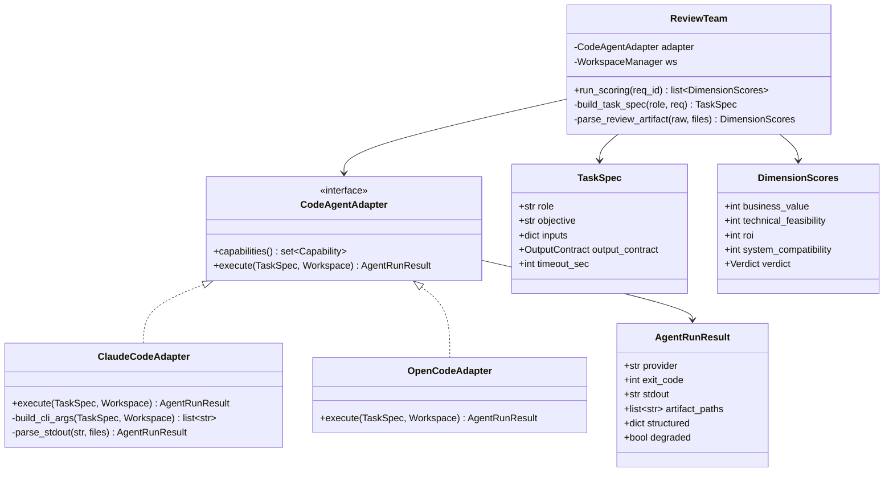

> 对比 v1：`ReviewAgent.call_llm`（NotImplementedError）被替换为 `ReviewTeam` 持有 `CodeAgentAdapter` 引用；角色逻辑不再各自实现 LLM 调用，而是构造 Task Spec 委托适配器。

#### 2.2.3 Sequence Diagram（*revised*）

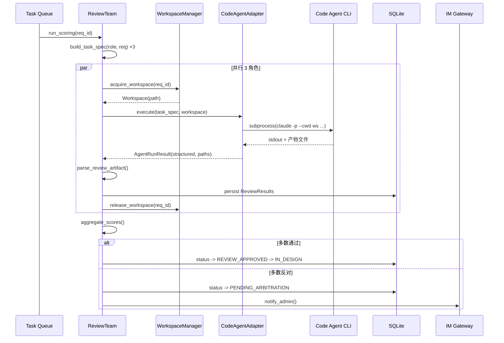

#### 2.2.4 Design Notes
- **Task Spec 契约**：`role`、`objective`、`inputs`（需求文本/摘要/历史版本）、`output_contract`（声明期望的结构化字段或产物文件名）、`timeout_sec`
- **产物解析双路径**：provider 支持结构化输出时取 `AgentRunResult.structured`；否则适配器降级读取 Code Agent 写入的 `review_{role}.json` 文件（`degraded=true`）
- **裁决规则**沿用 v1：≥2 通过自动通过，≥2 反对仲裁，1通过1反对1中立自动通过
- **失败处理**：CLI 非零退出/超时/产物不可解析 -> 指数退避重试 3 次；2 成功 1 失败可降级裁决并标注（OQ#5）

### 2.3 设计系统（*revised*）FR-009/010/011/012

#### 2.3.1 Overview
设计团 3 角色作业委托 Code Agent，**产物直接写入 worktree** `docs/design/{req_id}/v{n}.md` 及结构化接口文件。

#### 2.3.2 Class Diagram（*revised*）

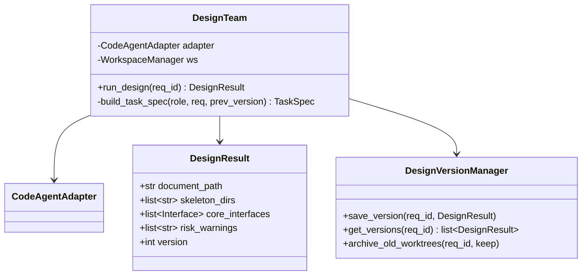

> 对比 v1：`document_url` 占位符（`design://{req_id}/v{n}`）改为真实文件相对路径 `document_path`；版本管理新增旧 worktree 归档。

#### 2.3.3 Sequence Diagram（*revised*）

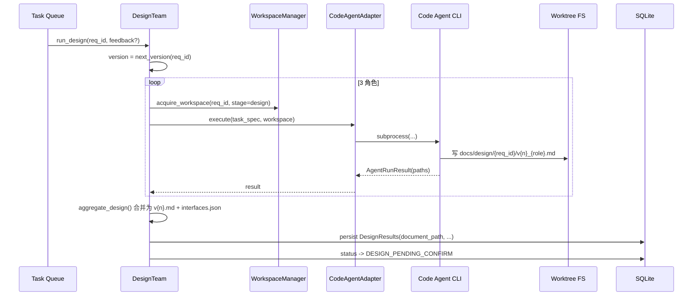

#### 2.3.4 Design Notes
- **产物文件化**：设计文档、目录骨架、接口定义由 Code Agent 写入 worktree；DB 仅存 `document_path` 与结构化摘要
- **驳回迭代**：Task Spec `inputs` 携带上一版 `document_path` 与驳回意见；版本号递增，历史文件保留
- **接口校验**：`DesignOutputHandler._validate_interfaces` 沿用 v1 逻辑，但读 worktree 文件而非 DB 大字段

### 2.4 实施系统（*revised*）FR-013/014/015/016/017

#### 2.4.1 Overview
**Code Agent 在需求专属 worktree 中生成代码+测试、运行测试、采集覆盖率**；验收通过后 worktree 整体提交到独立分支。这是 v2 变化最大的模块。

#### 2.4.2 Class Diagram（*revised*）

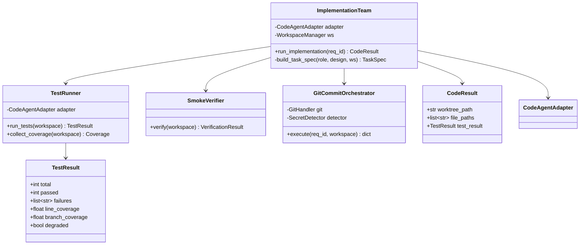

> 对比 v1：移除 `CodeGenerator`（Code Agent 直接生成）；新增 `TestRunner`（FR-024）；`CodeResult` 用 `worktree_path`+`file_paths` 替代内联 `code_files`。

#### 2.4.3 Sequence Diagram（*revised*）

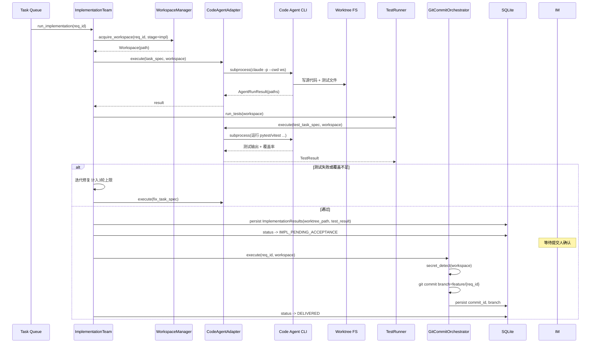

#### 2.4.4 Design Notes
- **worktree 生命周期**：实施 worktree 在设计确认时创建，贯穿实施+验收+落盘，落盘后保留供追溯（NFR-014 控制回收）
- **测试运行**：`TestRunner` 构造 Task Spec 让 Code Agent 在 worktree 执行测试命令并解析输出；适配器声明 `Capability.RUN_TESTS`，不支持则降级（FR-014 AC5）
- **密钥检测**：`SecretDetector` 沿用 v1 的 8 模式，但扫描 worktree 实际文件而非 DB JSON
- **Git 规范**：`feature/{req_id}` 分支，Conventional Commits；worktree 提交即落盘，无需额外拷贝

### 2.5 看板仪表盘（*revised*）FR-018/019/021

沿用 v1，`RequirementDetail` 新增 `worktree_path`、`test_result`、`coverage` 字段用于详情页展示实施结果。`DashboardAPI` 端点不变。

### 2.6 状态机引擎（沿用 v1）FR-020

`StateMachine`/`StateTransitionTable`/`PersistenceManager` 沿用已落地实现。`IMPL_SMOKE_FAIL` 事件语义扩展为"测试未通过"，`IMPL_COMPLETE` 语义为"测试通过待验收"--仅语义说明，迁移表不变。

---

## 2.7 Code Agent 适配层（*new* 核心设计）

> 本节是 v2 的设计重心，定义可插拔执行引擎的契约与实现。

### 2.7.1 CodeAgentAdapter 接口契约

```python
class Capability(str, Enum):
    READ_WRITE_FILES = "read_write_files"   # 读写文件（基础能力，ASM-006）
    RUN_SHELL = "run_shell"                 # 执行 Shell 命令
    RUN_TESTS = "run_tests"                 # 运行测试套件
    STRUCTURED_OUTPUT = "structured_output" # 结构化产物输出
    WORKTREE_ISOLATION = "worktree_isolation"  # 原生 worktree 支持

class TaskSpec(BaseModel):
    role: str                          # 业务角色（产品分析/后端开发...）
    objective: str                     # 作业目标描述
    stage: str                         # review/design/impl/test/archive
    inputs: dict                       # 输入产物引用（文件路径/历史版本/驳回意见）
    output_contract: OutputContract    # 期望产物：结构化字段 或 产物文件名
    timeout_sec: int = 600
    constraints: list[str] = []        # 约束（如"不得访问网络""仅修改 worktree 内文件"）

class OutputContract(BaseModel):
    structured_fields: list[str] | None = None  # 期望的结构化字段名
    artifact_files: list[str] | None = None     # 期望写出的产物文件相对路径
    format: Literal["json", "markdown", "text"] = "json"

class Workspace(BaseModel):
    path: str                  # worktree 绝对路径
    req_id: str
    stage: str                 # 该 worktree 绑定的阶段
    base_ref: str | None       # worktree 基线 git ref

class AgentRunResult(BaseModel):
    provider: str
    exit_code: int
    stdout: str
    stderr: str
    artifact_paths: list[str]  # 实际产出的文件相对路径
    structured: dict | None    # 解析后的结构化产物
    degraded: bool = False     # 是否降级（能力不足/解析失败）
    duration_sec: float

class CodeAgentAdapter(ABC):
    @property
    @abstractmethod
    def provider_name(self) -> str: ...

    @abstractmethod
    def capabilities(self) -> set[Capability]: ...

    @abstractmethod
    def execute(self, task: TaskSpec, workspace: Workspace) -> AgentRunResult: ...
```

### 2.7.2 适配器实现：ClaudeCodeAdapter（默认）

```python
class ClaudeCodeAdapter(CodeAgentAdapter):
    """默认 provider：claude CLI 子进程。"""

    def __init__(self, cli_path: str, extra_args: list[str] | None = None):
        self._cli = cli_path or "claude"
        self._extra = extra_args or []

    @property
    def provider_name(self) -> str:
        return "claude"

    def capabilities(self) -> set[Capability]:
        return {Capability.READ_WRITE_FILES, Capability.RUN_SHELL,
                Capability.RUN_TESTS, Capability.STRUCTURED_OUTPUT,
                Capability.WORKTREE_ISOLATION}

    def execute(self, task: TaskSpec, workspace: Workspace) -> AgentRunResult:
        args = [
            self._cli, "-p",                       # 非交互模式
            "--cwd", workspace.path,               # 工作目录=worktree
            "--output-format", "json",             # 结构化输出
            "--max-turns", "50",
        ] + self._extra
        prompt = self._render_prompt(task)
        proc = subprocess.run(
            args, input=prompt, capture_output=True,
            text=True, timeout=task.timeout_sec, encoding="utf-8",
        )
        structured = self._try_parse_json(proc.stdout) if (
            Capability.STRUCTURED_OUTPUT in self.capabilities()) else None
        return AgentRunResult(
            provider=self.provider_name, exit_code=proc.returncode,
            stdout=proc.stdout, stderr=proc.stderr,
            artifact_paths=self._scan_artifacts(workspace, task.output_contract),
            structured=structured, degraded=structured is None,
            duration_sec=proc.elapsed,
        )
```

### 2.7.3 适配器实现：OpenCodeAdapter（可切换）

```python
class OpenCodeAdapter(CodeAgentAdapter):
    """备选 provider：opencode CLI。仅 build_cli_args / 解析逻辑不同。"""

    @property
    def provider_name(self) -> str:
        return "opencode"

    def capabilities(self) -> set[Capability]:
        return {Capability.READ_WRITE_FILES, Capability.RUN_SHELL,
                Capability.RUN_TESTS}  # 假设暂不支持 STRUCTURED_OUTPUT -> 触发降级

    def execute(self, task: TaskSpec, workspace: Workspace) -> AgentRunResult:
        args = ["opencode", "run", "--cwd", workspace.path, task.objective]
        # ... subprocess 调用，解析走文件产物路径（降级）
```

> **关键**：两个适配器的 `execute` 返回统一的 `AgentRunResult`，业务层 `ReviewTeam`/`DesignTeam`/`ImplementationTeam` 完全不感知差异。新增 provider 只需复制 `OpenCodeAdapter` 模式。

### 2.7.4 CodeAgentRegistry（provider 注册与切换）

```python
class CodeAgentRegistry:
    """provider 注册表 + 启动自检。"""

    _adapters: dict[str, type[CodeAgentAdapter]] = {
        "claude": ClaudeCodeAdapter,
        "opencode": OpenCodeAdapter,
    }

    @classmethod
    def get(cls, provider: str, **kwargs) -> CodeAgentAdapter:
        if provider not in cls._adapters:
            raise ConfigError(f"Unknown CODE_AGENT_PROVIDER: {provider}")
        return cls._adapters[provider](**kwargs)

    @classmethod
    def health_check(cls, provider: str) -> bool:
        """NFR-012：启动时探测 CLI 可用性（claude --version / opencode --version）。"""
        ...
```

### 2.7.5 WorkspaceManager（worktree 隔离）

```python
class WorkspaceManager:
    """FR-023：每需求作业独立 git worktree。"""

    def acquire_workspace(self, req_id: str, stage: str, base_ref: str | None = None) -> Workspace:
        path = Path(settings.WORKTREE_BASE_DIR) / req_id / stage
        path.parent.mkdir(parents=True, exist_ok=True)
        # git worktree add path <base_ref>  -- 独立工作树
        if not path.exists():
            subprocess.run(["git", "worktree", "add", str(path), base_ref or "HEAD"],
                           cwd=settings.GIT_REPO_DIR, check=True)
        return Workspace(path=str(path), req_id=req_id, stage=stage, base_ref=base_ref)

    def release_workspace(self, req_id: str, stage: str, keep: bool = True) -> None:
        """保留供追溯；终态由 Huey 定时任务清理（NFR-014）。"""
        ...
```

### 2.7.6 能力协商与降级矩阵

| 业务调用 | 需要 Capability | provider 不支持时降级 |
|---------|----------------|---------------------|
| 评审打分 | STRUCTURED_OUTPUT | 改读 `review_{role}.json` 文件，`degraded=true` |
| 设计产出 | READ_WRITE_FILES | 必需，不支持则该 provider 不可用于设计（启动自检告警） |
| 代码生成 | READ_WRITE_FILES + RUN_SHELL | 必需 |
| 测试运行 | RUN_TESTS | 仅冲烟验证，结果标注"测试未运行"（FR-014 AC5） |

---

## 3. Data Model（*revised*）

### 3.1 ER Diagram 变更

沿用 v1 的 8 张表，**扩展** `ImplementationResults`，**新增** `CodeAgentRuns`：

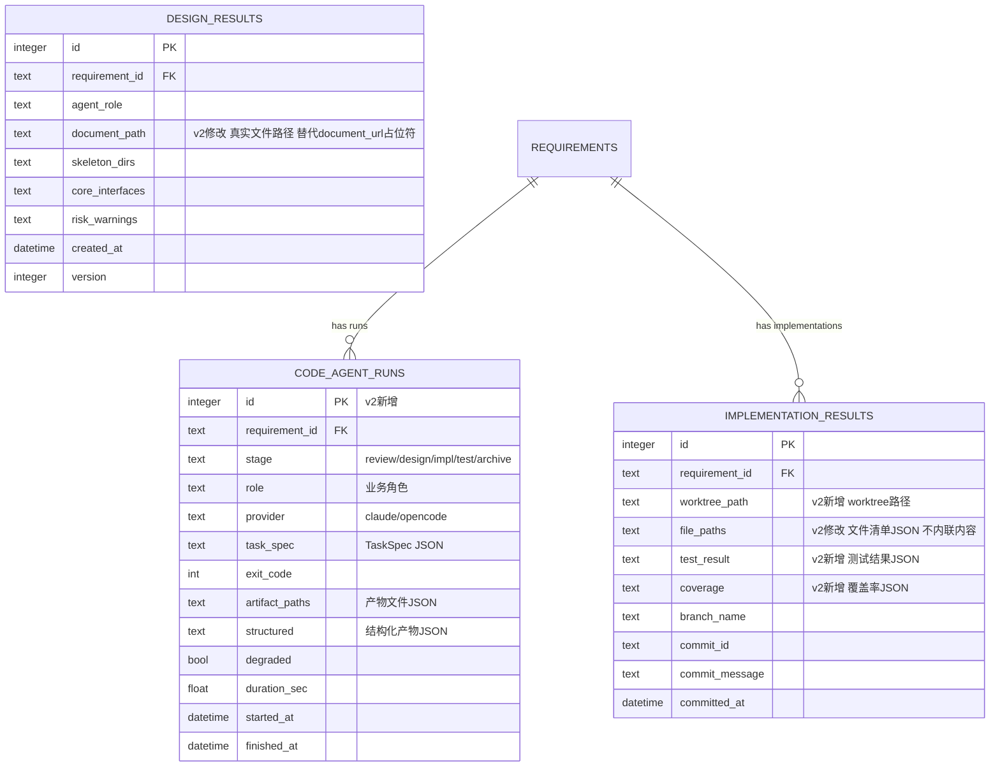

### 3.2 迁移说明（Alembic）

| 变更 | 操作 |
|------|------|
| `implementation_results.worktree_path` | ADD COLUMN Text |
| `implementation_results.file_paths` | RENAME/COPY 自 `code_files`（语义从内联内容改为路径清单） |
| `implementation_results.test_result` | ADD COLUMN JSON |
| `implementation_results.coverage` | ADD COLUMN JSON |
| `design_results.document_url` -> `document_path` | 语义重命名（数据迁移：`design://` 占位符清空） |
| `code_agent_runs` | CREATE TABLE（新） |

### 3.3 存储策略（*revised*）

| 表 | 预估行数(1年) | 索引策略 |
|---|--------------|---------|
| code_agent_runs *new* | 60,000 | IX(requirement_id), IX(stage, provider), IX(started_at) |
| implementation_results | 15,000 | IX(requirement_id) |
| 其余 | 沿用 v1 | - |

> `code_agent_runs` 是 v2 的可观测性核心：每次 Code Agent 调用的 provider、耗时、降级情况全留痕，支撑 NFR-007 审计与 provider 选型决策。

---

## 4. API / Interface Design（*revised*）

### 4.1 外部接口

| ID | 外部系统 | 方向 | 协议 | 数据格式 |
|----|---------|------|------|---------|
| IFR-001 | IM 平台 | 双向 | Webhook | JSON |
| IFR-002 | Git 仓库 | 出站 | Git HTTPS/SSH | 代码+Commit |
| IFR-003 *revised* | Code Agent CLI（本地） | 出站 | 子进程 | prompt + 文件产物 |

### 4.2 内部 API 契约

沿用 v1 的 C-001~C-006。详情接口 `GET /api/requirements/{req_id}` 响应新增 `worktree_path`、`test_result`、`coverage` 字段。

### 4.3 任务队列契约（*revised*）

| Task Name | Parameters | Return | Contract |
|-----------|-----------|--------|----------|
| `process_im_message` | message_id, sender_id, content | StructuredRequirement | T-001 |
| `run_review` | requirement_id | ReviewResult | T-002 |
| `run_design` | requirement_id, feedback? | DesignResult | T-003 |
| `run_implementation` | requirement_id | CodeResult | T-004 |
| `run_acceptance_tests` *new* | requirement_id, workspace | TestResult | T-007 |
| `send_im_notification` | recipient_id, message_type, content | bool | T-005 |
| `cleanup_worktrees` *new* | - | str | T-008 |

### 4.4 CodeAgentAdapter 契约（*new* C-100 系列）

| Contract | 方法 | 签名 |
|----------|------|------|
| C-100 | `execute` | `(TaskSpec, Workspace) -> AgentRunResult` |
| C-101 | `capabilities` | `() -> set[Capability]` |
| C-102 | `Registry.get` | `(provider: str, **kw) -> CodeAgentAdapter` |
| C-103 | `Registry.health_check` | `(provider: str) -> bool` |

---

## 5. UI/UX Design（*revised*）

前端架构沿用 v1。新增展示：

| UCD 组件 | 实现组件 | 路径 | v2 新增内容 |
|----------|---------|------|------------|
| 实施结果卡 | `ImplementationCard` | `src/components/requirements/ImplementationCard.tsx` | 展示测试通过率、覆盖率、worktree 路径 |
| 执行引擎状态 | `ProviderBadge` | `src/components/common/ProviderBadge.tsx` | 详情页显示当前 provider 与降级标记 |
| 配置页（运维） | `ProviderConfigPage` | `src/pages/ProviderConfigPage.tsx` | provider 切换、CLI 健康状态 |

路由新增 `/settings/provider`（仅平台维护者可见）。

---

## 6. Third-Party Dependencies（*revised*）

### 6.1 Python 后端

| 库 | 版本 | 用途 | v2 变更 |
|---|------|------|--------|
| fastapi | ^0.110 | Web API | - |
| sqlalchemy | ^2.0 | ORM | - |
| huey | ^2.5 | 任务队列 | - |
| gitpython | ^3.1 | Git 操作 | worktree 管理增强 |
| pydantic | ^2.6 | 数据验证 | TaskSpec/AgentRunResult |
| ~~langchain~~ | - | - | **移除** |
| ~~langgraph~~ | - | - | **移除**（手写状态机已落地） |
| ~~langchain-openai~~ | - | - | **移除** |
| ~~minio~~ | - | - | **移除**（产物落 worktree） |

### 6.2 外部 CLI 依赖（*new*）

| CLI | 用途 | 必需性 |
|-----|------|--------|
| `claude` (ClaudeCode) | 默认执行引擎 | 默认 provider 必需 |
| `opencode` | 可切换执行引擎 | 仅当 provider=opencode 时必需 |
| `git` | worktree + 落盘 | 必需 |

### 6.3 前端
沿用 v1。

---

## 7. Testing Strategy（*revised*）

### 7.1 测试哲学（沿用）
TDD + 质量门禁；Red -> Green -> Refactor -> Coverage -> Mutation。

### 7.2 工具选型（沿用 v1，新增适配器测试）

| 层 | 工具 | 用途 |
|---|------|------|
| 适配器测试 | pytest + subprocess mock | 验证 CLI 参数构造与产物解析 |
| provider 切换回归 | pytest | 同一 TaskSpec 经不同 adapter 产出等价结构 |
| worktree 隔离测试 | pytest + 临时 git repo | 并发作业路径零串扰 |

### 7.3 覆盖率门禁（沿用）
行 ≥80%，分支 ≥70%。**注意**：此门禁同时是 FR-024 交付物的验收标准--系统自身的代码与 Code Agent 生成的代码均须满足。

---

## 8. Deployment / Infrastructure（*revised*）

### 8.1 部署架构

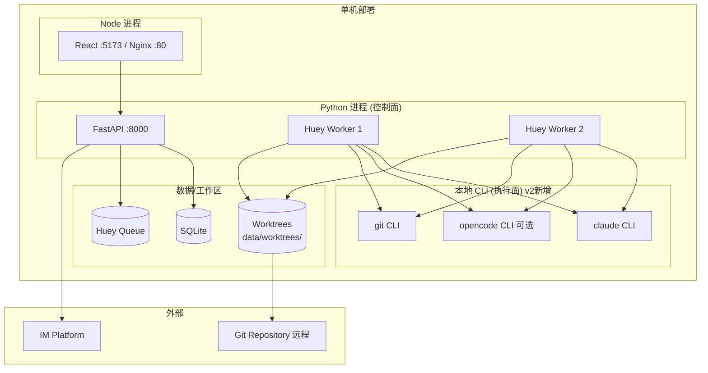

### 8.2 环境变量（*revised*）

| 变量 | 说明 | 默认值 |
|------|------|--------|
| `DATABASE_URL` | SQLite 路径 | `sqlite:///data/demandflow.db` |
| `HUEY_URL` | Huey 队列路径 | `sqlite:///data/huey_queue.db` |
| **`CODE_AGENT_PROVIDER`** *new* | 执行引擎 provider | `claude` |
| **`CODE_AGENT_CLI_PATH`** *new* | CLI 可执行路径 | `claude`（按 provider 默认） |
| **`CODE_AGENT_EXTRA_ARGS`** *new* | CLI 额外参数（JSON） | `[]` |
| **`CODE_AGENT_TIMEOUT_SEC`** *new* | 单作业超时 | `600` |
| **`WORKTREE_BASE_DIR`** *new* | worktree 根目录 | `data/worktrees` |
| **`WORKTREE_RETENTION_DAYS`** *new* | worktree 保留天数 | `7` |
| `GIT_REPO_URL` | Git 仓库地址 | - |
| `GIT_REPO_DIR` *new* | 本地仓库目录（worktree 基线） | - |
| `GIT_BRANCH_PREFIX` | 分支前缀 | `feature/` |
| `IM_PLATFORM` | IM 平台 | `dingtalk` |
| `IM_WEBHOOK_SECRET` | Webhook 密钥 | - |

---

## 9. Development Plan（*revised*）

### 9.1 v2 迭代里程碑

| 里程碑 | 范围 | 退出标准 |
|--------|------|----------|
| **M8: Adapter Foundation** | CodeAgentAdapter 抽象、Registry、WorkspaceManager、ClaudeCodeAdapter、启动自检 | 适配器可调通 claude CLI，worktree 隔离单测通过 |
| **M9: Review/Design 委托** | ReviewTeam/DesignTeam 改为委托适配器，产物文件化 | 评审/设计经 Code Agent 真实产出，DB 存引用 |
| **M10: Implementation 委托** | ImplementationTeam + TestRunner，worktree 代码生成+测试 | 代码+测试在 worktree 生成并通过 |
| **M11: Acceptance & Archive** | FR-024 完整测试验收、交付档案、Git 落盘接通 | 端到端：IM 需求 -> 已交付分支 |
| **M12: Provider 可插拔** | OpenCodeAdapter、切换回归测试、配置页 | opencode 切换跑通同样流程 |
| **M13: Observability & Polish** | code_agent_runs 留痕、降级标注、看板展示 | NFR-007/012/013 达标 |

### 9.2 Feature 分解（v2 新增）

| Feature ID | 名称 | Priority | Mapped FRs | 依赖 |
|------------|------|----------|------------|------|
| F024 | CodeAgentAdapter 抽象与 Registry | P0 | FR-022 | F001 |
| F025 | WorkspaceManager worktree 隔离 | P0 | FR-023 | F024 |
| F026 | ClaudeCodeAdapter 实现 | P0 | FR-022 | F024 |
| F027 | 评审团委托适配器（重构 F008） | P0 | FR-005 | F026 |
| F028 | 设计团委托适配器（重构 F012/F013） | P0 | FR-009/010 | F026 |
| F029 | 实施团委托适配器（重构 F015） | P0 | FR-013 | F025/F026 |
| F030 | TestRunner 完整测试验收 | P0 | FR-014/024 | F029 |
| F031 | Git 落盘接通 worktree（重构 F018） | P0 | FR-016 | F029 |
| F032 | 交付档案 Code Agent 生成（重构 F019） | P0 | FR-017a/b | F031 |
| F033 | OpenCodeAdapter 与切换回归 | P1 | FR-022 | F026 |
| F034 | code_agent_runs 留痕与降级标注 | P1 | NFR-007/012 | F027 |
| F035 | 看板展示执行引擎状态 | P1 | FR-018 | F034 |

### 9.3 依赖链（v2 关键路径）

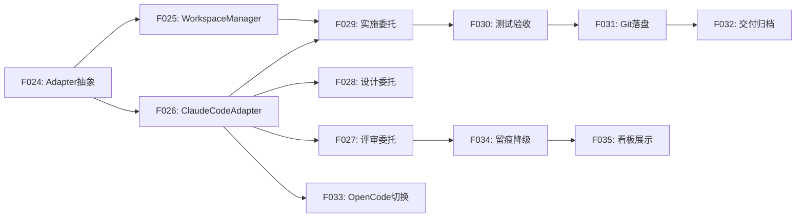

**关键路径**: F024 -> F026 -> F029 -> F030 -> F031 -> F032

### 9.4 风险登记（*revised*）

| 风险 | 影响 | 概率 | 缓解策略 |
|------|------|------|----------|
| Code Agent CLI 不可用/未安装 | 全流程停滞 | 中 | NFR-012 启动自检 + 明确部署文档 |
| 单作业耗时超 10min | 队列堆积 | 中 | 超时熔断 + 降级为冲烟 + IM 通知 |
| provider 能力不等价致验收降级 | 验收客观性下降 | 中 | 能力协商 + 降级标注供决策门参考 |
| worktree 磁盘膨胀 | 磁盘耗尽 | 低 | NFR-014 定时清理 + 保留期配置 |
| CLI 输出格式变更 | 适配器解析失败 | 低 | 适配器单元测试 + 版本锁定 |
| 并发 worktree Git 锁竞争 | 落盘失败 | 低 | worktree 级独立分支 + 重试 |

---

## 10. Additional Notes

### 10.1 与 v1 实现的兼容性
- 已落地的 F001~F023（IM/状态机/数据模型/看板）**控制面代码基本保留**，仅 `ImplementationResults`/`DesignResults` 字段迁移
- F008/F012/F013/F015/F018/F019 的 Agent 类（ReviewTeam 等）**内部重构**（call_llm -> adapter.execute），对外方法签名（`run_scoring`/`run_design`/`run_implementation`）保持不变，调用方无需改动
- 现有测试需更新：mock `CodeAgentAdapter` 而非 `call_llm`

### 10.2 provider 扩展指南（新增 code agent CLI 的步骤）
1. 新建 `app/core/adapters/{name}_adapter.py`，继承 `CodeAgentAdapter`
2. 实现 `provider_name`/`capabilities`/`execute`（核心是 `build_cli_args` 与产物解析）
3. 在 `CodeAgentRegistry._adapters` 注册
4. 新增适配器单元测试 + provider 切换回归测试
5. 配置 `CODE_AGENT_PROVIDER={name}` 即可启用，**业务代码零改动**

### 10.3 未来迁移路径（沿用 v1 并扩展）
- SQLite -> PostgreSQL：并发 >50 或需求 >10,000 时
- Huey -> Celery：需分布式队列时
- 本地 CLI -> 远程 Code Agent 服务：若出现托管型 code agent 服务，新增 RemoteAdapter（HTTP 调用）即可，仍遵守 `CodeAgentAdapter` 契约

---

**Document ends. v2 评审通过后，按 §9.2 Feature 分解推进 M8~M13 实施。**
