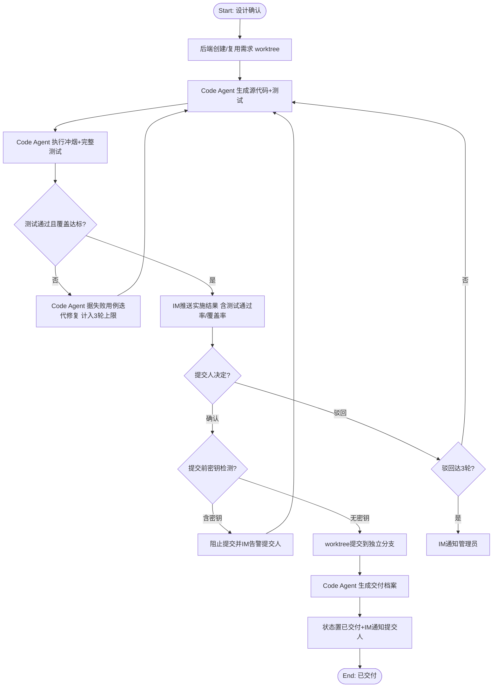

# DemandFlow 智能需求交付系统 - Software Requirements Specification (v2)

**Date**: 2026-07-08
**Status**: Draft（待评审）
**Supersedes**: [2026-07-04-demandflow-srs.md](2026-07-04-demandflow-srs.md)（v1）
**Standard**: Aligned with ISO/IEC/IEEE 29148

---

## 0. 变更摘要（v1 → v2）

本轮迭代的唯一主题：**把各环节的"智力作业"从空壳的 LangChain LLM 调用，重构为可插拔的代码类 CLI Agent 执行引擎**。v1 设计的 Agent 层（评审团/设计团/实施团）`call_llm` 方法均为 `NotImplementedError`，真正的评审打分、概要设计、代码生成从未接上执行能力。v2 引入统一适配层，使任意代码类 CLI（ClaudeCode / opencode / 未来其他）均可作为执行引擎，配置切换、零代码改动。

| 维度 | v1 | v2 | 变更类型 |
|------|----|----|---------|
| 执行引擎 | LangChain + 远程 LLM REST API（空壳） | 可插拔 Code Agent CLI 适配层（默认 ClaudeCode） | 重构 |
| 接入方式 | 进程内 SDK 调用（未实现） | CLI 子进程 + 适配器模式 | 重构 |
| 厂商绑定 | 绑定 LangChain/OpenAI | 不绑定，provider 可配置切换 | 强化 NFR-010 |
| 产物落盘 | LLM 返回 JSON，后端落盘 | Code Agent 直接写文件到 worktree/仓库，DB 存引用 | 优化 |
| 作业隔离 | 无（共享进程内存） | 每需求作业独立 git worktree | 新增 |
| 验收范围 | 仅冲烟验证（语法/导入/启动） | 完整测试套件 + 覆盖率门禁 | 升级（解决 OQ#2） |
| 控制面/执行面 | 混杂 | 明确分离：后端=控制面，Code Agent=执行面 | 重构 |

**FR 编号策略**：保留 v1 的 FR-001 ~ FR-021 编号与语义，对受影响 FR 做内容修订（标注 *revised*）；新增 FR-022（Code Agent 可插拔）、FR-023（Worktree 隔离与产物落盘）、FR-024（完整测试验收）。其余 FR 原文保留。

### 0.1 架构决策记录（ADR）

以下决策在产出 design 前已采纳为合理默认，供评审。如需调整请在评审反馈中标注。

| ADR | 决策 | 理由 |
|-----|------|------|
| ADR-1 | 接入方式 = CLI 子进程 + 适配器模式 | "可切换 opencode 等其他 CLI"的硬约束排除了厂商 SDK 方案；CLI 是跨厂商唯一通用入口 |
| ADR-2 | 控制面/执行面分离，后端保留控制面 | 状态机/IM/DB/决策门需确定性、可审计、可恢复，不宜交给非确定的 Agent；Agent 专注一次性智力作业 |
| ADR-3 | Code Agent 直接写文件到 worktree，DB 存引用 | 代码类 CLI 的核心能力是文件系统操作；返回大段 JSON 给后端落盘违背其能力模型且易截断 |
| ADR-4 | 每需求作业独立 git worktree | 并发隔离 + 失败可整体丢弃 + 验收通过后合并即落盘，天然契合 Git 落盘 FR-016 |
| ADR-5 | 验收升级为完整测试套件 | Code Agent 天然可读写测试并运行；彻底解决 v1 OQ#2"可运行但行为错误" |
| ADR-6 | 默认 provider = ClaudeCode，配置项 `CODE_AGENT_PROVIDER` 切换 | 满足"不限制具体 code agent"；opencode 等仅新增适配器即可接入 |

---

## 1. Purpose & Scope

DemandFlow 是一套以 IM 为唯一交互入口、**由可插拔代码类 CLI Agent 执行全链路智力作业**、人工仅在决策门介入的需求交付流水线。用户通过 IM 发送一句话需求，系统自动完成「需求接入 → 评审 → 概要设计 → 代码实施 → 验收 → 归档」全链路，每个环节由后端控制面调度、Code Agent 执行面产出产物文档与代码，所有进度与产出在可视化看板呈现，形成"输入即触发、执行可委托、结果可追溯"的闭环。

本系统的核心价值（WHAT）：将本应聚焦关键决策的人从重复的评审/设计/编码/验收执行中解放出来——执行交给可插拔的 Code Agent CLI 自动完成，人工仅在确认/驳回决策门介入；且执行引擎不绑定特定厂商，可随工具演进切换。

### 1.1 In Scope

本轮（v2）覆盖：

- 单一 IM 渠道接入：消息接收、需求/指令识别、需求结构化与 ID 生成、基本幂等（沿用 v1）
- IM 指令体系（5 个）：提交需求、确认、驳回、进度、我的列表（沿用 v1）
- **可插拔 Code Agent 执行引擎**（新增）：统一适配器契约、provider 配置切换、CLI 子进程调度、超时与重试
- 需求评审：多角色评审作业**委托 Code Agent 并行执行**、汇总裁决、多数反对触发人工仲裁、驳回归档
- 概要方案设计：多角色设计作业**委托 Code Agent 产出设计文档+目录骨架+核心接口**、确认门、驳回多轮迭代
- 代码实施：**Code Agent 在独立 worktree 生成源代码与测试**、冲烟+完整测试验证、确认门、驳回多轮迭代
- 验收：**Code Agent 运行完整测试套件并输出覆盖率**，作为验收门客观依据
- 代码落盘：验收通过后 worktree 合并到独立 Git 分支、规范 Commit、密钥检测、交付档案与状态归档
- 基础看板：总览指标、需求列表（筛选+搜索）、状态机自动流转、看板与 IM 操作同步、超时提醒（沿用 v1）
- 全局协调与状态机：节点自动流转、多需求并发隔离（worktree 级）、3 轮迭代上限升级、4 小时超时提醒

### 1.2 Out of Scope

明确不做的内容（沿用 v1，新增项标注 *new*）：

- 非需求/指令的富媒体消息处理（图片/文件/语音，本轮仅文本）
- 语义级需求去重（本轮仅基本幂等）
- 详细架构与技术设计阶段（本轮概要设计直接驱动代码）
- 多 IM 渠道（本轮单一渠道）
- 详情页时间轴/版本对比/执行日志（本轮基础看板）
- 历史方案复用与向量知识库（本轮最小使用）
- IM 追加补充/优先级设置指令（本轮 5 个指令）
- 非IM渠道提交（Web 表单/API）
- 多租户/组织隔离（单组织内部使用）
- 对接外部 CI/CD 或 Issue 系统（Jira/GitLab CI/GitHub Actions）
- 需求拆分合并与版本分支管理
- *new* 跨多仓库/多语言的代码实施（本轮假设 Code Agent 在单一目标仓库作业）
- *new* Code Agent 的远程/分布式执行（本轮 Code Agent CLI 需与后端同机部署）

### 1.3 Problem Statement

沿用 v1 根因分析，v2 补充一条根因：

```
Symptom: 关键决策者每天被重复的需求评审/方案设计/代码实施/验收执行工作淹没
Root Cause (v1): 需求交付链路缺少"自动化执行引擎 + 关键节点人工决策门"
Root Cause (v2 补充): 即便设计了多智能体执行层，若执行能力依赖单一厂商 LLM SDK 且未真正接通，
                     则"自动执行"仍是空壳，人依旧被淹没——执行引擎必须可落地且可替换
```

**Jobs-to-be-Done**: 当一个新的需求被提出时，我想要只需在 IM 发一句话，由系统委托代码类 Agent 自动完成评审-设计-实施-验收全链路，以便把精力集中在关键确认/驳回决策上，且执行引擎可随工具演进自由切换而不重构系统。

Pain Map 沿用 v1，新增：

| Pain Point | Current Workaround | Frequency | Severity | Score |
|---|---|---|---|---|
| 执行引擎绑定单一厂商，工具迭代即过时 | 重写 Agent 调用层 | Quarterly | Medium | 5 |

**Alignment Validation**: PASS
- 根因覆盖：v1 痛点 4/4 + v2 新增痛点 1/1 已由 FR 覆盖
- JTBD 结果：通过完成全部 Must 级 FR 可达成
- Pre-mortem 发现：3 项记入 Open Questions（Code Agent 能力差异、CLI 可用性、作业耗时）
- 孤儿 FR：0

---

## 2. Glossary & Definitions

沿用 v1 全部术语，新增/修订以下：

| Term | Definition | Do NOT confuse with |
|------|-----------|---------------------|
| 代码类 CLI Agent（Code Agent CLI） | 能读写文件、执行 Shell 命令、运行测试、多步推理的代码智能体命令行工具，如 ClaudeCode、opencode | 仅做文本生成的远程 LLM API |
| Code Agent 适配器（CodeAgentAdapter） | 统一封装不同 Code Agent CLI 差异的抽象层，定义 `execute(task, workspace)` 契约 | 具体某个 CLI |
| Provider | 适配器的具体实现标识（如 `claude`、`opencode`），通过配置切换 | 适配器接口本身 |
| 控制面（Control Plane） | 后端 FastAPI 负责的确定性调度职责：IM 接入、状态机、DB、看板 API、决策门、适配器调度、超时监控 | 执行面 |
| 执行面（Execution Plane） | Code Agent 负责的一次性智力作业：评审/设计/实施/验收/归档的产物生成 | 控制面 |
| Worktree 隔离 | 每个需求作业在独立 git worktree 中执行，互不干扰，失败可整体丢弃 | 共享工作目录 |
| 任务规格（Task Spec） | 后端下发给 Code Agent 的结构化作业描述：角色、目标、输入产物引用、输出契约、约束 | Prompt（Task Spec 经适配器转译为具体 CLI 调用） |
| 能力协商（Capability Negotiation） | 适配器声明其 provider 支持的能力（如 `run_tests`、`structured_output`），后端据此选择调用方式 | 静态假设所有 provider 能力等价 |
| 完整测试验收 | Code Agent 生成并运行单元/集成测试，以测试通过率+覆盖率达门禁作为验收依据 | 冲烟验证（仅可运行性检查） |

---

## 3. Stakeholders & User Personas

沿用 v1，新增一行：

| Persona | Technical Level | Key Needs | Access Level |
|---------|----------------|-----------|--------------|
| 平台维护者（DevOps） | 高 | 配置/切换 Code Agent provider、监控 CLI 可用性与作业耗时 | 配置项 + 运维面板 |

Use Case View 沿用 v1，新增 UC：UC22[FR-022: Code Agent provider 切换]、UC23[FR-023: Worktree 隔离作业]、UC24[FR-024: 完整测试验收]。

---

## 4. Functional Requirements

> 标注 *revised* 的 FR 相对 v1 有内容修订；未标注者原文保留。新增 FR 编号从 FR-022 起。

### FR-001 ~ FR-004b（沿用 v1）
IM 消息接收与识别、需求结构化与 ID 生成、重复提交幂等、状态变更/查询指令。原文不变。

### FR-005: 评审团多角色独立打分 *revised*
**Priority**: Must
**EARS**: When 一条新结构化需求入库，the system shall 通过 Code Agent 适配器并行触发评审团（产品分析、价值评估、技术可行性 3 角色）作业，每角色独立产出 4 维度 1-5 分评分与通过/反对/中立结论。
**Acceptance Criteria**:
- Given 新需求入库，when 触发评审，then 后端为每角色构造 Task Spec 并经适配器调用 Code Agent，3 份作业并行执行
- Given Code Agent 作业返回结构化评分（适配器解析产物），when 汇总，then 落库 ReviewResults 且各维度 1-5、verdict ∈ {通过,反对,中立}
- Given 某 Code Agent 作业失败（CLI 非零退出/超时/产物不可解析），when 触发，then 指数退避重试 3 次，3 次仍失败则 IM 通知管理员
- Given 3 角色作业均失败，when 触发，then 暂停该需求流转并 IM 通知管理员
- Given 当前 provider 不支持结构化输出能力，when 调度，then 适配器降级为文本产物 + 正则/JSON 提取，并记录降级事件

### FR-006: 评审结论汇总与裁决（沿用 v1）
≥2 通过自动通过；≥2 反对触发仲裁；1通过1反对1中立视为多数未反对自动通过。

### FR-007: 人工仲裁处理（沿用 v1）

### FR-008a / FR-008b: 评审驳回通知与归档（沿用 v1）

### FR-009: 设计团多角色产出概要设计 *revised*
**Priority**: Must
**EARS**: When 评审通过，the system shall 通过 Code Agent 适配器并行触发设计团（产品设计、技术选型、合规风控 3 角色）作业，产出概要设计文档、代码目录骨架与核心接口定义。
**Acceptance Criteria**:
- Given 评审通过，when 触发设计，then 3 角色各自经适配器调用 Code Agent 产出，汇总为概要设计
- Given Code Agent 作业，when 产出，then 设计文档以 Markdown 写入 `docs/design/{req_id}/v{n}.md`，目录骨架与接口以结构化产物返回
- Given 合规风控角色识别影响核心业务流程的高风险，when 汇总，then 在设计中标注 `[高风险]` 并给出建议
- Given 某角色 Code Agent 作业失败，when 触发，then 指数退避重试 3 次，3 次仍失败则 IM 通知管理员

### FR-010: 设计产出物生成 *revised*
**Priority**: Must
**EARS**: When 设计团完成，the system shall 输出概要设计文档、代码目录骨架与核心接口定义（顶层模块全部对外接口），产物引用落库。
**Acceptance Criteria**:
- Given 设计完成，when 输出，then 生成结构化概要设计文档（文件路径）+ 目录骨架 + 顶层模块全部对外接口定义
- Given 顶层模块某接口无法从需求完全推导，when 输出，then 标注该接口为"待确认项"并保留推导假设
- Given 产出物存储失败，when 输出，then 指数退避重试 3 次，3 次仍失败则 IM 通知管理员
- Given 产物已写入 worktree，when 落库，then DesignResults 记录文件相对路径而非内联全文（避免大字段）

### FR-011: 设计确认门与 IM 推送（沿用 v1）

### FR-012: 设计驳回迭代 *revised*
**Priority**: Must
**EARS**: When 提交人发送「驳回 + 修改意见」，the system shall 携带修改意见回到设计阶段，重新委托 Code Agent 生成并保留历史版本。
**Acceptance Criteria**:
- Given 提交人驳回 + 修改意见，when 处理，then 重新触发设计团（Task Spec 携带上一版产物与意见）并保留上一版历史文件
- Given 同节点驳回达 3 轮，when 处理，then IM 通知管理员介入并暂停自动流转
- Given 提交人确认，when 处理，then 进入代码实施阶段
- Given 驳回意见为空，when 处理，then IM 提示需提供修改意见

### FR-013: 实施团代码生成 *revised*
**Priority**: Must
**EARS**: When 设计经提交人确认，the system shall 在该需求专属 worktree 中委托 Code Agent 按设计稿生成可运行源代码与配套测试。
**Acceptance Criteria**:
- Given 设计确认，when 触发实施，then 后端为该需求创建/复用独立 git worktree，Code Agent 在其中生成符合设计规范的源代码
- Given Code Agent 作业，when 生成，then 同时生成单元测试覆盖核心接口 happy path 与边界条件
- Given 设计存在两种以上合理解释（歧义），when 生成，then Code Agent 选择一种解释并标注假设后继续生成
- Given 代码生成失败，when 处理，then 指数退避重试 3 次，3 次仍失败则 IM 通知管理员
- Given 作业在 worktree 中完成，when 落库，then ImplementationResults 记录 `worktree_path` 与产物文件清单，不内联全部代码内容

### FR-014: 冲烟验证 → 完整测试验收 *revised*
**Priority**: Must
**EARS**: When 源代码生成完成，the system shall 委托 Code Agent 执行冲烟验证（语法/编译、导入、启动）并运行完整测试套件，输出测试结果与覆盖率作为验收依据。
**Acceptance Criteria**:
- Given 代码生成完成，when 验证，then Code Agent 依次执行冲烟三检查 + 单元/集成测试，输出结构化结果日志
- Given 冲烟验证失败，when 处理，then 标记问题并自动迭代修复（计入 3 轮上限）
- Given 冲烟通过但测试失败，when 处理，then Code Agent 据失败用例迭代修复（计入 3 轮上限），避免"可运行但行为错误"
- Given 全部测试通过且覆盖率达门禁（行 ≥80% / 分支 ≥70%），when 处理，then 进入实施待验收并触发确认门
- Given 当前 provider 不支持 `run_tests` 能力，when 调度，then 降级为仅冲烟验证并在结果中标注"测试未运行"（记入 Open Questions 风险）

### FR-015: 实施结果确认门 *revised*
**Priority**: Must
**EARS**: When 验证通过，the system shall 通过 IM 推送实施结果摘要（含测试通过率与覆盖率）并等待提交人确认或驳回。
**Acceptance Criteria**:
- Given 验证通过，when 推送，then IM 发送实施结果摘要 + 测试结果 + 覆盖率 + 详情链接
- Given 提交人确认，when 处理，then 进入代码落盘阶段
- Given 提交人驳回 + 意见，when 处理，then 携带意见重新实施（计入 3 轮上限）
- Given 驳回达 3 轮，when 处理，then IM 通知管理员介入
- Given 推送超过 4 小时未操作，when 超时，then IM 提醒提交人；累计 3 次提醒后升级管理员介入

### FR-016: Git 提交 *revised*
**Priority**: Must
**EARS**: When 实施结果经提交人确认，the system shall 对该需求 worktree 执行密钥检测，通过后将代码提交到指定 Git 仓库的独立分支并生成规范 Commit 信息。
**Acceptance Criteria**:
- Given 实施确认，when 提交，then 对 worktree 全部变更执行密钥检测，通过后创建独立分支 `feature/{req_id}` 并提交 + Conventional Commits 规范信息
- Given 代码含疑似密钥（API Key/密码/Token 模式），when 提交前，then 阻止提交并 IM 告警提交人
- Given Git 提交失败，when 处理，then 重试 3 次后 IM 通知管理员
- Given 指定仓库写入凭证失效，when 提交，then IM 通知管理员检查凭证
- Given worktree 已含完整代码与测试，when 提交，then 一并提交（含测试代码）

### FR-017a / FR-017b: 交付档案与状态归档 *revised*
**Priority**: Must
**EARS**: When Git 提交成功，the system shall 委托 Code Agent 生成全流程交付档案（含各阶段产物引用与交付总结），并将需求状态置为「已交付」通知提交人。
**Acceptance Criteria**:
- Given Git 提交成功，when 归档，then 生成全流程交付档案 Markdown（写入 `docs/archive/{req_id}.md`，含评审/设计/实施/验收产物引用）+ 交付总结
- Given 档案存储失败，when 处理，then 指数退避重试 3 次，3 次仍失败则 IM 通知管理员（不影响已提交的 Git 代码）
- Given 档案生成完成，when 处理，then 状态置"已交付"并 IM 通知提交人

### FR-018 ~ FR-021（沿用 v1）
总览看板指标、需求列表与筛选搜索、工作流状态机自动流转、看板操作与 IM 同步。原文不变。

### FR-022: Code Agent 执行引擎可插拔 *new*
**Priority**: Must
**EARS**: When 平台维护者配置 `CODE_AGENT_PROVIDER`，the system shall 经统一适配器契约调度对应 Code Agent CLI 执行各环节作业，切换 provider 无需修改业务代码。
**Acceptance Criteria**:
- Given 配置 `CODE_AGENT_PROVIDER=claude`，when 系统启动，then 评审/设计/实施/验收/归档作业均经 ClaudeCodeAdapter 调度
- Given 配置 `CODE_AGENT_PROVIDER=opencode`，when 系统启动，then 上述作业改经 OpenCodeAdapter 调度，业务流转逻辑不变
- Given 新增一个 provider，when 接入，then 仅需实现 `CodeAgentAdapter` 接口并注册，无需改动 ReviewTeam/DesignTeam/ImplementationTeam 等业务类
- Given 配置的 provider CLI 在主机不可用（未安装/路径错误），when 启动，then 启动自检失败并明确提示缺失的 CLI
- Given 适配器调用 CLI，when 执行，then 统一封装：子进程启动、超时控制、退出码判定、stdout/stderr 捕获、产物路径回传
- Given 两份作业并发，when 调度，then 适配器保证各作业在独立 worktree / 独立子进程中互不干扰

### FR-023: Worktree 隔离与产物落盘 *new*
**Priority**: Must
**EARS**: When 后端为某需求触发执行面作业，the system shall 在独立 git worktree 中执行该作业，Code Agent 产物直接写入文件系统，后端仅持久化产物引用与元数据。
**Acceptance Criteria**:
- Given 触发某需求作业，when 调度，then 在 `WORKTREE_BASE_DIR/{req_id}/` 下创建独立 git worktree
- Given Code Agent 作业，when 产出，then 文档/代码/测试直接写入 worktree 文件，DB 记录相对路径与文件清单
- Given 多需求并发作业，when 执行，then 各 worktree 路径隔离，无文件串扰
- Given 作业失败或需求终止，when 清理，then 对应 worktree 可被回收（保留 N 天后清理，可配置）
- Given 验收通过进入落盘，when 合并，then worktree 变更合并/提交到目标分支后，worktree 可保留供追溯

### FR-024: 完整测试验收 *new*
**Priority**: Must
**EARS**: When 实施作业完成，the system shall 委托 Code Agent 运行生成的测试套件并采集覆盖率，作为验收门的客观依据。
**Acceptance Criteria**:
- Given 实施作业产出代码与测试，when 验收，then Code Agent 运行测试并输出通过率、失败用例、覆盖率
- Given 覆盖率低于门禁（行 <80% 或分支 <70%），when 验收，then 标记未达标并触发迭代修复（计入 3 轮上限）
- Given 测试全部通过且覆盖率达门禁，when 验收，then 结果作为 FR-015 确认门推送内容的一部分
- Given 测试运行环境缺失（如目标语言运行时未安装），when 验收，then 记录环境缺失并 IM 通知管理员

### 4.1 Process Flows

评审/设计流程沿用 v1。实施与落盘流程 *revised*（新增 worktree 与完整测试）：



需求全生命周期状态沿用 v1（14 个状态）；`IMPL_SMOKE_FAIL` 事件语义扩展为"测试未通过"，`IMPL_COMPLETE` 语义为"测试通过待验收"。

---

## 5. Non-Functional Requirements

沿用 v1 NFR-001 ~ NFR-011，修订/新增如下：

| ID | Category | Requirement | Measurable Criterion | Measurement Method |
|----|----------|-------------|---------------------|-------------------|
| NFR-002 *revised* | Performance | 单 Code Agent 作业执行时间 | p95 < 10min（含文件读写与测试运行） | 适配器作业耗时埋点 |
| NFR-010 *revised* | Maintainability | Code Agent provider 可配置替换 | 切换 provider 零业务代码改动，仅配置 | 配置切换回归测试 |
| NFR-012 *new* | Reliability | Code Agent CLI 可用性自检 | 启动时探测 CLI 存在性与版本，不可用则告警 | 启动自检日志 |
| NFR-013 *new* | Security | Worktree 隔离 | 并发作业文件零串扰，100% 路径隔离 | 并发 worktree 隔离测试 |
| NFR-014 *new* | Resource | 作业资源回收 | 终止/失败 worktree 在配置保留期后 100% 可清理 | 清理任务审计 |

---

## 6. Interface Requirements

| ID | External System | Direction | Protocol | Data Format |
|----|----------------|-----------|----------|-------------|
| IFR-001 | IM 平台（单渠道，可配置） | 双向 | Webhook + 事件订阅 | JSON |
| IFR-002 | Git 仓库（指定） | 出站 | Git HTTPS/SSH | 代码 + Commit |
| IFR-003 *revised* | Code Agent CLI（本地子进程） | 出站 | 子进程 stdin/stdout | 文本 prompt + 文件产物 |
| IFR-004 | SQLite | 双向 | SQL（驱动） | 业务数据 |
| IFR-005 | MinIO | 双向 | S3 API | 代码包/设计文档（可选，产物主要落 worktree） |

> IFR-003 由 v1 的"远程大模型 REST API"改为"本地 Code Agent CLI 子进程"。这是 v2 最核心的接口变更。

---

## 7. Constraints

| ID | Constraint | Rationale |
|----|-----------|-----------|
| CON-001 | 多智能体团队协作架构为硬性约束：每阶段由分工明确的多角色 + 协调后端组成 | 用户既定架构决策 |
| CON-002 | 工作流编排基于状态机 + 事件驱动（v1 指定 LangGraph，实现采用手写 StateTransitionTable；v2 保留手写实现） | 已落地实现 |
| CON-003 *revised* | 后端 FastAPI + SQLAlchemy + Huey；**执行层为可插拔 Code Agent CLI，经统一适配器契约调用，不绑定特定厂商 SDK**；存储 SQLite + Git；前端 React + Ant Design | 用户既定技术栈 + v2 可插拔约束 |
| CON-004 | 本轮接入单一 IM 渠道（平台可配置） | 最小闭环范围 |
| CON-005 | 单组织内部使用，非多租户 | Out-of-scope 决策 |
| CON-006 | 不集成外部 CI/CD 或 Issue 系统 | Out-of-scope 决策 |
| CON-007 *revised* | Code Agent CLI 为本地外部依赖，需与后端同机部署且预先安装；不同 provider 能力可能不等价 | 外部工具固有约束 |
| CON-008 *new* | 执行引擎不得硬编码特定 Code Agent 调用细节，业务层仅依赖 `CodeAgentAdapter` 抽象 | 可插拔约束的直接体现 |

---

## 8. Assumptions & Dependencies

| ID | Assumption | Impact if Invalid |
|----|-----------|------------------|
| ASM-001 | 提交人 IM 身份可由 Webhook payload 可靠提供 | 无法执行"仅提交人"权限 |
| ASM-002 | 指定 Git 仓库的写入凭证已配置且可用 | Git 落盘失败 |
| ASM-003 *revised* | 配置的 Code Agent CLI 已安装、可用，且在可接受时长内完成作业（p95 < 10min） | 作业超时，流程停滞 |
| ASM-004 *revised* | 各 Code Agent provider 能输出可被适配器解析的结构化产物（或可降级为文本提取） | 需为该 provider 定制解析器 |
| ASM-005 | 单实例部署可满足本轮并发需求（≥5 并发 worktree） | 需引入水平扩展 |
| ASM-006 *new* | Code Agent 具备读写文件与运行 Shell 命令的基础能力（能力协商判定） | 无法委托实施/验收作业 |

---

## 9. Acceptance Criteria Summary

沿用 v1 全部 AC 汇总，新增：

| ID | Acceptance Summary |
|----|-------------------|
| FR-022 | provider 配置切换零业务代码改动，CLI 不可用启动自检告警 |
| FR-023 | 每需求独立 worktree，产物落文件、DB 存引用，并发零串扰 |
| FR-024 | 完整测试通过+覆盖率达门禁作为验收依据，未达标触发迭代 |

---

## 10. Traceability Matrix

沿用 v1，新增映射：

| Requirement ID | Source | Pain Point | Verification |
|---------------|--------|-----------|--------------|
| FR-022 | v2 JTBD: 执行引擎可替换 | 执行引擎绑定单一厂商 | 集成测试（provider 切换回归） |
| FR-023 | v2 JTBD: 可委托执行 | 执行淹没决策 | 集成测试（worktree 隔离） |
| FR-024 | v2 Pre-mortem OQ#2 | 可运行但行为错误 | 集成测试（测试门禁） |
| NFR-012~014 | v2 NFR 量化 | 可靠性/安全/资源 | 运维/隔离测试 |

---

## 11. Open Questions

1. **Code Agent 输出质量保障**（沿用 v1，细化）：评审/设计/实施产物质量依赖 Task Spec 工程，需建立各环节产物的验收基准（如设计文档完整度、测试覆盖率门禁）。**v2 部分**：FR-024 已为实施环节定义客观门禁，评审/设计环节仍需主观+结构化校验。
2. **冲烟验证不足以保证代码质量**（v1 OQ#2）：**v2 已解决**——FR-014/FR-024 升级为完整测试套件 + 覆盖率门禁。
3. **基本幂等 vs 语义去重边界**（沿用 v1）：FR-003 仅做 5 分钟同提交人相同文本幂等。
4. **Code Agent provider 具体选型**（v2 新）：本轮保持可配置（CON-003/CON-007），默认 ClaudeCode；opencode 作为可切换备选。各 provider 的 CLI 参数差异由适配器吸收。
5. **多角色作业失败时的降级策略**（沿用 v1，v2 细化）：FR-005 规定单角色失败重试、全失败通知管理员；"2 成功 1 失败"时**v2 明确**：可用部分结论降级裁决，并在评审结论中标注"部分角色缺失"。
6. **不同 provider 能力不等价**（v2 新）：如某 provider 不支持 `run_tests` 或结构化输出，适配器需能力协商并降级（FR-005/FR-014 已覆盖降级路径），但降级可能影响验收客观性——需在产物中显式标注降级事件供决策门参考。
7. **作业耗时与成本**（v2 新）：Code Agent 单作业可能显著长于纯 LLM 调用（NFR-002 已放宽至 10min），高并发下需关注主机资源（CPU/磁盘/worktree 数量）上限。

---

**Document ends. v2 评审通过后将以本文件为基线更新 design 文档与后续 feature 分解。**
